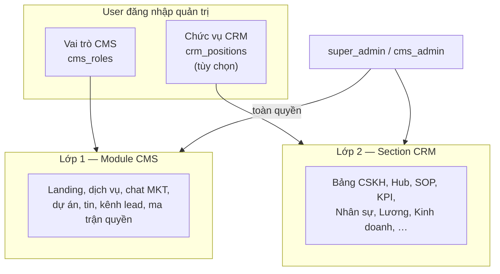

# Phân quyền PTT — Quy trình & hướng dẫn sử dụng

Tài liệu dành cho **quản trị viên** và **người dùng nội bộ** (CMS, CRM, portal nhân viên).  
Tham chiếu kỹ thuật: [`HE_THONG_PTT.md`](HE_THONG_PTT.md) · Mã nguồn: `cms_permissions.py`, `admin_page_permissions.py`, `unified_auth.py`.

---

## 1. Tổng quan

Hệ thống PTT có **ba loại phiên đăng nhập**:

| Loại | Ai dùng | Giao diện | Phạm vi |
|------|---------|-----------|---------|
| **Quản trị viên toàn quyền** | `super_admin`, `cms_admin` | Sidebar admin đầy đủ | Mọi CMS + CRM, không bị giới hạn section |
| **Quản trị theo vai trò + chức vụ** | Các role CMS khác (`content_editor`, `marketing_lead`, …) | Sidebar admin (ẩn mục không có quyền) | CMS theo **vai trò**; CRM theo **chức vụ** (nếu gán) |
| **Portal nhân viên** | Nhân viên CSKH (`crm_staff`) | Thanh nav gọn | Chỉ `/crm`, khách được gán, KPI/chấm công cá nhân |

### 1.1. Một tài khoản — một mật khẩu

Mỗi **username** chỉ có **một mật khẩu** dùng chung cho toàn hệ thống (CMS, CRM admin, portal nhân viên).

- Mật khẩu được đồng bộ giữa bảng `cms_admin_users` và `crm_staff` (cùng username).
- Đổi mật khẩu tại **/account/password** → cập nhật mọi nơi.
- Đăng nhập tại **/admin/login**:
  - Nếu username có trong **CMS admin** → vào giao diện quản trị (ưu tiên).
  - Nếu chỉ có trong **nhân viên CRM** → vào portal nhân viên.

### 1.2. Hai lớp phân quyền (admin)



| Lớp | Kiểm soát | Cấu hình tại |
|-----|-----------|--------------|
| **Vai trò CMS** | Trang `/cms`, `/admin` (module nội dung & marketing) | CMS → tab **Phân quyền** → ma trận **Vai trò** |
| **Chức vụ CRM** | Các section trong trang CRM (Kanban, Khách hàng, KPI, …) | CMS → tab **Phân quyền** → ma trận **Chức vụ** |

**Lưu ý:** User có vai trò `super_admin` hoặc `cms_admin` **bỏ qua** mọi giới hạn section CRM và module CMS.

---

## 2. Hành động (Actions)

Mỗi hạng mục gán một hoặc nhiều hành động:

| Mã | Tiếng Việt | Ví dụ thực tế |
|----|------------|---------------|
| `view` | Xem | Mở trang, đọc danh sách |
| `edit` | Sửa | Cập nhật bản ghi, form hồ sơ |
| `create` | Tạo | Thêm case, khách hàng, chiến dịch |
| `delete` | Xóa | Xóa bản ghi |
| `export` | Xuất file | Excel, báo cáo |
| `configure` | Cấu hình | Ma trận quyền, thiết bị chấm công |

Giao diện ẩn hoặc khóa nút/form khi thiếu quyền (`admin_section_gating.js`). API backend cũng kiểm tra — không thể vượt quyền chỉ bằng cách gọi API trực tiếp.

---

## 3. Vai trò CMS mặc định

| Mã vai trò | Tên | Mục đích |
|------------|-----|----------|
| `super_admin` | Quản trị hệ thống | Toàn quyền; chỉ super_admin mới gán role này cho người khác |
| `cms_admin` | Quản trị CMS | Toàn quyền CMS + CRM; ma trận quyền chỉ **xem** |
| `content_editor` | Biên tập nội dung | Landing, dịch vụ, dự án, tin |
| `marketing_lead` | Trưởng nhóm Marketing | Chatbox MKT, export, Excel, campaign kit |
| `marketing_staff` | NV Marketing | Chat + export; không cấu hình chatbox |
| `viewer` | Chỉ xem | Xem mọi module CMS, không sửa |

Chi tiết ma trận từng module: xem mục 6.3 trong [`HE_THONG_PTT.md`](HE_THONG_PTT.md).

---

## 4. Chức vụ CRM mặc định

Khi gán **chức vụ** cho user admin, quyền CRM lấy từ `crm_position_section_permissions`. Nếu chưa cấu hình, dùng mặc định theo mã chức vụ:

| Mã | Tên | Đặc điểm |
|----|-----|----------|
| `CSKH-01` | Chăm sóc khách hàng | Bảng CSKH, khách hàng (tạo/sửa), nhắc việc, KPI bản ghi |
| `KD-01` | Kinh doanh | **Chỉ Quản lý Lead** — nhận & chăm sóc lead được phân (theo dự án BĐS tham gia) |
| `MKT-01` | Trưởng phòng Marketing | Hub, Lead, SOP, RE Marketing/KPI/Kế toán, export |
| `MKT-02` | Nhân viên Marketing | Campaign, lead (xem/sửa), RE MKT, nhập chi ads |
| `VH-01` | Vận hành / HR | SOP, nhân sự, chấm công/lương; CSKH chủ yếu **xem** |

Danh sách đầy đủ section CRM (gồm 8 section **Kinh doanh** `/crm/sales`): xem [`admin_page_permissions.py`](../admin_page_permissions.py).

### 4.1. Chi tiết chức vụ Marketing (`MKT-01` / `MKT-02`)

Hệ thống **tự seed** hai chức vụ khi khởi động (hàm `seed_marketing_positions`). Gán user admin: **Vai trò CMS** `marketing_lead` (MKT-01) hoặc `marketing_staff` (MKT-02) + **Chức vụ** tương ứng.

#### MKT-01 — Trưởng phòng Marketing

| Nhóm | Section | Actions |
|------|---------|---------|
| Hub | `crm_hub_campaigns` | view, edit, create, delete |
| Hub | `crm_hub_contracts`, `crm_hub_reminders` | view, edit (+ create reminders) |
| Kế hoạch | `crm_mktplan` | view, edit, create, **export** |
| Lead | `crm_leads` | view, edit, create, export, **configure** |
| Phễu | `crm_board_funnel` | view, export |
| AI | `crm_assistant` | view, create, export |
| SOP | `crm_sop_runs`, `crm_sop_overdue` | view, edit, create |
| SOP | `crm_sop_templates` | view |
| KPI | `crm_kpi_*` | view, edit, create, export (chart) |
| Sales (đọc) | `crm_sales_overview`, `crm_sales_funnel`, `crm_sales_market` | view, export / edit market |
| RE Projects | `crm_re_projects` | view, **export** |
| RE | `crm_re_projects_marketing`, `kpi`, `budget`, `risks` | view, edit, create (+ export budget) |
| RE (read) | `business`, `sales`, `products` | **view** |
| Báo cáo | `crm_daily_work_report` | view, edit, create, export |
| KH | `crm_board_customers` | view |

**Không có:** Kanban CSKH (create/delete), payroll, nhân sự, xóa dự án BĐS.

#### MKT-02 — Nhân viên Marketing

| Section | Actions |
|---------|---------|
| `crm_hub_campaigns` | view, edit, create |
| `crm_mktplan` | view, edit |
| `crm_leads` | view, edit, export |
| `crm_re_projects_marketing`, `budget` | view, edit (+ create dòng tiền) |
| `crm_sop_runs` | view, edit, create |
| `crm_daily_work_report` | view, create |

**Không có:** configure lead, delete campaign, export tổng hợp RE, configure Facebook global.

### 4.2. SOP mẫu — Launch campaign 14 ngày

Template hệ thống: **`MKT-LAUNCH-14D`** (tự tạo khi khởi động app).

- **Trang:** `/crm/sop` → tab **Playbook / Template**
- **14 bước:** Brief → duyệt NS → tracking → creative → ads → MQL handoff → báo cáo → retro
- **Khởi chạy:** tab **Tiến trình** → **+ Launch SOP** → chọn template `MKT-LAUNCH-14D`, gắn campaign Hub (tuỳ chọn)

### 4.3. Quy trình vận hành Marketing theo tuần (trên PTT)

| Ngày | Việc chính | Module PTT |
|------|------------|------------|
| **T2** | KPI cảnh báo, lead SLA, rủi ro MKT | `/crm/kpi`, `/crm/leads`, RE → Kế toán → Dự báo & Rủi ro |
| **T3–T4** | KH segment, GTM dự án, chạy SOP | `/crm/marketing-plan`, `/crm/re-projects`, `/crm/sop` |
| **T5** | Sync Sales–MKT, MQL handoff | Phễu CSKH + `/crm/sales`, KPI `RE_LEADS_NEW` |
| **T6** | Nhập chi ads, export Excel kế toán | RE → Kế toán → Dòng tiền + ⬇ Excel |
| **Hàng ngày** | Lead mới FB, lead chưa owner | `/crm/leads`, AI Truy xuất |

### Quy tắc đặc biệt — Tạo khách hàng

API và nút **Thêm khách hàng** chấp nhận nếu có **một trong hai** quyền:

- Section `crm_board_customers` → `create`
- Section `crm_board_create` → `create`

---

## 5. Quy trình phân quyền (dành cho quản trị)

### 5.1. Quy trình tổng thể

```mermaid
flowchart TD
    A[Bước 1: Tạo phòng ban / chức vụ\nCRM → Nhân sự] --> B[Bước 2: Tạo hồ sơ nhân viên\n+ username nếu cần portal]
    B --> C{Bước 3: Cần quyền CMS/CRM admin?}
    C -->|Có| D[Tạo user CMS admin\nCMS → Phân quyền → Users]
    C -->|Không| E[Chỉ portal nhân viên]
    D --> F[Gán vai trò CMS]
    D --> G[Gán chức vụ CRM\n(tùy chọn)]
    F --> H[Bước 4: Tinh chỉnh ma trận\nVai trò + Chức vụ]
    G --> H
    H --> I[Bước 5: User đăng nhập lại\n/ admin/logout]
    E --> I
```

### 5.2. Tạo tài khoản quản trị CMS

**Đường dẫn:** `/cms` → cuộn tới **Phân quyền** (hoặc sidebar **Phân quyền**).

1. Mở tab **Users / Tài khoản admin**.
2. **Thêm user:** username, tên hiển thị, **vai trò CMS**, **chức vụ CRM** (nếu muốn giới hạn section CRM).
3. (Tùy chọn) Nhập **mật khẩu ban đầu** — nếu username trùng nhân viên CRM, mật khẩu được đồng bộ.
4. Lưu → yêu cầu user **đăng xuất / đăng nhập lại**.

**Gán vai trò `super_admin`:** chỉ user đang là super_admin mới gán được.

### 5.3. Tạo tài khoản portal nhân viên

**Đường dẫn:** `/crm/staff` → form thêm/sửa nhân viên → mục **Tài khoản đăng nhập CSKH**.

1. Bật **Cho phép đăng nhập**.
2. Nhập **Tên đăng nhập** (3–64 ký tự: chữ, số, `.`, `_`, `-`).
3. Nhập **Mật khẩu** (tối thiểu 6 ký tự).
4. Lưu.

Nếu cùng username đã có trong CMS admin → mật khẩu thống nhất; đăng nhập sẽ vào **quản trị** (không phải portal) vì CMS được ưu tiên.

### 5.4. Chỉnh ma trận quyền CMS (theo vai trò)

**Đường dẫn:** `/cms#cms-permissions` → **Ma trận vai trò**.

1. Chọn vai trò cần sửa (vd. `marketing_staff`).
2. Tick/bỏ tick từng **module × action**.
3. **Lưu ma trận** (cần quyền `permissions_matrix` → `configure`).

Thay đổi lưu vào `cms_role_permissions`. User đang online cần **tải lại trang** (F5) để gating UI cập nhật.

### 5.5. Chỉnh quyền CRM (theo chức vụ)

**Đường dẫn:** `/cms#cms-permissions` → **Ma trận chức vụ**.

1. Chọn chức vụ (vd. `KD-01`, `VH-01`).
2. Với từng **section** (nhóm Bảng CSKH, Hub, KPI, Kinh doanh, …), chọn action được phép.
3. **Lưu**.

Lưu vào `crm_position_section_permissions`. User admin gắn chức vụ đó sẽ bị giới hạn section tương ứng (trừ `super_admin` / `cms_admin`).

**Mẹo:** Admin **không gán chức vụ** (`position_id` trống) → toàn quyền CRM section (vẫn bị giới hạn bởi vai trò CMS nếu không phải super/cms_admin).

### 5.6. Quy trình onboarding nhân viên mới (mẫu)

| Bước | Việc cần làm | Người thực hiện |
|------|----------------|-----------------|
| 1 | Tạo hồ sơ NV tại CRM → Nhân sự | HR / Admin |
| 2 | Gán phòng ban, chức vụ, quản lý trực tiếp | HR |
| 3 | Bật login + username + mật khẩu | Admin |
| 4 | (Nếu cần CMS) Thêm user CMS cùng username, chọn role + chức vụ | Super admin |
| 5 | Gửi link `/admin/login` và hướng dẫn đổi mật khẩu lần đầu | Admin |
| 6 | NV đăng nhập → kiểm tra topbar: **Quản trị viên** hoặc **Nhân viên CSKH** | NV |

### 5.7. Đổi / reset mật khẩu

| Tình huống | Cách làm |
|----------|----------|
| User tự đổi | `/account/password` — nhập mật khẩu cũ + mới |
| Admin đặt lại cho NV | CRM → Nhân sự → Sửa → mục đăng nhập → mật khẩu mới |
| Admin đặt lại user CMS | CMS → Phân quyền → Sửa user → trường mật khẩu (API PATCH) |
| Mật khẩu `.env` ban đầu | `ADMIN_USERNAME` / `ADMIN_PASSWORD` — vẫn dùng được cho tài khoản env; lần đăng nhập thành công sẽ lưu hash vào DB |

---

## 6. Hướng dẫn sử dụng (người dùng cuối)

### 6.1. Đăng nhập

1. Mở **http://&lt;host&gt;:5050/admin/login**
2. Nhập **username** và **mật khẩu** (một bộ duy nhất).
3. Sau đăng nhập:
   - Sidebar trái đầy đủ + topbar **Quản trị viên** → bạn là admin CMS.
   - Chỉ thanh nav ngang + **Nhân viên CSKH** → bạn là portal nhân viên.

### 6.2. Admin — điều hướng theo quyền

- **Sidebar:** mục không có quyền `view` bị ẩn (`data-admin-nav`).
- **Trong trang:** panel không có quyền bị ẩn hoặc **chỉ đọc** (nút/input disabled) — thuộc tính `data-admin-section`.
- **super_admin / cms_admin:** không bị gating; dùng đủ mọi tính năng.

### 6.3. Nhân viên CSKH — việc được phép

| Việc | Được phép |
|------|-----------|
| Xem bảng CSKH | Chỉ case **được gán** cho mình |
| Cập nhật case, gửi báo cáo CSKH | Case được gán |
| Xem khách hàng | Hồ sơ liên quan case được gán |
| KPI, chấm công | Chỉ dữ liệu **cá nhân** |
| Tạo case / tạo khách mới / Hub / CMS | **Không** |

### 6.4. Kiểm tra nhanh quyền của mình

1. Admin: mở **CMS → Phân quyền** — xem vai trò và chức vụ gắn với username.
2. Thử thao tác (vd. **Thêm khách hàng** tại `/crm/customers`):
   - Không thấy nút → thiếu quyền section hoặc đang ở portal nhân viên.
   - Nút có nhưng API báo 403 → thiếu quyền backend; liên hệ admin chỉnh ma trận chức vụ.
3. Sau khi admin đổi quyền: **đăng xuất và đăng nhập lại** (hoặc F5 cứng).

---

## 7. Xử lý sự cố thường gặp

| Triệu chứng | Nguyên nhân thường gặp | Cách xử lý |
|-------------|------------------------|------------|
| Không thấy nút **Thêm khách hàng** | Đang ở portal nhân viên; hoặc thiếu quyền `create` trên section KH | Đăng nhập bằng tài khoản CMS admin; kiểm tra chức vụ / ma trận section `crm_board_customers` |
| Topbar ghi **Nhân viên CSKH** nhưng cần quản trị | Username chỉ có trong `crm_staff`, chưa có (hoặc chưa active) trong `cms_admin_users` | Thêm user CMS cùng username, role phù hợp |
| Cùng username, mật khẩu NV đúng nhưng vào portal thay vì admin | Trước đây CMS chưa có mật khẩu — đã sửa bằng đăng nhập thống nhất | Đảm bảo có bản ghi CMS admin active; đăng xuất/đăng nhập lại |
| Vào CMS nhưng tab Phân quyền không sửa được | Role không có `permissions_matrix` → `configure` | super_admin hoặc cms_admin chỉnh ma trận vai trò |
| CRM section bị xám / không bấm được | Chức vụ thiếu action `edit`/`create` | CMS → Phân quyền → ma trận chức vụ |
| super_admin vẫn bị chặn | Session cũ | `/admin/logout` → đăng nhập lại |

---

## 8. Bảng tra cứu section CRM theo trang

| Trang | Section IDs (tóm tắt) |
|-------|------------------------|
| `/admin` | `admin_projects`, `admin_news` |
| `/crm` | `crm_board_funnel`, `crm_board_workspace`, `crm_board_kanban`, `crm_board_create`, `crm_board_playbook` |
| `/crm/customers` | `crm_board_customers` |
| `/crm/hub` | `crm_hub_campaigns`, `crm_hub_contracts`, `crm_hub_reminders` |
| `/crm/marketing-plan` | `crm_mktplan` |
| `/crm/sop` | `crm_sop_runs`, `crm_sop_templates`, `crm_sop_overdue` |
| `/crm/staff` | `crm_staff_departments`, `crm_staff_positions`, `crm_staff_roster` |
| `/crm/kpi` | `crm_kpi_alerts`, `crm_kpi_chart`, `crm_kpi_metrics`, `crm_kpi_records` |
| `/crm/payroll` | `crm_payroll_device`, `crm_payroll_attendance`, `crm_payroll_salary` |
| `/crm/sales` | `crm_sales_overview`, `crm_sales_plans`, `crm_sales_funnel`, `crm_sales_prospects`, `crm_sales_deals`, `crm_sales_training`, `crm_sales_market`, `crm_sales_reports` |

---

## 9. Checklist bảo mật (khuyến nghị)

- [ ] Đổi mật khẩu mặc định `.env` (`changeme`) ngay khi triển khai.
- [ ] Chỉ gán `super_admin` cho 1–2 tài khoản tin cậy.
- [ ] Gán **chức vụ CRM** sát nghiệp vụ; tránh để trống chức vụ nếu không cần full CRM.
- [ ] Tắt `login_enabled` khi nhân viên nghỉ việc (`active = 0` + vô hiệu CMS user).
- [ ] Rà soát ma trận quyền định kỳ (quý) tại CMS → Phân quyền.

---

## 10. Tham chiếu API phân quyền

| API | Quyền cần có | Mục đích |
|-----|--------------|----------|
| `GET /api/cms/permissions` | `permissions_matrix` → `view` | Đọc ma trận vai trò |
| `PATCH /api/cms/permissions` | `permissions_matrix` → `configure` | Lưu ma trận vai trò |
| `GET /api/cms/permissions/positions` | `permissions_matrix` → `view` | Ma trận chức vụ |
| `PATCH /api/cms/permissions/positions/:id` | `permissions_matrix` → `configure` | Lưu quyền chức vụ |
| `GET/POST/PATCH /api/cms/admin-users` | `permissions_matrix` | Quản lý user CMS |

---

*Tài liệu cập nhật theo codebase PTT (mật khẩu thống nhất, CRM Kinh doanh, admin toàn quyền `super_admin`/`cms_admin`). Khi thêm section hoặc module mới, cập nhật `admin_page_permissions.py` / `cms_permissions.py` và bổ sung mục tương ứng trong file này.*
