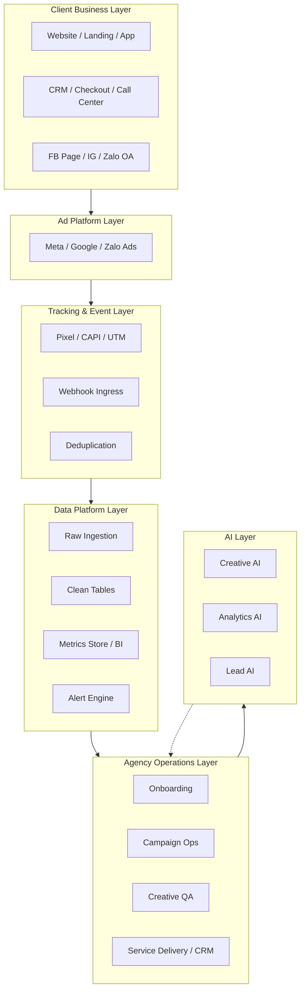
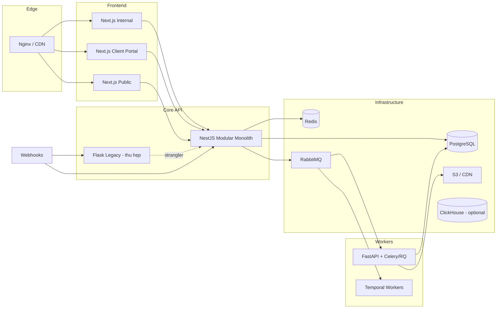
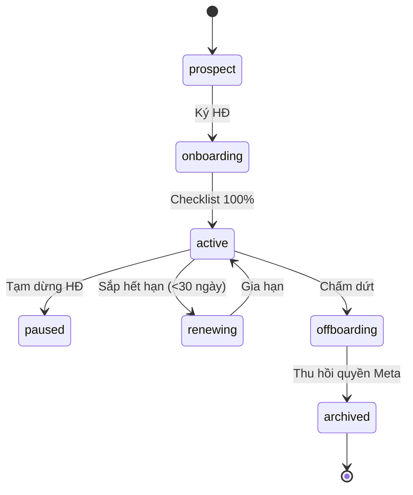
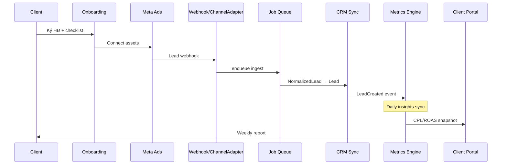
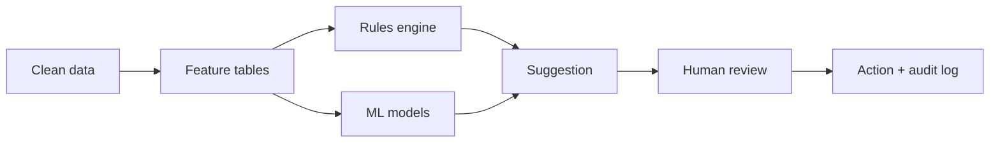

# PTT Agency Operating Platform — Đặc tả hệ thống (Target Specification)

> **Phiên bản:** 2026-07-17 · **Trạng thái:** Target architecture (Strangler migration từ PTTADS)  
> **Codebase hiện tại:** `PTTADS/` (Flask monolith) · **Production:** `https://pttads.vn`  
> **Loại tài liệu:** Business + Technical Specification (master cho nền tảng agency)  
> **Tài liệu liên quan:**  
> - [`SPEC_HE_THONG_PTT.md`](SPEC_HE_THONG_PTT.md) — đặc tả PTTADS hiện tại (as-is)  
> - [`SPEC_UI_UX_AGENCY.md`](SPEC_UI_UX_AGENCY.md) — UI/UX Agency Ops Phase 1  
> - [`specs/2026-07-17-prd-phase-1.md`](specs/2026-07-17-prd-phase-1.md) — PRD Phase 1 (4–8 tuần)  
> - [`specs/2026-07-17-architecture-phase-1.md`](specs/2026-07-17-architecture-phase-1.md) — Kiến trúc Phase 1 (C4)  
> - [`product-model-v1.md`](product-model-v1.md) — lead funnel CRM  
> - [`specs/2026-07-16-channel-adapter-design.md`](specs/2026-07-16-channel-adapter-design.md) — ChannelAdapter Phase 0  
> - [`../PTT/docs/facebook_ads_agency_architecture.md`](../PTT/docs/facebook_ads_agency_architecture.md) — kiến trúc agency 7 lớp  
> - [`../PTT/docs/facebook_ads_agency_techservice.txt`](../PTT/docs/facebook_ads_agency_techservice.txt) — 15 core services  
> - [`schemas/channel/README.md`](../schemas/channel/README.md) — JSON Schema normalized models  
> - [`SPEC_SEO_AEO_OPERATING_SYSTEM.md`](SPEC_SEO_AEO_OPERATING_SYSTEM.md) — SEO/AEO Enterprise OS (delivery module)  
> - [`SPEC_EMAIL_MARKETING_OPERATING_SYSTEM.md`](SPEC_EMAIL_MARKETING_OPERATING_SYSTEM.md) — Email Marketing Enterprise OS (greenfield Next/Nest)  
> - [`SPEC_MIGRATION_FLASK_EXECUTION_PLAN.md`](SPEC_MIGRATION_FLASK_EXECUTION_PLAN.md) — **Kế hoạch thực thi bỏ Flask (EXECUTING)**  
> - [`specs/2026-07-19-seo-aeo-pg-cutover-policy.md`](specs/2026-07-19-seo-aeo-pg-cutover-policy.md) — SEO/AEO PostgreSQL-only policy (active)

---

## Mục lục

1. [Tổng quan & phạm vi](#1-tổng-quan--phạm-vi)
2. [Kiến trúc hệ thống](#2-kiến-trúc-hệ-thống)
3. [Bounded Contexts & chức năng](#3-bounded-contexts--chức-năng)
4. [Luồng nghiệp vụ & quy tắc kinh doanh](#4-luồng-nghiệp-vụ--quy-tắc-kinh-doanh)
5. [Mô hình dữ liệu](#5-mô-hình-dữ-liệu)
6. [Đặc tả API & tích hợp](#6-đặc-tả-api--tích-hợp)
7. [Event catalog](#7-event-catalog)
8. [KPI dictionary](#8-kpi-dictionary)
9. [AI & Intelligence](#9-ai--intelligence)
10. [Xác thực, phân quyền & bảo mật](#10-xác-thực-phân-quyền--bảo-mật)
11. [Yêu cầu phi chức năng](#11-yêu-cầu-phi-chức-năng)
12. [Triển khai & vận hành](#12-triển-khai--vận-hành)
13. [Lộ trình migration & nâng cấp](#13-lộ-trình-migration--nâng-cấp)
14. [Ma trận nâng cấp từ PTTADS](#14-ma-trận-nâng-cấp-từ-pttads)
15. [Phụ lục](#15-phụ-lục)

---

## 1. Tổng quan & phạm vi

### 1.1. Vision

**PTT Agency Operating Platform** là nền tảng vận hành agency quảng cáo đa kênh, tích hợp CRM dịch vụ và delivery BĐS, phục vụ:

- Quản lý **nhiều khách hàng (client)** trong một agency — **không** phải SaaS multi-agency.
- Đồng bộ và vận hành tài sản ads (Meta, Zalo, Google, Email) theo quyền được cấp.
- Closed-loop marketing: **Spend → Lead → Deal → Revenue → ROAS/CPL**.
- Quy trình phê duyệt, audit trail, SLA, client portal.
- AI hỗ trợ sáng tạo, phân tích, lead scoring — luôn **human-in-the-loop**.

### 1.2. Ba lớp sản phẩm

| Lớp | Mục tiêu | Người dùng | Công nghệ target |
|-----|----------|------------|------------------|
| **Public** | Landing, SEO, form, showcase | Khách truy cập | Next.js SSG/ISR |
| **Internal Ops** | CRM, ads ops, creative, HR, RE | AM, Buyer, CSKH, PM, HR | Next.js + NestJS |
| **Client Portal** | Báo cáo, duyệt creative, ticket | Client approver, viewer | Next.js (scoped JWT) |

### 1.3. Personas

| Persona | Quyền chính | Mục tiêu |
|---------|-------------|----------|
| **Super Admin** | Toàn hệ thống | Governance, cấu hình |
| **Account Manager (AM)** | Client, HĐ, lifecycle | Chăm sóc KH, renew |
| **Media Buyer** | Campaign read/write (có gate) | Tối ưu ads, budget |
| **Creative Lead** | Creative approval | QA creative trước launch |
| **Tracking/Tech** | Pixel, CAPI, webhooks | Tracking integrity |
| **CSKH / Sales** | Lead, Case, lifecycle | Pipeline, SLA |
| **PM RE** | RE Projects workflow | Governance dự án BĐS |
| **HR / Finance** | Payroll, KPI, accounting | Nhân sự, chi phí |
| **Client Viewer** | Portal read-only | Xem báo cáo |
| **Client Approver** | Portal approve | Duyệt creative/budget |

### 1.4. Phạm vi (In scope)

- Multi-client tenant logic (`client_id`) trong một agency PTT.
- ChannelAdapter đa kênh: Meta, Zalo, Google, Email.
- CRM lead funnel + service lifecycle (Lead → Retain).
- Hub HĐ, SOP, KPI nhân sự, RE Projects (migrate dần).
- Metrics engine, CAPI/event store, alerting.
- Workflow phê duyệt (onboarding, launch QA, budget, creative).
- Client portal (Phase 3).

### 1.5. Phạm vi ngoài (Out of scope — giai đoạn đầu)

- SaaS cho nhiều agency độc lập trên cùng cluster.
- Mobile app native.
- ERP/kế toán tổng hợp doanh nghiệp đầy đủ.
- Thanh toán trực tuyến / billing Meta thay client.
- 15 microservices tách ngay từ ngày 1 (ưu tiên modular monolith + workers).

### 1.6. Chiến lược migration

**Strangler Fig Pattern:**

1. Giữ Flask PTTADS chạy production.
2. Thêm lớp mới (PostgreSQL, queue, NestJS, workers) song song.
3. Route dần traffic qua API v1 và services mới.
4. Deprecate module legacy khi UAT pass.

**Phase 0 đã hoàn thành (PTTADS):** `ptt_channel/`, JSON Schema, `/api/v1/webhooks/{channel}`.

---

## 2. Kiến trúc hệ thống

### 2.1. Sơ đồ 7 lớp (agency architecture)



### 2.2. Kiến trúc triển khai target



### 2.3. Stack công nghệ

| Thành phần | As-Is (PTTADS) | To-Be | Ghi chú |
|------------|----------------|-------|---------|
| Frontend | Jinja2 + vanilla JS | Next.js 14+ App Router | SSR/ISR public |
| Core API | Flask 3 (~431 routes) | NestJS modular monolith | Strangler |
| Workers | systemd FB sync | FastAPI + Celery/RQ | Tách khỏi Gunicorn |
| OLTP | SQLite | PostgreSQL 15+ | RLS, pgvector |
| Cache | — | Redis 7 | Session, rate limit |
| Queue | — | RabbitMQ → Kafka (scale) | Webhook, sync |
| Workflow | SOP DB + code gates | Temporal | Approval flows |
| Event analytics | — | ClickHouse / PG partition | CAPI volume |
| Auth | Flask session | Keycloak + JWT | Portal MFA |
| Secrets | `.env` | Vault / SSM | Meta token per client |
| Files | `static/uploads/` | S3 + CDN | Creative versions |
| BI | HTML + Excel | Metabase | Self-serve |
| Observability | Log file | Sentry + Prometheus + OTEL | Production SLA |
| Contract | — | JSON Schema `schemas/channel/` | ✅ Phase 0 |

### 2.4. 12 Bounded Contexts

| # | Context | Trách nhiệm | Service target |
|---|---------|-------------|----------------|
| BC-01 | **Auth & RBAC** | Login, JWT, MFA, roles | Auth Service |
| BC-02 | **Tenant / Client** | Client, contract, onboarding | Tenant Service |
| BC-03 | **Asset Access** | BM, ad account, page, pixel registry | Asset Access Service |
| BC-04 | **Channel Integration** | Meta/Zalo/Google/Email adapters | Meta Integration + ChannelAdapter |
| BC-05 | **Campaign Ops** | Sync, read, write (gated) campaigns | Campaign Orchestration |
| BC-06 | **Creative** | Brief, version, approval | Creative Management |
| BC-07 | **Event / Tracking** | CAPI, pixel, dedup, attribution | Tracking Service |
| BC-08 | **CRM** | Lead, customer, assign, scoring | CRM Sync Service |
| BC-09 | **Service Delivery** | Lifecycle, SOP, Hub, Case | Workflow + CRM |
| BC-10 | **Public / CMS** | Landing, SEO, forms, chat MKT | Public Next.js + CMS API |
| BC-11 | **People / Finance** | KPI, payroll, RE accounting | HR/Finance modules |
| BC-12 | **AI / Alert** | Score, anomaly, digest, notify | AI services + Notification |

---

## 3. Bounded Contexts & chức năng

### 3.1. BC-02 Tenant / Client

#### Entities

| Entity | Mô tả | Khóa |
|--------|-------|------|
| `Client` | Khách hàng agency | `id`, `code` UNIQUE |
| `Contract` | Hợp đồng dịch vụ | `client_id`, `type`, dates |
| `OnboardingChecklist` | 12 mục Meta + billing | `client_id` |
| `ClientChannelAccount` | Tài khoản ads theo kênh | `client_id`, `channel`, `external_id` |

#### State machine — Client



#### Functional requirements

| ID | Yêu cầu | Priority |
|----|---------|----------|
| FR-CL-01 | CRUD client với `code` naming convention | P0 |
| FR-CL-02 | Onboarding checklist — block `active` until complete | P0 |
| FR-03 | Offboarding SOP — revoke tokens, archive data | P1 |
| FR-CL-04 | Map Hub HĐ → `client_id` | P1 |
| FR-CL-05 | Client owner AM assignment | P0 |

### 3.2. BC-03 Asset Access

| ID | Yêu cầu | Priority |
|----|---------|----------|
| FR-AA-01 | Registry: BM, ad account, page, pixel, catalog per client | P1 |
| FR-AA-02 | Credential ref → Vault (không plain text DB) | P1 |
| FR-AA-03 | Weekly asset sync job | P1 |
| FR-AA-04 | Alert khi token hết hạn / quyền bị thu hồi | P1 |
| FR-AA-05 | Không share ad account giữa 2 client | P0 |

### 3.3. BC-04 Channel Integration (ChannelAdapter)

**Interface:** `ChannelAdapter` ABC trong `ptt_channel/base.py`.

| Method | Mô tả |
|--------|-------|
| `channel_id` | `meta`, `zalo`, `google`, `email` |
| `parse_webhook(payload, headers)` | → `NormalizedLead[]` / events |
| `validate_credentials(account)` | Health check |
| `sync_daily_insights(account, date)` | → `NormalizedDailyPerformance[]` |
| `capabilities()` | Feature flags per channel |

#### Adapter roadmap

| Channel | Phase 0 | Phase 1 | Phase 2 | Phase 3 |
|---------|---------|---------|---------|---------|
| **Meta** | Webhook parse ✅ | Credential validate | Marketing API insights | Campaign read/write |
| **Zalo** | Webhook parse ✅ | Autosync poll | Zalo Ads API | OA messaging |
| **Google** | Stub | — | Lead form + GA4 | Campaign read |
| **Email** | Stub | — | — | ESP webhook + nurture |

#### Functional requirements

| ID | Yêu cầu | Priority |
|----|---------|----------|
| FR-CH-01 | Unified webhook `/api/v1/webhooks/{channel}` | P0 ✅ |
| FR-CH-02 | Header `X-PTT-Client-Id` gán tenant | P0 ✅ |
| FR-CH-03 | Webhook → queue → CRM ingest (idempotent) | P0 |
| FR-CH-04 | Daily insights sync per client/account | P1 |
| FR-CH-05 | Rate limit handling + circuit breaker Meta | P1 |
| FR-CH-06 | Deprecate legacy FB/Zalo routes sau UAT | P2 |

**Normalized models:** xem `schemas/channel/*.json` — `NormalizedLead`, `NormalizedEvent`, `NormalizedDailyPerformance`.

### 3.4. BC-05 Campaign Ops

#### Naming convention (bắt buộc trước launch)

```
{client_code}_{objective}_{geo}_{YYYYMMDD}_{variant}
Ví dụ: PTT_LEADS_HCM_20260701_v01
```

#### Campaign write policy

| Hành động | Role | Gate |
|-----------|------|------|
| Xem insights | AM, Buyer, Client viewer | — |
| Pause / resume | Buyer | — |
| Budget change ≤10% | Buyer | — |
| Budget change >10% | Buyer | AM approve (Workflow) |
| Budget change >30% | Buyer | AM + Client approver |
| Publish creative mới | Creative Lead | QA checklist + Client approve |
| AI scale suggestion | AI | Task only — không auto execute |

#### Sync schedule

| Job | Tần suất | Output |
|-----|----------|--------|
| Assets sync | Weekly | BM, pages, pixels |
| Campaign structure | Daily | Campaign/adset/ad |
| Insights daily | Daily T-1 | `NormalizedDailyPerformance` |
| Leads delta | 15 phút + webhook | CRM ingest |

| ID | Yêu cầu | Priority |
|----|---------|----------|
| FR-CO-01 | Read-only campaign sync từ Meta | P1 |
| FR-CO-02 | Hub campaign ↔ Meta campaign ID mapping (2 chiều) | P1 |
| FR-CO-03 | Budget change approval workflow | P2 |
| FR-CO-04 | Launch QA checklist (Temporal) | P2 |
| FR-CO-05 | Campaign write via approved workflow | P3 |

### 3.5. BC-06 Creative Management

| ID | Yêu cầu | Priority |
|----|---------|----------|
| FR-CR-01 | Creative brief từ chat MKT CMS | P2 |
| FR-CR-02 | Version storage S3 + metadata PG | P2 |
| FR-CR-03 | Approval workflow: Draft → QA → Client → Approved | P2 |
| FR-CR-04 | Link creative → Meta ad ID | P3 |

### 3.6. BC-07 Event / Tracking

#### Standard events

| Event | Nguồn | Consumer |
|-------|-------|----------|
| `lead` | FB, Zalo, form, CAPI | CRM Sync |
| `purchase` | CAPI, offline, RE sold | ROAS |
| `complete_registration` | Landing | Funnel |
| `email_open`, `email_click` | ESP | Nurture |

#### Deduplication

```
event_id = SHA256(channel + external_id + event_name + occurred_at_bucket)
Rule: Pixel + CAPI cùng event_id → giữ bản server-first (CAPI)
```

| ID | Yêu cầu | Priority |
|----|---------|----------|
| FR-TR-01 | CAPI collector endpoint | P1 |
| FR-TR-02 | Event dedup table UNIQUE(event_id) | P1 |
| FR-TR-03 | UTM processor gắn lead | P1 |
| FR-TR-04 | Form ingest không silent fail + DLQ | P0 |
| FR-TR-05 | Career apply → Lead ingest | P1 |

### 3.7. BC-08 CRM

**Kế thừa:** [`product-model-v1.md`](product-model-v1.md), [`SPEC_HE_THONG_PTT.md`](SPEC_HE_THONG_PTT.md) §3 CRM.

#### Pipeline policy (thống nhất Lead vs Case)

| Giai đoạn | Object | Pipeline |
|-----------|--------|----------|
| Acquisition (pre-sale) | `Lead` | 8 bước care + scoring |
| Pre-sales trên lead | `Lead` | B2 → Intake → 3 tab presales |
| Post-sale CSKH | `Case` | 7 bước Kanban |
| Delivery sau HĐ | `LifecycleWorkflow` | Lead → Retain (7 stage) |

#### Lead scoring

| Lớp | Engine | Trigger |
|-----|--------|---------|
| Rule rubric | `crm_lead_scoring` (migrate) | Mọi ingest |
| ML score | AI Lead Scoring service | Nightly + hot rescore on ingest |

| ID | Yêu cầu | Priority |
|----|---------|----------|
| FR-CRM-01 | Lead ingest từ ChannelAdapter (idempotent) | P0 |
| FR-CRM-02 | Auto-assign hybrid (industry × service pool) | P0 |
| FR-CRM-03 | SLA push Zalo/email/SMS (cron 5 phút) | P0 |
| FR-CRM-04 | B2 review queue + GDKD release | P0 |
| FR-CRM-05 | Presales gates (marketing plan, TMMT) | P0 |
| FR-CRM-06 | Link lead.campaign_id ↔ ads campaign | P1 |
| FR-CRM-07 | AI auto-classify + rescore on ingest | P1 |
| FR-CRM-08 | Unified Lead/Case view policy | P2 |

### 3.8. BC-09 Service Delivery

#### Lifecycle gates (giữ từ PTTADS)

| Gate | Điều kiện | Test ref |
|------|-----------|----------|
| B2 | Care B2 complete | L02, L16 |
| Intake | Go / Director override | L04, L17, L18 |
| Pre-sales tabs | 100% task | L03–L06 |
| HĐ Active | Hub promote | L07 |
| Task stage | 100% task | L09, L19 |
| TMMT R5 | Deliver gate | L22 |
| Payment | Handover → Retain | L23 |

| ID | Yêu cầu | Priority |
|----|---------|----------|
| FR-SD-01 | Hub HĐ promote → lifecycle + SOP | P0 |
| FR-SD-02 | SOP auto-start khi campaign launch | P1 |
| FR-SD-03 | SOP overdue escalate (email manager) | P0 |
| FR-SD-04 | Case SLA + link issue ↔ lead | P1 |
| FR-SD-05 | Temporal workflow lifecycle stages | P2 |

### 3.9. BC-10 Public / CMS

| ID | Yêu cầu | Priority |
|----|---------|----------|
| FR-PUB-01 | Landing SSG/ISR Next.js | P2 |
| FR-PUB-02 | Form contact → event queue (retry) | P0 |
| FR-PUB-03 | Chat MKT → CreativeBrief draft | P2 |
| FR-PUB-04 | GTM / SEO giữ nguyên behavior | P1 |

### 3.10. BC-11 People / Finance

#### KPI types (tách rõ nguồn)

| Loại | Ví dụ | Source of truth |
|------|-------|-----------------|
| Ads KPI | CPA, ROAS, spend | Channel API → Metrics |
| CRM KPI | Lead won, lifecycle | CRM Sync |
| HR KPI | RE_LEADS_NEW, attendance | Staff module |

#### Closed-loop P&L

```
CPL = SUM(daily_performance.spend) / COUNT(leads WHERE utm_campaign)
Win rate = won / qualified
ROAS = conversion_value / spend
```

| ID | Yêu cầu | Priority |
|----|---------|----------|
| FR-PF-01 | RE KPI auto-refresh nightly | P0 |
| FR-PF-02 | Payroll state machine: draft→locked→notified | P1 |
| FR-PF-03 | RE plan approval gates (business/marketing) | P2 |
| FR-PF-04 | DealWon → inventory sold + cashflow | P1 |
| FR-PF-05 | Accounting sync weekly cron | P1 |

### 3.11. BC-12 AI / Alert

| ID | Yêu cầu | Priority |
|----|---------|----------|
| FR-AI-01 | Proactive next-best-action sau activity | P0 |
| FR-AI-02 | Daily digest 8h: SLA, lead mới, KPI lệch | P0 |
| FR-AI-03 | Anomaly CPA/spend > threshold | P2 |
| FR-AI-04 | AI draft RE marketing plan | P1 |
| FR-AI-05 | Customer 360 churn risk | P2 |
| FR-AI-06 | Log mọi AI decision + human override | P0 |

**Nguyên tắc AI:**

- Fallback rule-based khi không có API key.
- Không auto budget/campaign without approval.
- Không gửi PII raw lên LLM — redact/hash.

---

## 4. Luồng nghiệp vụ & quy tắc kinh doanh

### 4.1. Luồng end-to-end agency



### 4.2. Luồng Lead → Customer → Lifecycle

Tham chiếu: [`product-model-v1.md`](product-model-v1.md), SPEC PTTADS §4.

```
Assigned → B2 → (Addon) → Presales → Contract → Lifecycle (7 stage) → Retain
```

**Gate B2:** Liên hệ OK trong 24h (configurable) — quá hạn → Review Queue.

### 4.3. Luồng Marketing closed-loop

```
Hub Campaign start
  → SOP run auto-create
  → Meta campaign map (external_id)
  → Daily spend sync
  → Leads count by utm_campaign
  → CPL / win rate dashboard
```

### 4.4. Luồng vận hành định kỳ

| # | Quy trình | Tần suất | Automation |
|---|-----------|----------|------------|
| B1 | SLA lead & case | Realtime | Cron 5 phút + notify |
| B2 | KPI RE_LEADS_NEW | Daily | Auto refresh + pull staff |
| B3 | Facebook/Zalo pending | 5–15 phút | Worker autosync |
| B4 | SOP overdue | Daily | Escalate → Hub + email |
| B5 | Chấm công → lương | Monthly | Workflow draft→locked |
| B6 | BC công việc ngày | Daily | Remind 17h |
| B7 | RE accounting sync | Weekly | Cron sync-from-plans |
| B8 | Backup & health | Daily | PG snapshot + alert |

### 4.5. Deal closure (BĐS)

```
Lead won
  → Convert customer
  → Reserve inventory unit
  → Update product status = sold
  → Cash-flow entry auto
  → Event DealWon
```

---

## 5. Mô hình dữ liệu

### 5.1. Core entities (PostgreSQL target)

#### Tenant

```sql
-- clients
id UUID PK
code VARCHAR(32) UNIQUE NOT NULL  -- naming prefix
name VARCHAR(255) NOT NULL
industry_slug VARCHAR(64)
status ENUM('prospect','onboarding','active','paused','renewing','offboarding','archived')
owner_am_id UUID FK → staff
created_at, updated_at TIMESTAMPTZ

-- contracts
id UUID PK
client_id UUID FK
type VARCHAR(64)
start_date, end_date DATE
sla_hours INT
kpi_targets JSONB
status VARCHAR(32)

-- client_channel_accounts
id UUID PK
client_id UUID FK
channel VARCHAR(16)  -- meta|zalo|google|email
external_account_id VARCHAR(128)
credential_ref VARCHAR(255)  -- Vault path
status VARCHAR(32)
UNIQUE(client_id, channel, external_account_id)
```

#### CRM (migrate từ SQLite)

```sql
-- leads (extended)
id UUID PK
client_id UUID FK NULL  -- NULL = organic PTT lead
channel VARCHAR(16)
external_lead_id VARCHAR(128)
campaign_id UUID FK NULL
utm_campaign, utm_source, utm_medium VARCHAR(255)
owner_id UUID FK
stage VARCHAR(64)
score_rule INT, score_ml FLOAT
idempotency_key VARCHAR(128) UNIQUE
meta JSONB
```

#### Jobs & events

```sql
-- job_queue
id UUID PK
job_type VARCHAR(64)
payload JSONB
status ENUM('pending','running','done','failed','dead')
idempotency_key VARCHAR(128) UNIQUE
attempts INT DEFAULT 0
scheduled_at, started_at, finished_at TIMESTAMPTZ

-- domain_events (outbox pattern)
id UUID PK
event_type VARCHAR(64)
aggregate_type VARCHAR(64)
aggregate_id UUID
payload JSONB
published_at TIMESTAMPTZ NULL

-- tracking_events
id UUID PK
event_id VARCHAR(128) UNIQUE
client_id UUID
channel VARCHAR(16)
event_name VARCHAR(64)
occurred_at TIMESTAMPTZ
payload JSONB
```

#### Metrics

```sql
-- daily_performance (partition by month recommended)
client_id UUID
channel VARCHAR(16)
external_campaign_id VARCHAR(128)
date DATE
spend, impressions, clicks, conversions DECIMAL
leads_count INT
UNIQUE(client_id, channel, external_campaign_id, date)

-- kpi_definitions
code VARCHAR(64) PK
name VARCHAR(255)
formula TEXT
source_tables JSONB
granularity VARCHAR(32)
```

### 5.2. Tenant isolation

PostgreSQL Row Level Security:

```sql
-- Session variable: SET app.client_id = '...'
CREATE POLICY client_isolation ON leads
  USING (client_id IS NULL OR client_id = current_setting('app.client_id')::uuid);
```

### 5.3. Migration từ SQLite

| SQLite table (PTTADS) | PostgreSQL target | Ghi chú |
|----------------------|-------------------|---------|
| `crm_leads` | `leads` | Thêm `client_id`, `idempotency_key` |
| `crm_customers` | `clients` + `customers` | Tách agency client vs end customer |
| `crm_sales_hub_contracts` | `contracts` | Map Hub → tenant |
| `crm_facebook_*` | `client_channel_accounts` + events | Via ChannelAdapter |
| `crm_sop_*` | Giữ schema, PG migrate | |
| `crm_re_projects` | Giữ, PG migrate | Admin/kế toán |

---

## 6. Đặc tả API & tích hợp

### 6.1. API versioning

| Version | Base path | Trạng thái |
|---------|-----------|------------|
| Legacy | `/api/crm/*`, `/admin/*` | Maintain until deprecated |
| v1 | `/api/v1/*` | Target standard |

### 6.2. Channel API (Phase 0 — implemented)

| Method | Path | Mô tả |
|--------|------|--------|
| GET | `/api/v1/channels` | Danh sách adapter + capabilities |
| GET/POST | `/api/v1/webhooks/{channel}` | Ingress thống nhất |

**Headers:**

| Header | Bắt buộc | Mô tả |
|--------|----------|-------|
| `X-Hub-Signature-256` | Meta POST | Verify webhook |
| `X-PTT-Client-Id` | Khuyến nghị | Gán tenant |

**Legacy (deprecate Phase 2):**

- `/api/crm/integration/webhooks/facebook`
- `/zalo` webhook routes

**OpenAPI:** `schemas/channel/webhook-ingest.openapi.yaml`

### 6.3. Target NestJS API (Phase 1+)

| Module | Prefix | Mô tả |
|--------|--------|-------|
| Auth | `/api/v1/auth` | Login, refresh, MFA |
| Clients | `/api/v1/clients` | CRUD + onboarding |
| Leads | `/api/v1/leads` | CRUD, assign, score |
| Campaigns | `/api/v1/campaigns` | Read sync, write gated |
| Metrics | `/api/v1/metrics` | CPL, ROAS, dashboards |
| Events | `/api/v1/events` | CAPI ingest |
| Workflows | `/api/v1/workflows` | Approval tasks |

### 6.4. External integrations

| Hệ thống | Protocol | Module PTTADS | Target |
|----------|----------|---------------|--------|
| Meta Lead Ads | Webhook + Graph API | `crm_facebook_leads.py` | MetaAdapter + worker |
| Meta Marketing API | REST | — | FastAPI worker |
| Zalo OA / Ads | Webhook | `crm_lead_webhooks` Zalo | ZaloAdapter |
| Google Ads | Webhook + API | — | GoogleAdapter Phase 2 |
| Email ESP | Webhook | — | EmailAdapter Phase 3 |
| OpenAI | REST | `crm_lead_ai.py` | AI services |
| ZKTeco | Device API | `crm_attendance_*` | HR module |

---

## 7. Event catalog

**Transport:** RabbitMQ topic exchange `ptt.events` (Phase 1).

| Event | Publisher | Subscribers | Payload chính |
|-------|-----------|-------------|-------------|
| `LeadCreated` | Channel / CRM | Score AI, SLA, Metrics | `lead_id`, `client_id`, `channel` |
| `LeadScored` | AI Lead | Assign, Notify | `lead_id`, `score`, `tier` |
| `LeadAssigned` | CRM | Notify, SLA timer | `lead_id`, `owner_id` |
| `SlaBreached` | Workflow | Notification | `object_type`, `object_id` |
| `ClientOnboarded` | Tenant | Asset sync, Workflow | `client_id` |
| `ContractActivated` | Hub / Tenant | Lifecycle, SOP | `contract_id`, `client_id` |
| `CampaignLaunched` | Campaign | SOP auto, Metrics | `campaign_id`, `external_id` |
| `BudgetChanged` | Campaign | Audit, Notify, AI | `campaign_id`, `old`, `new` |
| `DailyPerformanceSynced` | Meta Integration | Metrics, Anomaly AI | `client_id`, `date` |
| `CreativeApproved` | Workflow | Campaign publish | `creative_id`, `version` |
| `DealWon` | CRM | RE inventory, cashflow | `lead_id`, `unit_id` |
| `ClientOffboarded` | Tenant | Revoke tokens, archive | `client_id` |

**Outbox pattern:** NestJS ghi `domain_events` trong transaction → publisher worker → RabbitMQ.

---

## 8. KPI dictionary

| Code | Tên | Công thức | Source | Granularity |
|------|-----|-----------|--------|-------------|
| `SPEND` | Chi phí quảng cáo | Σ ad spend | Channel API | client/campaign/day |
| `IMPRESSIONS` | Lượt hiển thị | Σ impressions | Channel API | day |
| `CLICKS` | Lượt click | Σ clicks | Channel API | day |
| `CTR` | Tỷ lệ click | clicks/impressions | computed | day |
| `CPC` | Chi phí/click | spend/clicks | computed | day |
| `CPM` | Chi phí/1000 impression | spend/impressions×1000 | computed | day |
| `LEADS` | Số lead | COUNT lead events | CRM | campaign/day |
| `CPL` | Chi phí/lead | spend/leads | cross-service | campaign/week |
| `CPA` | Chi phí/chuyển đổi | spend/conversions | channel | day |
| `ROAS` | Return on ad spend | conversion_value/spend | CAPI + CRM | week |
| `WIN_RATE` | Tỷ lệ chốt | won/qualified | CRM | AM/month |
| `SLA_BREACH` | Vi phạm SLA | COUNT overdue | Workflow | team/day |
| `FREQUENCY` | Tần suất hiển thị | Meta API | Meta only | adset |

**Attribution models:**

| Model | Primary use |
|-------|-------------|
| Last-click UTM | Báo cáo ads team |
| First-touch | Marketing plan ROI |
| Lead owner | CRM KPI AM |

---

## 9. AI & Intelligence

### 9.1. Kiến trúc 3 lớp



### 9.2. Use cases theo lớp

| Lớp | Use case | Module | Priority |
|-----|----------|--------|----------|
| Creative AI | Hook, brief, caption | CMS chat → CreativeBrief | P2 |
| Analytics AI | CPA spike, spend anomaly | Metrics + Prophet/XGBoost | P2 |
| Lead AI | Score, classify, next-action | `crm_lead_ai` → service | P0–P1 |
| Ops AI | Daily digest, report summary | Notification 8h | P0 |
| RE AI | Draft marketing/business plan | RE Projects | P1 |

### 9.3. AI audit log

Mọi call AI ghi:

```
prompt_hash, model, input_ref, output, actor_id, decision, overridden_by
```

---

## 10. Xác thực, phân quyền & bảo mật

### 10.1. RBAC matrix (agency ads)

| Role | Assets | Campaign write | Report | Creative approve | Billing | Tracking |
|------|:------:|:--------------:|:------:|:----------------:|:-------:|:--------:|
| Admin Agency | ✓ | ✓ | ✓ | ✓ | ✓ | ✓ |
| Account Manager | ✓ | △ | ✓ | ✓ | ✗ | ✗ |
| Media Buyer | ✓ | ✓ | ✓ | ✗ | ✗ | ✗ |
| Creative Lead | ✓ | ✗ | ✓ | ✓ | ✗ | ✗ |
| Tracking/Tech | ✓ | ✗ | ✓ | ✗ | ✗ | ✓ |
| Client Viewer | △ scoped | ✗ | ✓ read | ✗ | ✗ | ✗ |
| Client Approver | △ scoped | △ approve | ✓ | ✓ | ✗ | ✗ |

### 10.2. Security requirements

| ID | Yêu cầu | Priority |
|----|---------|----------|
| SEC-01 | JWT + refresh token; Keycloak realm PTT | P1 |
| SEC-02 | MFA cho admin và client approver | P2 |
| SEC-03 | Meta token encrypt at rest; rotate 60 ngày | P1 |
| SEC-04 | Webhook signature verify + IP rate limit | P0 |
| SEC-05 | PII mask trong logs; retention offboard | P1 |
| SEC-06 | PostgreSQL RLS per client_id | P1 |
| SEC-07 | Audit log: budget, creative, campaign changes | P1 |
| SEC-08 | AI: không gửi PII raw lên LLM | P0 |

---

## 11. Yêu cầu phi chức năng

### 11.1. Performance

| Metric | Target |
|--------|--------|
| API p95 latency (read) | < 300ms |
| Webhook ACK | < 2s (async queue) |
| Daily insights sync | Complete before 08:00 ICT |
| Dashboard load | < 3s |

### 11.2. Reliability

| Capability | Requirement |
|------------|-------------|
| Idempotency | Mọi webhook/sync job có `idempotency_key` UNIQUE |
| Retry | Exponential backoff; max 5 attempts |
| DLQ | `job_queue.status=dead`; admin replay UI |
| Circuit breaker | Meta API 429/5xx |
| Uptime target | 99.5% (business hours weighted) |

### 11.3. Observability

| Tool | Scope |
|------|-------|
| Sentry | Exceptions FE + BE |
| Prometheus | Request latency, job success rate |
| OpenTelemetry | Trace webhook → queue → CRM |
| Structured logs | JSON; correlation_id |

### 11.4. Data governance

| Policy | Rule |
|--------|------|
| Retention leads | 7 năm hoặc theo HĐ |
| Retention events | 24 tháng raw; aggregate vĩnh viễn |
| Offboard client | Archive + delete PII sau 90 ngày (configurable) |
| Backup | PG daily; test restore monthly |

---

## 12. Triển khai & vận hành

### 12.1. Môi trường

| Env | Mục đích | Stack |
|-----|----------|-------|
| Local | Dev | Docker Compose: PG, Redis, RabbitMQ; Flask 5050 |
| Staging | UAT | VPS mirror; NestJS dual-run |
| Production | Live | VPS/K8s; Gunicorn → migrate PM2/K8s |

### 12.2. Phase 0–1 topology (VPS)

```
Nginx
├── pttads.vn          → Flask legacy + Next public (Phase 2)
├── api.pttads.vn      → NestJS
└── worker             → FastAPI Celery (ptt-worker)

Docker Compose: PostgreSQL + Redis + RabbitMQ
```

### 12.3. CI/CD

| Stage | Action |
|-------|--------|
| PR | Lint, unit tests, schema validate |
| Merge main | Build Docker images |
| Deploy staging | Migrate PG, smoke test |
| Deploy prod | Blue/green hoặc rolling; manual approve |

### 12.4. Runbooks

| Runbook | Trigger |
|---------|---------|
| Meta webhook fail | DLQ depth > 10 |
| Graph API rate limit | Circuit open |
| PG disk > 80% | Alert |
| Token expire | Asset sync fail |

---

## 13. Lộ trình migration & nâng cấp

### 13.1. Phase overview

| Phase | Thời gian | Focus | Deliverables |
|-------|-----------|-------|--------------|
| **0** | 0–2 tháng | Foundation | ChannelAdapter ✅, PG, queue, client registry, Sentry |
| **1** | 2–6 tháng | CRM + ingest | NestJS CRM core, webhook→queue→CRM, notification |
| **2** | 6–9 tháng | Ads closed-loop | Meta insights, CAPI, metrics, Zalo autosync |
| **3** | 9–15 tháng | Portal + workflow | Client portal, creative approval, Google, Temporal |
| **4** | 15+ tháng | Scale | Campaign write, Email ESP, ClickHouse, deprecate Flask |

### 13.2. Phase 0 — chi tiết

| ID | Task | Status |
|----|------|--------|
| P0-01 | ChannelAdapter + schemas | ✅ Done |
| P0-02 | `/api/v1/webhooks/{channel}` | ✅ Done |
| P0-03 | PostgreSQL DDL v1 + Docker Compose | ✅ |
| P0-04 | Job queue + `ptt-worker` | ✅ |
| P0-05 | Wire webhook → queue → CRM ingest | ✅ |
| P0-06 | Client registry + onboarding | ⏳ |
| P0-07 | Notification service | ⏳ |
| P0-08 | Form ingest reliability | ⏳ |
| P0-09 | Sentry + structured logging | ⏳ |
| P0-10 | KPI dictionary seed | ⏳ |

### 13.3. Strangler order

| Thứ tự | Module | Rủi ro |
|--------|--------|--------|
| 1 | Webhook ingress | Thấp |
| 2 | Client/Tenant | Thấp |
| 3 | Lead read API | Trung bình |
| 4 | Lead write + assign | Cao |
| 5 | Lifecycle / Temporal | Cao |
| 6 | Hub, SOP | Trung bình |
| 7 | RE, Payroll | Trung bình |
| 8 | CMS/Landing | Thấp (cuối) |

### 13.4. Definition of Done — Phase 1

- [ ] 100% webhook leads qua queue idempotent
- [ ] Dual-run CRM read Flask/Nest — diff 0%
- [ ] SLA push hoạt động Zalo/email
- [ ] Client onboarding checklist block launch
- [ ] Sentry + Prometheus dashboards
- [ ] UAT sign-off test cases FLOW + L01–L26

---

## 14. Ma trận nâng cấp từ PTTADS

### 14.1. P0 — Nền + vận hành (0–3 tháng)

| ID | Nâng cấp | Module PTTADS |
|----|----------|---------------|
| U-P0-01 | PostgreSQL + migration spec | Toàn DB |
| U-P0-02 | Docker Compose dev | — |
| U-P0-03 | Job queue + ptt-worker | `crm_facebook_autosync.py` |
| U-P0-04 | Webhook v1 → queue → CRM | `ptt_channel`, `crm_lead_webhooks` |
| U-P0-05 | Client registry | `crm_customers`, Hub |
| U-P0-06 | Notification service | `crm_lead_sla.py` |
| U-P0-07 | Lead SLA push cron | `crm_lead_sla.py` |
| U-P0-08 | Form ingest không silent fail | `app.py` ingest |
| U-P0-09 | Sentry + logging | — |
| U-P0-10 | KPI dictionary DB | — |

### 14.2. P1 — Ads closed-loop + CRM (3–9 tháng)

| ID | Nâng cấp | Module PTTADS |
|----|----------|---------------|
| U-P1-01 | Meta Marketing API insights | `crm_facebook_leads.py` |
| U-P1-02 | Metrics engine CPL/ROAS | — |
| U-P1-03 | CAPI collector | — |
| U-P1-04 | Asset registry + Vault | — |
| U-P1-05 | NestJS CRM core | `crm_lead_*` (~20 files) |
| U-P1-06 | Dual-run Flask/Nest | — |
| U-P1-07 | Hub ↔ campaign ID map | `crm_sales_hub.py` |
| U-P1-08 | SOP auto-start on launch | `crm_sop_*` |
| U-P1-09 | AI auto-classify on ingest | `crm_lead_ai.py` |
| U-P1-10 | Zalo autosync | mirror FB autosync |
| U-P1-11 | RE KPI auto-refresh | RE KPI modules |
| U-P1-12 | Payroll state machine | `crm_payroll_engine.py` |

### 14.3. P2 — Portal + Workflow (9–15 tháng)

| ID | Nâng cấp |
|----|----------|
| U-P2-01 | Temporal onboarding + launch QA |
| U-P2-02 | Client portal Next.js |
| U-P2-03 | Creative versioning + approval |
| U-P2-04 | Google Ads adapter |
| U-P2-05 | Metabase dashboards |
| U-P2-06 | Unified Lead/Case policy |
| U-P2-07 | RE plan approval gates |
| U-P2-08 | AI daily digest 8h |
| U-P2-09 | Anomaly detection CPA |

### 14.4. P3 — Scale (15+ tháng)

| ID | Nâng cấp |
|----|----------|
| U-P3-01 | Campaign write Meta (approved) |
| U-P3-02 | Email ESP + nurture |
| U-P3-03 | ClickHouse event store |
| U-P3-04 | Kafka (event >1M/tháng) |
| U-P3-05 | TikTok / LinkedIn adapters |
| U-P3-06 | Deprecate Flask monolith |

---

## 15. Phụ lục

### 15.1. Artifacts cần tạo tiếp

| Artifact | Path đề xuất | Phase |
|----------|--------------|-------|
| PRD Phase 1 | `docs/specs/2026-07-17-prd-phase-1.md` | 1 | ✅ |
| PRD Phase 2 | `docs/specs/2026-07-17-prd-phase-2.md` | 2 | ✅ |
| PRD Phase 3 | `docs/specs/2026-07-17-prd-phase-3.md` | 3 | ✅ planning |
| Architecture Phase 2 | `docs/specs/2026-07-17-architecture-phase-2.md` | 2 | ✅ |
| Architecture Phase 3 | `docs/specs/2026-07-17-architecture-phase-3.md` | 3 | ✅ planning |
| PG DDL v3 leads OLTP | `docs/specs/2026-07-17-postgresql-ddl-v3-leads-oltp.sql` | 2 | ✅ |
| PG DDL v3 performance | `docs/specs/2026-07-17-postgresql-ddl-v3-performance.sql` | 2 | ✅ |
| Architecture Phase 1 | `docs/specs/2026-07-17-architecture-phase-1.md` | 1 | ✅ |
| UI/UX Agency Phase 1 | `docs/SPEC_UI_UX_AGENCY.md` | 1 | ✅ |
| PostgreSQL DDL v1 | `docs/specs/2026-07-17-postgresql-ddl-v1.sql` | 0 | ✅ |
| Event catalog YAML | `docs/specs/events/catalog.yaml` | 0 | ✅ |
| Docker Compose | `docker-compose.yml` | 0 | ✅ |
| Migration matrix | `docs/specs/2026-07-17-sqlite-pg-migration.md` | 0 | ✅ |
| Temporal workflows | `docs/specs/workflows/` | 2 |

### 15.2. Tài liệu tham chiếu

| Tài liệu | Nội dung |
|----------|----------|
| [`SPEC_HE_THONG_PTT.md`](SPEC_HE_THONG_PTT.md) | As-is PTTADS đầy đủ |
| [`TEST_CASES_PTT.md`](TEST_CASES_PTT.md) | QA test cases |
| [`crm/bo-test-case-huong-dan-tester.md`](crm/bo-test-case-huong-dan-tester.md) | Luồng hệ thống TC-FLOW |
| [`specs/services/INDEX.md`](specs/services/INDEX.md) | Spec 12 dịch vụ |
| [`schemas/channel/`](../schemas/channel/) | JSON Schema contracts |

### 15.3. Glossary

| Thuật ngữ | Định nghĩa |
|-----------|------------|
| **Client** | Khách hàng của agency PTT (tenant) |
| **Customer** | Khách hàng cuối (lead convert) |
| **ChannelAdapter** | Plugin chuẩn hóa dữ liệu đa kênh |
| **NormalizedLead** | Lead schema chung trước CRM ingest |
| **Strangler** | Migration dần thay monolith |
| **CAPI** | Conversions API (Meta server-side) |
| **CPL** | Cost Per Lead |
| **ROAS** | Return On Ad Spend |
| **SOP** | Standard Operating Procedure (task runs) |
| **TMMT** | Thuyết minh marketing (plan deliver gate) |

### 15.4. Lịch sử thay đổi

| Phiên bản | Ngày | Thay đổi |
|-----------|------|----------|
| 1.0 | 2026-07-17 | Khởi tạo target spec — agency platform, 12 BC, migration roadmap |

---

*Tài liệu này mô tả **trạng thái target**. Implementation hiện tại xem [`SPEC_HE_THONG_PTT.md`](SPEC_HE_THONG_PTT.md) và [`specs/2026-07-16-channel-adapter-design.md`](specs/2026-07-16-channel-adapter-design.md).*
