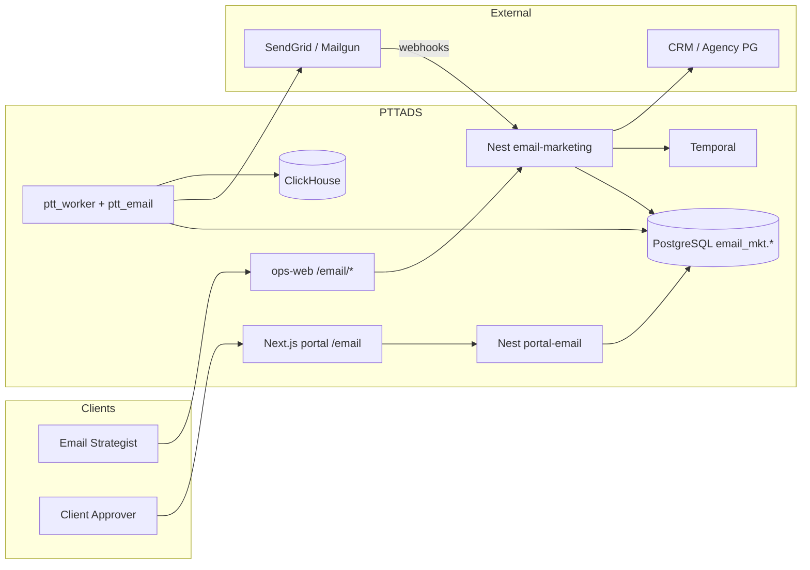
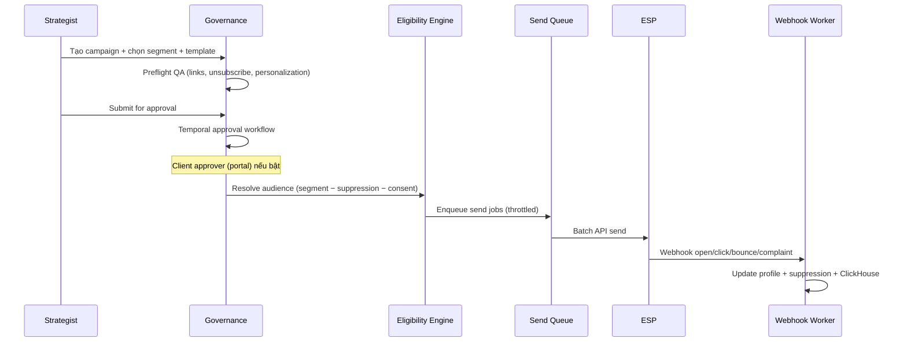

# Email Marketing Enterprise Operating System — Master Specification

> **Phiên bản:** 1.3 · **Ngày:** 2026-07-20  
> **Trạng thái:** EM-0/EM-1 đã kickoff trên ops-web + Nest (hub, governance, workspace, contacts, consent, suppression)  
> **UI Admin:** **Next.js ops-web** — `ops.pttads.vn/email/*` (quyết định platform 2026-07-20 — **bỏ Flask admin**)  
> **Client portal:** Next.js + NestJS — `portal.pttads.vn/email/*`  
> **Kế hoạch thực thi:** [`SPEC_MIGRATION_FLASK_EXECUTION_PLAN.md`](SPEC_MIGRATION_FLASK_EXECUTION_PLAN.md) §7.3 (greenfield EM)  
> **Codebase:** `PTTADS/` (NestJS + Next.js ops/portal + Python workers; Flask monolith đang retire)  
> **Nguồn gốc:** `Sơ đồ kiến trúc enterprise Cho Hệ thống Email Marketing.docx` (PTTCOM)  
> **Loại tài liệu:** Business + Technical master spec  
> **Tài liệu liên quan:**  
> - [`specs/2026-07-19-email-marketing-architecture.md`](specs/2026-07-19-email-marketing-architecture.md) — Kiến trúc hệ thống (C4, data model, API, deployment)  
> - [`SPEC_UI_UX_EMAIL_MARKETING.md`](SPEC_UI_UX_EMAIL_MARKETING.md) — UI/UX specification  
> - [`SPEC_MIGRATION_FLASK_TO_NEXT.md`](SPEC_MIGRATION_FLASK_TO_NEXT.md) — Lộ trình platform Flask → Next/Nest (Track E)  
> - [`SPEC_AGENCY_OPERATING_PLATFORM.md`](SPEC_AGENCY_OPERATING_PLATFORM.md) — Agency platform target  
> - [`SPEC_SEO_AEO_OPERATING_SYSTEM.md`](SPEC_SEO_AEO_OPERATING_SYSTEM.md) — Mẫu bounded context enterprise (SEO/AEO)  
> - [`specs/2026-07-16-channel-adapter-design.md`](specs/2026-07-16-channel-adapter-design.md) — ChannelAdapter pattern  
> - [`specs/events/catalog.yaml`](specs/events/catalog.yaml) — Domain event catalog  
> - [`runbooks/vps-production-operations.md`](runbooks/vps-production-operations.md) — VPS ops  

---

## Mục lục

1. [Tổng quan & phạm vi](#1-tổng-quan--phạm-vi)
2. [Kiến trúc 12 lớp enterprise](#2-kiến-trúc-12-lớp-enterprise)
3. [Phân tích nền tảng kỹ thuật PTTADS](#3-phân-tích-nền-tảng-kỹ-thuật-pttads)
4. [Bounded contexts & modules](#4-bounded-contexts--modules)
5. [Personas & phân quyền](#5-personas--phân-quyền)
6. [Luồng nghiệp vụ cốt lõi](#6-luồng-nghiệp-vụ-cốt-lõi)
7. [Mô hình dữ liệu tóm tắt](#7-mô-hình-dữ-liệu-tóm-tắt)
8. [Tích hợp bên ngoài & ESP](#8-tích-hợp-bên-ngoài--esp)
9. [KPI & success metrics](#9-kpi--success-metrics)
10. [Lộ trình triển khai](#10-lộ-trình-triển-khai)
11. [Ma trận tái sử dụng PTTADS](#11-ma-trận-tái-sử-dụng-pttads)
12. [Checklist sẵn sàng triển khai](#12-checklist-sẵn-sàng-triển-khai)
13. [Phụ lục](#13-phụ-lục)

---

## 1. Tổng quan & phạm vi

### 1.1. Vision

**Email Marketing Enterprise Operating System (EM-OS)** là hệ điều hành email marketing quy mô agency lớn trên nền PTTADS — không chỉ "gửi email + automation", mà là nền tảng end-to-end:

```
Acquisition → Capture & Consent → Unified Profile → Segmentation & Decisioning
           → Orchestration → Content Production → Sending Infrastructure
           → Deliverability & Compliance → Measurement → Client Reporting
```

Hệ thống phục vụ **nhiều client trong một agency PTT** (multi-client, không phải SaaS multi-agency), với governance federated: trung tâm giữ framework, client pod giữ execution.

### 1.2. Mục tiêu kinh doanh

| Mục tiêu | Chỉ số thành công |
|----------|-------------------|
| Tăng doanh thu từ email | Revenue attributed to email, pipeline influenced |
| Cải thiện deliverability | Inbox placement rate, complaint rate < 0.1% |
| Giảm rủi ro compliance | Consent audit pass, unsubscribe SLA < 24h |
| Scale nhiều client | Workspace isolation, per-client domain/IP |
| Giảm thời gian vận hành | Campaign cycle time, template reuse rate |
| Tăng chất lượng nội dung | QA preflight pass rate, render test pass |
| Closed-loop marketing | Email → Lead → Deal → Revenue attribution |

### 1.3. Nguyên tắc thiết kế

1. **Multi-client isolation** — mọi entity keyed by `client_id` / `customer_id`
2. **Consent-first** — không gửi nếu thiếu consent hoặc trong suppression master
3. **Governance-heavy** — approval workflow trước send; audit mọi thao tác rủi ro cao
4. **Template-modular** — master templates + content blocks, không làm thủ công từng campaign
5. **Deliverability-by-design** — domain/IP strategy, warm-up, bounce/complaint automation
6. **Event-driven** — engagement events quay vòng segmentation và attribution
7. **Measurable** — BI dashboard deliverability + business outcomes
8. **Admin on ops-web** — internal ops UI trên Next.js ops-web + Nest `email-marketing/` (pattern SEO hub); **không** Flask `/crm/email/*`; portal client vẫn Next.js

### 1.4. Phạm vi (In scope)

| Module | Mô tả ngắn |
|--------|------------|
| Client email workspace | Domain, ESP account, brand kit, sending limits |
| Capture & consent | Forms, preference center, consent registry |
| Unified profile | Identity resolution, contact merge, suppression master |
| Segmentation & decisioning | Lifecycle, behavior, RFM, eligibility engine |
| Campaign orchestration | Broadcast, journey builder, triggers, frequency cap |
| Content production | Templates, blocks, personalization, localization, QA |
| Sending infrastructure | ESP/MTA adapter, queue, throttling, warm-up |
| Deliverability ops | SPF/DKIM/DMARC, bounce/complaint, blacklist monitoring |
| Measurement & BI | Open/click/reply, conversion, revenue attribution |
| Governance | Global/brand/market rules, approval, audit |
| Client portal | Campaign performance, approval inbox |
| Operating model | CoE standards, runbooks, incident response |

### 1.5. Phạm vi ngoài (Out of scope)

- Thay thế CRM (`crm_leads`, lifecycle) — tích hợp, không thay
- ESP/MTA tự host (Phase 1–3 dùng ESP bên thứ ba: SendGrid/Mailgun/SES)
- SMS/Push notification (kênh khác, có thể mở rộng sau)
- Full CDP thay Salesforce/HubSpot nếu client đã có — sync qua connector
- SaaS multi-agency trên cùng cluster

### 1.6. Trạng thái hiện tại (PTTADS)

| Thành phần | Trạng thái | Ghi chú |
|------------|------------|---------|
| SMTP cơ bản (`smtplib`) | ✅ Có sẵn | `app.py` — transactional, SEO reports |
| SEO scheduled email reports | ✅ Shipped | `ptt_seo/notify.py`, `report_schedule.py` |
| Email ChannelAdapter | ✅ EM-6 | `ptt_channel/adapters/email.py` — SendGrid + dry-run |
| `client_channel_accounts` (channel=email) | ✅ DDL sẵn | `docs/specs/2026-07-17-postgresql-ddl-v1.sql` |
| CRM leads + customers | ✅ Có sẵn | SQLite + PG migration |
| Lead intake forms | ✅ Có sẵn | `/crm/intake`, `/crm/forms/lead-intake/` |
| Facebook Lead Ads webhook | ✅ Có sẵn | Acquisition source |
| Approval workflow (Temporal) | ✅ EM-6 | `EmailCampaignApprovalWorkflow` |
| Domain events outbox | ✅ Có sẵn | `domain_events`, `catalog.yaml` |
| ClickHouse BI | ✅ EM-7 | `ptt_email/bi_clickhouse.py` |
| Portal (Next.js + NestJS) | ✅ EM-4 | `/email/*` portal + ops |
| EM-OS bounded context | ✅ EM-0→EM-9 | Nest + ops-web + `ptt_email` workers |

---

## 2. Kiến trúc 12 lớp enterprise

Ánh xạ trực tiếp từ tài liệu nguồn PTTCOM sang bounded context trên PTTADS:

```mermaid
flowchart TB
    subgraph L1["L1 — Acquisition Layer"]
        A1[Paid Ads — Meta/Google]
        A2[SEO / Content — seo_aeo]
        A3[Webinar / Event]
        A4[Social / Referral]
        A5[Outbound / Sales — CRM]
    end

    subgraph L2["L2 — Capture & Consent"]
        B1[Landing / CMS]
        B2[Forms / Popups]
        B3[Chat / Bot]
        B4[Preference Center]
        B5[Consent Logging]
    end

    subgraph L3["L3 — Data Foundation"]
        C1[CRM / CDP Profile]
        C2[PG + ClickHouse WH]
        C3[Event Stream]
        C4[Identity Resolution]
        C5[Suppression Master]
        C6[Consent Registry]
    end

    subgraph L4["L4 — Governance"]
        D1[Global Rules]
        D2[Brand Rules]
        D3[Market Rules]
        D4[RBAC]
        D5[Approval Workflow]
        D6[Audit Logs]
    end

    subgraph L5["L5 — Segmentation & Decisioning"]
        E1[Lifecycle Segments]
        E2[Behavior Segments]
        E3[RFM / Value]
        E4[Intent Signals]
        E5[Eligibility Engine]
        E6[Next Best Action]
    end

    subgraph L6["L6 — Orchestration"]
        F1[Campaign Orchestrator]
        F2[Journey Builder]
        F3[Trigger Engine]
        F4[Frequency Cap]
        F5[Send-Time Optimization]
        F6[Experiment Engine]
    end

    subgraph L7["L7 — Content Production"]
        G1[Master Templates]
        G2[Modular Blocks]
        G3[Dynamic Personalization]
        G4[Localization]
        G5[QA & Preflight]
        G6[Render Testing]
    end

    subgraph L8["L8 — Sending Infrastructure"]
        H1[ESP Adapter]
        H2[Send Queue]
        H3[Dedicated Domains]
        H4[IP Pools]
        H5[Warm-up Manager]
        H6[Throttling]
    end

    subgraph L9["L9 — Deliverability & Compliance"]
        I1[SPF/DKIM/DMARC]
        I2[Bounce Processing]
        I3[Complaint Handling]
        I4[One-Click Unsubscribe]
        I5[Blacklist Monitoring]
        I6[Inbox Placement]
    end

    subgraph L10["L10 — Recipient Ecosystem"]
        J1[Gmail / Outlook / Yahoo]
    end

    subgraph L11["L11 — Measurement"]
        K1[Engagement Events]
        K2[Conversion Tracking]
        K3[Revenue Attribution]
        K4[BI Dashboard]
    end

    subgraph L12["L12 — Operating Model"]
        M1[Email CoE]
        M2[Client Pods]
        M3[Runbooks / SLA]
    end

    L1 --> L2 --> L3
    L3 --> L5 --> L6 --> L7 --> L8 --> L9 --> L10 --> L11
    L4 --> L5
    L4 --> L6
    L4 --> L7
    L11 --> L12
```



### 2.1. Khác biệt so với hệ thống email thông thường

| Khía cạnh | Email tool thông thường | EM-OS trên PTTADS |
|-----------|-------------------------|-------------------|
| Governance | Ít hoặc không có | Federated: global + brand + market rules, approval chain |
| Data | List upload | Unified profile từ CRM, ads, web, events |
| Deliverability | Cơ bản | Ops layer: warm-up, IP/domain isolation, scorecards |
| Measurement | Open/click | Revenue + pipeline attribution qua CRM closed-loop |
| Multi-client | Workspace riêng (nếu có) | `client_id` + domain/IP suppression tách biệt |
| Vận hành | Ad-hoc | CoE + runbooks + incident response |

Chi tiết C4, containers, components, API: xem [`specs/2026-07-19-email-marketing-architecture.md`](specs/2026-07-19-email-marketing-architecture.md).

---

## 3. Phân tích nền tảng kỹ thuật PTTADS

### 3.1. Tổng quan stack hiện tại

| Thành phần | Công nghệ | Vai trò trong EM-OS |
|------------|-----------|---------------------|
| **Internal Admin UI** | **Next.js ops-web** | `ops.pttads.vn/email/*` — hub, clients, contacts, consent, suppression, … |
| **Admin API** | NestJS `email-marketing/` | `/api/v1/email/*` — CRUD, governance, public capture |
| Client Portal | Next.js 14 + NestJS `portal-email` | `portal.pttads.vn/email/*` — reports, approval inbox |
| Domain logic | `ptt_email/*` + `ptt_worker` | Send queue, segments, ESP, deliverability jobs |
| OLTP | PostgreSQL 15 (`email_mkt.*`) | Source of truth (PG-only) |
| CRM bridge | Nest leads API / PG | Contacts, attribution — read-only bridge |
| Auth (admin) | Staff JWT + Nest guards | `staff_section_permissions` — keys `crm_email_mkt_*` |
| Auth (portal) | Nest portal JWT / Keycloak | Scoped `client_id` |

**Chiến lược:** Greenfield trên ops-web + Nest (Execution Plan §7.3) — **không** blueprint Flask. Portal client tách Nest/Next. Python workers giữ async/send.

### 3.2. Ánh xạ 12 lớp → module PTTADS

| Lớp enterprise | Module PTTADS | Package / path | DB schema |
|--------------|---------------|----------------|-----------|
| L1 Acquisition | Tích hợp có sẵn | `ptt_meta/`, `ptt_google/`, `ptt_seo/`, `crm_lead_store.py` | `crm_leads`, ads insights |
| L2 Capture & Consent | **Mới** | `ptt_email/capture.py`, `ptt_email/consent.py` | `email_mkt.consent_*`, `email_mkt.forms_*` |
| L3 Data Foundation | **Mới + bridge** | `ptt_email/profile.py`, `ptt_email/suppression.py` | `email_mkt.contacts`, `email_mkt.suppression_*` |
| L4 Governance | **Mới + reuse** | `ptt_email/governance.py`, `ptt_email/rbac.py` | `email_mkt.rules_*`, `email_mkt.audit_log` |
| L5 Segmentation | **Mới** | `ptt_email/segments.py`, `ptt_email/eligibility.py` | `email_mkt.segments`, `email_mkt.segment_members` |
| L6 Orchestration | **Mới** | `ptt_email/campaigns.py`, `ptt_email/journeys.py` | `email_mkt.campaigns`, `email_mkt.journey_*` |
| L7 Content | **Mới** | `ptt_email/templates.py`, `ptt_email/render.py` | `email_mkt.templates`, `email_mkt.blocks` |
| L8 Sending | **Mới + adapter** | `ptt_email/sender.py`, `ptt_channel/adapters/email.py` | `email_mkt.send_queue`, `email_mkt.domains` |
| L9 Deliverability | **Mới** | `ptt_email/deliverability.py` | `email_mkt.bounces`, `email_mkt.complaints` |
| L10 Recipient | ESP-dependent | Webhook ingest | — |
| L11 Measurement | **Mới + BI** | `ptt_email/analytics.py`, `ptt_email/bi_clickhouse.py` | ClickHouse `email_*` facts |
| L12 Operating | Docs + runbooks | `docs/runbooks/email-*` | — |

### 3.3. Quyết định kiến trúc (ADR tóm tắt)

| ADR | Quyết định | Lý do |
|-----|------------|-------|
| ADR-EM-01 | PostgreSQL-only cho EM-OS (không SQLite) | Nhất quán SEO/AEO cutover policy |
| ADR-EM-02 | ESP abstraction qua ChannelAdapter | Đã có pattern Meta/Google/Email stub |
| ADR-EM-03 | Send queue trong PG + worker, không gửi sync HTTP | Throttling, retry, audit |
| ADR-EM-04 | Temporal cho approval + multi-step journeys | Đã vận hành SEO content, campaign write |
| ADR-EM-05 | ClickHouse cho engagement analytics | Pattern SEO Gate D, không query OLTP nặng |
| ADR-EM-06 | Feature flags per gate | `PTT_EMAIL_*_ENABLED` — pilot an toàn |
| ADR-EM-07 | ESP khuyến nghị Phase 1: **SendGrid** hoặc **Mailgun** | Webhook mạnh, dedicated domain, EU compliance |
| ADR-EM-10 | **Admin UI ops-web + REST Nest `email-marketing/`** | Supersedes Flask v1.2; nhất quán SEO hub cutover; staff login ops-web |
| ADR-EM-11 | Webhook ingest qua Nest `webhooks` (+ worker jobs) | Pattern channel adapter; không Flask blueprint |

### 3.4. Container diagram (target)



---

## 4. Bounded contexts & modules

| Context | Module ID | Prefix code | Phase |
|---------|-----------|-------------|-------|
| Client email workspace | 4.1 | `email_workspace` | 1 |
| Capture & consent | 4.2 | `email_capture` | 1 |
| Unified profile & suppression | 4.3 | `email_profile` | 1 |
| Governance & rules | 4.4 | `email_governance` | 1 |
| Segmentation & eligibility | 4.5 | `email_segment` | 2 |
| Campaign orchestration | 4.6 | `email_campaign` | 2 |
| Journey & automation | 4.7 | `email_journey` | 3 |
| Content & templates | 4.8 | `email_content` | 2 |
| Sending infrastructure | 4.9 | `email_sender` | 2 |
| Deliverability ops | 4.10 | `email_deliverability` | 3 |
| Analytics & attribution | 4.11 | `email_analytics` | 3 |
| Client portal | 4.12 | `email_portal` | 4 |
| Automation & alerts | 4.13 | `email_automation` | 3 |

**Quy ước module Python:** `ptt_email/<context>.py` (workers/jobs — không HTTP admin)  
**Quy ước route admin UI:** `ops.pttads.vn/email/*` → `services/ops-web/src/app/email/**`  
**Quy ước route API:** `/api/v1/email/*` → `services/ptt-crm-api/src/email-marketing/`  
**Quy ước route portal:** `portal.pttads.vn/email/*` → Nest + `portal-web`  
**DDL:** `deploy/sql/email_mkt_pg_schema.sql`

---

## 5. Personas & phân quyền

### 5.1. Personas

| Persona | Vai trò | Entry screens |
|---------|---------|---------------|
| Email CoE Lead | Standards, template system, testing framework | Governance Hub, CoE Dashboard |
| Email Strategist | Segments, campaigns, journeys | Campaign Console, Segment Builder |
| Content Designer | Templates, blocks, render QA | Template Studio |
| Deliverability Specialist | Domain/IP health, warm-up, recovery | Deliverability Console |
| Compliance Reviewer | Consent audit, market rules | Consent Registry, Audit Log |
| Account Manager | Client workspace overview | Client Email Hub |
| Client Approver | Approve campaigns before send | Portal approval inbox |
| Client Viewer | Read-only performance | Portal reports |
| Admin | ESP credentials, domain DNS | Settings |

### 5.2. RBAC section keys (mới)

| Key | Scope | Actions |
|-----|-------|---------|
| `crm_email_mkt` | View hub, read-only | `view` |
| `crm_email_mkt_write` | Campaigns, segments, templates CRUD | `view`, `edit`, `create` |
| `crm_email_mkt_approve` | Approve send, override suppression (logged) | `approve` |
| `crm_email_mkt_deliverability` | Domain/IP, warm-up, bounce tools | `view`, `edit`, `configure` |
| `crm_email_mkt_settings` | ESP credentials, client workspace | `view`, `edit`, `configure` |
| `crm_email_mkt_reports` | Export, BI, scheduled client reports | `view`, `export` |
| `crm_email_mkt_compliance` | Consent registry, audit, suppression master | `view`, `edit` |

**Default grants:**

| Position | Keys |
|----------|------|
| **MKT-EM-01** (Head Email) | Full — all 7 keys |
| **MKT-EM-02** (Strategist) | `crm_email_mkt` + `write` + `reports` |
| **MKT-EM-03** (Deliverability) | `crm_email_mkt` + `deliverability` + `settings` |
| **KD-01** (AM) | `crm_email_mkt` view + `settings` + `reports` |
| **Portal approver** | Approve inbox only (Nest scope) |

Implementation: `ptt_email/rbac.py` + extend `admin_page_permissions.py` (pattern `ptt_seo/rbac.py`).

---

## 6. Luồng nghiệp vụ cốt lõi

### 6.1. Luồng tạo và gửi campaign (broadcast)



**Business rules:**

1. Không enqueue nếu `consent_status != opted_in` cho topic tương ứng
2. Hard suppression: bounce hard, complaint, global unsubscribe, legal hold
3. Frequency cap: max N emails / contact / 7 days (config per client)
4. Send window: respect timezone + quiet hours (market rules)
5. Approval bắt buộc nếu audience > threshold hoặc client policy yêu cầu

### 6.2. Luồng consent & preference center

1. Contact submit form / landing → `ConsentRecorded` event
2. Ghi `email_mkt.consent_records` (who, what, when, channel, ip, version)
3. Double opt-in (nếu market rule EU/VN yêu cầu) → confirmation email
4. Preference center: update topics, frequency, unsubscribe per topic
5. One-click unsubscribe header (RFC 8058) → immediate suppression

### 6.3. Luồng deliverability incident

1. Alert: complaint rate spike / blacklist / domain reputation drop
2. Auto-pause send queue cho domain/IP affected
3. Slack/Teams notify Deliverability team
4. Runbook: [`runbooks/email-deliverability-incident.md`](runbooks/email-deliverability-incident.md) (tạo Phase 3)
5. Recovery: warm-up schedule → gradual volume restore

### 6.4. Luồng closed-loop attribution

1. Email click → UTM / tracked link → landing with `email_send_id`
2. Lead created (CRM) → correlate `correlation_id` / `send_id`
3. Deal won → `ptt_email/attribution.py` (pattern `ptt_seo/attribution.py`)
4. Rollup vào ClickHouse + client report

---

## 7. Mô hình dữ liệu tóm tắt

Schema PostgreSQL: `email_mkt.*` (chi tiết DDL trong architecture doc).

### 7.1. Core entities

| Entity | Mô tả | Key fields |
|--------|-------|------------|
| `email_workspaces` | Workspace email per client | `client_id`, `default_from_domain`, `esp_account_id` |
| `email_contacts` | Unified contact profile | `client_id`, `email`, `crm_customer_id`, `identity_keys` |
| `email_consent_records` | Consent registry (immutable append) | `contact_id`, `topic`, `status`, `source`, `recorded_at` |
| `email_suppression_entries` | Suppression master | `email`, `reason`, `scope`, `expires_at` |
| `email_segments` | Segment definitions | `client_id`, `type`, `definition_json`, `refresh_schedule` |
| `email_segment_members` | Materialized membership | `segment_id`, `contact_id`, `computed_at` |
| `email_templates` | Master templates | `client_id`, `html_body`, `blocks_json`, `locale` |
| `email_campaigns` | Broadcast campaigns | `client_id`, `status`, `segment_id`, `template_id`, `scheduled_at` |
| `email_journeys` | Automation journeys | `client_id`, `trigger_type`, `graph_json`, `status` |
| `email_send_queue` | Outbound queue | `campaign_id`, `contact_id`, `status`, `esp_message_id` |
| `email_engagement_events` | Raw events (OLTP hot) | `event_type`, `send_id`, `occurred_at` |
| `email_domains` | Sending domains | `client_id`, `domain`, `spf_status`, `dkim_status`, `dmarc_status` |
| `email_bounces` / `email_complaints` | Deliverability | `send_id`, `type`, `raw_payload` |
| `email_audit_log` | Governance audit | `actor`, `action`, `entity`, `before/after` |
| `email_rules` | Global/brand/market rules | `scope`, `rule_type`, `config_json` |

### 7.2. Identity resolution

- Primary key: normalized email (lowercase, trimmed)
- Secondary keys: `crm_customer_id`, `crm_lead_id`, external IDs từ ESP
- Merge policy: AM manual merge + auto-merge khi email match + confidence score
- Bridge: read `crm_customers` từ SQLite qua `ptt_email/db.py` (pattern `ptt_seo/db.py`)

### 7.3. ClickHouse facts (OLAP)

| Table | Grain | Metrics |
|-------|-------|---------|
| `email_send_facts` | send | sent, delivered, bounced |
| `email_engagement_facts` | event | opens, clicks, unsubscribes |
| `email_campaign_daily` | campaign × day | rates, revenue_proxy |
| `email_deliverability_daily` | domain × day | bounce_rate, complaint_rate |

---

## 8. Tích hợp bên ngoài & ESP

### 8.1. ESP adapter (Phase 2+)

Implement đầy đủ `EmailAdapter` (`ptt_channel/adapters/email.py`):

| Capability | SendGrid | Mailgun | AWS SES |
|------------|----------|---------|---------|
| Transactional + marketing API | ✅ | ✅ | ✅ |
| Webhook events | ✅ | ✅ | ✅ (SNS) |
| Dedicated domain | ✅ | ✅ | ✅ |
| Suppression sync | ✅ | ✅ | Partial |
| Template API | ✅ | ✅ | ✅ |

**Khuyến nghị Phase 1 pilot:** SendGrid (documentation, webhook richness) hoặc Mailgun (EU data residency).

### 8.2. Webhook ingest

- Route: `POST /api/v1/webhooks/email` (Nest `webhooks` module)
- Header: `X-PTT-Client-Id` + ESP signature verification
- Normalize → `NormalizedEvent` (đã có map open/click/unsubscribe)
- Enqueue job `email_engagement_ingest`

### 8.3. Tích hợp nội bộ PTTADS

| Hệ thống | Hướng | Use case |
|----------|-------|----------|
| CRM leads | Read + write back | Lead from email, status sync |
| SEO/AEO | Read | Content links, subscriber from content |
| Meta/Google Ads | Read | Acquisition source, lookalike export (Phase 4) |
| Service lifecycle | Read | Gating email service delivery |
| Temporal | Bidirectional | Approval workflows |
| Portal NestJS | Read/write scoped | Client reports, approve |
| Slack/Teams | Notify | Alerts, approval reminders |

### 8.4. Domain events (mở rộng catalog)

| Event | Publisher | Subscribers |
|-------|-----------|-------------|
| `ConsentRecorded` | email_capture | email_profile, audit |
| `ContactSuppressed` | email_deliverability | email_segment, email_sender |
| `EmailCampaignApproved` | workflow | email_sender |
| `EmailSent` | email_sender | email_analytics, metrics_engine |
| `EmailEngagementReceived` | email_adapter | email_analytics, email_segment |
| `DeliverabilityAlertRaised` | email_deliverability | notification_service |

---

## 9. KPI & success metrics

### 9.1. Deliverability KPIs

| KPI | Target | Source |
|-----|--------|--------|
| Delivery rate | ≥ 98% | ESP + bounce processing |
| Hard bounce rate | < 0.5% | `email_bounces` |
| Complaint rate | < 0.1% | `email_complaints` |
| Unsubscribe rate | Benchmark by vertical | engagement events |
| Domain authentication pass | 100% SPF/DKIM/DMARC | `email_domains` |
| Inbox placement (seed test) | ≥ 85% primary | Phase 4 monitoring tool |

### 9.2. Business KPIs

| KPI | Source |
|-----|--------|
| Email-attributed revenue | ClickHouse + CRM deals |
| Pipeline influenced | CRM pipeline stages |
| Campaign ROI | Spend (ESP) vs revenue |
| List growth rate | consent records |
| Engagement rate (CTOR) | ClickHouse |
| Time-to-send (cycle time) | audit log timestamps |

### 9.3. Ops KPIs

| KPI | Target |
|-----|--------|
| Approval SLA | < 24h business hours |
| Incident MTTR | < 4h (P1 deliverability) |
| Send queue lag | < 5 min P95 |
| Segment refresh SLA | Per schedule ± 15 min |

---

## 10. Lộ trình triển khai

> **Cập nhật 2026-07-20:** Codebase đã vượt Phase 0–4 + Waves EM-6→EM-9. Sprint **EM-10 Send hardening** bổ sung schedule send, preflight v2, eligibility v2.

### Phase 0 — Foundation (2–3 tuần) ✅

- [x] DDL `email_mkt.*` (`deploy/sql/email_mkt_pg_schema.sql`)
- [x] Nest `email-marketing/` hub + governance (EM-0)
- [x] ops-web `/email/hub`, `/email/governance` + gate scripts
- [ ] RBAC section keys trong PG `staff_section_permissions` (prod)
- [ ] Feature flag `PTT_EMAIL_ENABLED=0` prod pilot (env sẵn, chưa rollout)

### Phase 1 — Capture & Profile (3–4 tuần) ✅ ~85%

- [x] Preference center public page (`/email/public/preferences/:token`)
- [x] Form capture API (`POST /api/v1/email/capture`) + consent logging
- [x] Contact import API + ops-web UI
- [x] Consent + suppression registry (ops-web + Nest)
- [ ] Identity resolution v1 (email match + CRM bridge)
- [ ] Audit log UI tail (governance tab mở rộng)

### Phase 2 — Send MVP (4–5 tuần) ✅ ~85%

- [x] Template studio (master + blocks) — EM-2, Wave 3b
- [x] Segment builder (lifecycle + static) — EM-2, Wave 3b
- [x] Eligibility engine v1 (consent + suppression + daily cap)
- [x] Campaign broadcast + PG send queue — EM-6
- [x] ESP adapter SendGrid/Mailgun — EM-6 (dry-run default dev)
- [x] Webhook ingest open/click/bounce/unsub — EM-6
- [x] Approval workflow (Temporal) — EM-6
- [x] Preflight QA cơ bản — EM-2
- [x] **EM-10:** Preflight v2 (broken links, List-Unsubscribe header, SPF/DKIM warn)
- [x] **EM-10:** Schedule send API + UI + due runner
- [x] **EM-10:** Eligibility v2 (frequency cap 7d + quiet hours defer)

### Phase 3 — Enterprise depth (5–6 tuần) 🟡 ~45%

- [x] Journey builder UI (CRUD + canvas editor) — EM-3 / EM-12
- [x] Deliverability console (domain DNS check, warm-up) — EM-3 / Wave 2
- [x] Bounce/complaint automation → suppression — EM-6 webhook
- [x] ClickHouse BI + reports UI — EM-7
- [x] Journey **execution engine** (trigger → wait → send → branch → exit) — EM-11/EM-12
- [ ] Send-time optimization v1 (beyond quiet-hours defer)
- [ ] Grafana dashboard embed
- [ ] Slack/Teams deliverability alerts (runbook có, tích hợp chưa)
- [x] Experiment engine (A/B subject line) — EM-12
- [ ] Segment RFM / behavior rules

### Phase 4 — Portal & Attribution (3–4 tuần) ✅ ~75%

- [x] NestJS `portal-email` module
- [x] portal-web `/email`, `/email/approvals`, `/email/campaigns/:id`
- [x] Portal approval preview iframe — EM-9 / Wave 4
- [x] Revenue attribution KPI (hub + reports proxy)
- [x] Scheduled client reports (pattern SEO) — EM-7
- [ ] Inbox placement monitoring integration

### Phase 5 — Prod pilot (Gate A) 🟡 Staging pack ready

- [x] Gate chain EM-0→EM-9 (`phase9_email_wave4_gate.sh`)
- [x] Horizon 0 orchestrator (`scripts/horizon0_gate_a_pack.sh`) + runbook
- [x] Delivery admin Flask retirement (SEO + Email → ops-web) — partial Phase 5
- [ ] Staging/prod soak ≥ 7 ngày (cron `phase5_email_soak_record.sh`)
- [ ] 1–2 client pilot ESP thật (`deploy/env.em5-prod-send.example`)
- [ ] Human sign-off (`docs/evidence/em5-email-pilot-signoff.json`)

### Waves bổ sung (implementation track)

| Wave | Gate | Deliverable |
|------|------|-------------|
| EM-6 / Wave 1 | `phase6_email_send_platform_gate.sh` | Send pipeline + ESP adapter |
| EM-7 / Wave 2 | `phase7_email_wave2_gate.sh` | Measurement + CH export |
| EM-8 / Wave 3 | `phase8_email_wave3_gate.sh` | UX polish |
| EM-8b / Wave 3b | `phase8b_email_wave3b_gate.sh` | Segment/template studio depth |
| EM-9 / Wave 4 | `phase9_email_wave4_gate.sh` | Prod pilot gate + portal preview |
| **EM-10** | *(pytest EM-10)* | Send hardening + preflight v2 |
| **EM-11** | *(pytest EM-11)* | Prod ops cron + journey MVP enrollments |
| **EM-12** | `phase12_email_automation_gate.sh` | Journey execution + A/B experiments |

**Tiếp theo (sau EM-12):** VPS prod soak 7d + ESP real + Gate A human sign-off ([`horizon0-gate-a-execution.md`](runbooks/horizon0-gate-a-execution.md)).

**Tổng ước tính ban đầu:** 17–22 tuần — **platform shell ~90%**, prod ops ~40%.

---

## 11. Ma trận tái sử dụng PTTADS

| Thành phần PTTADS | Tái sử dụng EM-OS | Ghi chú |
|-------------------|-------------------|---------|
| `clients`, `client_channel_accounts` | ✅ Trực tiếp | channel=`email` |
| `crm_customers`, `crm_leads` | ✅ Bridge read | Không duplicate CRM |
| `job_queue`, `ptt_worker` | ✅ Pattern | Job types mới |
| `domain_events` | ✅ Extend catalog | Outbox pattern |
| `ptt_channel/adapters/email.py` | ✅ Implement | Thay stub; worker gọi ESP |
| Nest `webhooks` (email ESP) | ✅ Extend | Email webhooks ingress |
| `services/ptt-crm-api/src/email-marketing/` | ✅ **New** | Admin REST API (thay Flask blueprint) |
| `staff_section_permissions` / Nest staff-auth | ✅ Extend | 7 section keys `crm_email_mkt_*` |
| `services/ops-web/src/app/email/` | ✅ **New** | Admin screens E-01…E-13 (thay Jinja templates) |
| `services/ptt-crm-api/src/portal-email/` | ✅ New | Client portal API only |
| `services/portal-web/src/app/email/` | ✅ New | Client portal UI |
| Flask monolith | ❌ **Không dùng cho EM** | Retire — không tạo `/crm/email/*` |
| `templates/crm_email_*.html` | ❌ **Không tạo** | Superseded by ops-web |
| `blueprints/email_marketing.py` | ❌ **Không tạo** | Superseded by Nest |
| SMTP `app.py` | ⚠️ Legacy transactional only | Marketing bulk qua ESP + worker |
| `ptt_seo/workflow.py`, `ptt_seo/bi_clickhouse.py`, … | ✅ Pattern | Audit, CH export, governance clone |
| `deploy/grafana/` | ✅ Extend | Email ops dashboard |
| SQLite new schema | ❌ Không | PG-only policy |

---

## 12. Checklist sẵn sàng triển khai

Theo tài liệu nguồn + điều kiện PTTADS:

| # | Hạng mục | PTTADS hiện tại | Cần làm |
|---|----------|-----------------|---------|
| 1 | Domain strategy per brand/client | 🟡 E-11 domains | Prod onboarding wizard |
| 2 | SPF/DKIM/DMARC | 🟡 EM-3 dns_verify + preflight warn | Prod verify trước send |
| 3 | Suppression master + consent registry | ✅ EM-1 | Harden prod RBAC + audit UI |
| 4 | Lifecycle + behavior segmentation | 🟡 lifecycle v1 | RFM / behavior Phase 3 |
| 5 | Approval workflow | ✅ EM-6 Temporal + portal | Prod Temporal path |
| 6 | Modular templates | ✅ EM-2 + Wave 3b blocks | Drag-drop editor (P2) |
| 7 | Deliverability + revenue dashboard | 🟡 EM-7 reports | Grafana embed |
| 8 | Incident runbook | 🟡 draft | Alert automation |
| 9 | CoE + client pod model | 🟡 Agency ops doc | Operationalize |
| 10 | Quarterly review + audit | 🟡 SEO governance clone | Governance write UI |

---

## 13. Phụ lục

### 13.1. Environment variables (target)

```bash
# Core
PTT_EMAIL_ENABLED=0
PTT_EMAIL_DB=pg                    # pg only
DATABASE_URL=postgresql://...

# ESP (per env; per-client creds in client_channel_accounts)
EMAIL_ESP_PROVIDER=sendgrid        # sendgrid | mailgun | ses
SENDGRID_API_KEY=
MAILGUN_API_KEY=
MAILGUN_DOMAIN=

# Sending limits
PTT_EMAIL_DEFAULT_DAILY_CAP=50000
PTT_EMAIL_FREQUENCY_CAP_7D=5

# Features
PTT_EMAIL_JOURNEYS_ENABLED=0
PTT_EMAIL_PORTAL_ENABLED=0
PTT_EMAIL_DELIVERABILITY_ALERTS=1

# BI
PTT_EMAIL_CLICKHOUSE_EXPORT=1
CLICKHOUSE_URL=http://127.0.0.1:8123
```

### 13.2. UI screens (internal — ops-web admin)

Host: **`ops.pttads.vn`** · Source: `services/ops-web/src/app/email/**`

| Screen ID | Route | Phase | Trạng thái |
|-----------|-------|-------|------------|
| E-01 | `/email/hub` — Hub | 0 | ✅ EM-0 (KPI + calendar + client health) |
| E-02 | `/email/clients` — Client list | 1 | ✅ EM-1 |
| E-03 | `/email/clients/:id` — Client workspace | 1 | ✅ EM-1 |
| E-04 | `/email/contacts` — Contact directory | 1 | ✅ EM-1 |
| E-05 | `/email/consent` — Consent registry | 1 | ✅ EM-1 |
| E-06 | `/email/suppression` — Suppression master | 1 | ✅ EM-1 |
| E-07 | `/email/segments` — Segment builder | 2 | 🟡 EM-2 + Wave 3b (lifecycle; RFM Phase 3) |
| E-08 | `/email/templates` — Template studio | 2 | 🟡 EM-2 + Wave 3b (blocks/HTML tabs) |
| E-08b | `/email/templates/:id` — Template editor | 2 | 🟡 EM-2 + Wave 3b |
| E-09 | `/email/campaigns` — Campaign console | 2 | ✅ EM-2 |
| E-09b | `/email/campaigns/:id` — Campaign detail | 2 | 🟡 EM-10 (+ schedule send UI) |
| E-09c | `/email/campaigns/:id/review` — Preflight QA | 2 | 🟡 EM-10 (preflight v2 + staff approve) |
| E-10 | `/email/journeys` — Journey builder | 3 | ✅ EM-12 CRUD + execution |
| E-11 | `/email/deliverability` — Deliverability console | 3 | ✅ EM-3 |
| E-12 | `/email/reports` — Analytics center | 3 | ✅ EM-7 |
| E-13 | `/email/governance` — Rules & audit | 0→1 | 🟡 EM-0 read-only rules + audit tail |

Portal: **P-EMAIL-01** ✅ · **P-EMAIL-02** ✅ (+ preview EM-9) · **P-EMAIL-03** ✅

Public (minimal layout): `/email/public/preferences/:token`, `/email/public/unsubscribe/:token`, `/email/public/confirm/:token` — ✅ EM-1

### 13.3. Tài liệu cần tạo tiếp theo

1. [`specs/2026-07-19-email-marketing-architecture.md`](specs/2026-07-19-email-marketing-architecture.md) — C4, DDL, API tables
2. [`SPEC_UI_UX_EMAIL_MARKETING.md`](SPEC_UI_UX_EMAIL_MARKETING.md) — UI/UX spec ✅
3. `runbooks/email-deliverability-incident.md` — Incident response
4. `runbooks/email-esp-cutover.md` — ESP onboarding per client
5. `deploy/sql/email_mkt_pg_schema.sql` — PostgreSQL DDL

### 13.4. Tham chiếu tài liệu nguồn

Kiến trúc 12 lớp, data flow, org model và deployment principles lấy từ:

`/Users/quoctuan/Documents/PTTCOM/Sơ đồ kiến trúc enterprise Cho Hệ thống Email Marketing.docx`

---

## Lịch sử

| Version | Date | Change |
|---------|------|--------|
| 1.4 | 2026-07-20 | §10/§13.2 sync EM-0→EM-10; Send hardening sprint documented |
| 1.3 | 2026-07-20 | Platform decision: no Flask — admin ops-web (see execution plan) |
| 1.2 | 2026-07-19 | Admin Flask (superseded by 1.3) |
| 1.1 | 2026-07-19 | Draft Next.js ops-web (superseded by v1.2 for admin) |
| 1.0 | 2026-07-19 | Initial master spec from enterprise EM architecture doc |
