# PTT Advertising — Đặc tả hệ thống (System Specification)

> **Phiên bản:** 2026-05 · **Codebase:** `PTT/` · **Production:** `https://pttads.vn` · **Local:** `http://127.0.0.1:5050`  
> **Loại tài liệu:** Functional + Technical Specification (master)  
> **Tài liệu liên quan:** [`HE_THONG_PTT.md`](HE_THONG_PTT.md) (tóm tắt) · [`SPEC_AGENCY_OPERATING_PLATFORM.md`](SPEC_AGENCY_OPERATING_PLATFORM.md) (target agency platform) · [`SPEC_UI_UX_PTT.md`](SPEC_UI_UX_PTT.md) (UI/UX) · [`HUONG_DAN_SU_DUNG_PTT.md`](HUONG_DAN_SU_DUNG_PTT.md) (hướng dẫn sử dụng) · [`PHAN_QUYEN_HUONG_DAN.md`](PHAN_QUYEN_HUONG_DAN.md) (phân quyền) · [`TEST_CASES_PTT.md`](TEST_CASES_PTT.md) (QA)

---

## Mục lục

1. [Tổng quan & phạm vi](#1-tổng-quan--phạm-vi)
2. [Kiến trúc hệ thống](#2-kiến-trúc-hệ-thống)
3. [Đặc tả chức năng theo module](#3-đặc-tả-chức-năng-theo-module)
4. [Luồng nghiệp vụ & quy tắc kinh doanh](#4-luồng-nghiệp-vụ--quy-tắc-kinh-doanh)
   - [4.5 RE Projects — Sequence diagrams chi tiết](#45-re-projects--sequence-diagrams-chi-tiết)
5. [Mô hình dữ liệu](#5-mô-hình-dữ-liệu)
6. [Đặc tả API](#6-đặc-tả-api)
7. [Xác thực & phân quyền](#7-xác-thực--phân-quyền)
8. [Tích hợp bên ngoài](#8-tích-hợp-bên-ngoài)
9. [Yêu cầu phi chức năng](#9-yêu-cầu-phi-chức-năng)
10. [Triển khai & vận hành](#10-triển-khai--vận-hành)
11. [Kiểm thử & chất lượng](#11-kiểm-thử--chất-lượng)
12. [Phụ lục](#12-phụ-lục)
13. [Roadmap — Quy trình cần hoàn thiện & nâng cấp Automation/AI](#13-roadmap--quy-trình-cần-hoàn-thiện--nâng-cấp-automationai)

---

## 1. Tổng quan & phạm vi

### 1.1. Vision

PTT là **nền tảng all-in-one** cho agency quảng cáo và kinh doanh bất động sản, gồm ba lớp tích hợp trong một ứng dụng Flask duy nhất:

| Lớp | Mục tiêu | Người dùng |
|-----|----------|------------|
| **Landing công khai** | Thu hút khách, showcase dịch vụ & dự án, thu lead/form | Khách truy cập |
| **CMS & Admin** | Quản trị thương hiệu, nội dung, chat marketing AI | Admin, biên tập, marketing |
| **CRM nội bộ** | CSKH, lead, kinh doanh, dự án BĐS, nhân sự, KPI, lương | Admin, CSKH, sales, MKT, HR |

### 1.2. Personas

| Persona | Đăng nhập | Shell UI | Mục tiêu chính |
|---------|-----------|----------|----------------|
| Khách website | Không | Landing | Xem dịch vụ, liên hệ, ứng tuyển |
| Super Admin | `/admin/login` | Sidebar đầy đủ | Toàn quyền hệ thống |
| CMS Admin | Cùng trên | Sidebar đầy đủ | Quản trị nội dung + CRM |
| Biên tập / MKT | Cùng trên | Sidebar (lọc quyền) | CMS + CRM theo vai trò/chức vụ |
| NV CSKH (portal) | Cùng trên | Nav ngang gọn | Case/lead được gán, KPI cá nhân |
| NV Kinh doanh | Admin hoặc portal | Tuỳ gán quyền | Pipeline, deal, dự án BĐS |

### 1.3. Stack kỹ thuật

| Thành phần | Công nghệ |
|------------|-----------|
| Backend | Python 3, Flask 3, SQLite |
| Frontend | Jinja2 templates, Vanilla JS, CSS custom properties |
| Auth | Flask session (`ptt_session`, 14 ngày), PBKDF2-SHA256 |
| Export | openpyxl (Excel), reportlab (PDF) |
| AI (tuỳ chọn) | OpenAI API — chat CMS, trợ lý CRM, lead AI |
| Deploy | Gunicorn (`gunicorn.conf.py`), systemd `ptt.service`, port **8002** (prod) / **5050** (dev) |

### 1.4. Phạm vi ngoài (Out of scope)

- Multi-tenant / SaaS cho nhiều công ty
- Mobile app native
- ERP/kế toán tổng hợp doanh nghiệp (chỉ có module kế toán dự án BĐS cơ bản)
- Thanh toán trực tuyến

---

## 2. Kiến trúc hệ thống

### 2.1. Sơ đồ tổng thể

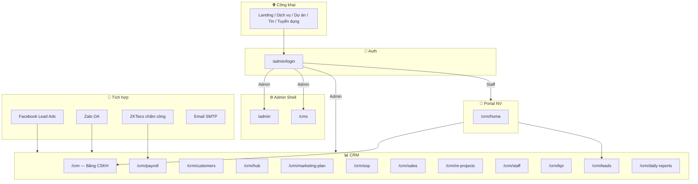

### 2.2. Kiến trúc ứng dụng

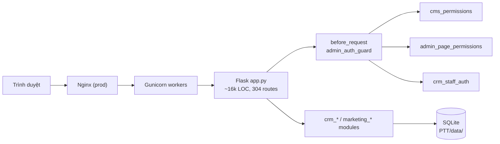

**Đặc điểm kiến trúc:**

- **Monolith** — toàn bộ route trong `app.py`, không dùng Flask Blueprint
- **Schema migration** — `init_db()` + chuỗi `_ensure_*` / `ensure_*` khi khởi động
- **Module tách file** — logic nghiệp vụ trong `crm_*.py`, `marketing_*.py`
- **Dual permission** — vai trò CMS (module) + chức vụ CRM (section + button)

### 2.3. Luồng xử lý request

1. `admin_auth_guard` (before_request) — path có cần đăng nhập?
2. **Admin session** → kiểm tra `_cms_can()` hoặc `_admin_section_can()`
3. **Staff session** → chỉ path/API trong allowlist; lead/case scope theo assign
4. Chưa đăng nhập → redirect `/admin/login` hoặc JSON 401
5. API response `/api/*` → header no-cache

---

## 3. Đặc tả chức năng theo module

### 3.1. Landing công khai

| ID | Route | Chức năng | Input/Output |
|----|-------|-----------|--------------|
| L-01 | `GET /` | Trang chủ: hero, dịch vụ, dự án, tin, form liên hệ | Đọc `settings`, `services`, `projects`, `news` |
| L-02 | `GET /services/<slug>` | Chi tiết dịch vụ | Category + item từ CMS builder |
| L-03 | `GET /du-an/<id>` | Portfolio dự án | CRUD qua Admin |
| L-04 | `GET /tin-tuc/<id>` | Chi tiết tin tức | CRUD qua Admin |
| L-05 | `GET /career` | Danh sách tuyển dụng + modal ứng tuyển | |
| L-06 | `GET /career/<slug>` | Chi tiết vị trí | |
| L-07 | `POST /career/<slug>/apply` | Nộp hồ sơ (PDF/DOC) | Email SMTP |
| L-08 | `GET /chinh-sach-bao-mat` | Chính sách bảo mật | Static/CMS |
| L-09 | `POST /api/consultations` | Form tư vấn landing | Excel + email |
| L-10 | `POST /api/landing-contact` | Form liên hệ | JSON API |

**Yêu cầu:** Responsive, SEO (`/robots.txt`, `/sitemap.xml`), favicon, GTM (nếu cấu hình).

### 3.2. Admin Dashboard

| ID | Route | Chức năng | Quyền CMS |
|----|-------|-----------|-----------|
| A-01 | `GET /admin` | CRUD **dự án portfolio** | `projects` |
| A-02 | `GET /admin` | CRUD **tin tức** | `news` |
| A-03 | `GET /admin` | **Kênh CRM** — dropdown kênh trên Bảng CSKH | `crm_lead_channels` |

### 3.3. CMS

| ID | Tab / Section | Chức năng | Quyền |
|----|---------------|-----------|-------|
| C-01 | Cài đặt trang | Thương hiệu, hero, liên hệ, footer, mega menu | `landing_settings` |
| C-02 | Dịch vụ | Category + item dịch vụ (JSON builder) | `services_builder` |
| C-03 | Chat Marketing | Cấu hình chatbox AI + hội thoại 7 bước (A–G) | `mk_chat_config`, `mk_chat_conversation` |
| C-04 | Chat export | Export MD/HTML/JSON, Excel kế hoạch MKT | `mk_chat_export`, `mk_chat_excel` |
| C-05 | Campaign kit | Bộ KHMKT + KPI chiến dịch (Excel) | `mk_chat_campaign_kit` |
| C-06 | Phân quyền | Ma trận vai trò CMS + chức vụ CRM + gán user | `permissions_matrix` |

**Chat Marketing AI:** module `marketing_chat_service.py` — playbook 7 bước chiến lược + module thực thi (H–L). Yêu cầu `OPENAI_API_KEY` (degraded mode nếu thiếu).

### 3.4. CRM — Bảng CSKH & Khách hàng

| ID | Route | Chức năng | Section CRM |
|----|-------|-----------|-------------|
| R-01 | `/crm` | Phễu bán hàng realtime | `crm_board_funnel` |
| R-02 | `/crm` | Workspace nhân viên | `crm_board_workspace` |
| R-03 | `/crm` | Kanban case CSKH | `crm_board_kanban` |
| R-04 | `/crm` | Tạo yêu cầu mới | `crm_board_create` |
| R-05 | `/crm` | Playbook 6 bước | `crm_board_playbook` |
| R-06 | `/crm/customers` | Hồ sơ KH 360° | `crm_board_customers` |
| R-07 | Widget | Trợ lý AI playbook | `crm_assistant` |

**Khách hàng 360°** (`crm_customer_360.py`): quan hệ, lịch sử mua, vấn đề phát sinh, timeline chăm sóc, hợp đồng.

**Case CSKH:** pipeline Kanban 7 giai đoạn (`crm_sales_pipeline.py`), assign NV, SLA, báo cáo chăm sóc (`crm_care.py`).

### 3.5. CRM — Quản lý Lead

| ID | Chức năng | Module |
|----|-----------|--------|
| R-10 | Danh sách lead, filter, scoring, tier hot/warm/cold | `crm_lead_store.py` |
| R-11 | Config global: scoring rubric, dedup, assign strategy | `crm_lead_rules.py`, `crm_lead_settings` |
| R-12 | Pipeline chăm sóc 8 bước | `crm_lead_care_pipeline.py` |
| R-13 | Auto-assign: round-robin, skill, region, daily cap | `crm_lead_auto_assign.py` |
| R-14 | Import/export CSV/XLSX/PDF | `crm_lead_report.py` |
| R-15 | Merge duplicate, validate, audit log | `crm_lead_store.py` |
| R-16 | Convert lead → customer/case | `crm_lead_convert.py` |
| R-17 | AI: search, summary, recommend, classify, price-list | `crm_lead_ai.py` |
| R-18 | Per-project lead pool & webhook | `crm_project_leads.py`, `crm_project_webhooks.py` |

**Nguồn lead:** manual, website, Facebook Lead Ads, Zalo, marketing ingest API, form landing.

### 3.6. CRM — Marketing Hub & SOP

| ID | Route | Chức năng | Section |
|----|-------|-----------|---------|
| R-20 | `/crm/hub` | Chiến dịch, hợp đồng, nhắc việc | `crm_hub_*` |
| R-21 | `/crm/marketing-plan` | KHTN / KHQT / CSKH segment | `crm_mktplan` |
| R-22 | `/crm/sop` | Template SOP + run (vd. `MKT-LAUNCH-14D`) | `crm_sop_*` |

**Hub:** đồng bộ nhắc việc gia hạn hợp đồng tự động. **SOP:** template → steps → run → tasks, theo dõi overdue.

### 3.7. CRM — Kinh doanh & Dự án BĐS

| ID | Route | Chức năng | Section |
|----|-------|-----------|---------|
| R-30 | `/crm/sales` | Pipeline KD: plans, funnel, prospects, deals, training, market, reports | `crm_sales_*` |
| R-31 | `/crm/re-projects` | Dự án BĐS toàn diện | `crm_re_projects_*` |

**Sales Hub** (`crm_sales_hub.py`): kế hoạch, chỉ tiêu, đối tác, đào tạo, nghiên cứu thị trường, giao dịch.

**RE Projects** (`crm_re_projects.py` + phụ trợ):

| Tab | Chức năng |
|-----|-----------|
| Tổng quan | Workflow 8 bước, trạng thái dự án |
| Kế hoạch KD/MKT/Sales | GTM, chiến lược go-to-market |
| Sản phẩm | Inventory theo zone, import, search |
| Bảng giá | Price lists, compare, apply (`crm_re_price_lists.py`) |
| KPI | Chỉ tiêu dự án, sync staff KPI |
| Rủi ro & ngân sách | Risk register, budget lines |
| Kế toán | Cash flow, forecast, AI ask, risk predictions (`crm_re_project_accounting.py`) |
| Lead config | Webhook FB/Zalo/website per project |

### 3.8. CRM — Nhân sự & Vận hành

| ID | Route | Chức năng | Section |
|----|-------|-----------|---------|
| R-40 | `/crm/staff` | Phòng ban, chức vụ, hồ sơ NV, import/export, login portal | `crm_staff_*` |
| R-41 | `/crm/kpi` | Chỉ tiêu, biểu đồ, cảnh báo, bản ghi KPI | `crm_kpi_*` |
| R-42 | `/crm/payroll` | Thiết bị chấm công, attendance, bảng lương | `crm_payroll_*` |
| R-43 | `/crm/daily-reports` | Báo cáo công việc ngày | `crm_daily_work_report` |

**Nhân sự:** cấp bậc sales A/B/C (`crm_staff_levels.py`), competency scoring (`crm_staff_competency.py`) phục vụ auto-assign.

**Chấm công:** import Excel, ZKTeco `/iclock/cdata`, tính lương (`crm_payroll_engine.py`).

### 3.9. Portal nhân viên

| ID | Route | Chức năng |
|----|-------|-----------|
| P-01 | `/crm/home` | Dashboard cá nhân: KPI, lead, báo cáo |
| P-02 | Nav portal | Lead của tôi, KPI, BC ngày, CSKH, KH, chấm công |

**Giới hạn:**

- Chỉ case/lead **được gán** hoặc trong pool dự án được phép
- Terminal stages (`chot`, `mat`, `won`, `lost`) ẩn khỏi danh sách đang chăm sóc
- API allowlist cứng (`crm_staff_auth.py`) + gating section theo chức vụ
- Không truy cập `/admin`, `/cms`, Hub, SOP (trừ khi có quyền admin)

---

## 4. Luồng nghiệp vụ & quy tắc kinh doanh

### 4.1. Pipeline CSKH (Case Kanban) — 7 giai đoạn

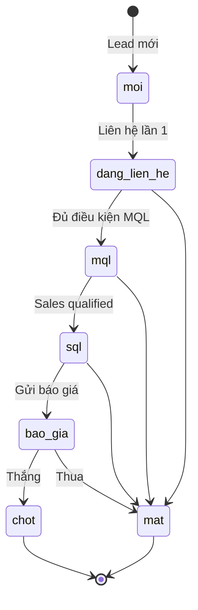

| Stage | Nhãn | SLA (giờ) |
|-------|------|-----------|
| `moi` | Mới | 4 |
| `dang_lien_he` | Đang liên hệ | 24 |
| `mql` | MQL | 72 |
| `sql` | SQL | 120 |
| `bao_gia` | Báo giá | 168 |
| `chot` | Chốt | — (terminal) |
| `mat` | Mất | — (terminal) |

**Auto-assign:** round-robin theo pool NV (`crm_sales_pipeline.py`). **SLA email:** bật qua `CRM_LEAD_SLA_EMAIL=1`.

### 4.2. Pipeline Lead — 8 bước chăm sóc

| Bước | Key | Trạng thái CRM |
|------|-----|----------------|
| 1 | `intake` | new, pending_cleanup, hot, warm, cold |
| 2 | `first_contact` | contacted |
| 3 | `qualify` | qualified |
| 4 | `advise` | proposal_sent |
| 5 | `nurture` | nurturing |
| 6 | `negotiate` | negotiation, lost |
| 7 | `closing` | — |
| 8 | `post_sale` | won |

**Scoring:** rubric D1–D6 (`crm_lead_scoring_rubric.py`) → tier hot/warm/cold (`crm_lead_tiers.py`).

**Dedup:** theo phone/email, policy configurable (`crm_lead_rules.py`).

### 4.3. Luồng lead Facebook → CRM

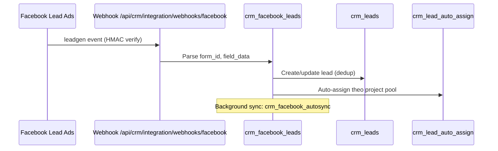

**3 lớp cấu hình:** env global → `crm_lead_settings.facebook_config` → per-project `crm_re_project_lead_config`.

### 4.4. Luồng tạo lead → chăm sóc → chốt

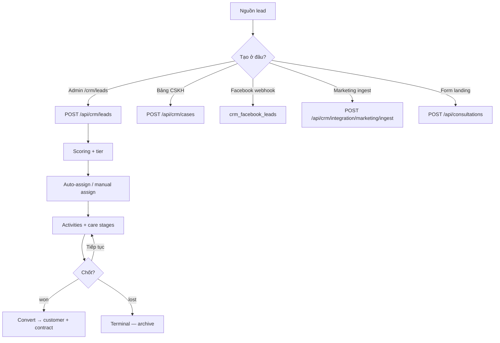

### 4.5. RE Projects — Sequence diagrams chi tiết

Module **Dự án BĐS** (`/crm/re-projects`) là trung tâm vận hành dự án: kế hoạch KD/MKT/Sales, tồn kho, bảng giá, KPI, kế toán và thu lead theo dự án.  
**File chính:** `crm_re_projects.py` · `crm_re_price_lists.py` · `crm_re_project_accounting.py` · `crm_project_leads.py` · `crm_project_webhooks.py`

#### 4.5.1. Kiến trúc module RE Projects

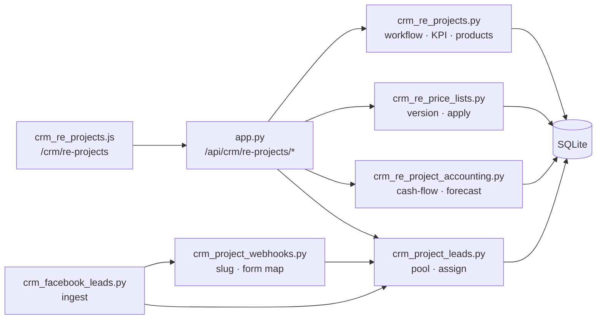

#### 4.5.2. Quy trình 8 bước vận hành dự án

Hệ thống tính trạng thái từng bước qua `compute_project_workflow()` — **không khóa tuần tự** (free navigation), hiển thị % hoàn thành và gợi ý bước tiếp theo.

| # | ID | Giai đoạn | Tiêu chí hoàn thành (`criteria`) |
|---|-----|-----------|-----------------------------------|
| 1 | `overview` | Khởi tạo | Mã, tên, vị trí, tổng số căn |
| 2 | `business` | Chiến lược | SWOT + doanh thu mục tiêu (hoặc duyệt KH) |
| 3 | `budget` | Tài chính | Có dòng doanh thu & chi phí kế hoạch |
| 4 | `products` | Sản phẩm | Tồn kho theo phân khu & loại hình |
| 5 | `sales` | Bán hàng | Doanh thu + số căn mục tiêu (hoặc duyệt KH) |
| 6 | `marketing` | GTM | Định vị, lead/tháng, ngân sách MKT |
| 7 | `kpi` | Đo lường | ≥ 3 KPI gán NV phụ trách |
| 8 | `risks` | Quản trị *(tuỳ chọn)* | ≥ 1 rủi ro chính trong register |

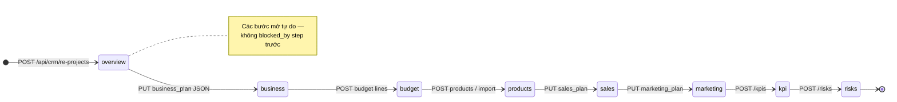

**Sequence — tải & cập nhật workflow bar:**

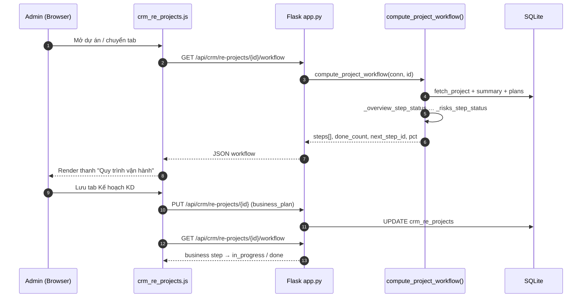

#### 4.5.3. Tạo dự án BĐS mới

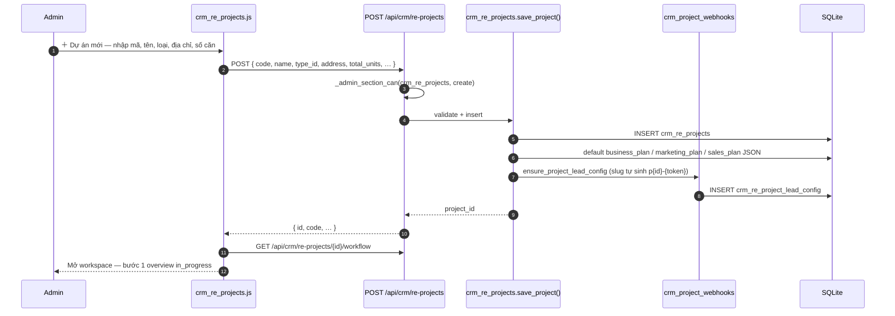

#### 4.5.4. Tồn kho sản phẩm & áp dụng bảng giá

Luồng chuẩn BĐS: **master data căn** → **bảng giá version** → **bulk apply** lên `crm_re_project_products`.

```mermaid
sequenceDiagram
    autonumber
    participant U as Admin
    participant JS as crm_re_projects.js
    participant API as Flask
    participant PL as crm_re_price_lists
    participant DB as SQLite

    Note over U,DB: Bước A — Nhập tồn kho
    U->>JS: Import Excel / thêm căn thủ công
    JS->>API: POST /api/crm/re-projects/{id}/products/import
    API->>DB: UPSERT crm_re_project_products (unit_code, zone, status=available)
    API-->>JS: { created, updated, errors[] }

    Note over U,DB: Bước B — Tạo bảng giá version
    U->>JS: Tạo price list v2026-Q2
    JS->>API: POST /api/crm/re-projects/{id}/price-lists
    API->>DB: INSERT crm_re_price_lists (status=draft)
    U->>JS: Import CSV giá theo unit_code
    JS->>API: POST …/price-lists/{list_id}/items/import
    API->>PL: import_price_list_items_csv()
    PL->>DB: INSERT crm_re_price_list_items

    Note over U,DB: Bước C — So sánh & áp dụng
    U->>JS: Compare 2 version (tuỳ chọn)
    JS->>API: GET …/price-lists/compare?a=&b=
    API-->>JS: diff theo unit_code

    U->>JS: Áp dụng bảng giá
    JS->>API: POST …/price-lists/{list_id}/apply
    API->>PL: apply_price_list()
    loop Mỗi dòng giá
        PL->>DB: MATCH unit_code → crm_re_project_products
        alt status != sold
            PL->>DB: UPDATE list_price_vnd, net_price_vnd, price_batch
        else sold
            PL->>PL: skipped += 1
        end
    end
    PL->>DB: Archive bảng giá active cũ; set list status=active
    PL-->>API: { matched, skipped, unmatched[] }
    API-->>JS: Kết quả apply
    JS-->>U: Toast + refresh inventory grid
```

#### 4.5.5. Cấu hình lead webhook theo dự án

Mỗi dự án có **webhook slug riêng**, map **Facebook Form ID** / **Zalo campaign** / **website route**.

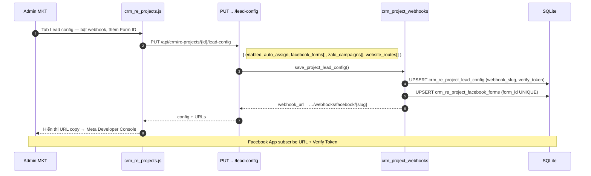

**Resolve dự án khi webhook đến** (`resolve_project_from_webhook` — thứ tự ưu tiên):

1. `webhook_slug` trong URL path  
2. `form_id` → `crm_re_project_facebook_forms`  
3. `page_id` duy nhất → `crm_re_project_lead_config.facebook_page_id`

#### 4.5.6. Facebook Lead Ads → Lead gắn dự án → Auto-assign

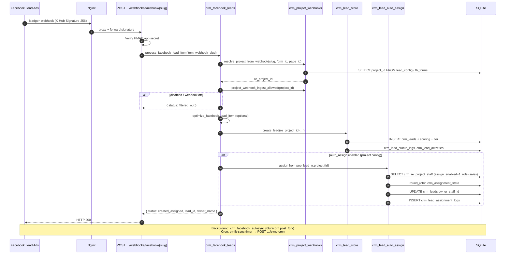

#### 4.5.7. Pool nhân viên dự án & portal scope

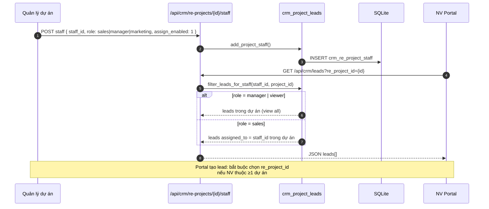

#### 4.5.8. KPI dự án ↔ KPI nhân viên & RE_LEADS_NEW

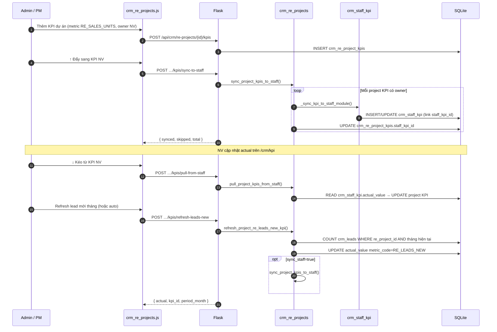

**Metric `RE_LEADS_NEW`:** đếm lead qualified trong tháng, loại trừ status `lost`, `junk`, `spam`, `duplicate` và `is_duplicate=1`.

#### 4.5.9. Kế toán dự án — đồng bộ & dòng tiền

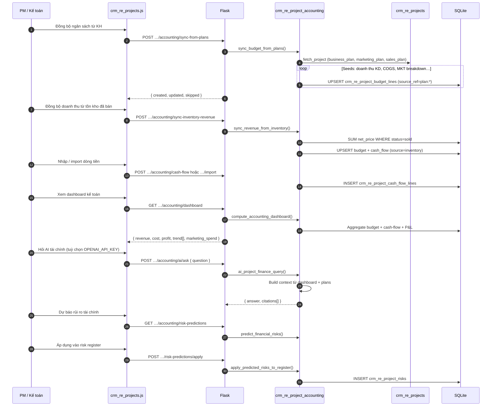

#### 4.5.10. Xuất báo cáo dự án

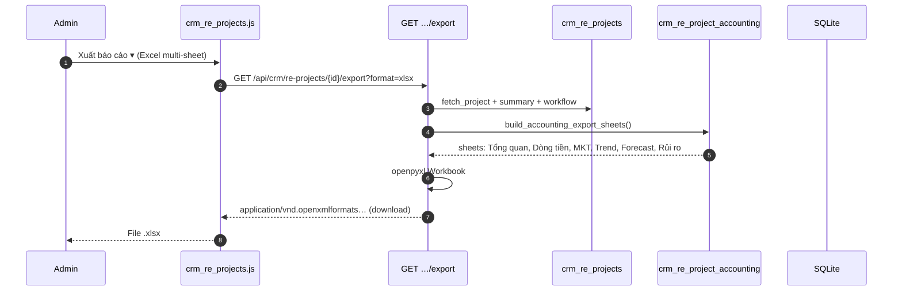

#### 4.5.11. API RE Projects — bản đồ endpoint (tham chiếu nhanh)

| Nhóm | Endpoint chính | Module |
|------|------------------|--------|
| CRUD dự án | `GET/POST /re-projects`, `GET/PUT/DELETE …/{id}` | `crm_re_projects` |
| Workflow | `GET …/{id}/workflow`, `GET …/{id}/summary` | `compute_project_workflow` |
| Sản phẩm | `GET/POST …/products`, `POST …/import`, `GET …/search` | `crm_re_projects` |
| Bảng giá | `…/price-lists`, `…/items/import`, `…/apply`, `…/compare` | `crm_re_price_lists` |
| KPI | `…/kpis`, `…/sync-to-staff`, `…/pull-from-staff`, `…/refresh-leads-new` | `crm_re_projects` |
| Rủi ro & NS | `…/risks`, `…/budget` | `crm_re_projects` |
| Kế toán | `…/accounting/dashboard`, `…/cash-flow`, `…/sync-from-plans`, `…/ai/ask` | `crm_re_project_accounting` |
| Lead config | `GET/PUT …/lead-config`, `…/staff` | `crm_project_webhooks`, `crm_project_leads` |
| Export | `GET …/export` | `crm_re_projects` + accounting |

**Quyền CRM section:** `crm_re_projects`, `crm_re_projects_business`, `crm_re_projects_marketing`, `crm_re_projects_sales`, `crm_re_projects_kpi`, `crm_re_projects_products`, `crm_re_projects_risks`, `crm_re_projects_budget` — xem [`PHAN_QUYEN_HUONG_DAN.md`](PHAN_QUYEN_HUONG_DAN.md).

---

### 4.6. Quy tắc đặc biệt

| Quy tắc | Mô tả |
|---------|-------|
| Tạo khách hàng | API chấp nhận nếu có `crm_board_customers` **hoặc** `crm_board_create` → `create` |
| Unified password | Một username/mật khẩu cho CMS admin và staff portal (`unified_auth.py`) |
| Login priority | CMS admin trước → staff portal |
| KD-01 default | UI leads-only (nhiều button bị ẩn) — cấu hình lại qua ma trận chức vụ |
| Project-scoped lead | NV portal chỉ thấy lead thuộc dự án được gán trong pool |

---

## 5. Mô hình dữ liệu

### 5.1. Sơ đồ ER (tóm tắt)

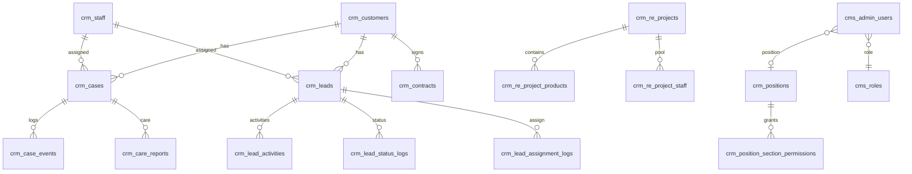

### 5.2. Danh mục bảng SQLite

#### CMS & Site

| Bảng | Mô tả |
|------|-------|
| `projects` | Portfolio landing |
| `news` | Tin tức |
| `settings` | Key-value cấu hình site |

#### Phân quyền

| Bảng | Mô tả |
|------|-------|
| `cms_roles` | Vai trò CMS |
| `cms_role_permissions` | Quyền module/action theo role |
| `cms_admin_users` | User admin (username, role, position, password_hash) |
| `crm_positions` | Chức vụ CRM |
| `crm_position_section_permissions` | Quyền section/action theo chức vụ |

#### CRM Core

| Bảng | Mô tả |
|------|-------|
| `crm_customers` | Khách hàng |
| `crm_customer_relations` | Quan hệ KH |
| `crm_customer_purchases` | Lịch sử mua |
| `crm_customer_issues` | Vấn đề phát sinh |
| `crm_cases` | Case CSKH |
| `crm_case_events` | Timeline case |
| `crm_care_reports` | Báo cáo chăm sóc |
| `crm_lead_channels` | Kênh lead |
| `crm_leads` | Lead |
| `crm_lead_activities` | Hoạt động lead |
| `crm_lead_status_logs` | Log đổi trạng thái |
| `crm_lead_assignment_logs` | Log gán NV |
| `crm_lead_ai_logs` | Log AI |
| `crm_lead_settings` | Config JSON (scoring, assign, facebook) |
| `crm_facebook_pending` | Lead FB chờ xử lý |

#### HR & KPI

| Bảng | Mô tả |
|------|-------|
| `crm_departments` | Phòng ban |
| `crm_staff` | Nhân viên + login portal |
| `crm_staff_settings` | Cấu hình cá nhân |
| `crm_kpi_metrics` | Danh mục chỉ tiêu |
| `crm_staff_kpi` | Bản ghi KPI theo kỳ |
| `crm_position_kpi_metrics` | Chỉ tiêu theo chức vụ |

#### Chấm công & lương

| Bảng | Mô tả |
|------|-------|
| `crm_attendance` | Bản ghi chấm công |
| `crm_payroll` | Kỳ lương |
| `crm_payroll_line` | Chi tiết lương NV |
| `crm_payroll_policy` | Chính sách lương |
| `crm_position_payroll` | Mức lương theo chức vụ |

#### Marketing & SOP

| Bảng | Mô tả |
|------|-------|
| `crm_campaigns` | Chiến dịch |
| `crm_contracts` | Hợp đồng |
| `crm_reminders` | Nhắc việc |
| `crm_marketing_plans` | Kế hoạch MKT |
| `crm_marketing_plan_campaigns` | Liên kết chiến dịch |
| `crm_marketing_plan_milestones` | Mốc kế hoạch |
| `crm_sop_templates` | Template SOP |
| `crm_sop_steps` | Bước template |
| `crm_sop_runs` | Run đang thực hiện |
| `crm_sop_run_tasks` | Task trong run |

#### Sales & RE Projects

| Bảng | Mô tả |
|------|-------|
| `crm_assignment_state` | State round-robin assign |
| `crm_sales_plans` | Kế hoạch KD |
| `crm_sales_targets` | Chỉ tiêu |
| `crm_sales_partners` | Đối tác |
| `crm_sales_trainings` | Đào tạo |
| `crm_sales_market_research` | NCTT |
| `crm_sales_transactions` | Giao dịch |
| `crm_re_projects` | Dự án BĐS |
| `crm_re_project_types` | Loại dự án |
| `crm_re_project_products` | Sản phẩm/ căn hộ |
| `crm_re_project_kpis` | KPI dự án |
| `crm_re_project_risks` | Rủi ro |
| `crm_re_project_budget_lines` | Ngân sách |
| `crm_re_price_lists` | Bảng giá |
| `crm_re_price_list_items` | Chi tiết giá |
| `crm_re_project_cash_flow_lines` | Dòng tiền |
| `crm_re_project_staff` | Pool NV dự án |
| `crm_re_project_lead_config` | Config lead/webhook |
| `crm_re_project_facebook_forms` | Map Form ID FB |
| `crm_re_project_zalo_campaigns` | Campaign Zalo |
| `crm_re_project_website_routes` | Route website |

#### Vận hành

| Bảng | Mô tả |
|------|-------|
| `crm_daily_work_reports` | Báo cáo công việc ngày |

**DB path:** `PTT/data/` (override qua biến môi trường nếu có).

---

## 6. Đặc tả API

Tổng cộng **304 route** trong `app.py`. Nhóm theo domain:

### 6.1. Công khai (không cần session)

| Method | Path | Mục đích |
|--------|------|----------|
| GET | `/healthz` | Health check |
| GET | `/robots.txt`, `/sitemap.xml` | SEO |
| POST | `/api/consultations` | Form tư vấn |
| POST | `/api/landing-contact` | Form liên hệ |
| POST | `/career/<slug>/apply` | Ứng tuyển |
| POST | `/api/crm/attendance/device` | Máy chấm công |
| GET/POST | `/iclock/getrequest`, `/iclock/cdata` | ZKTeco protocol |
| POST | `/api/crm/integration/marketing/ingest` | Bearer token |
| GET/POST | `/api/crm/integration/webhooks/facebook[/<slug>]` | Facebook webhook |
| POST | `/api/crm/integration/webhooks/zalo[/<slug>]` | Zalo webhook |

### 6.2. Auth & Account

| Method | Path |
|--------|------|
| GET, POST | `/admin/login` |
| POST | `/admin/logout` |
| GET | `/account/password` |
| POST | `/api/account/change-password` |

### 6.3. CMS & Content

| Prefix | Methods | Auth |
|--------|---------|------|
| `/api/settings` | GET, PUT | Admin + `_cms_can` |
| `/api/services` | GET, PUT | Admin + `_cms_can` |
| `/api/projects` | GET, POST, PUT, DELETE | Admin + `_cms_can` |
| `/api/news` | GET, POST, PUT, DELETE | Admin + `_cms_can` |
| `/api/cms/permissions/*` | GET, PATCH | Admin |
| `/api/cms/admin-users/*` | GET, POST, PATCH | Admin |
| `/api/cms/marketing-chat/*` | GET, POST | Admin + module chat |

### 6.4. CRM — Cases & Customers

| Prefix | Methods |
|--------|---------|
| `/api/crm/cases` | GET, POST |
| `/api/crm/cases/<id>` | GET, PATCH |
| `/api/crm/cases/<id>/events` | POST |
| `/api/crm/cases/<id>/care-reports` | POST |
| `/api/crm/funnel`, `/api/crm/funnel/live` | GET |
| `/api/crm/channels` | GET, POST, PATCH |
| `/api/crm/customers` | GET, POST |
| `/api/crm/customers/<id>` | GET, PATCH |
| `/api/crm/customers/<id>/relations` | POST, PATCH, DELETE |
| `/api/crm/customers/<id>/purchases` | POST, PATCH, DELETE |
| `/api/crm/customers/<id>/issues` | POST, PATCH |

### 6.5. CRM — Leads (đầy đủ)

| Prefix | Methods |
|--------|---------|
| `/api/crm/leads` | GET, POST |
| `/api/crm/leads/<id>` | GET, PUT, DELETE |
| `/api/crm/leads/stats`, `/notifications` | GET |
| `/api/crm/leads/<id>/activities` | GET, POST |
| `/api/crm/leads/<id>/care-stages` | POST |
| `/api/crm/leads/<id>/assign`, `/rescore`, `/convert` | POST |
| `/api/crm/leads/<id>/duplicates`, `/merge` | GET, POST |
| `/api/crm/leads/import`, `/export` | POST, GET |
| `/api/crm/leads/config` | GET, PUT |
| `/api/crm/leads/ai/*` | POST |
| `/api/crm/integration/facebook/*` | GET, POST |

### 6.6. CRM — RE Projects (~60 endpoints)

Subgroups: types, projects CRUD, products, price-lists, KPIs, risks, budget, accounting, staff pool, lead-config, export.

Prefix gốc: `/api/crm/re-projects/...`

### 6.7. CRM — Hub, SOP, Sales, HR, KPI, Payroll, Reports

| Prefix | Mục đích |
|--------|----------|
| `/api/crm/campaigns`, `contracts`, `reminders` | Hub |
| `/api/crm/marketing-plans/*` | Kế hoạch MKT |
| `/api/crm/sop/*` | SOP templates & runs |
| `/api/crm/sales/*` | Sales dashboard |
| `/api/crm/staff/*`, `departments`, `positions` | Nhân sự |
| `/api/crm/kpi/*`, `/api/crm/staff/kpi/*` | KPI |
| `/api/crm/attendance`, `/api/crm/payroll/*` | Chấm công & lương |
| `/api/crm/daily-work-reports/*` | BC công việc ngày |
| `/api/crm/assistant/*` | Trợ lý AI |

### 6.8. Quy ước response

| HTTP | Ý nghĩa |
|------|---------|
| 200/201 | Thành công |
| 400 | Validation error — `{ "error": "..." }` |
| 401 | Chưa đăng nhập |
| 403 | Không đủ quyền — `{ "error": "...", "section": "..." }` |
| 404 | Không tìm thấy |
| 413 | File quá lớn |
| 500 | Lỗi server |

API `/api/*` luôn trả header `Cache-Control: no-store`.

---

## 7. Xác thực & phân quyền

### 7.1. Session keys

| Key | Ý nghĩa |
|-----|---------|
| `_ptt_admin_ok` | Đã đăng nhập admin |
| `_ptt_cms_role` | Mã vai trò CMS |
| `_ptt_cms_username` | Username hiển thị |
| `_ptt_cms_position_id` | ID chức vụ CRM (tuỳ chọn) |
| `_ptt_staff_ok` | Đã đăng nhập nhân viên portal |
| `_ptt_staff_id` | ID nhân viên |
| `_ptt_staff_name` | Tên nhân viên |

### 7.2. Ma trận quyền (2 lớp + allowlist)

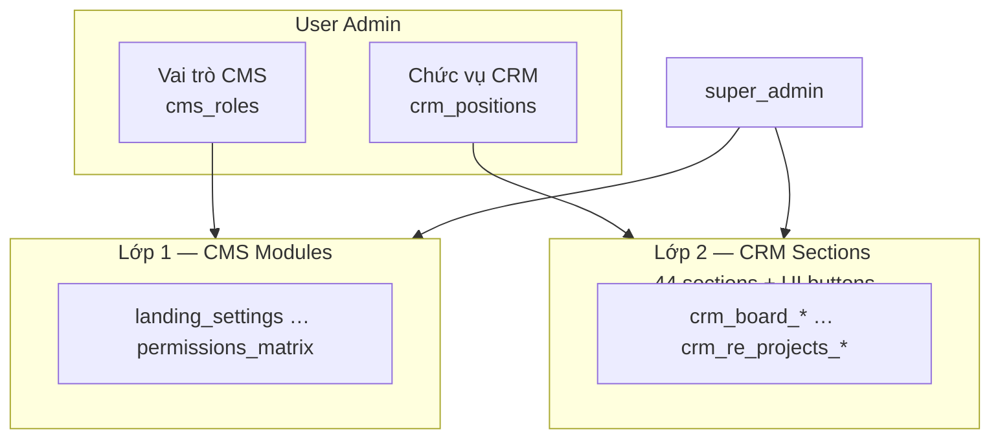

**Actions chuẩn:** `view`, `edit`, `create`, `delete`, `export`, `configure`

**Thứ tự kiểm tra `_admin_section_can()`:**

1. `super_admin` hoặc `cms_admin` → TRUE (toàn quyền CRM section)
2. Section thuộc CMS module → `_cms_can(module, action)`
3. Admin không có `position_id` → TRUE (full CRM)
4. Có `position_id` → `position_can(grants, section, action)`

**UI gating:** `admin_section_gating.js` + `data-admin-section` + `data-cms-nav`.

### 7.3. Vai trò CMS mặc định

| Code | Tên | Phạm vi |
|------|-----|---------|
| `super_admin` | Quản trị hệ thống | Toàn quyền |
| `cms_admin` | Quản trị CMS | Full CMS; permissions chỉ view |
| `content_editor` | Biên tập nội dung | Landing, dịch vụ, dự án, tin |
| `marketing_lead` | Trưởng nhóm Marketing | Full chat MKT + CRM nav mở rộng |
| `marketing_staff` | NV Marketing | Chat + export + CRM nav giảm |
| `viewer` | Chỉ xem | View-only |

### 7.4. Chức vụ CRM mặc định

| Code | Tên | Phạm vi tóm tắt |
|------|-----|-----------------|
| `CSKH-01` | Chuyên viên CSKH | Board, customers, leads, assistant, KPI, attendance |
| `KD-01` | NV kinh doanh | Leads-only UI (mặc định) |
| `MKT-01` | Trưởng phòng Marketing | Hub, mktplan, leads, SOP, sales, RE projects |
| `MKT-02` | NV Marketing | Hub campaigns, mktplan, leads, SOP runs |
| `VH-01` | Điều phối vận hành | SOP, staff, payroll, daily reports |

Chi tiết ma trận: [`PHAN_QUYEN_HUONG_DAN.md`](PHAN_QUYEN_HUONG_DAN.md).

### 7.5. Staff portal allowlist

**HTML:** `/crm`, `/crm/home`, `/crm/customers`, `/crm/leads`, `/crm/kpi`, `/crm/payroll`, `/crm/attendance`, `/crm/daily-reports`, `/account/password`

**API mở rộng:** cases, customers (GET), leads (CRUD subset), KPI cá nhân, attendance, daily reports, assistant, change-password.

**Scope dữ liệu:** chỉ case/lead assigned; project-scoped khi bật config dự án.

---

## 8. Tích hợp bên ngoài

### 8.1. Facebook Lead Ads

| Thành phần | Mô tả |
|------------|-------|
| Webhook | `GET` verify token, `POST` leadgen (HMAC SHA256) |
| Sync | Manual API + cron timer (`ptt-fb-sync.timer`, 5 phút) |
| Background | `crm_facebook_autosync` trong Gunicorn `post_fork` |
| Config | Env + DB `facebook_config` + per-project form mapping |

### 8.2. Zalo OA

Webhook `POST /api/crm/integration/webhooks/zalo[/<slug>]` — secret `CRM_ZALO_WEBHOOK_SECRET`.

### 8.3. Marketing Ingest

`POST /api/crm/integration/marketing/ingest` — Bearer `CRM_MARKETING_INGEST_SECRET`.

### 8.4. ZKTeco chấm công

Protocol iClock: `/iclock/getrequest`, `/iclock/cdata`. Filter SN qua `CRM_ZKTECO_ALLOWED_SN`.

### 8.5. Email SMTP

Form landing, ứng tuyển, SLA alerts. Biến: `SMTP_HOST`, `SMTP_PORT`, `SMTP_USERNAME`, `SMTP_PASSWORD`, `SMTP_FROM`.

### 8.6. OpenAI (tuỳ chọn)

CMS chat, CRM assistant, lead AI, campaign kit. Biến: `OPENAI_API_KEY`, `OPENAI_MODEL` (default `gpt-4o-mini`).

---

## 9. Yêu cầu phi chức năng

| Hạng mục | Yêu cầu |
|----------|---------|
| **Bảo mật** | Session HttpOnly, Secure trên HTTPS, PBKDF2, API 403 theo quyền, staff scope theo assign, webhook HMAC |
| **Hiệu năng** | SQLite local; static minified (`build_ptt_assets.py`); polling nhẹ CSKH |
| **Khả dụng** | Gunicorn 3 workers, timeout 120s, systemd restart always |
| **i18n** | Tiếng Việt — UI labels, error messages |
| **Export** | Excel: KPI, lead, nhân sự, RE accounting, daily reports |
| **Logging** | Gunicorn stdout → journald; `journalctl -u ptt -f` |
| **Backup** | Sao lưu thư mục `data/` định kỳ (manual/script) |

---

## 10. Triển khai & vận hành

### 10.1. Cấu trúc mã nguồn

```
PTT/
├── app.py                          # Flask monolith (~16k LOC, 304 routes)
├── unified_auth.py                 # Login thống nhất
├── cms_permissions.py              # Vai trò CMS
├── admin_page_permissions.py       # Section CRM + defaults chức vụ
├── ptt_ui_button_permissions.py    # Button-level gating
├── crm_staff_auth.py               # Portal allowlist
├── crm_lead_store.py               # Lead CRUD core
├── crm_lead_care_pipeline.py       # Pipeline 8 bước
├── crm_lead_auto_assign.py         # Auto-assign
├── crm_facebook_leads.py           # Facebook integration
├── crm_re_projects.py              # Dự án BĐS
├── crm_sales_pipeline.py             # Pipeline CSKH
├── crm_sales_hub.py                # Sales dashboard
├── marketing_chat_service.py       # Chat AI CMS
├── crm_assistant_service.py        # Trợ lý AI CRM
├── crm_daily_work_report*.py       # BC công việc ngày
├── gunicorn.conf.py                # Gunicorn + FB autosync hook
├── ptt.service                     # systemd unit
├── ptt-fb-sync.service/.timer      # Cron sync Facebook
├── deploy/nginx-facebook-webhook.conf
├── data/                           # SQLite DB
├── templates/                      # Jinja2
├── static/                         # CSS/JS (minified)
├── scripts/                        # Build, migrate, diagnose
├── tests/                          # unittest (~117+ tests)
└── docs/                           # Tài liệu
```

### 10.2. Chạy local

```bash
cd PTT
python3 -m venv .venv && source .venv/bin/activate
pip install -r requirements.txt
bash restart_flask.sh    # → http://127.0.0.1:5050
python3 scripts/build_ptt_assets.py   # minify static
```

**Dev credentials:** `admin` / `changeme` (env `ADMIN_USERNAME`, `ADMIN_PASSWORD`).

### 10.3. Production (VPS)

```bash
# systemd
sudo cp ptt.service /etc/systemd/system/
sudo systemctl enable --now ptt

# Facebook sync timer
sudo cp ptt-fb-sync.* /etc/systemd/system/
sudo systemctl enable --now ptt-fb-sync.timer

# nginx — snippet webhook
# deploy/nginx-facebook-webhook.conf → sites-available
```

| Service | Bind | User |
|---------|------|------|
| Gunicorn | `127.0.0.1:8002` | `deploy:www-data` |
| Working dir | `/var/www/ptt` | |

### 10.4. Biến môi trường quan trọng

| Biến | Mục đích |
|------|----------|
| `FLASK_SECRET_KEY` / `SECRET_KEY` | Session signing (**bắt buộc prod**) |
| `ADMIN_USERNAME`, `ADMIN_PASSWORD` | Bootstrap admin |
| `OPENAI_API_KEY` | AI features |
| `CRM_MARKETING_INGEST_SECRET` | Marketing ingest API |
| `CRM_FACEBOOK_*` / `FACEBOOK_*` | Facebook Lead Ads |
| `CRM_ZALO_*` / `ZALO_*` | Zalo webhook |
| `CRM_FACEBOOK_SYNC_SECRET` | Cron sync auth |
| `CRM_FACEBOOK_BACKGROUND` | Autosync worker (`1`/`0`) |
| `CRM_LEAD_SLA_EMAIL` | Email cảnh báo SLA |
| `CRM_KPI_ACCESS` | Mode truy cập KPI (`full`) |
| `CRM_ATTENDANCE_DEVICE_KEY` | API key máy chấm công |
| `SMTP_*` | Email |
| `SESSION_COOKIE_SECURE` | Cookie HTTPS |
| `PORT` | Dev port (5050) |

---

## 11. Kiểm thử & chất lượng

### 11.1. Automated tests

```bash
cd PTT && python3 -m unittest discover -s tests -v
```

**Coverage chính:** auth, permissions, CMS, CSKH, leads, RE projects, Facebook, auto-assign, scoring, staff, KPI, payroll, portal.

### 11.2. Test cases manual/UAT

Xem [`TEST_CASES_PTT.md`](TEST_CASES_PTT.md) — ~80+ TC-ID, file Excel `TEST_CASES_PTT.xlsx`, fixtures trong `tests/fixtures/test_data/`.

### 11.3. Smoke checklist (P0 trước release)

- [ ] Login admin + staff portal
- [ ] Tạo/sửa lead, assign, scoring
- [ ] Facebook webhook probe (`scripts/ptt_fb_webhook_probe.py`)
- [ ] CMS save settings
- [ ] Export lead Excel
- [ ] Chấm công import / device ping
- [ ] Phân quyền matrix save + UI gating

---

## 12. Phụ lục

### 12.1. Site map HTML đầy đủ

```
/                                    landing.html
/du-an/<id>                          project_detail.html
/tin-tuc/<id>                        news_detail.html
/services/<slug>                     service_detail.html
/career, /career/<slug>              career_list.html
/chinh-sach-bao-mat                  privacy_policy.html
/admin/login                         admin_login.html
/account/password                    account_password.html
/admin                               admin.html
/cms                                 cms.html
/crm/home                            crm_staff_home.html      [staff portal]
/crm                                 crm.html
/crm/customers                       crm_customers.html
/crm/leads                           crm_leads.html
/crm/hub                             crm_hub.html
/crm/marketing-plan                  crm_marketing_plan.html
/crm/marketing-plan/segment/<slug>   crm_marketing_segment.html
/crm/sop                             crm_sop.html
/crm/sales                           crm_sales.html
/crm/re-projects                     crm_re_projects.html
/crm/staff                           crm_staff.html
/crm/daily-reports                   crm_daily_reports.html
/crm/kpi                             crm_kpi.html
/crm/payroll                         crm_payroll.html
/crm/attendance                      → redirect payroll
/healthz, /robots.txt, /sitemap.xml
/iclock/getrequest, /iclock/cdata
```

### 12.2. Sidebar Admin (IA)

```
Tổng quan → /admin
Website → /cms (settings, services, chat, permissions)
Nội dung → /admin (projects, news, channels)
CRM · CSKH → /crm, /crm/customers, /crm/leads
CRM · Marketing → /crm/hub, /crm/marketing-plan, /crm/sop
CRM · Kinh doanh → /crm/sales, /crm/re-projects
CRM · Nhân sự → /crm/staff, /crm/daily-reports, /crm/kpi, /crm/payroll
```

Gating: `data-cms-nav` · `data-admin-nav` · ẩn nhóm trống.

### 12.3. Module file index

| File | Trách nhiệm |
|------|-------------|
| `app.py` | Routes, guards, DB init |
| `crm_lead_store.py` | Lead CRUD, dedup, merge |
| `crm_lead_rules.py` | Business rules, transitions |
| `crm_lead_scoring.py` | Scoring engine |
| `crm_lead_scoring_rubric.py` | Rubric D1–D6 |
| `crm_lead_tiers.py` | Hot/warm/cold tiers |
| `crm_lead_auto_assign.py` | Assign strategies |
| `crm_lead_convert.py` | Lead → customer |
| `crm_lead_ai.py` | AI endpoints |
| `crm_facebook_leads.py` | FB Lead Ads processing |
| `crm_facebook_autosync.py` | Background sync worker |
| `crm_project_leads.py` | Project-scoped leads |
| `crm_project_webhooks.py` | Per-project webhook config |
| `crm_re_projects.py` | RE project lifecycle |
| `crm_re_price_lists.py` | Price list management |
| `crm_re_project_accounting.py` | Cash flow, forecast, AI |
| `crm_sales_hub.py` | Sales plans, deals |
| `crm_care.py` | Care reports |
| `crm_customer_360.py` | Customer 360° |
| `crm_workflow_playbook.py` | 6-step playbook |
| `crm_daily_work_report_store.py` | Daily report storage |
| `crm_assistant_service.py` | In-CRM AI assistant |
| `marketing_chat_service.py` | CMS marketing chat |
| `marketing_campaign_kit.py` | KHMKT + KPI kit |
| `crm_payroll_engine.py` | Payroll computation |
| `crm_attendance_import.py` | Timesheet import |
| `zkteco_iclock.py` | ZKTeco protocol |

### 12.4. Lịch sử thay đổi tài liệu

| Phiên bản | Ngày | Nội dung |
|-----------|------|----------|
| 2026-05 | 2026-05-25 | Bổ sung §4.5 — 11 sequence diagrams chi tiết RE Projects |
| 2026-05 | 2026-05-25 | Bổ sung §13 — Roadmap quy trình, automation & AI |

---

## 13. Roadmap — Quy trình cần hoàn thiện & nâng cấp Automation/AI

> Phân tích dựa trên SPEC hiện tại vs codebase. Ưu tiên theo **ROI vận hành BĐS + agency**.

### 13.1. Ma trận hiện trạng (đã có vs còn thiếu)

| Module | Đã tự động / AI | Còn thủ công / thiếu quy trình |
|--------|-----------------|--------------------------------|
| **Lead** | Scoring, dedup, auto-assign (hybrid), FB webhook + autosync, AI search/summary | SLA chỉ nhắc Hub (chưa push Zalo/SMS); `performance`/`customer_profile` assign tắt; nurture follow-up không auto |
| **Case CSKH** | Pipeline 7 bước, round-robin, SLA giờ | **Song song Lead** — chưa thống nhất 1 pipeline; SLA email tuỳ chọn env |
| **RE Projects** | Workflow 8 bước (tính %), KPI sync, RE_LEADS_NEW (refresh thủ công) | **Không gate duyệt** KH; accounting sync thủ công; price apply thủ công |
| **Hub / SOP** | Nhắc gia hạn HĐ; SOP run + overdue list | SOP **không auto-start** theo sự kiện; overdue không escalate/reassign |
| **Marketing plan** | Segment KHTN/KHQT; chat AI sinh KH | Plan ↔ Hub campaign **chưa 2 chiều**; không đo CPL/win rate tự động |
| **KPI / Payroll** | Cảnh báo KPI; tính lương; ZKTeco | Đẩy lương **gửi thủ công**; KPI pull/sync thủ công; không auto-lock kỳ |
| **Landing / Form** | Excel + email; `_crm_ingest_lead_from_form` (silent fail) | Không báo lỗi ingest; career apply **chưa → lead** |
| **Trợ lý AI** | On-demand: playbook, pipeline, payroll export | **Không proactive** (không gửi digest/alert); chưa gắn RE project context sâu |
| **Zalo** | Webhook schema + resolve campaign | Thiếu autosync tương đương Facebook; thiếu OA messaging |

### 13.2. Quy trình quản lý cần bổ sung / hoàn thiện

#### A. Quy trình end-to-end (cross-module)

| # | Quy trình | Gap hiện tại | Cần bổ sung |
|---|-----------|--------------|-------------|
| A1 | **Lead → Customer → Contract → RE inventory** | Convert lead có; chốt căn → `sold` tách rời | Quy trình **Deal closure**: won lead → giữ căn → cập nhật product status → cash-flow tự động |
| A2 | **Marketing → Lead → KPI → P&L** | Rời rạc | **Closed-loop MKT**: chi phí ads (cash-flow) ÷ lead (RE_LEADS_NEW) = CPL; win rate theo campaign/UTM |
| A3 | **Case CSKH ↔ Lead** | 2 pipeline (7 vs 8 bước) | Policy: khi nào dùng case vs lead; **sync trạng thái** hoặc merge view |
| A4 | **Onboarding NV mới** | Có phân quyền doc | **Checklist tự động**: tạo staff → gán pool dự án → KPI mẫu → tài khoản portal |
| A5 | **Governance RE 8 bước** | Free navigation | **Gate duyệt**: business/sales/marketing plan `approval_status`; PM duyệt mới coi `done` |
| A6 | **Incident / Issue KH** | Có `crm_customer_issues` | SLA issue + escalate manager; link issue ↔ lead/case |

#### B. Quy trình vận hành định kỳ

| # | Quy trình | Tần suất | Automation đề xuất |
|---|-----------|----------|-------------------|
| B1 | SLA lead & case | Realtime | Cron 5 phút: `sync_lead_sla_reminders` + push notification |
| B2 | KPI RE_LEADS_NEW | Ngày | Timer auto `refresh-leads-new` + `pull-from-staff` |
| B3 | Facebook pending | 5 phút | ✅ Đã có `ptt-fb-sync.timer` — mở rộng Zalo tương tự |
| B4 | SOP overdue | Ngày | Escalate task quá hạn → Hub reminder + email quản lý |
| B5 | Chấm công → lương | Tháng | Workflow: remind NV bổ sung → auto-compute → HR review → lock → gửi file |
| B6 | BC công việc ngày | Ngày | Remind 17h nếu chưa nộp; manager duyệt/comment |
| B7 | RE accounting sync | Tuần | Auto `sync-from-plans` + `sync-inventory-revenue` theo lịch |
| B8 | Backup & health | Ngày | Snapshot `data/` + alert disk/502 |

### 13.3. Nâng cấp module — Automation (ưu tiên)

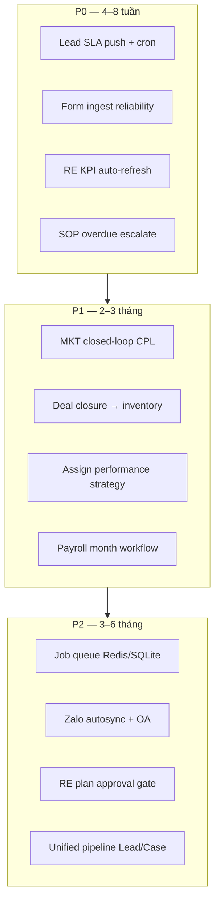

| Ưu tiên | Module | Nâng cấp cụ thể | File / API liên quan |
|---------|--------|-----------------|----------------------|
| **P0** | **Lead SLA** | Cron + Zalo/email/SMS khi quá SLA; dashboard SLA realtime | `crm_lead_sla.py`, timer mới `ptt-sla-sync` |
| **P0** | **Landing ingest** | Không nuốt lỗi silent; retry queue; career → lead | `app.py` `_crm_ingest_lead_from_form` |
| **P0** | **RE KPI** | Auto refresh `RE_LEADS_NEW` nightly; webhook sau mỗi lead mới | `refresh_project_re_leads_new_kpi` |
| **P0** | **SOP** | Auto tạo run khi launch campaign; escalate overdue | `crm_sop_*`, hook từ Hub |
| **P1** | **Lead assign** | Bật `performance`, `customer_profile`; competency score realtime | `crm_lead_auto_assign.py`, `crm_staff_competency.py` |
| **P1** | **RE Projects** | Auto sync accounting weekly; alert workflow step stuck >14 ngày | `crm_re_project_accounting.py` |
| **P1** | **Hub** | Campaign start → tạo SOP run + KPI snapshot | `crm_sales_hub.py`, `crm_sop_seed.py` |
| **P1** | **Payroll** | State machine: draft → computed → approved → locked → notified | `crm_payroll_engine.py` |
| **P1** | **Daily reports** | Remind + approve workflow + aggregate cho manager | `crm_daily_work_report_store.py` |
| **P2** | **Zalo** | Autosync worker + OA gửi tin SLA cho NV | mirror `crm_facebook_autosync.py` |
| **P2** | **Integrations** | Google Ads / TikTok lead webhook (pattern FB) | `crm_lead_webhooks.py` |
| **P2** | **Infrastructure** | Background job table (thay vì chỉ FB worker trong Gunicorn) | worker riêng hoặc Celery/RQ |

### 13.4. Nâng cấp module — AI (ưu tiên)

| Ưu tiên | Module | AI nâng cấp | Giá trị |
|---------|--------|-------------|---------|
| **P0** | **Lead** | **Proactive next-best-action**: sau mỗi activity, gợi ý bước + script gọi (8-step pipeline) | Giảm lead “để quên” |
| **P0** | **Lead** | **Auto-classify + rescore** khi ingest FB/form (không chỉ on-demand) | Hot lead vào pool S/A ngay |
| **P0** | **CRM Assistant** | **Daily digest** 8h: SLA, lead mới, KPI lệch, SOP overdue (push/email) | Thay standup thủ công |
| **P1** | **RE Projects** | **AI draft KH**: sinh business/marketing plan từ template + data dự án | Rút ngắn bước 2–6 workflow |
| **P1** | **RE Accounting** | Mở rộng `ai/ask` → **anomaly detection** (chi phí lệch budget >15%) | Cảnh báo sớm |
| **P1** | **Lead** | **AI price-list / product match** tự chạy khi qualify (đã có API, chưa auto) | Tư vấn nhanh BĐS |
| **P1** | **CMS Chat MKT** | Đẩy output chat → **tạo draft** marketing-plan / Hub campaign | Đóng vòng chat → CRM |
| **P2** | **Customer 360** | Tóm tắt KH + churn risk từ timeline + issues | CSKH chủ động |
| **P2** | **SOP** | AI gợi ý task tiếp theo trong run từ context dự án | Giảm phụ thuộc PM |
| **P2** | **Voice / Call** | Tích hợp transcript → auto activity + summary (Whisper/API) | Ghi nhận cuộc gọi |

**Nguyên tắc triển khai AI:**

- Luôn có **fallback rule-based** khi không có `OPENAI_API_KEY`
- Log vào `crm_lead_ai_logs` / audit — human override bắt buộc cho assign/convert
- Prompt context: project plan JSON + inventory + rubric scoring (đã có một phần trong `crm_lead_ai.py`)

### 13.5. Kiến trúc automation đề xuất (target)

```mermaid
sequenceDiagram
    participant CRON as systemd timers
    participant Q as Job queue
    participant W as Worker(s)
    participant APP as Flask API
    participant AI as OpenAI
    participant EXT as Zalo/Email/SMS
    participant DB as SQLite

    CRON->>Q: enqueue(sla_sync, kpi_refresh, fb_sync, accounting_sync)
    W->>Q: dequeue job
    W->>DB: mutate + rules
    opt needs_ai
        W->>AI: classify / summarize / detect anomaly
        AI-->>W: result
    end
    W->>EXT: notify staff / manager
    W->>DB: log job result

    Note over APP,DB: API vẫn sync cho thao tác user;<br/>worker xử lý batch & proactive
```

**Bước đầu (không đổi stack nhiều):** thêm bảng `crm_jobs` + worker Python độc lập (`scripts/ptt_worker.py`), tái sử dụng pattern `ptt-fb-sync.timer`.

### 13.6. Checklist triển khai gợi ý (3 phase)

**Phase 1 — “Không mất lead” (P0)**  
- [ ] Cron SLA + notification channel (email tối thiểu, Zalo OA nếu có)  
- [ ] Form landing/career ingest có log lỗi + admin alert  
- [ ] Auto-rescore + auto-assign ngay khi webhook FB  
- [ ] RE_LEADS_NEW refresh cron  
- [ ] CRM Assistant daily digest (email)

**Phase 2 — “Đóng vòng kinh doanh” (P1)**  
- [ ] Deal won → lock product + revenue cash-flow  
- [ ] CPL / win rate dashboard theo campaign  
- [ ] RE plan approval workflow  
- [ ] Payroll month state machine  
- [ ] Bật assign strategies performance + competency

**Phase 3 — “Intelligent ops” (P2)**  
- [ ] Job queue tổng quát  
- [ ] Zalo autosync + Google/TikTok leads  
- [ ] Unified Lead/Case pipeline  
- [ ] AI draft RE plans + proactive anomaly alerts

---

*Tài liệu này là **master specification**. Khi thêm route, section, hoặc bảng mới: cập nhật `admin_page_permissions.py`, `cms_permissions.py`, và file này.*
