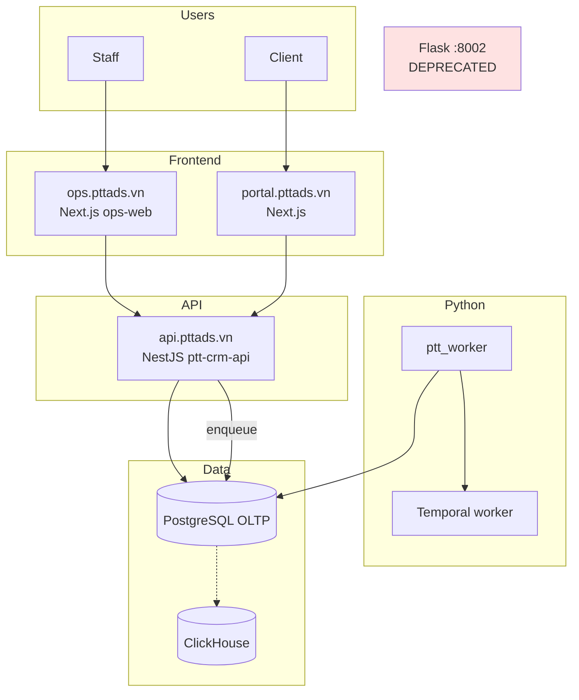

# PTTADS — Kế hoạch thực thi: Bỏ Flask → Next.js + NestJS

> **Phiên bản:** 1.0 · **Ngày:** 2026-07-20  
> **Trạng thái:** **APPROVED — thực thi ngay**  
> **Quyết định:** Không sử dụng Flask cho toàn hệ thống PTTADS (admin + API HTTP)  
> **Driver:** Data lớn, lead volume cao, Flask/Gunicorn + SQLite không ổn định  
> **Master roadmap:** [`SPEC_MIGRATION_FLASK_TO_NEXT.md`](SPEC_MIGRATION_FLASK_TO_NEXT.md)  
> **Data matrix:** [`specs/2026-07-17-sqlite-pg-migration.md`](specs/2026-07-17-sqlite-pg-migration.md)  

---

## Mục lục

1. [Tóm tắt điều hành](#1-tóm-tắt-điều-hành)
2. [Kiến trúc đích](#2-kiến-trúc-đích)
3. [Nguyên tắc thực thi](#3-nguyên-tắc-thực-thi)
4. [Sprint 0 — Tuần này (cầm máu)](#4-sprint-0--tuần-này-cầm-máu)
5. [Phase 0 — Nền móng (Tuần 1–2)](#5-phase-0--nền-móng-tuần-12)
6. [Phase 1 — Lead + Auth + ops-web (Tháng 1)](#6-phase-1--lead--auth--ops-web-tháng-1)
7. [Phase 2 — Agency + CRM core UI (Tháng 2–3)](#7-phase-2--agency--crm-core-ui-tháng-23)
8. [Phase 3 — SEO portal + API (Tháng 4–5)](#8-phase-3--seo-portal--api-tháng-45)
9. [Phase 4 — SEO/CRM nội bộ (Tháng 6–9)](#9-phase-4--seocrm-nội-bộ-tháng-69)
10. [Phase 5 — Flask retire (Tháng 10–12)](#10-phase-5--flask-retire-tháng-1012)
11. [Migration data lớn (SQLite → PG)](#11-migration-data-lớn-sqlite--pg)
12. [Routing & cutover nginx](#12-routing--cutover-nginx)
13. [KPI & Definition of Done](#13-kpi--definition-of-done)
14. [Rủi ro & rollback](#14-rủi-ro--rollback)
15. [Ma trận RACI](#15-ma-trận-raci)
16. [Checklist hàng tuần](#16-checklist-hàng-tuần)

---

## 1. Tóm tắt điều hành

### 1.1. Vấn đề

| Triệu chứng | Nguyên nhân gốc |
|-------------|-----------------|
| Lead nhiều → chậm, timeout | SQLite write lock; webhook **sync fallback** block Gunicorn |
| Khách lớn → CRM/SEO lag | 3 worker sync + monolith 656 route + query không paginate |
| Không ổn định | FB autosync thread trong mỗi Gunicorn worker; single SQLite file |

**Flask là triệu chứng tập trung**, không phải chỉ “đổi sang Nest là hết”. **Bắt buộc song song:** PG OLTP + tách worker + HTTP stateless (Nest) + UI mới (ops-web).

### 1.2. Mục tiêu 12 tháng

| Mốc | Ngày target | Kết quả |
|-----|-------------|---------|
| **M0** Cầm máu prod | +1 tuần | Lead queue-only; autosync tách; PG ingest primary |
| **M1** ops-web + staff login | +4 tuần | Admin vào `ops.pttads.vn`, không feature mới Flask |
| **M3** CRM lead/customer trên Nest+ops | +12 tuần | Flask CRM read-only cho lead |
| **M5** SEO portal không proxy Flask | +20 tuần | `portal-seo` native PG |
| **M9** SEO/Agency admin trên ops-web | +36 tuần | Flask blueprint SEO/Agency readonly |
| **M12** Flask retired | +52 tuần | `PTT_FLASK_MONOLITH_MODE=retired` |

### 1.3. Không làm

- Big-bang tắt Flask một đêm  
- Port 75 module `ptt_seo/` sang TypeScript  
- Block feature business 12 tháng — **song song** strangler + ship  

### 1.4. Vẫn giữ Python

| Component | Lý do |
|-----------|--------|
| `ptt_worker` | Send, ingest, sync, segment, ESP |
| `ptt_temporal` | Approval workflows |
| `ptt_seo/`, `ptt_meta/`, `ptt_email/` | Domain logic nặng — Nest **enqueue**, worker **execute** |

---

## 2. Kiến trúc đích



**Services mới (repo):**

```
services/
├── ptt-crm-api/     # mở rộng: crm, seo, agency, webhooks, staff-auth, email-marketing
├── portal-web/      # giữ — client portal
└── ops-web/         # MỚI — toàn bộ admin nội bộ
```

---

## 3. Nguyên tắc thực thi

1. **Data trước UI** — PG OLTP primary trước khi cut ops-web route  
2. **Không feature mới trên Flask** — freeze từ ngày approve; chỉ bugfix P0 prod  
3. **Webhook không sync** — 100% enqueue; worker ghi PG  
4. **Mọi bulk job off HTTP** — email send, segment, backfill → `job_queue`  
5. **Contract-first** — OpenAPI trong `schemas/` trước Nest module  
6. **Dual-run có thời hạn** — mỗi cutover max 4 tuần, deadline ghi trong runbook  
7. **Large data = batch** — backfill chunked, verify count + checksum, không một transaction  

---

## 4. Sprint 0 — Tuần này (cầm máu)

> **Mục tiêu:** Giảm sập/chậm ngay **không cần** hoàn thành migration UI.

### 4.1. Production env (ngay)

```bash
# Bắt buộc prod
PTT_JOBS_ENABLED=1
PTT_WEBHOOK_V1_ENQUEUE=1
PTT_JOBS_SYNC_FALLBACK=0          # TẮT sync inline trên webhook
PTT_LEADS_WRITE_SOURCE=pg         # bật khi dual-run pass staging

# Gunicorn tạm (trong khi Flask còn)
# -w 5 hoặc 9 (2*CPU+1), không tăng vô hạn
```

| # | Task | Owner | DoD |
|---|------|-------|-----|
| S0-1 | Verify `ptt-postgres` + `ptt_worker` systemd **always running** | Ops | `job_queue` pending không tích lũy > 5 phút |
| S0-2 | **Tắt `PTT_JOBS_SYNC_FALLBACK` prod** | Ops | Webhook log `mode=queue` 100% |
| S0-3 | Tách **FB autosync** khỏi Gunicorn → systemd `ptt-fb-autosync.service` | Dev | `gunicorn.conf.py` post_fork không start autosync |
| S0-4 | Tăng Gunicorn workers 3→5 (hoặc 9) + monitor latency p95 | Ops | p95 `/api/v1/webhooks/*` < 500ms |
| S0-5 | Index SQLite tạm (nếu chưa cut PG write): `crm_leads` created_at, source | Dev | Explain query lead list < 2s |
| S0-6 | Dashboard Grafana: job_queue depth, webhook mode, Gunicorn timeout | Ops | Alert queue > 1000 |
| S0-7 | **Freeze Flask** — announcement: no new routes/templates | PM | ADR committed |

### 4.2. Lead ingest → PostgreSQL write (bắt đầu ngay)

Sửa worker **`ingest_lead.py`**: ghi **PG `crm_leads` primary**, SQLite chỉ read-bridge tạm (4 tuần).

```
Webhook → Nest hoặc Flask enqueue ONLY
       → ptt_worker ingest_lead
       → INSERT/UPSERT PostgreSQL crm_leads
       → domain_events LeadCreated
       → (optional) async mirror SQLite for legacy UI  ← gỡ dần
```

| # | Task | DoD |
|---|------|-----|
| S0-8 | Apply DDL v3 OLTP nếu chưa: `postgresql-ddl-v3-leads-oltp.sql` | `\d crm_leads` có columns OLTP |
| S0-9 | `scripts/sync_leads_backfill.sh` **full** off-peak + reconcile report | PG count ≥ SQLite ± 0.1% |
| S0-10 | Worker write PG; Flask CRM list đọc PG qua adapter hoặc Nest API | Lead mới chỉ trên PG |

---

## 5. Phase 0 — Nền móng (Tuần 1–2)

### 5.1. Repository & CI

| # | Deliverable |
|---|-------------|
| P0-1 | Scaffold `services/ops-web/` (Next 14, App Router, copy tokens từ portal-web) |
| P0-2 | Nest module `staff-auth/` — login, refresh, `GET /api/v1/staff/me`, caps |
| P0-3 | PG table `staff_section_permissions` + migrate từ SQLite export script |
| P0-4 | Nest module `webhooks/` — move logic từ `channel_webhooks.py`; nginx cut Meta first |
| P0-5 | GitHub Actions: `ops-web` build, Nest e2e, **block PR** thêm route Flask mới (lint script) |
| P0-6 | OpenAPI stub `schemas/crm/`, `schemas/staff/` |

### 5.2. ops-web shell

| Route | Mô tả |
|-------|--------|
| `/login` | Staff login → Nest staff-auth |
| `/` | Dashboard placeholder + module nav |
| `/crm/leads` | **MVP** — list leads từ Nest API (read-only) |

**DoD Phase 0:** Staff login ops-web staging; lead list 50k rows paginated < 1s API.

---

## 6. Phase 1 — Lead + Auth + ops-web (Tháng 1)

### 6.1. Nest API

| Module | Endpoints | Thay Flask |
|--------|-----------|------------|
| `leads/` | CRUD + assign + filter (PG) | `app.py` `/api/crm/leads*` |
| `webhooks/` | `/api/v1/webhooks/{channel}` | blueprint + legacy app.py FB |
| `staff-auth/` | login, me, caps | Flask session |
| `health/` | extended metrics | — |

### 6.2. ops-web CRM MVP

| Screen | Route | Priority |
|--------|-------|----------|
| Lead list + filter | `/crm/leads` | P0 |
| Lead detail | `/crm/leads/:id` | P0 |
| Customer list | `/crm/customers` | P1 |

### 6.3. Cutover

| Step | Action |
|------|--------|
| 1 | Nginx `/api/v1/leads` → Nest only (đã có partial) |
| 2 | Nginx `/api/v1/webhooks` → Nest |
| 3 | Redirect staff bookmark `/crm/leads` → `ops.pttads.vn/crm/leads` |
| 4 | Flask `PTT_FLASK_MONOLITH_MODE=readonly` cho lead routes |

**DoD Phase 1:** 100% lead mới qua PG; webhook qua Nest; staff dùng ops-web cho lead hàng ngày.

---

## 7. Phase 2 — Agency + CRM core UI (Tháng 2–3)

### 7.1. Nest

- `agency/` — clients, jobs, notifications (port từ `ptt_agency/clients.py`)
- Hub campaign map PG-only (drop SQLite hub sync)

### 7.2. ops-web

| Module | Routes |
|--------|--------|
| Agency | `/agency`, `/agency/clients/:id` |
| Meta hub | `/meta/facebook-ads` |

**Horizon 1 checklist (Flask `/crm/facebook-ads` → ops-web):** [`runbooks/horizon1-meta-ads-migration-checklist.md`](./runbooks/horizon1-meta-ads-migration-checklist.md) · `./scripts/horizon1_meta_ads_pack.sh`

**CRM full Flask retirement:** [`runbooks/crm-flask-retirement-master-checklist.md`](./runbooks/crm-flask-retirement-master-checklist.md) · `./scripts/crm_flask_migration_pack.sh gap`
| CRM hub | `/crm/hub` (read PG khi migrate) |

### 7.3. Email Marketing (greenfield — **không Flask**)

| Deliverable | Stack |
|-------------|-------|
| DDL `email_mkt.*` | PG |
| Nest `email-marketing/` | API |
| ops-web `/email/*` | UI |
| `ptt_email/` + worker | send queue |

**DoD Phase 2:** Agency ops trên ops-web; Flask agency blueprint readonly.

---

## 8. Phase 3 — SEO portal + API (Tháng 4–5)

### 8.1. Bỏ Nest → Flask proxy (ưu tiên cao)

| Task | Detail |
|------|--------|
| Port `portal-seo.service.ts` | Query PG `seo_aeo.*` trực tiếp |
| Worker giữ | GSC/GA4 sync, AEO scan — Python |
| portal-web | Không đổi route; backend native |

### 8.2. Nest `seo/` internal API (batch 1)

Read-heavy trước:

- `GET /api/v1/seo/clients`, hub summary, research list, content list  
- Approval actions → Temporal (đã có pattern)

**DoD Phase 3:** Portal SEO không gọi `PTT_FLASK_MONOLITH_URL`; latency p95 giảm 50%.

---

## 9. Phase 4 — SEO/CRM nội bộ (Tháng 6–9)

### 9.1. ops-web SEO (149 route Flask → ~15 screen gom)

Theo [`SPEC_UI_UX_SEO_AEO.md`](SPEC_UI_UX_SEO_AEO.md) — routes `/seo/*` trên ops-web.

| Batch | Screens |
|-------|---------|
| B1 | Hub, clients, research |
| B2 | Content pipeline, detail, approval |
| B3 | Technical, reports, governance |
| B4 | AEO, ranks, automations |

### 9.2. CRM tail

| Module | Tháng |
|--------|-------|
| SOP, service lifecycle | 6–7 |
| Sales, KPI | 7–8 |
| RE projects, payroll | 8–9 (hoặc giữ Flask readonly lâu hơn nếu ít dùng) |

**DoD Phase 4:** Flask blueprints SEO + Agency **readonly**; >80% staff traffic ops-web.

---

## 10. Phase 5 — Flask retire (Tháng 10–12)

| Week | Action |
|------|--------|
| W1–2 | CMS/public landing strategy (Next SSG hoặc giữ Flask landing only) |
| W3–4 | `PTT_FLASK_MONOLITH_MODE=readonly` prod soak 14 ngày |
| W5 | Nginx remove `rs.pttads.vn` → Flask upstream |
| W6 | `retired` — stop `ptt.service` |
| W7 | Archive `app.py` to `legacy/flask/` branch tag |

**DoD:** Không process Gunicorn Flask prod; all HTTP qua Nest + Next.

---

## 11. Migration data lớn (SQLite → PG)

### 11.1. Thứ tự (data volume ưu tiên)

| Order | Table / domain | Est. risk | Script / runbook |
|-------|----------------|-----------|------------------|
| 1 | `crm_leads` | **Critical** | `scripts/sync_leads_backfill.sh` + reconcile |
| 2 | `crm_customers` | High | New `scripts/sync_customers_backfill.sh` |
| 3 | `crm_cases` | Medium | Phase 2 |
| 4 | Hub/SOP | Medium | Phase 2 DDL |
| 5 | Staff permissions | Low | One-time export/import |
| 6 | RE, payroll | Low | Phase 4 |
| 7 | SEO SQLite legacy | **Frozen** | Already PG `seo_aeo.*` |

### 11.2. Quy trình backfill an toàn (data lớn)

```bash
# 1. Snapshot
cp ptt.db ptt.db.backup-$(date +%Y%m%d)
pg_dump ptt_agency > pg_pre_backfill.sql

# 2. Chunk backfill (ví dụ leads 50k/lần)
CHUNK=50000 OFFSET=0 ./scripts/sync_leads_backfill.sh --chunk

# 3. Reconcile
python scripts/reconcile_sqlite_pg_leads.py --report reconcile.json

# 4. Cutover write
export PTT_LEADS_WRITE_SOURCE=pg
export PTT_LEADS_READ_SOURCE=pg

# 5. Soak 7 ngày — dual-read compare sample 1%
```

### 11.3. Tiêu chí reconcile

| Check | Pass |
|-------|------|
| Row count | `abs(pg - sqlite) / sqlite < 0.001` |
| Sample 1000 id | `phone, email, status` match |
| Max `created_at` | PG ≥ SQLite |
| No duplicate external_lead_id | 0 duplicates |

### 11.4. PostgreSQL tuning (data lớn)

```sql
-- Sau bulk load
VACUUM ANALYZE crm_leads;
CREATE INDEX CONCURRENTLY IF NOT EXISTS idx_crm_leads_created ON crm_leads (created_at DESC);
CREATE INDEX CONCURRENTLY IF NOT EXISTS idx_crm_leads_client ON crm_leads ((meta_json->>'agency_client_id'));
```

---

## 12. Routing & cutover nginx

### 12.1. Target hosts

| Host | Service | Port |
|------|---------|------|
| `ops.pttads.vn` | ops-web | 3200 |
| `portal.pttads.vn` | portal-web | 3100 |
| `api.pttads.vn` | ptt-crm-api | 3000 |
| `rs.pttads.vn` | Flask | 8002 → **remove M12** |

### 12.2. Cutover template (mỗi module)

```nginx
# Phase 1 example — leads API
location /api/v1/leads {
    proxy_pass http://127.0.0.1:3000;
}

# Redirect admin
location = /crm/leads {
    return 302 https://ops.pttads.vn/crm/leads;
}
```

### 12.3. systemd units mới

| Unit | Mô tả |
|------|--------|
| `ptt-ops-web.service` | Next.js internal |
| `ptt-crm-api.service` | Nest (existing) |
| `ptt-worker.service` | **scale**: 2+ instances nếu queue depth cao |
| `ptt-fb-autosync.service` | Tách khỏi Gunicorn |
| ~~`ptt.service`~~ | Retire Phase 5 |

---

## 13. KPI & Definition of Done

### 13.1. SLO vận hành (prod)

| Metric | Target |
|--------|--------|
| Webhook response p95 | < 300ms |
| Lead ingest lag (queue → PG) | < 60s p95 |
| ops-web lead list API p95 | < 800ms (50 rows) |
| Job queue depth | < 500 sustained |
| Flask 5xx rate | → 0 trước retire |
| PG connection errors | 0 sustained |

### 13.2. Migration DoD (toàn program)

- [ ] 0 route Flask mutating prod (`readonly` → `retired`)
- [ ] 0 ingest SQLite write path
- [ ] 0 Nest service gọi `PTT_FLASK_MONOLITH_URL`
- [ ] ops-web covers CRM lead, Agency, SEO hub minimum
- [ ] All webhooks Nest
- [ ] `ptt.service` stopped ≥ 14 days soak
- [ ] Runbook + on-call updated

---

## 14. Rủi ro & rollback

| Rủi ro | Mitigation | Rollback |
|--------|------------|----------|
| Backfill sai count | Reconcile script; không cut write until pass | Restore PG snapshot; keep SQLite primary |
| ops-web thiếu feature | Flask readonly parallel 4 tuần | Nginx redirect về Flask |
| Nest outage | Health check; Flask readonly fallback route | Nginx upstream Flask |
| Queue backlog | Scale worker; alert | Pause webhook; scale horizontally |
| Team overload | Phase gate; không parallel >2 major cuts | Slip Phase 4, giữ Phase 1 deadline |

---

## 15. Ma trận RACI

| Workstream | R | A | C | I |
|------------|---|---|---|---|
| Sprint 0 prod stability | Dev + Ops | Tech Lead | PM | All |
| PG data migration | Backend Dev | Tech Lead | Ops | AM |
| Nest API | Backend Dev | Tech Lead | — | — |
| ops-web | Frontend Dev | Tech Lead | Design | Staff pilot |
| Python workers | Backend Dev | Tech Lead | — | — |
| Nginx cutover | Ops | Tech Lead | Dev | — |
| QA / regression | QA | PM | Dev | — |

---

## 16. Checklist hàng tuần

```markdown
## Week ___ Migration standup

### Health
- [ ] job_queue depth max: ___
- [ ] webhook mode=queue %: ___
- [ ] PG crm_leads count delta vs sqlite: ___
- [ ] Flask new routes merged: 0 (must be 0)

### This week ship
- [ ] Nest modules: ___
- [ ] ops-web pages: ___
- [ ] Nginx cuts: ___
- [ ] Backfill batches: ___

### Blockers
- ___

### Next week
- ___
```

---

## Phụ lục A — Map Flask → Nest/ops (tham chiếu)

| Flask area | Nest module | ops-web | Phase |
|------------|-------------|---------|-------|
| `app.py` CRM leads | `leads/` | `/crm/leads` | 1 |
| `channel_webhooks.py` | `webhooks/` | — | 0–1 |
| `agency.py` | `agency/` | `/agency/*` | 2 |
| `seo_aeo.py` (149) | `seo/` | `/seo/*` | 3–4 |
| `crm_facebook_*` | `webhooks/meta` + `performance/` | `/meta/*` | 1–2 |
| Email (new) | `email-marketing/` | `/email/*` | 2 |
| CMS/landing | `public-web/` (future) | `pttads.vn` | 5 |

---

## Phụ lục B — Tài liệu cập nhật kèm theo

| File | Action |
|------|--------|
| [`SPEC_MIGRATION_FLASK_TO_NEXT.md`](SPEC_MIGRATION_FLASK_TO_NEXT.md) | Status → EXECUTING |
| [`SPEC_EMAIL_MARKETING_OPERATING_SYSTEM.md`](SPEC_EMAIL_MARKETING_OPERATING_SYSTEM.md) | Admin → ops-web (v1.3) |
| [`runbooks/vps-production-operations.md`](runbooks/vps-production-operations.md) | Thêm ops-web, worker scale |
| `runbooks/migration-sprint-0-prod.md` | **Tạo** — chi tiết S0 tasks |

---

## Lịch sử

| Version | Date | Change |
|---------|------|--------|
| 1.0 | 2026-07-20 | Initial execution plan — no Flask decision, large data driver |
