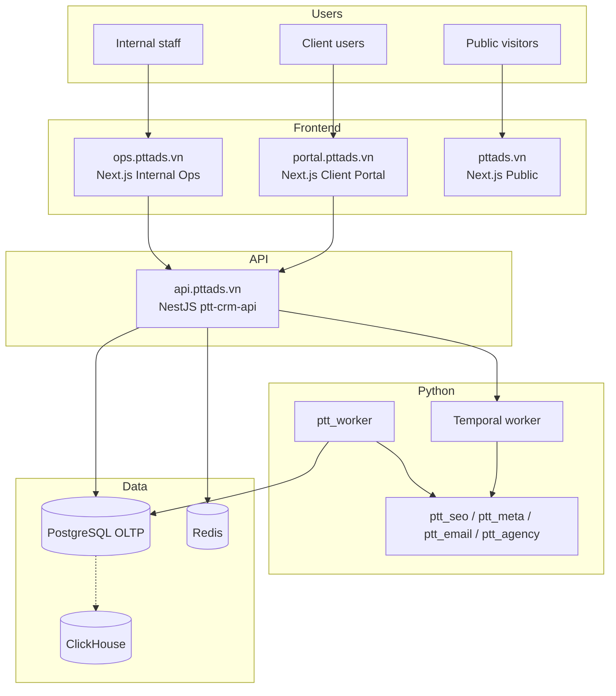
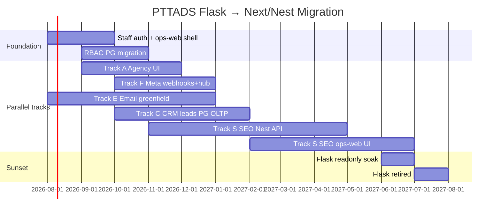

# PTTADS — Migration Flask → Next.js + NestJS

> **Phiên bản:** 1.1 · **Ngày:** 2026-07-20  
> **Trạng thái:** **APPROVED — EXECUTING** (quyết định: bỏ Flask toàn hệ thống)  
> **Kế hoạch thực thi:** [`SPEC_MIGRATION_FLASK_EXECUTION_PLAN.md`](SPEC_MIGRATION_FLASK_EXECUTION_PLAN.md) ← **bắt đầu tại đây**  
> **Sprint 0 prod:** [`runbooks/migration-sprint-0-prod.md`](runbooks/migration-sprint-0-prod.md)  
> **Phạm vi:** CRM · SEO/AEO · Agency · Facebook/Meta · Email Marketing (greenfield)  
> **Loại tài liệu:** Platform migration master plan  
> **Tài liệu liên quan:**  
> - [`SPEC_AGENCY_OPERATING_PLATFORM.md`](SPEC_AGENCY_OPERATING_PLATFORM.md) — Target platform (Internal Ops = Next.js + NestJS)  
> - [`specs/2026-07-17-architecture-phase-4.md`](specs/2026-07-17-architecture-phase-4.md) — Flask sunset tracks F3/F4  
> - [`specs/2026-07-17-sqlite-pg-migration.md`](specs/2026-07-17-sqlite-pg-migration.md) — OLTP cutover matrix  
> - [`runbooks/vps-production-operations.md`](runbooks/vps-production-operations.md) — VPS topology  
> - [`SPEC_EMAIL_MARKETING_OPERATING_SYSTEM.md`](SPEC_EMAIL_MARKETING_OPERATING_SYSTEM.md) — EM-OS greenfield (no Flask)  
> - [`runbooks/keycloak-portal-auth.md`](runbooks/keycloak-portal-auth.md) — OIDC foundation  

---

## Mục lục

1. [Tổng quan](#1-tổng-quan)
2. [Hiện trạng vs target](#2-hiện-trạng-vs-target)
3. [Nguyên tắc migration](#3-nguyên-tắc-migration)
4. [Kiến trúc target](#4-kiến-trúc-target)
5. [Auth & RBAC migration](#5-auth--rbac-migration)
6. [Lộ trình theo domain](#6-lộ-trình-theo-domain)
7. [Timeline & phases](#7-timeline--phases)
8. [Routing & deployment](#8-routing--deployment)
9. [Data migration (SQLite → PG)](#9-data-migration-sqlite--pg)
10. [Python layer (giữ lại)](#10-python-layer-giữ-lại)
11. [Rủi ro & rollback](#11-rủi-ro--rollback)
12. [Ma trận theo dõi tiến độ](#12-ma-trận-theo-dõi-tiến-độ)
13. [Phụ lục](#13-phụ-lục)

---

## 1. Tổng quan

### 1.1. Mục tiêu

Chuyển **toàn bộ HTTP surface + internal admin UI** của PTTADS từ Flask monolith sang **Next.js (UI) + NestJS (API)**, theo **Strangler Fig Pattern** — không big-bang.

| Lớp | Target |
|-----|--------|
| **Public** | Next.js SSG/ISR (`pttads.vn`) |
| **Internal Ops** | Next.js App Router (`ops.pttads.vn`) |
| **Client Portal** | Next.js (`portal.pttads.vn`) — đã có Phase 3 |
| **API OLTP** | NestJS (`api.pttads.vn` hoặc `:3000`) |
| **Workers** | Python (`ptt_worker`, Temporal) — **giữ** |
| **Domain logic** | Python libs (`ptt_seo`, `ptt_meta`, `ptt_email`, …) gọi từ worker/Nest qua PG |

### 1.2. Phạm vi domain

| Domain | Flask hiện tại | Target | Độ khó |
|--------|----------------|--------|--------|
| **Agency** | `blueprints/agency.py` (47 routes), 7 templates | Next.js ops + Nest (đa phần đã có) | **Medium** |
| **Facebook/Meta** | Legacy `app.py` + hub + webhooks dual path | Nest webhooks + performance + hub UI Next | **Medium–High** |
| **SEO/AEO** | `blueprints/seo_aeo.py` (149 routes), 22 templates, Nest proxy Flask | Nest native + ops Next | **High** |
| **CRM** | `app.py` (~290 CRM routes), ~55 templates, SQLite OLTP | Nest modules + ops Next + PG OLTP | **High** |
| **Email Marketing** | Chưa có | **Greenfield Next + Nest** — không qua Flask | **Medium** (module mới) |

### 1.3. Out of scope migration

- Viết lại toàn bộ `ptt_seo/` (75 modules) sang TypeScript — **không**; giữ Python, Nest orchestrates qua PG + job queue
- SaaS multi-agency
- Thay thế Temporal / ClickHouse stack

**Ước lượng tổng:** 12 tháng (accelerated) — xem timeline chi tiết trong [`SPEC_MIGRATION_FLASK_EXECUTION_PLAN.md`](SPEC_MIGRATION_FLASK_EXECUTION_PLAN.md).

### 1.4. Quyết định (2026-07-20)

- **Không** phát triển feature mới trên Flask (admin + API HTTP).  
- **Không** build Email Marketing admin trên Flask — dùng `ops-web` + Nest.  
- Python **workers giữ nguyên**; Flask Gunicorn **retire** trong 12 tháng.

---

## 2. Hiện trạng vs target

### 2.1. Scale Flask (baseline 2026-07-19)

| Metric | Giá trị | Evidence |
|--------|---------|----------|
| `app.py` | ~20,879 lines, ~434 routes | Flask monolith |
| Blueprints | ~222 routes | `blueprints/` |
| **Tổng HTTP Flask** | **~656 routes** | |
| Jinja templates | ~70 HTML | `templates/` |
| Nest endpoints | ~29 | `services/ptt-crm-api/` |
| Next.js pages | 9 (portal) | `services/portal-web/` |

### 2.2. Đã migrate / đang strangler

| Capability | Nest | Next portal | Flask còn |
|------------|------|-------------|-------------|
| Lead read/write v1 | ✅ | — | Proxy/dual-run |
| Portal auth JWT | ✅ | ✅ login | — |
| Performance Meta/Google | ✅ | ✅ `/meta` | — |
| Creatives approval | ✅ + Temporal | ✅ | — |
| Campaign write approval | ✅ + Temporal | — | UI shell |
| Client onboarding WF | ✅ | — | — |
| SEO portal widgets | Proxy Flask ⚠️ | ✅ `/seo/*` | 149 routes internal |
| Webhook v1 channel | Partial | — | Legacy FB in `app.py` |
| Agency clients/jobs | Partial PG | — | 7 templates |

### 2.3. Target topology



**Flask:** `PTT_FLASK_MONOLITH_MODE=retired` — Gunicorn tắt; không còn route production.

---

## 3. Nguyên tắc migration

1. **Strangler, không big-bang** — route từng module; dual-run + feature flags
2. **Contract-first** — OpenAPI frozen trong `schemas/` trước khi cut UI
3. **PG OLTP trước UI** — không port UI module khi data còn SQLite-primary
4. **Python workers survive** — business logic nặng giữ Python; Nest = API + auth + orchestration
5. **Không proxy Flask lâu dài** — SEO portal-seo proxy là nợ kỹ thuật; port logic → Nest, deadline cứng
6. **Greenfield = Next-first** — module mới (Email Marketing) **không** thêm Flask routes
7. **Soak trước cutover** — staging + prod readonly ≥ 14 ngày (`phase4-kickoff.md`)
8. **RBAC migrate cùng UI** — section keys giữ tên; store chuyển PG

---

## 4. Kiến trúc target

### 4.1. Services layout (target)

```
PTTADS/services/
├── ptt-crm-api/          # NestJS — all /api/v1/*
│   └── src/
│       ├── leads/
│       ├── portal/
│       ├── portal-seo/       → refactor: native, no Flask proxy
│       ├── email-marketing/  # NEW — EM-OS API
│       ├── seo/              # NEW — internal SEO API (extract from Flask)
│       ├── agency/
│       ├── creatives/
│       ├── campaign-writes/
│       ├── workflows/
│       ├── webhooks/           # channel ingress (move from Flask)
│       └── staff-auth/         # NEW — internal staff JWT / Keycloak
├── portal-web/           # Client portal (existing)
│   └── src/app/email/    # client-facing EM
└── ops-web/              # NEW — Internal Ops Next.js
    └── src/app/
        ├── crm/
        ├── seo/
        ├── agency/
        ├── meta/
        └── email/
```

### 4.2. Flask sunset stages

Theo `ptt_crm/flask_guard.py` + Phase 4 docs:

| Stage | Flag | HTTP | Ghi chú |
|-------|------|------|---------|
| **Active** | `active` (default) | Flask read+write | Hiện tại |
| **Readonly** | `readonly` | GET OK; mutating → 503 | Soak ≥ 14 ngày |
| **Retired** | `retired` | Health only / off | Nginx → Nest + Next only |

### 4.3. ADRs (platform)

| ADR | Decision |
|-----|----------|
| ADR-MIG-01 | Internal Ops UI = Next.js `ops-web`, không mở rộng Jinja |
| ADR-MIG-02 | Module mới không thêm Flask blueprint |
| ADR-MIG-03 | Python domain libs callable từ worker; Nest gọi PG + enqueue jobs |
| ADR-MIG-04 | Staff auth = Keycloak realm mở rộng hoặc Nest staff JWT (tách portal JWT) |
| ADR-MIG-05 | RBAC section keys migrate sang PG `staff_section_permissions` |
| ADR-MIG-06 | SEO Nest proxy Flask — deprecate trong Track S2 (deadline) |

---

## 5. Auth & RBAC migration

### 5.1. Hai auth realm

| Realm | User | Mechanism | Scope |
|-------|------|-----------|-------|
| **Staff (internal)** | AM, MKT, CSKH, Admin | Keycloak OIDC **hoặc** Nest staff JWT | Full ops modules |
| **Client (portal)** | Client viewer/approver | Nest portal JWT / Keycloak | `client_id` scoped |

Flask session (`ptt_session`) **retire** khi ops-web cutover hoàn tất.

### 5.2. RBAC migration

| Hiện tại | Target |
|----------|--------|
| `admin_page_permissions.py` + SQLite `crm_position_section_permissions` | PG table `staff_section_permissions` |
| Section keys: `crm_seo_aeo_*`, `crm_agency`, `crm_email_mkt_*`, … | Giữ nguyên key names |
| Flask `_admin_section_can()` | Nest `StaffRbacGuard` + Next middleware |
| Template `ui_caps()` | Next hook `useStaffCaps()` từ `GET /api/v1/staff/me` |

### 5.3. Cutover auth checklist

- [ ] Keycloak realm staff roles map → section keys
- [ ] Nest `staff-auth` module: login, refresh, `/staff/me`
- [ ] ops-web: auth cookie / bearer, redirect `/login`
- [ ] Parallel: Flask session + staff JWT during transition (optional)
- [ ] Retire Flask login for ops routes

---

## 6. Lộ trình theo domain

### 6.1. Track A — Agency (ưu tiên cao, effort thấp)

**Hiện trạng:** Data PG; Nest có workflows, creatives, campaign-writes; Flask = UI shell.

| Bước | Deliverable | Effort |
|------|-------------|--------|
| A1 | Nest `agency/` module — clients, jobs, notifications API | 2 tuần |
| A2 | ops-web `/agency/*` — thay 7 Jinja templates | 4–6 tuần |
| A3 | Nginx cut `/crm/agency` → ops-web | 1 tuần |
| A4 | Flask agency blueprint → readonly → remove | 1 tuần |

**Blockers:** Hub campaign sync còn SQLite — fix trong Track D1.

---

### 6.2. Track F — Facebook/Meta

**Hiện trạng:** Dual webhook; lead ingest SQLite-first; Nest performance + campaign-writes OK.

| Bước | Deliverable | Effort |
|------|-------------|--------|
| F1 | Consolidate webhooks → Nest `/api/v1/webhooks/meta` only | 2 tuần |
| F2 | Retire `app.py` FB webhook routes | 1 tuần |
| F3 | ops-web `/meta/facebook-ads` hub UI | 3–4 tuần |
| F4 | Lead ingest PG-primary (link Track C) | 4–6 tuần |

**Dependency:** Track C (CRM leads PG OLTP) cho F4.

---

### 6.3. Track S — SEO/AEO (effort cao nhất)

**Hiện trạng:** 149 Flask routes; 75 Python modules; Nest `portal-seo` proxies Flask; data PG.

| Bước | Deliverable | Effort |
|------|-------------|--------|
| S0 | Freeze Flask SEO — no new routes (policy đã có) | — |
| S1 | Nest `seo/` internal API — port high-traffic read endpoints | 6–8 tuần |
| S2 | **Retire portal-seo Flask proxy** — Nest reads PG + `ptt_seo` via jobs | 4–6 tuần |
| S3 | ops-web `/seo/*` — 11 screens (clone wireframes SPEC_UI_UX_SEO_AEO) | 8–12 tuần |
| S4 | Port remaining write/approval APIs to Nest + Temporal | 6–8 tuần |
| S5 | Decommission `blueprints/seo_aeo.py` | 2 tuần |

**Không port:** GSC/GA4 sync, crawl, AEO scan, ClickHouse export — giữ Python workers.

**Portal client SEO:** S2 unblocks portal không phụ thuộc Flask.

---

### 6.4. Track C — CRM (monolith tail)

**Hiện trạng:** ~290 routes `app.py`; SQLite OLTP; Nest leads v1 partial.

| Bước | Deliverable | Effort |
|------|-------------|--------|
| C1 | Leads write PG OLTP primary; retire SQLite write | 6–8 tuần |
| C2 | Nest modules: hub, sop, lifecycle (theo migration matrix) | 12–16 tuần |
| C3 | ops-web `/crm/*` — leads, customers, hub (incremental) | 12–20 tuần |
| C4 | RE projects, payroll, staff — late phase or keep Flask longest | 16+ tuần |
| C5 | Retire CRM routes in `app.py` | 2 tuần |

**Thứ tự ưu tiên UI:** leads → customers → hub/sop → RE/payroll.

---

### 6.5. Track E — Email Marketing (greenfield)

**Theo quyết định 2026-07-20:** Admin + API **Next/Nest only** — xem [`SPEC_MIGRATION_FLASK_EXECUTION_PLAN.md`](SPEC_MIGRATION_FLASK_EXECUTION_PLAN.md) Phase 2.

| Bước | Deliverable | Stack |
|------|-------------|-------|
| E0 | DDL + `ptt_email/*` | PG + worker |
| E1 | Nest `email-marketing/` | Nest |
| E2 | ops-web `/email/*` | Next.js |
| E3 | portal-web `/email/*` | Next/Nest |

---

## 7. Timeline & phases

### 7.1. Gantt logic (không big-bang)



*Dates illustrative — adjust per team capacity.*

### 7.2. Phase gates

| Gate | Criteria | Domains |
|------|----------|---------|
| **G0** | ops-web + staff auth staging | Platform |
| **G1** | Agency ops fully on ops-web | Agency |
| **G2** | No Flask proxy for portal SEO | SEO portal |
| **G3** | EM-OS prod pilot | Email |
| **G4** | CRM leads + hub on PG + Nest | CRM core |
| **G5** | SEO internal on ops-web | SEO |
| **G6** | `PTT_FLASK_MONOLITH_MODE=retired` | All |

---

## 8. Routing & deployment

### 8.1. Nginx target

| Host | Upstream | Purpose |
|------|----------|---------|
| `pttads.vn` | Next public / Flask landing (transition) | Public site |
| `ops.pttads.vn` | Next ops-web `:3200` | **Internal admin** |
| `portal.pttads.vn` | Next portal-web `:3100` | Client portal |
| `api.pttads.vn` | Nest `:3000` | All `/api/v1/*` |
| `rs.pttads.vn` | Flask `:8002` | **Legacy — retire** |

### 8.2. API routing (Nest)

```nginx
location /api/v1/ {
    proxy_pass http://127.0.0.1:3000;
}

# Webhooks — no Flask
location /api/v1/webhooks/ {
    proxy_pass http://127.0.0.1:3000;
}
```

### 8.3. Strangler redirect (transition)

```nginx
# Temporary 302 during migration
location /crm/agency {
    return 302 https://ops.pttads.vn/agency$request_uri;
}
location /crm/seo {
    return 302 https://ops.pttads.vn/seo$request_uri;
}
```

Remove redirects when Flask retired.

### 8.4. New systemd units

| Unit | Service |
|------|---------|
| `ptt-ops-web.service` | Next.js internal ops |
| `ptt-crm-api.service` | Nest (existing) |
| `ptt-portal-web.service` | Client portal (existing) |
| ~~`ptt.service`~~ | Flask — decommission G6 |

---

## 9. Data migration (SQLite → PG)

Theo [`specs/2026-07-17-sqlite-pg-migration.md`](specs/2026-07-17-sqlite-pg-migration.md):

| Domain | SQLite tables | PG target | Track |
|--------|---------------|-----------|-------|
| Leads | `crm_leads` | `crm_leads` | C1 |
| Agency clients | partial | `clients` | Done |
| Hub/SOP | hub tables | PG hub schema | C2 / Phase 4 |
| SEO/AEO | frozen legacy | `seo_aeo.*` | Done (new work PG-only) |
| Staff permissions | `crm_position_section_permissions` | `staff_section_permissions` | Auth track |
| RE, payroll | many | late | C4 |

**Rule:** Port Nest API **after** PG table is primary; UI cut **after** API stable.

---

## 10. Python layer (giữ lại)

| Component | Path | Role post-Flask |
|-----------|------|-----------------|
| Job worker | `ptt_worker/` | Poll PG `job_queue`, execute handlers |
| Temporal worker | `ptt_temporal/` | Approvals, campaign write, SEO content, EM journeys |
| Channel adapters | `ptt_channel/` | ESP, Meta webhooks normalize (ingress may move to Nest) |
| SEO domain | `ptt_seo/` | GSC/GA4 sync, crawl, AEO, BI export |
| Meta domain | `ptt_meta/` | Graph API, CAPI, campaign write execute |
| Email domain | `ptt_email/` | Send queue, segments, deliverability |
| Agency domain | `ptt_agency/` | Performance rollup, notifications |

Nest invokes Python **indirectly**:

1. Write PG + enqueue `job_queue`
2. Start Temporal workflow
3. (Optional) Internal HTTP to worker admin — avoid for hot path

---

## 11. Rủi ro & rollback

| Rủi ro | Mitigation |
|--------|------------|
| Regression trên 656 Flask routes | Strangler per module; E2E per track; keep Flask readonly rollback |
| Dual auth confusion | Separate hosts: ops vs portal; clear login pages |
| SEO proxy Nest→Flask latency/failure | S2 deadline; monitor `portal_seo_flask_proxy_errors` |
| SQLite/PG drift | Dual-run tests (`ptt_crm/dual_run.py`); block UI cut until pass |
| Team capacity | EM greenfield parallel; Agency first win |
| Long CRM tail | Keep RE/payroll on Flask until G5; không block Agency/SEO/EM |

**Rollback:** Re-enable Flask route in nginx; set `PTT_FLASK_MONOLITH_MODE=active`; revert ops-web feature flag.

---

## 12. Ma trận theo dõi tiến độ

| Domain | Flask routes | Nest API | ops-web UI | PG OLTP | Portal Next | Target date |
|--------|:------------:|:--------:|:----------:|:-------:|:-----------:|-------------|
| Agency | 47 | Partial | ❌ | ✅ | N/A | G1 |
| Facebook | ~15 legacy | Partial | ❌ | Partial | ✅ meta | G2 |
| SEO/AEO | 149 | Proxy ⚠️ | ❌ | ✅ | ✅ | G5 |
| CRM | ~290 | Partial | ❌ | Partial | N/A | G4–G6 |
| Email | 0 | ❌ | ❌ | ❌ | ❌ | G3 |

Cập nhật cột này mỗi sprint; link evidence PR/runbook trong `docs/evidence/`.

---

## 13. Phụ lục

### 13.1. Module migration checklist (template)

```markdown
## Module: {name}
- [ ] OpenAPI contract in schemas/
- [ ] PG DDL applied
- [ ] Nest module + tests
- [ ] ops-web pages + E2E
- [ ] RBAC guards wired
- [ ] Nginx cutover
- [ ] Flask route readonly
- [ ] Flask route removed
- [ ] Runbook updated
- [ ] Prod soak sign-off
```

### 13.2. Key files

| Purpose | Path |
|---------|------|
| Flask guard | `ptt_crm/flask_guard.py` |
| Nest root | `services/ptt-crm-api/src/app.module.ts` |
| Portal web | `services/portal-web/` |
| ops-web (new) | `services/ops-web/` |
| Phase 4 arch | `docs/specs/2026-07-17-architecture-phase-4.md` |
| SEO proxy (debt) | `services/ptt-crm-api/src/portal-seo/portal-seo.service.ts` |

### 13.3. Related specs to update when tracks complete

- `SPEC_AGENCY_OPERATING_PLATFORM.md` — as-is → shipped notes
- `SPEC_SEO_AEO_OPERATING_SYSTEM.md` — UI routes `/ops/seo/*`
- `SPEC_UI_UX_SEO_AEO.md` — ops-web shell thay Flask sidebar
- `SPEC_HE_THONG_PTT.md` — CRM as-is section

---

## Lịch sử

| Version | Date | Change |
|---------|------|--------|
| 1.0 | 2026-07-19 | Initial unified migration roadmap CRM/SEO/Agency/FB/Email |
