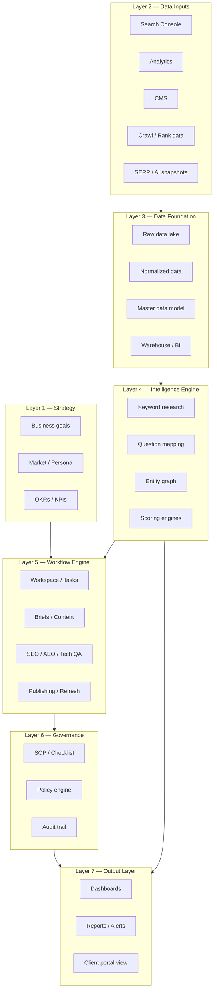
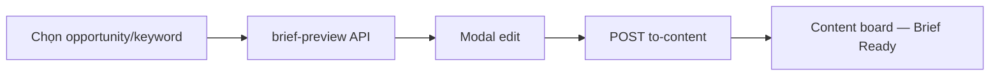
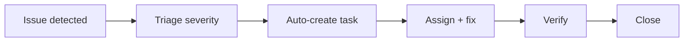
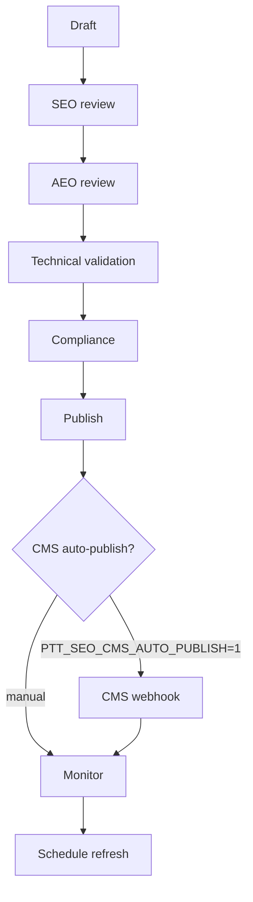

# SEO/AEO Enterprise Operating System — Master Specification

> **Phiên bản:** 1.4 · **Ngày:** 2026-07-19  
> **Trạng thái:** Target architecture — **code Phase 0–5 + Gate B/C/D/E shipped**; prod pilot (Gate A) pending  
> **Codebase:** `PTTADS/` (Flask monolith) · **Production:** `https://pttads.vn`  
> **Nguồn gốc:** `SEO:AEO Enterprise Operating System.docx` (PTTCOM)  
> **Loại tài liệu:** Business + Technical master spec  
> **Tài liệu liên quan:**  
> - [`specs/2026-07-19-seo-aeo-architecture.md`](specs/2026-07-19-seo-aeo-architecture.md) — Kiến trúc hệ thống (C4, data model, API, deployment) **v1.4**  
> - [`specs/2026-07-19-seo-aeo-pg-cutover-policy.md`](specs/2026-07-19-seo-aeo-pg-cutover-policy.md) — **Chính sách PostgreSQL-only (active 2026-07-19)**  
> - [`SPEC_UI_UX_SEO_AEO.md`](SPEC_UI_UX_SEO_AEO.md) — UI/UX specification  
> - [`SPEC_AGENCY_OPERATING_PLATFORM.md`](SPEC_AGENCY_OPERATING_PLATFORM.md) — Agency platform target  
> - [`SPEC_UI_UX_PTT.md`](SPEC_UI_UX_PTT.md) — Design system gốc  
> - [`superpowers/specs/2026-06-23-aeo-tooling-design.md`](superpowers/specs/2026-06-23-aeo-tooling-design.md) — AEO MVP (Phase 0, đã có)  
> - [`runbooks/seo-aeo-gate-e.md`](runbooks/seo-aeo-gate-e.md) — Gate E enterprise depth (OKR, crawl connector, CWV UI, …)  
> - [`runbooks/phase5-prod-signoff-checklist.md`](runbooks/phase5-prod-signoff-checklist.md) — Gate A prod sign-off  

---

## Mục lục

1. [Tổng quan & phạm vi](#1-tổng-quan--phạm-vi)
2. [Kiến trúc 7 lớp](#2-kiến-trúc-7-lớp)
3. [Bounded contexts & modules](#3-bounded-contexts--modules)
4. [Personas & phân quyền](#4-personas--phân-quyền)
5. [Luồng nghiệp vụ cốt lõi](#5-luồng-nghiệp-vụ-cốt-lõi)
6. [Mô hình dữ liệu tóm tắt](#6-mô-hình-dữ-liệu-tóm-tắt)
7. [Tích hợp bên ngoài](#7-tích-hợp-bên-ngoài)
8. [KPI & success metrics](#8-kpi--success-metrics)
9. [Lộ trình triển khai](#9-lộ-trình-triển-khai)
10. [Ma trận tái sử dụng PTTADS](#10-ma-trận-tái-sử-dụng-pttads)
11. [Phụ lục](#11-phụ-lục)

---

## 1. Tổng quan & phạm vi

### 1.1. Vision

**SEO/AEO Enterprise Operating System** là hệ điều hành vòng đời SEO + AEO cho agency marketing quy mô lớn — không chỉ là "tool SEO", mà là nền tảng vận hành end-to-end:

```
Strategy → Research → Planning → Content Production → Technical QA
         → AEO Optimization → Publishing → Monitoring → Refresh → Reporting
```

### 1.2. Mục tiêu kinh doanh

| Mục tiêu | Chỉ số thành công |
|----------|-------------------|
| Tăng organic traffic | Organic sessions growth |
| Tăng non-brand visibility | Non-brand clicks, ranking share |
| Tăng citations trong AI/answer engines | AI citations, answer visibility |
| Tăng conversion từ organic | Conversion rate from organic |
| Giảm thời gian vận hành | Content cycle time reduction |
| Tăng chất lượng nội dung | QA pass rate improvement |
| Tăng hiệu quả quản trị agency | SLA compliance improvement |

### 1.3. Nguyên tắc thiết kế

1. **Multi-tenant** — tách biệt dữ liệu theo client (`client_id` / `customer_id`)
2. **Workflow-driven** — mọi artifact đi qua trạng thái rõ ràng
3. **Template-first** — giảm làm thủ công (brief, checklist, report)
4. **AI-aware** — tối ưu cho answer engines, human-in-the-loop
5. **Entity-first** — không chỉ keyword-first
6. **Measurable** — mọi quyết định phải có data
7. **Scalable** — mở rộng theo pod/team/vertical
8. **Governance-heavy** — đủ kiểm soát cho enterprise

### 1.4. Phạm vi (In scope)

| Module | Mô tả ngắn |
|--------|------------|
| Client/workspace management | Hồ sơ client, brand kit, integrations |
| Strategy & roadmap | OKR/KPI tree, roadmap 30/60/90 |
| Research intelligence | Keyword, question, entity, **clusters**, **SERP stub**, **page inventory** |
| Content factory | Pipeline kanban, brief, approval, version |
| Technical SEO | Crawl, index, schema, CWV monitoring |
| AEO engine | Question coverage, citation, AI visibility |
| Authority & trust | Mentions, citations, backlink quality |
| Content freshness | Decay scoring, refresh queue |
| Experimentation | A/B variants, hypothesis, decision log |
| Reporting & analytics | Executive, client, ops dashboards |
| Workflow & approvals | Multi-stage approval chain |
| Governance & compliance | SOP, checklist, policy engine |
| Automation & alerts | Sync, anomaly, scheduled reports |

### 1.5. Phạm vi ngoài (Out of scope)

- CRM replacement (tích hợp, không thay thế `crm_leads`)
- CMS replacement (tích hợp publish, không thay CMS)
- Paid media management (thuộc Agency Ops / Meta Ads)
- Social media management
- Full project finance/accounting

### 1.6. Trạng thái hiện tại (PTTADS)

> **Chính sách lưu trữ (2026-07-19):** Team **không build thêm** schema/feature SEO/AEO trên SQLite. Mọi phát triển mới → PostgreSQL `seo_aeo.*`. Chi tiết: [`specs/2026-07-19-seo-aeo-pg-cutover-policy.md`](specs/2026-07-19-seo-aeo-pg-cutover-policy.md).

| Thành phần | Trạng thái | Ghi chú |
|------------|------------|---------|
| AEO query bank + scan | ✅ Phase 0 | PG-first qua `seo_questions` (`source=aeo`) |
| Client/customer model | ✅ Có sẵn | `crm_customers` |
| Service lifecycle | ✅ Có sẵn | Gắn SEO/AEO project |
| SOP/checklist | ✅ Có sẵn | `/crm/sop` |
| Approval chain | ✅ Phase 2+ | Content workflow + portal approver (5C) |
| SEO Ops hub + client | ✅ Phase 1 | PG (`SEO_AEO_DB=pg`); UI = `crm_seo_hub.html` |
| Research + Content pipeline | ✅ Phase 2 | PG; Gate B: filters, brief modal, review kanban |
| Technical + Reports + Automation | ✅ Phase 3 | PG; CRM task bridge, schedule reports |
| PG schema DDL | ✅ Ready | `deploy/sql/seo_aeo_pg_schema.sql` + `seo_aeo_research_p2.sql` |
| PG cutover (Phase 3.5) | ✅ Done | `SEO_AEO_DB=pg` |
| GSC/GA4 OAuth sync | ✅ Phase 4 | OAuth + daily timers |
| AEO Console v2 + Freshness + Authority | ✅ Phase 4 | S-10, freshness queue, S-11 |
| **Governance Hub (5A)** | ✅ Shipped | `PTT_SEO_GOVERNANCE_ENABLED` (default `1`) |
| **Portal SEO (5C)** | ✅ Shipped | `PTT_PORTAL_SEO_ENABLED` (prod default `0` until pilot) |
| **Experimentation (5B)** | ✅ Shipped | `PTT_SEO_EXPERIMENTS_ENABLED` (prod default `0` until internal UAT) |
| **RBAC §9 — section keys riêng** | ✅ P2 | 6 keys trong `admin_page_permissions.py`; helpers `ptt_seo/rbac.py` |
| **Slack alerts (P3e)** | ✅ P2 | `critical_issues`, `report_schedule_failed`, `sync_failed`, `freshness_urgent` |
| **Research depth (P2)** | ✅ Shipped | Clusters, SERP stub, `seo_pages` sync GSC — UI tabs S-06 |
| **Reports charts (S-12)** | ✅ P2 | Sparkline GSC + bar charts (`crm_seo_charts.js`) |
| **Gate B UI parity** | ✅ 2026-07-19 | S-06 filters, S-07 review kanban, F1 brief modal, S-03 Tasks, `/crm/aeo` 301 |
| **BI / ClickHouse (5D)** | ✅ Gate D | Grafana dashboard + alerts; CWV ingest; crawl reminder; Teams; AEO schedule — [`runbooks/seo-aeo-gate-d.md`](runbooks/seo-aeo-gate-d.md) |
| **P3 backlog (Gate C)** | ✅ Code shipped | SerpAPI/DataForSEO, white-label PDF, portal widgets, entity graph+, Temporal WF — [`runbooks/seo-aeo-p3-gate-c.md`](runbooks/seo-aeo-p3-gate-c.md) |
| **Enterprise depth (Gate E)** | ✅ Code shipped | OKR/KPI tree, crawl webhook, CWV CRM UI, entity autolink, CMS auto-publish, rank/SOV, attribution API, a11y partial — [`runbooks/seo-aeo-gate-e.md`](runbooks/seo-aeo-gate-e.md) |
| **Gate A — prod pilot** | 🟡 Staging ready | Horizon 0 pack: [`runbooks/horizon0-gate-a-execution.md`](runbooks/horizon0-gate-a-execution.md) · soak ≥7d trên VPS |

**Prod readiness (2026-07-19):** ~88–92% feature code vs spec; ~45–50% prod-ready (flags, infra deploy, QA §12, Gate A chưa ký).

---

## 2. Kiến trúc 7 lớp



Chi tiết C4, containers, components, API: xem [`specs/2026-07-19-seo-aeo-architecture.md`](specs/2026-07-19-seo-aeo-architecture.md).

---

## 3. Bounded contexts & modules

| Context | Module ID | Prefix code | Phase |
|---------|-----------|-------------|-------|
| Client workspace | 6.1 | `seo_client` | 1 |
| Strategy & roadmap | 6.2 | `seo_strategy` | 1 → **Gate E** |
| Research intelligence | 6.3 | `seo_research` | 2 |
| Content factory | 6.4 | `seo_content` | 2 |
| Technical SEO | 6.5 | `seo_technical` | 3 |
| AEO engine | 6.6 | `seo_aeo` | 0→4 |
| Authority & trust | 6.7 | `seo_authority` | 4 |
| Content freshness | 6.8 | `seo_freshness` | 4 |
| Experimentation | 6.9 | `seo_experiment` | 5 |
| Reporting | 6.10 | `seo_report` | 3→4 |
| Workflow & approvals | 6.11 | `seo_workflow` | 2 |
| Governance | 6.12 | `seo_governance` | 2 |
| Automation & alerts | 6.13 | `seo_automation` | 3 |

**Quy ước module Python:** `seo_<context>.py` (ví dụ `seo_content.py`, `seo_research.py`).  
**Quy ước route:** `/crm/seo/*`, `/crm/aeo/*` (giữ backward compat AEO MVP).

---

## 4. Personas & phân quyền

### 4.1. Personas

| Persona | Vai trò chính | Entry screens |
|---------|---------------|---------------|
| Executive | KPI tổng, client health | Executive Overview |
| Head of SEO/AEO | Governance, roadmap | Strategy, Reports |
| SEO Strategist | Research, roadmap | Research Console, Strategy |
| AEO Strategist | Question/entity, AEO QA | AEO Console |
| Technical SEO Lead | Issue backlog, schema | Technical Console |
| Content Strategist | Brief, pipeline | Content Pipeline |
| Editor / Writer | Draft, revision | Content detail |
| Analyst | Reports, experiments | Reporting Center |
| QA/Compliance | Approval, policy | Governance |
| Account Manager | Client overview | Client Workspace |
| Client Reviewer | Portal read/approve | Client portal (Phase 5) |
| Admin | Settings, integrations | Settings |

### 4.2. Permission model (RBAC §9)

- **RBAC** — role-based, extend `admin_page_permissions.py` + `ptt_seo/rbac.py`
- **Client-level isolation** — filter mọi query theo `customer_id`
- **Project-level** — gắn vào `crm_service_lifecycle`
- **Approval permission** — per stage (SEO, AEO, technical, client) via `crm_seo_aeo_approve`
- **Export permission** — PDF/ClickHouse gated via `crm_seo_aeo_reports`
- **Audit log** — mọi hành động quan trọng

**Section keys (không gom vào một key duy nhất):**

| Key | Scope | Actions | Route guard (blueprint) |
|-----|-------|---------|-------------------------|
| `crm_seo_aeo` | View module, hub, read-only screens | `view` (+ legacy shim `edit`/`configure`) | `_can("view")` default |
| `crm_seo_aeo_write` | Research CRUD, content create/edit | `view`, `edit`, `create` | `_can("create")`, `_can("edit")` |
| `crm_seo_aeo_approve` | Approval stages, publish gate | `approve` | `_can("approve")` |
| `crm_seo_aeo_technical` | Technical console write, crawl import | `view`, `edit`, `create` | `_can_technical()` |
| `crm_seo_aeo_settings` | Client settings, OAuth, CMS, schedules | `view`, `edit`, `configure` | `_can_settings()` / `_can("configure")` |
| `crm_seo_aeo_reports` | Export PDF, BI, scheduled reports | `view`, `export` | `_can_reports()` |

**Default grants (position templates):**

| Position | Keys |
|----------|------|
| **MKT-01** (Head SEO/AEO) | Full — all 6 keys |
| **MKT-02** (Strategist/Writer) | `crm_seo_aeo` view + `crm_seo_aeo_write` + `crm_seo_aeo_reports` view |
| **KD-01** (Account Manager) | `crm_seo_aeo` view + `crm_seo_aeo_settings` + `crm_seo_aeo_reports` |

UI capability flags (`ptt_seo/rbac.py` → `ui_caps()`): `can_seo_write`, `can_seo_approve`, `can_seo_configure`, `can_seo_export`, `can_seo_technical`.

Chi tiết matrix UI: [`SPEC_UI_UX_SEO_AEO.md` §9](SPEC_UI_UX_SEO_AEO.md).

---

## 5. Luồng nghiệp vụ cốt lõi

### 5.1. Research → Brief → Content



API: `POST /api/v1/seo/research/brief-preview` (template + optional Anthropic) → `POST /api/v1/seo/research/to-content`.

### 5.2. Audit → Task → Fix



### 5.3. Content → Publish → Monitor



Gate E5: `maybe_auto_publish` khi `workflow_status → published`. Runbook: [`seo-cms-webhook-pilot.md`](runbooks/seo-cms-webhook-pilot.md).

### 5.4. Content workflow stages

```
Idea → Researching → Brief Ready → In Writing → SEO Review → AEO Review
     → Technical Review → Client Review → Approved → Published
     → Monitoring → Refresh Required → Archived
```

---

## 6. Mô hình dữ liệu tóm tắt

| Entity | Khóa chính | Liên kết |
|--------|------------|----------|
| Client | `client_id` | → `crm_customers.id` |
| Project | `project_id` | → `client_id`, `crm_service_lifecycle` |
| Keyword | `keyword_id` | → `client_id`, `cluster_id` |
| Keyword cluster | `cluster_id` | → `client_id` (`seo_keyword_clusters`, P2) |
| Question | `question_id` | → `client_id` |
| Entity | `entity_id` | → `client_id` |
| SERP snapshot | `snapshot_id` | → `client_id` (`seo_serp_snapshots`, stub P2) |
| Page inventory | `page_id` | → `client_id` (`seo_pages`; sync GSC) |
| Content | `content_id` | → `project_id`, workflow status |
| Content_Version | `version_id` | → `content_id` |
| Task | `task_id` | → `project_id` |
| Technical_Issue | `issue_id` | → `client_id`, `url`, optional `crm_task_id` |
| AI_Mention | `mention_id` | → `client_id` |
| Audit | `audit_id` | → `client_id` |
| Report | `report_id` | → `client_id` |
| SEO daily fact | `fact_id` | → ClickHouse `ptt.seo_daily_facts` (5D) |
| Strategy goal | `goal_id` | → `client_id` (`seo_strategy_goals`, Gate E1) |
| Strategy KPI | `kpi_id` | → `goal_id`, optional `initiative_id` (`seo_strategy_kpis`) |
| CWV snapshot | `snapshot_id` | → `client_id`, `url` (`seo_cwv_snapshots`, Gate D/E) |
| Crawl schedule | `customer_id` | → webhook ingest (`seo_crawl_schedules`, Gate E2) |
| Rank tracked keyword | `tracked_id` | → `seo_rank_tracked_keywords` + `seo_rank_snapshots` (Gate E6) |
| CMS publish job | `job_id` | → `content_id`, webhook payload (`seo_cms_publish_jobs`) |

Schema SQL chi tiết: [`specs/2026-07-19-seo-aeo-architecture.md` §6](specs/2026-07-19-seo-aeo-architecture.md).

**AEO MVP (Phase 0 — đã có):** `crm_aeo_queries`, `crm_aeo_scans`, `crm_aeo_content`.

---

## 7. Tích hợp bên ngoài

| Hệ thống | Mục đích | Phase / Gate | Trạng thái code |
|----------|----------|--------------|-----------------|
| Google Search Console | Impressions, clicks, queries | 3 / 4 | ✅ OAuth + daily sync |
| GA4 | Sessions, conversions, **revenue** | 3 / 4 / **E7** | ✅ OAuth; revenue columns + attribution API; **GA4 sync chưa pull revenue** |
| CMS (PTTWEB / client) | Publish, page metadata | 2 / **E5** | ✅ Webhook pilot; **auto-publish** flag `PTT_SEO_CMS_AUTO_PUBLISH` |
| Rank tracker | Position data, share of voice | 3 / **E6** | ✅ CSV + live SERP capture (`PTT_RANK_LIVE_ENABLED`) |
| Crawl/audit tool | Technical issues | 3 / **E2** | ✅ CSV import + **webhook ingest** (`/internal/crawl-ingest`) |
| PageSpeed Insights | Core Web Vitals | **Gate D/E** | ✅ Ingest + CRM UI; staging thường `PTT_CWV_STUB=1` |
| SerpAPI / DataForSEO | SERP snapshots | **Gate C/E6** | ✅ Code; prod default `PTT_SERP_PROVIDER=stub` |
| Anthropic API | AEO scan, brief gen | 0 | ✅ |
| ClickHouse + Grafana | Aggregated metrics, ops dashboard | **5D Gate D** | ✅ Code + DDL; **VPS deploy staging pending** |
| CRM (PTTADS) | Client, lifecycle, leads | 1 | ✅ |
| Slack / Teams | Alerts | 3 / **Gate D** | ✅ Slack (4 types); ✅ Teams (`PTT_SEO_TEAMS_WEBHOOK`) |
| Email SMTP | Reports, approvals | 2 | 🟡 Schedule có; prod SMTP chưa verify |
| Client Portal (Next.js) | Read-only SEO + approve | **5C** | ✅ Code; `PTT_PORTAL_SEO_ENABLED=0` prod |
| Temporal | Content approval workflow | **Gate C** | ✅ Code; `PTT_SEO_CONTENT_TEMPORAL=0` prod |

---

## 8. KPI & success metrics

### 8.1. SEO metrics

| Metric | Backend | UI / BI |
|--------|---------|---------|
| Organic sessions | GSC/GA4 | ✅ S-01, S-12 |
| Impressions, CTR | GSC | ✅ |
| Rankings / position | Rank tracker + SERP | ✅ S-17; live E6 |
| Share of voice | `rank_live.share_of_voice` | ✅ S-17 |
| Conversions / revenue (organic) | `attribution.py`, GA4 cols | 🟡 API only — **S-12 panel backlog** |
| CWV pass rate | `seo_cwv_snapshots` | ✅ S-09 |
| Non-brand visibility | — | ❌ Backlog |

### 8.2. AEO metrics

AI citations · AI mentions · Answer visibility · Source inclusion rate · **Question coverage** (✅ + ClickHouse `aeo_coverage_pct`) · Entity accuracy · Freshness effect

### 8.3. Ops metrics

SLA compliance · Time to publish · QA pass rate · Task throughput · Refresh compliance · **OKR KPI refresh** (Gate E1 — manual/API, cron backlog)

---

## 9. Lộ trình triển khai

> **Storage policy:** Từ 2026-07-19, mọi phase mới ghi SEO/AEO domain vào **PostgreSQL**. Phase 1–3 trên SQLite là legacy — cutover tại Phase 3.5. Xem [`specs/2026-07-19-seo-aeo-pg-cutover-policy.md`](specs/2026-07-19-seo-aeo-pg-cutover-policy.md).

| Phase | Thời gian | Deliverables | Storage |
|-------|-----------|--------------|---------|
| **0** ✅ | Done | AEO MVP (`crm_aeo.py`, `/crm/aeo`) | SQLite (legacy) |
| **1** ✅ | Done | Data model core, nav, Client SEO workspace, Hub | SQLite (legacy — freeze) |
| **2** ✅ | Done | Content Pipeline, Research Console, Workflow | SQLite (legacy — freeze) |
| **3** ✅ | Done | Technical Console, GSC CSV, Reporting, Automation | SQLite (legacy — freeze) |
| **3.5** ✅ | 1–2 tuần | **PG cutover**, backfill, `SEO_AEO_DB=pg`, UAT pilot | **PostgreSQL primary** |
| **4** ✅ | 8–12 tuần | GSC/GA4 OAuth, AEO Engine v2, Freshness, Authority | **PostgreSQL only** |
| **5** ✅ | 4–6 tuần | Governance, Portal SEO, Experimentation | **PostgreSQL only** |
| **P2 Enterprise** ✅ | 2026-07 | RBAC §9, Slack, research depth, S-12 charts, Gate B UI | **PostgreSQL only** |
| **5D** ✅ | Gate D | ClickHouse export + Grafana + CWV + crawl reminder + Teams + AEO schedule | **PostgreSQL only** |
| **Gate E** ✅ | 2026-07 | OKR/KPI, crawl connector, CWV UI, entity autolink, CMS auto-publish, rank/SOV, attribution, a11y | **PostgreSQL only** |
| **Gate A** 🟡 | Prod pilot | Staging deploy, soak ≥7d, Phase 5 sign-off, QA §12 | — |

**MVP enterprise usable:** Phase 1–2 ✅  
**PG cutover gate:** Phase 3.5 ✅  
**P2 Enterprise + Gate B/C/D/E:** ✅ code shipped  
**Phase 5 prod rollout:** staged flags + 7-day soak — [`runbooks/seo-aeo-pg-oauth-uat-cutover.md`](runbooks/seo-aeo-pg-oauth-uat-cutover.md) §10  
**Full enterprise prod-ready:** Gate A sign-off + VPS infra (ClickHouse/Grafana timers, SERP/CWV keys) + QA handoff §12  
**Backlog sau Gate E:** GA4 revenue sync, S-12 attribution UI, OKR KPI editor, non-brand SOV, native crawl API

Plan cutover: [`superpowers/plans/2026-07-19-seo-aeo-phase3.5-pg-cutover.md`](superpowers/plans/2026-07-19-seo-aeo-phase3.5-pg-cutover.md).

UI/UX chi tiết theo phase: [`SPEC_UI_UX_SEO_AEO.md`](SPEC_UI_UX_SEO_AEO.md).

### 9.1. Phase 5D — ClickHouse BI (Gate D)

| Thành phần | Path | Trạng thái |
|------------|------|------------|
| DDL | `deploy/clickhouse/init-seo-daily-facts.sql` | ✅ |
| Export script | `scripts/export_seo_facts_clickhouse.sh` | ✅ |
| systemd timer | `deploy/ptt-seo-clickhouse-export.{service,timer}` (04:00 VN) | ✅ |
| Grafana panel mẫu | `deploy/grafana/seo-gsc-clicks-panel.json` | ✅ |
| Runbook | `docs/runbooks/seo-aeo-clickhouse-bi.md` | ✅ |
| Full Grafana dashboard + alerting | `deploy/grafana/seo-ops-dashboard.json`, `seo-ops-alert-rules.json` | ✅ |
| CWV PageSpeed ingest | `ptt_seo/cwv.py`, `seo_cwv_snapshots` | ✅ |
| Crawl import reminder | `ptt_seo/crawl_reminder.py` | ✅ |
| Teams webhook alerts | `PTT_SEO_TEAMS_WEBHOOK` | ✅ |
| AEO scheduled scan + auto draft | `ptt_seo/aeo_schedule.py` | ✅ |
| **VPS staging deploy** | `scripts/staging_seo_gate_d_deploy.sh` | 🟡 Chưa apply trên staging |

Manual export: `POST /api/v1/seo/bi/export-clickhouse` (gate `crm_seo_aeo_reports`).  
Cron bundle: `POST /api/v1/seo/cron/gate-d`.

### 9.2. Gate E — Enterprise depth

| # | Hạng mục | Module / path | Trạng thái |
|---|----------|---------------|------------|
| E1 | OKR/KPI tree (S-05) | `ptt_seo/strategy_okr.py`, `seo_strategy_goals`, `seo_strategy_kpis` | ✅ API + UI tree; 🟡 KPI form editor backlog |
| E2 | Scheduled crawl connector | `ptt_seo/crawl_connector.py`, `POST /internal/crawl-ingest/:id` | ✅ Webhook + schedule; native SF API backlog |
| E3 | CWV dashboard CRM | `GET .../cwv`, S-09 panel | ✅ |
| E4 | Entity auto-link | `ptt_seo/entity_autolink.py`, Research button | ✅ |
| E5 | CMS auto-publish | `PTT_SEO_CMS_AUTO_PUBLISH`, `maybe_auto_publish` | ✅ Code; 🟡 staging/prod pilot |
| E6 | Rank live + SOV | `ptt_seo/rank_live.py`, S-17 | ✅ Stub default; live keys prod |
| E7 | Organic revenue attribution | `ptt_seo/attribution.py`, BI `organic_revenue` fact | 🟡 API + schema; GA4 pull + S-12 UI backlog |
| E8 | Accessibility §10.2 | `crm_seo_a11y.js`, chart table fallback | 🟡 Partial (~60%) |

DDL: `deploy/sql/seo_aeo_gate_e.sql` · Apply: `scripts/apply_seo_gate_e_schema.sh` · Deploy: `scripts/staging_seo_gate_e_deploy.sh` · Runbook: [`seo-aeo-gate-e.md`](runbooks/seo-aeo-gate-e.md).  
Cron: `POST /api/v1/seo/cron/gate-e` (crawl schedule checks + rank live); bundled in weekly cron.

### 9.3. Gate A — Production pilot (pending)

| Bước | Runbook | Trạng thái |
|------|---------|------------|
| Staging schema Gate D + E | `staging_seo_gate_*_deploy.sh` | 🟡 |
| CMS webhook + auto-publish pilot | `seo-cms-webhook-pilot.md` §F | 🟡 |
| Phase 5 staged cutover | `phase5-prod-signoff-checklist.md` | 🟡 |
| Portal E2E | `phase5_portal_seo_e2e_gate.sh` | 🟡 |
| Prod soak ≥7 ngày | `seo-aeo-pg-oauth-uat-cutover.md` §10 | 🟡 |

---

## 10. Ma trận tái sử dụng PTTADS

| Thành phần spec | PTTADS hiện có | Hành động |
|-----------------|----------------|-----------|
| Client management | `crm_customers`, agency clients | Extend settings tab |
| Project | `crm_service_lifecycle` | Gắn SEO/AEO type |
| Task/assignment | CRM tasks, staff portal | Extend cho content tasks |
| SOP/checklist | `/crm/sop` | Link governance module |
| Approval | `crm_email_approval_chain` | Extend stages |
| Notifications | Agency notifications | Reuse alert channels |
| AEO workspace | `crm_aeo.py` | ✅ Migrate → `/crm/seo/aeo`; `/crm/aeo` 301 redirect |
| RBAC | `admin_page_permissions` + `ptt_seo/rbac.py` | ✅ 6 section keys §9 |
| Design system | `SPEC_UI_UX_PTT.md` | Extend tokens |
| Job queue | `job_queue` (Phase 1 agency) | Reuse for sync jobs |

---

## 11. Phụ lục

### 11.1. Content types hỗ trợ

Blog article · Pillar page · Service page · Landing page · FAQ page · Comparison page · How-to page · Glossary page · Local page · Product/support page

### 11.2. Technical issue severity

Critical · High · Medium · Low

### 11.3. AEO content patterns

Answer-first paragraph · FAQ blocks · Comparison tables · Step-by-step · Definitional blocks · Summary · Pros/cons

### 11.4. Governance publish rules

- Không publish nếu thiếu required metadata
- Không publish nếu schema lỗi
- Không publish nếu content chưa QA
- Không publish nếu vi phạm compliance
- Mọi thay đổi quan trọng phải có audit log

---

## Lịch sử

| Version | Date | Change |
|---------|------|--------|
| 1.4 | 2026-07-19 | Gate E (E1–E8); Gate A pending; sửa drift 5D/Teams/portal; §7 integrations matrix; §9.2–9.3; KPI table §8 |
| 1.3 | 2026-07-19 | §1.6 P2 Enterprise + Gate B; RBAC §9 keys; research depth; 5D partial |
| 1.2 | 2026-07-19 | Phase 5 shipped (5A/5B/5C); prod flags + soak runbook |
| 1.1 | 2026-07-19 | PG-only policy; Phase 3.5 cutover gate; cập nhật trạng thái Phase 1–3 |
| 1.0 | 2026-07-19 | Initial master spec — chuyển đổi từ docx PTTCOM sang PTTADS |
