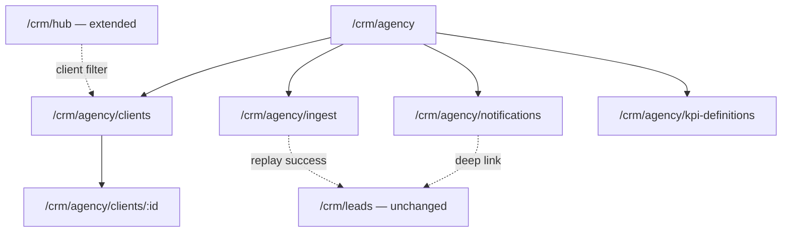
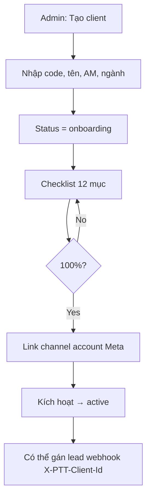
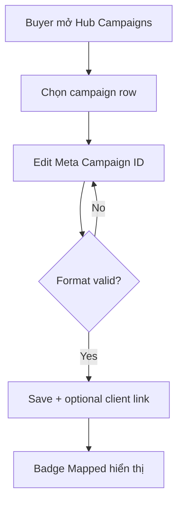
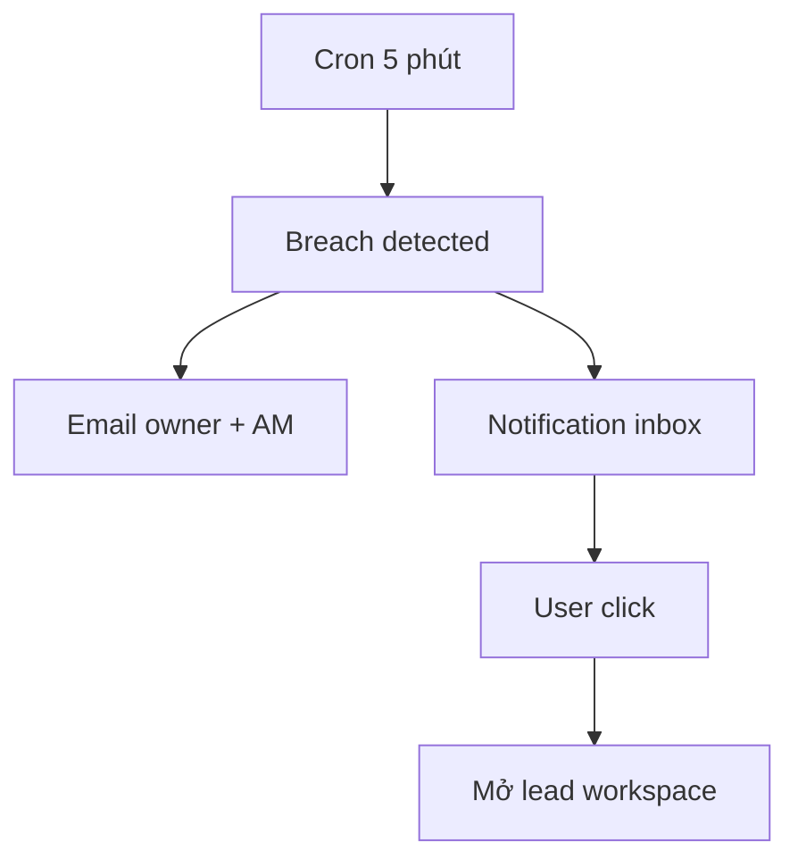

# PTT Agency Platform — UI/UX Specification (Phase 1)

> **Phiên bản:** 1.0 · **Ngày:** 2026-07-17  
> **Phạm vi:** Agency Ops UI trong Flask admin (Phase 1 PRD) — **chưa** Next.js Client Portal  
> **PRD:** [`specs/2026-07-17-prd-phase-1.md`](specs/2026-07-17-prd-phase-1.md)  
> **Kiến trúc:** [`specs/2026-07-17-architecture-phase-1.md`](specs/2026-07-17-architecture-phase-1.md)  
> **Master spec:** [`SPEC_AGENCY_OPERATING_PLATFORM.md`](SPEC_AGENCY_OPERATING_PLATFORM.md)  
> **Design system gốc:** [`SPEC_UI_UX_PTT.md`](SPEC_UI_UX_PTT.md) — **kế thừa tokens, không redesign**

---

## Mục lục

1. [Tổng quan UX Phase 1](#1-tổng-quan-ux-phase-1)
2. [Personas & scenarios](#2-personas--scenarios)
3. [Information Architecture](#3-information-architecture)
4. [User flows](#4-user-flows)
5. [Screen inventory](#5-screen-inventory)
6. [Wireframe mô tả (ASCII)](#6-wireframe-mô-tả-ascii)
7. [Components mới](#7-components-mới)
8. [States & feedback](#8-states--feedback)
9. [Permissions ↔ UI](#9-permissions--ui)
10. [Responsive & accessibility](#10-responsive--accessibility)
11. [Phase 2+ UI preview (out of scope)](#11-phase-2-ui-preview-out-of-scope)
12. [Handoff checklist](#12-handoff-checklist)

---

## 1. Tổng quan UX Phase 1

### 1.1. Mục tiêu UX

| Mục tiêu | Metric UX |
|----------|-----------|
| AM onboard client không cần dev | Checklist guided; <10 clicks to active |
| Buyer map Hub ↔ Meta campaign rõ ràng | 1 field + validation inline |
| Ops thấy pipeline ingest health | Dashboard queue depth + DLQ 1 màn |
| SLA breach không bỏ sót | Inbox + email; badge unread |

### 1.2. Nguyên tắc thiết kế

1. **Extend, don't replace** — giữ admin shell, sidebar, topbar từ `SPEC_UI_UX_PTT.md`.
2. **Same design tokens** — `--primary`, Inter/Manrope, pill buttons, card pattern.
3. **Progressive disclosure** — client detail dùng tabs; checklist collapsible.
4. **Ops-first** — số liệu queue/SLA nổi bật hơn decorative charts Phase 1.
5. **Tiếng Việt** — labels, errors, empty states.

### 1.3. Phạm vi UI

| In scope Phase 1 | Out of scope |
|------------------|--------------|
| Nhóm sidebar **Agency Ops** (Flask) | Client Portal Next.js |
| Client list / detail / checklist | Ads performance dashboard (Meta API) |
| Ingest monitor + DLQ replay | Creative approval workflow UI |
| Hub Meta campaign ID field | Campaign write / budget approve |
| Notification inbox | Full metrics CPL auto charts |
| KPI definitions (read-only) | Mobile app |

---

## 2. Personas & scenarios

| Persona | Scenario Phase 1 | Entry point |
|---------|------------------|-------------|
| **Super Admin** | Tạo client mới, link Meta page, xem job failed | `/crm/agency/clients` |
| **AM** | Hoàn thành onboarding checklist; xem SLA inbox | Client detail, Notifications |
| **Media Buyer** | Gán Meta Campaign ID cho Hub campaign | `/crm/hub` (extend) |
| **CSKH** | Nhận notify SLA; mở lead như cũ | Inbox → `/crm/leads/{id}` |
| **DevOps** | Replay DLQ job | `/crm/agency/ingest` |

---

## 3. Information Architecture

### 3.1. Admin sidebar — thêm nhóm Agency Ops

Vị trí: **sau** `CRM · Marketing`, **trước** `CRM · Kinh doanh`.

```
CRM · Agency Ops                    [data-admin-nav="crm_agency"]
  ├─ Tổng quan vận hành             → /crm/agency
  ├─ Khách hàng (Client)            → /crm/agency/clients
  ├─ Pipeline ingest                → /crm/agency/ingest
  ├─ Thông báo                      → /crm/agency/notifications
  └─ Định nghĩa KPI                 → /crm/agency/kpi-definitions
```

**Hub extension (không route mới):** Tab Campaigns tại `/crm/hub` — thêm cột + modal Meta ID.

### 3.2. Sitemap Phase 1



### 3.3. Navigation rules

| Rule | Behavior |
|------|----------|
| Unread notifications | Badge đỏ trên sidebar item + topbar bell |
| Client status `onboarding` | Badge vàng trên client row |
| DLQ > 0 | Banner đỏ trên `/crm/agency` và `/crm/agency/ingest` |
| Strict onboarding | Nút "Kích hoạt client" disabled until checklist 100% |

---

## 4. User flows

### 4.1. Flow F1 — Onboard client mới



**Checklist 12 mục (default seed):**

1. Hợp đồng ký  
2. Billing / phương thức thanh toán  
3. Business Manager access  
4. Ad account access  
5. Facebook Page access  
6. Pixel / dataset  
7. Client approver contact  
8. Naming convention agreed  
9. UTM template  
10. SLA hours confirmed  
11. Hub contract created  
12. Webhook test lead OK  

### 4.2. Flow F2 — Webhook lead → CRM

```mermaid
flowchart LR
    META[Meta webhook] --> V1[/api/v1/webhooks/meta]
    V1 --> Q[Queue job]
    Q --> W[Worker ingest]
    W --> LEAD[Lead in /crm/leads]
    OPS[Ops: Ingest monitor] --> Q
```

**UX ops:** Ingest monitor hiển thị job realtime; click job → payload summary (masked PII).

### 4.3. Flow F3 — Hub Meta campaign mapping



### 4.4. Flow F4 — SLA breach



---

## 5. Screen inventory

### 5.1. Bảng màn hình Phase 1

| ID | Route | Tên màn | Persona | Priority |
|----|-------|---------|---------|----------|
| **A-01** | `/crm/agency` | Tổng quan vận hành | Admin, AM | P0 |
| **A-02** | `/crm/agency/clients` | Danh sách client | Admin, AM | P0 |
| **A-03** | `/crm/agency/clients/new` | Tạo client | Admin | P0 |
| **A-04** | `/crm/agency/clients/:id` | Chi tiết client | Admin, AM | P0 |
| **A-05** | `/crm/agency/clients/:id/checklist` | Onboarding checklist | AM | P0 |
| **A-06** | `/crm/agency/clients/:id/channels` | Channel accounts | Admin | P0 |
| **A-07** | `/crm/agency/ingest` | Pipeline ingest | Admin, DevOps | P0 |
| **A-08** | `/crm/agency/ingest/jobs/:id` | Job detail + replay | Admin | P0 |
| **A-09** | `/crm/agency/notifications` | Hộp thông báo | All staff | P0 |
| **A-10** | `/crm/agency/kpi-definitions` | Định nghĩa KPI | Admin, AM | P1 |
| **H-01** | `/crm/hub` (extend) | Hub + Meta ID column | Buyer, AM | P0 |

**Templates đề xuất:**

| Screen | Template file |
|--------|---------------|
| A-01 | `templates/crm_agency_dashboard.html` |
| A-02–A-06 | `templates/crm_agency_clients.html`, `crm_agency_client_detail.html` |
| A-07–A-08 | `templates/crm_agency_ingest.html` |
| A-09 | `templates/crm_agency_notifications.html` |
| A-10 | `templates/crm_agency_kpi_definitions.html` |
| H-01 | Extend `templates/crm_hub.html` + `static/crm_hub.js` |

**JS/CSS mới:**

- `static/crm_agency.css`
- `static/crm_agency.js` — polling ingest stats, replay confirm modal

---

## 6. Wireframe mô tả (ASCII)

### A-01 — Tổng quan vận hành (`/crm/agency`)

```
┌─────────────────────────────────────────────────────────────────┐
│ [Topbar]  Agency Ops · Tổng quan          🔔(3)  [User] [Logout]│
├──────────┬──────────────────────────────────────────────────────┤
│ Sidebar  │  ┌─────────┐ ┌─────────┐ ┌─────────┐ ┌─────────┐   │
│ ...      │  │Clients  │ │Jobs pend│ │DLQ dead │ │SLA today│   │
│ Agency ▼ │  │   12    │ │   4     │ │   0 ⚠   │ │   2     │   │
│ · Tổng quan│ └─────────┘ └─────────┘ └─────────┘ └─────────┘   │
│ · Clients│                                                      │
│ · Ingest │  [DLQ banner nếu >0: "2 job cần xử lý → Xem"]       │
│ · Notif  │                                                      │
│          │  Hoạt động gần đây                                    │
│          │  ┌──────────────────────────────────────────────┐  │
│          │  │ 12:01 ingest_lead meta ✓  job-abc            │  │
│          │  │ 11:58 ingest_lead meta ✗  [Replay]           │  │
│          │  │ 11:55 SLA breach lead #1234 → [Mở lead]      │  │
│          │  └──────────────────────────────────────────────┘  │
└──────────┴──────────────────────────────────────────────────────┘
```

### A-02 — Danh sách client

```
┌─────────────────────────────────────────────────────────────────┐
│ Khách hàng (Client)                    [+ Tạo client]           │
│ Filter: [Status ▼] [AM ▼] [Ngành ▼]  Search: [________]        │
├──────┬────────────┬──────────┬─────────┬──────────┬───────────┤
│ Code │ Tên        │ AM       │ Status  │ Channels │ Updated   │
├──────┼────────────┼──────────┼─────────┼──────────┼───────────┤
│ PTT  │ Cty ABC    │ Nguyễn A │ ● active│ Meta     │ 17/07     │
│ XYZ  │ Cty XYZ    │ Trần B   │ ○ onboard│ —       │ 16/07     │
└──────┴────────────┴──────────┴─────────┴──────────┴───────────┘
```

### A-04 — Chi tiết client (tabs)

```
┌─────────────────────────────────────────────────────────────────┐
│ ← Clients    XYZ — Cty XYZ          Status: [onboarding ▼]      │
│ [Tổng quan] [Checklist 8/12] [Kênh ads] [Leads liên kết]       │
├─────────────────────────────────────────────────────────────────┤
│ Checklist tab:                                                  │
│ ☑ Hợp đồng ký        ☑ BM access                               │
│ ☐ Pixel / dataset    ☐ Webhook test OK                         │
│ Progress ████████░░░░ 67%                                       │
│ [Kích hoạt client] (disabled until 100%)                        │
└─────────────────────────────────────────────────────────────────┘
```

### A-07 — Pipeline ingest

```
┌─────────────────────────────────────────────────────────────────┐
│ Pipeline ingest          Auto-refresh: ON (30s)  [Refresh now]  │
│ Tabs: [Pending] [Running] [Failed] [Dead] [Done 24h]            │
├──────┬────────────┬─────────┬──────────┬─────────┬───────────────┤
│ Time │ Type       │ Channel │ Client   │ Status  │ Actions       │
├──────┼────────────┼─────────┼──────────┼─────────┼───────────────┤
│ 12:01│ ingest_lead│ meta    │ PTT      │ dead    │ [Detail][Replay│
└──────┴────────────┴─────────┴──────────┴─────────┴───────────────┘
```

### H-01 — Hub extension (campaign row)

```
Campaign name          Client    Meta Campaign ID        Mapped
─────────────────────────────────────────────────────────────
PTT_LEADS_HCM_...      PTT       [ 120210334455667 ▼ ]   ✓
Summer promo           —         [ ________________ ]    —
                                              [Lưu]
```

### A-09 — Notifications inbox

```
┌─────────────────────────────────────────────────────────────────┐
│ Thông báo                    [Đánh dấu tất cả đã đọc]           │
│ [Tất cả] [SLA] [Ingest] [Hệ thống]                              │
├─────────────────────────────────────────────────────────────────┤
│ ● SLA — Lead #1234 quá hạn liên hệ          5 phút   [Mở lead] │
│ ○ Ingest — Job replay thành công            1 giờ               │
└─────────────────────────────────────────────────────────────────┘
```

---

## 7. Components mới

Kế thừa [`SPEC_UI_UX_PTT.md` §9](SPEC_UI_UX_PTT.md); bổ sung:

| Component | Mô tả | CSS class đề xuất |
|-----------|-------|-------------------|
| **Stat card** | 4-up metrics dashboard | `.agency-stat-card` |
| **Status badge** | client status colors | `.badge-onboarding`, `.badge-active`, `.badge-paused` |
| **Checklist row** | checkbox + label + optional note | `.onboarding-item` |
| **Job row** | table row + status pill | `.job-status-dead`, `.job-status-done` |
| **DLQ banner** | dismissible alert top | `.agency-dlq-banner` |
| **Replay modal** | confirm replay job | `#modal-replay-job` |
| **Meta ID input** | validated numeric string | `.hub-meta-campaign-id` |
| **Notification item** | unread dot + deep link | `.notif-item--unread` |
| **Progress bar** | checklist % | `.onboarding-progress` |
| **Empty state** | no clients / no jobs | `.agency-empty` |

### 7.1. Status badge colors

| Status | Background | Text |
|--------|------------|------|
| `prospect` | `#e8eef0` | `#5c6f63` |
| `onboarding` | `#fef3c7` | `#92400e` |
| `active` | `#dcfce7` | `#166534` |
| `paused` | `#fee2e2` | `#991b1b` |
| `archived` | `#f3f4f6` | `#6b7280` |
| Job `dead` | `#fee2e2` | `#991b1b` |
| Job `done` | `#dcfce7` | `#166534` |

### 7.2. Icons (inline SVG — match admin shell)

- Client: building  
- Ingest: arrows-circle  
- Notification: bell  
- DLQ warning: triangle-alert  
- Mapped: check-circle  

---

## 8. States & feedback

### 8.1. Loading

| Context | Pattern |
|---------|---------|
| Client list | Skeleton rows 5 |
| Ingest table | Spinner + "Đang tải job…" |
| Replay action | Button disabled + spinner |

### 8.2. Empty states

| Màn | Message | CTA |
|-----|---------|-----|
| No clients | "Chưa có khách hàng agency." | [Tạo client đầu tiên] |
| No dead jobs | "Không có job lỗi." | — |
| No notifications | "Bạn đã xem hết thông báo." | — |

### 8.3. Errors

| Error | UX |
|-------|-----|
| Client code duplicate | Inline field error |
| Checklist incomplete activate | Toast + scroll to unchecked |
| Replay failed | Modal error + link Sentry id |
| Meta ID invalid format | Inline validation |

### 8.4. Success toasts

- "Client đã được tạo"  
- "Meta Campaign ID đã lưu"  
- "Job replay đã xếp hàng"  
- "Đã đánh dấu đọc"

---

## 9. Permissions ↔ UI

Section key mới: **`crm_agency`**

| Action | Super Admin | AM | Buyer | CSKH | DevOps-like admin |
|--------|:-----------:|:--:|:-----:|:----:|:-----------------:|
| View agency dashboard | ✓ | ✓ | ✓ | ✓ | ✓ |
| CRUD clients | ✓ | ✓ | — | — | ✓ |
| Activate client | ✓ | ✓ | — | — | ✓ |
| Channel accounts | ✓ | — | ✓ | — | ✓ |
| Ingest monitor | ✓ | — | — | — | ✓ |
| DLQ replay | ✓ | — | — | — | ✓ |
| Hub Meta ID edit | ✓ | ✓ | ✓ | — | — |
| Notifications | ✓ | ✓ | ✓ | ✓ | ✓ |
| KPI definitions | ✓ | read | read | — | ✓ |

**Implementation:** extend `admin_page_permissions.py` — default AM + Admin có `crm_agency` view; write clients admin+AM; ingest admin only.

**Topbar bell:** visible nếu có quyền `crm_agency` view hoặc any staff với notifications.

---

## 10. Responsive & accessibility

### 10.1. Breakpoints (kế thừa SPEC_UI_UX)

| Breakpoint | Agency UI behavior |
|------------|-------------------|
| `<768px` | Stat cards 2×2; table horizontal scroll |
| `≥768px` | Stat cards 4-up |
| Sidebar collapse | Giữ pattern admin mobile |

### 10.2. Accessibility

| Requirement | Implementation |
|-------------|----------------|
| Focus visible | `--focus-ring` on buttons/inputs |
| Table headers | `<th scope="col">` |
| Status not color-only | Text label + badge |
| Modal replay | `role="dialog"`, focus trap |
| Live region | Ingest auto-refresh announces politely (`aria-live="polite"`) |

---

## 11. Phase 2+ UI preview (out of scope)

Thiết kế sớm — **không build Phase 1**:

| Màn hình future | App | Phase |
|-----------------|-----|-------|
| Ads performance dashboard | Next.js Internal | 2 |
| CPL / ROAS charts | Next.js Internal | 2 |
| Client portal home | Next.js Portal | 3 |
| Creative approval board | Next.js Internal | 3 |
| Budget approval inbox | Temporal UI | 3 |
| Multi-client switcher global | Next.js | 2 |

**IA future (reference):**

```
Next.js Internal
├── Dashboard (metrics)
├── Clients (read-rich)
├── Campaigns (synced Meta)
└── Approvals

Client Portal
├── Reports
├── Approvals
└── Support tickets
```

---

## 12. Handoff checklist

### Design → Dev

- [ ] Figma optional; ASCII wireframes §6 approved
- [ ] Tokens từ `SPEC_UI_UX_PTT.md` §6 — no new primary color
- [ ] Screen IDs A-01…A-10 mapped to templates
- [ ] Permission matrix §9 implemented in `admin_page_permissions.py`
- [ ] API contracts: `/api/v1/clients`, `/api/v1/jobs`, `/api/v1/notifications`

### Dev → QA

- [ ] Test: create client → checklist → active
- [ ] Test: webhook → job visible in ingest → lead in list
- [ ] Test: DLQ replay
- [ ] Test: SLA notification → inbox → deep link lead
- [ ] Test: Hub Meta ID save + badge
- [ ] Regression: existing CRM screens unchanged layout
- [ ] Mobile smoke: agency dashboard + client list

### Copy deck (VN)

| Key | Text |
|-----|------|
| `agency.title` | Agency Ops |
| `agency.clients` | Khách hàng (Client) |
| `agency.ingest` | Pipeline ingest |
| `agency.dlq.banner` | Có {n} job lỗi cần xử lý |
| `agency.replay.confirm` | Bạn có chắc replay job này? |
| `agency.onboarding.block` | Hoàn thành checklist trước khi kích hoạt |

---

## Lịch sử

| Version | Date | Change |
|---------|------|--------|
| 1.0 | 2026-07-17 | Initial UI/UX Agency Phase 1 — Flask extension |
