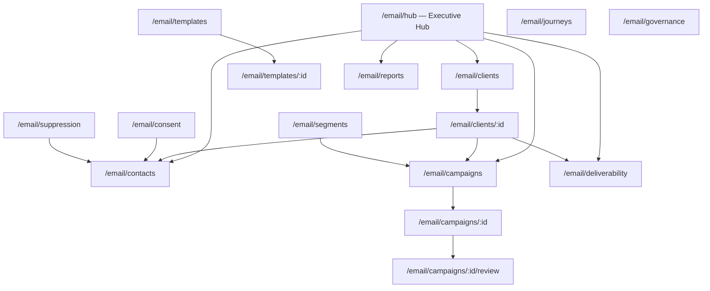
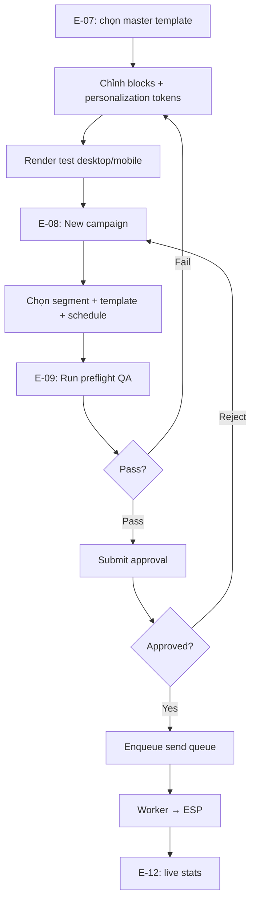
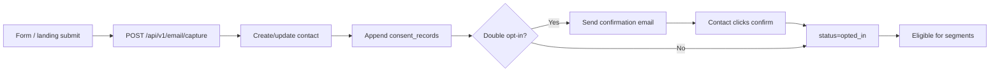
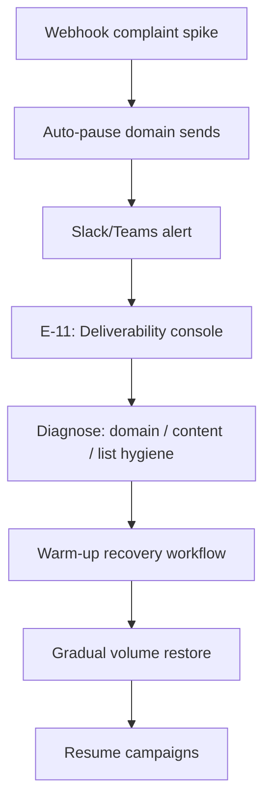
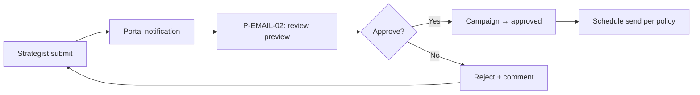
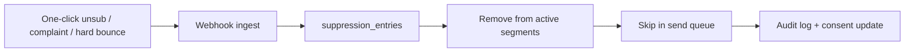

# Email Marketing Enterprise OS — UI/UX Specification

> **Phiên bản:** 1.3 · **Ngày:** 2026-07-20  
> **Phạm vi:** **Next.js ops-web** (`ops.pttads.vn/email/*`) **+** client portal (`portal.pttads.vn/email/*`) **+** public preference pages  
> **Quyết định:** Admin **không dùng Flask** — ops-web + Nest `email-marketing/` (pattern SEO hub Phase 4; ADR-EM-10 v1.3)  
> **Master spec:** [`SPEC_EMAIL_MARKETING_OPERATING_SYSTEM.md`](SPEC_EMAIL_MARKETING_OPERATING_SYSTEM.md) v1.3  
> **Kiến trúc:** [`specs/2026-07-19-email-marketing-architecture.md`](specs/2026-07-19-email-marketing-architecture.md)  
> **Design system gốc:** [`SPEC_UI_UX_PTT.md`](SPEC_UI_UX_PTT.md) — tokens kế thừa · shell = **ops-web** (target Internal Ops)  
> **Pattern tham chiếu:** [`SPEC_UI_UX_SEO_AEO.md`](SPEC_UI_UX_SEO_AEO.md) — wireframes, flows (routes đổi sang `/email/*` trên ops-web)  

---

## Mục lục

1. [Tổng quan UX](#1-tổng-quan-ux)
2. [Personas & scenarios](#2-personas--scenarios)
3. [Information Architecture](#3-information-architecture)
4. [User flows](#4-user-flows)
5. [Screen inventory](#5-screen-inventory)
6. [Wireframe mô tả (ASCII)](#6-wireframe-mô-tả-ascii)
7. [Components](#7-components)
8. [States & feedback](#8-states--feedback)
9. [Permissions ↔ UI](#9-permissions--ui)
10. [Responsive & accessibility](#10-responsive--accessibility)
11. [Phase rollout UI map](#11-phase-rollout-ui-map)
12. [Public & transactional pages](#12-public--transactional-pages)
13. [Handoff checklist](#13-handoff-checklist)

---

## 1. Tổng quan UX

### 1.1. Mục tiêu UX

| Mục tiêu | Metric UX |
|----------|-----------|
| Giảm rủi ro gửi sai | Preflight QA pass trước enqueue — 0 send without approval khi policy bật |
| Consent minh bạch | AM/Compliance tra consent trong ≤ 3 clicks từ contact |
| Deliverability visible | Domain health + complaint rate luôn trên hub / client workspace |
| Campaign cycle nhanh | Template reuse → campaign draft < 15 phút |
| Scale nhiều client | Client switcher + workspace tabs — không lẫn brand |
| Leadership + operator | Hub KPI cards (executive) + dense tables (strategist/deliverability) |
| Enterprise onboarding | Strategist mới hiểu flow trong < 30 phút |

### 1.2. Nguyên tắc thiết kế

1. **Extend, don't replace** — giữ ops-web shell, `OpsNav`, topbar từ `SPEC_UI_UX_PTT.md` (cùng CRM/SEO/Agency)
2. **Same design tokens** — `--primary`, Inter/Manrope, pill buttons, card pattern
3. **Consent-first visibility** — mọi contact/campaign hiển thị consent status + suppression flag
4. **Risk-visible** — deliverability warnings không ẩn trong settings; banner + badge trên hub
5. **Workflow-visible** — campaign status pipeline rõ: draft → approval → scheduled → sending → sent
6. **Modular content** — template studio tách blocks; preview desktop + mobile
7. **Tiếng Việt** — labels, errors, empty states, tooltips (EN cho thuật ngữ kỹ thuật khi cần: SPF, DKIM)
8. **Desktop-first** — enterprise B2B; tablet minimum cho AM review trên tablet

### 1.3. Design system direction

| Thuộc tính | Hướng dẫn |
|------------|-----------|
| Layout | Clean grid, 12-col, dense data tables |
| Hierarchy | Strong typographic scale (h1→caption) |
| Color | Semantic: campaign status, deliverability health, consent state |
| Density | Compact tables, 40px row height |
| Noise | Minimal decoration; metrics > chrome |
| Typography | Inter body, Manrope headings (existing) |
| Email preview | Isolated iframe/card — không phá admin layout |

### 1.4. Phạm vi UI theo phase

| Phase | Screens in scope |
|-------|------------------|
| **0** | E-01 Hub, E-13 Governance (read-only rules) |
| **1** | E-02…E-06, P-EMAIL-PUB-* |
| **2** | E-07 Segments, E-08 Templates, E-09 Campaigns + E-09c Preflight |
| **3** | E-10 Journeys, E-11 Deliverability, E-12 Reports |
| **4** | P-EMAIL-01…03 portal |
| **5** | Gate A prod pilot QA |
| **EM-10** | Schedule send, preflight v2, staff approve (E-09b/E-09c) |

---

## 2. Personas & scenarios

| Persona | Scenario | Entry point |
|---------|----------|-------------|
| **Email CoE Lead** | Review standards, template library, global rules | E-01 Hub → E-13 Governance |
| **Email Strategist** | Tạo segment, campaign, schedule send | E-06, E-08 |
| **Content Designer** | Build template, blocks, render test | E-07 Template Studio |
| **Deliverability Specialist** | Monitor domain, warm-up, pause send | E-11 Deliverability |
| **Compliance Reviewer** | Audit consent, approve high-risk send | E-04, E-09, approval modal |
| **Account Manager** | Client health, send calendar, reports | E-02 Workspace, E-12 |
| **Admin** | ESP credentials, domain DNS setup | E-02 Settings tab |
| **Client Approver** | Duyệt campaign trước send | Portal P-EMAIL-02 |
| **Client Viewer** | Xem performance, revenue proxy | Portal P-EMAIL-01 |
| **End subscriber** | Update preferences, unsubscribe | Public P-EMAIL-PUB-01 |

---

## 3. Information Architecture

### 3.1. Global navigation (ops-web `OpsNav`)

Host admin: **`ops.pttads.vn`** · App: `services/ops-web/src/app/email/*` · Nav: `OpsNav.tsx` (cap `crm_email_mkt:view`)

Vị trí link: **sau** SEO hub, **cùng nhóm** Agency/CRM ops.

```
Email hub          → /email/hub
Email clients      → /email/clients
Contacts           → /email/contacts
Consent            → /email/consent
Suppression        → /email/suppression
Email gov          → /email/governance
```

Auth: staff JWT (`/api/v1/staff/auth/*`) + Nest `StaffRbacGuard` — caps `crm_email_mkt_*` trong PG `staff_section_permissions` (stub: `staff-auth.service.ts` local dev).

Route base client workspace: `/email/clients/:client_id`

```
[Tổng quan] [Danh bạ] [Consent] [Phân khúc] [Chiến dịch] [Deliverability] [Báo cáo] [Cài đặt]
```

Context bar luôn hiển thị:

**Client name · Sending domain · ESP · Daily cap · Owner AM · Consent mode (single/double opt-in)**

### 3.3. Sitemap



### 3.4. Navigation rules & badges

| Rule | Behavior |
|------|----------|
| Client chưa cấu hình ESP/domain | Banner vàng trên client workspace + disable [Schedule send] |
| Domain auth fail (SPF/DKIM/DMARC) | Badge đỏ sidebar Deliverability + tab Deliverability |
| Complaint rate > threshold | Banner đỏ hub + auto-pause indicator trên campaigns |
| Campaign pending approval | Badge cam sidebar Chiến dịch + hub widget |
| Send queue lag > 5 min | Banner trên hub |
| Suppression conflict (audience ∩ suppression) | Block preflight; highlight count excluded |
| Consent gap (segment có contact thiếu consent) | Warning vàng trên campaign detail |

---

## 4. User flows

### 4.1. Flow F1 — Template → Campaign → Send



### 4.2. Flow F2 — Contact capture → Consent



### 4.3. Flow F3 — Deliverability incident



### 4.4. Flow F4 — Client approval (portal)



### 4.5. Flow F5 — Suppression & unsubscribe



---

## 5. Screen inventory

### 5.1. Internal ops screens (ops-web)

Host: **`ops.pttads.vn`**

| ID | Route | Tên màn | Persona | Phase | Priority | Trạng thái |
|----|-------|---------|---------|-------|----------|------------|
| **E-01** | `/email/hub` (alias `/email`) | Email Ops Hub | CoE, AM, Head | 0 | P0 | ✅ Done |
| **E-02** | `/email/clients` | Danh sách client Email | AM, Admin | 1 | P0 | ✅ Done |
| **E-03** | `/email/clients/:id` | Client workspace (tabs) | All email team | 1 | P0 | ✅ Done |
| **E-04** | `/email/contacts` | Danh bạ contacts | Strategist, AM | 1 | P0 | ✅ Done |
| **E-05** | `/email/consent` | Consent registry | Compliance, AM | 1 | P0 | ✅ Done |
| **E-06** | `/email/suppression` | Suppression master | Compliance, Deliverability | 1 | P0 | ✅ Done |
| **E-07** | `/email/segments` | Segment builder | Strategist | 2 | P0 | 🟡 Partial (RFM Phase 3) |
| **E-08** | `/email/templates` | Template studio | Designer, Strategist | 2 | P0 | 🟡 Partial |
| **E-08b** | `/email/templates/:id` | Template editor | Designer | 2 | P0 | 🟡 Partial |
| **E-09** | `/email/campaigns` | Campaign console | Strategist | 2 | P0 | ✅ Done |
| **E-09b** | `/email/campaigns/:id` | Campaign detail | Strategist | 2 | P0 | 🟡 EM-10 schedule UI |
| **E-09c** | `/email/campaigns/:id/review` | Preflight QA | Strategist, Compliance | 2 | P0 | 🟡 EM-10 preflight v2 + approve |
| **E-10** | `/email/journeys` | Journey builder | Strategist | 3 | P1 | ✅ CRUD + activate |
| **E-10b** | `/email/journeys/:id` | Journey canvas editor | Strategist | 3 | P1 | ✅ Editable graph (EM-12) |
| **E-11** | `/email/deliverability` | Deliverability console | Deliverability | 3 | P0 | ✅ Done |
| **E-12** | `/email/reports` | Analytics center | Analyst, AM | 3 | P1 | ✅ Done |
| **E-13** | `/email/governance` | Governance hub | CoE, Compliance | 0→1 | P1 | 🟡 Read-only |

### 5.2. Client portal screens (Next.js)

| ID | Route | Tên màn | Persona | Phase | Priority | Trạng thái |
|----|-------|---------|---------|-------|----------|------------|
| **P-EMAIL-01** | `/email` | Client email dashboard | Client viewer | 4 | P0 | ✅ Done |
| **P-EMAIL-02** | `/email/approvals` | Approval inbox | Client approver | 4 | P0 | ✅ Done (+ preview EM-9) |
| **P-EMAIL-03** | `/email/campaigns/:id` | Campaign performance | Client viewer | 4 | P1 | ✅ Done |

Flag: `PTT_EMAIL_PORTAL_ENABLED=1`

### 5.3. Public pages

| ID | Route | Tên màn | Persona | Phase | Trạng thái |
|----|-------|---------|---------|-------|------------|
| **P-EMAIL-PUB-01** | `/email/preferences/:token` | Preference center | Subscriber | 1 | ✅ Done |
| **P-EMAIL-PUB-02** | `/email/unsubscribe/:token` | One-click unsubscribe | Subscriber | 1 | ✅ Done |
| **P-EMAIL-PUB-03** | `/email/confirm/:token` | Double opt-in confirm | Subscriber | 1 | ✅ Done |

Public pages: **standalone minimal layout** — không admin shell; brand logo client optional.

### 5.4. Source files (target)

| Screen | Next.js page | Components / lib |
|--------|--------------|------------------|
| E-01 | `ops-web/src/app/email/page.tsx` | `EmailHubPanel.tsx`, `email-charts.tsx` |
| E-02–E-03 | `ops-web/src/app/email/clients/` | `EmailClientWorkspace.tsx` |
| E-04 | `ops-web/src/app/email/contacts/page.tsx` | `EmailContactsTable.tsx` |
| E-05–E-06 | `ops-web/src/app/email/consent/`, `suppression/` | shared tables |
| E-07–E-08b | `ops-web/src/app/email/segments/`, `templates/` | `SegmentBuilder.tsx`, `TemplateStudio.tsx` |
| E-09–E-09c | `ops-web/src/app/email/campaigns/` | `CampaignConsole.tsx`, `PreflightChecklist.tsx` |
| E-10–E-10b | `ops-web/src/app/email/journeys/` | `JourneyCanvas.tsx`, `JourneyCanvasEditor.tsx` |
| E-09 experiment | `ops-web/src/app/email/campaigns/[id]/` | `CampaignExperimentPanel.tsx` |
| E-11 | `ops-web/src/app/email/deliverability/page.tsx` | `DeliverabilityConsole.tsx` |
| E-12 | `ops-web/src/app/email/reports/page.tsx` | `EmailReportsPanel.tsx` |
| E-13 | `ops-web/src/app/email/governance/page.tsx` | `EmailGovernanceHub.tsx` |
| P-EMAIL-01 | `portal-web/src/app/email/page.tsx` | `EmailWidgetsPanel.tsx` |
| P-EMAIL-02 | `portal-web/src/app/email/approvals/page.tsx` | — |
| P-EMAIL-PUB-01 | `ops-web/src/app/email/public/preferences/[token]/page.tsx` | minimal public layout |

**API client:** `ops-web/src/lib/email-api.ts` → Nest `GET/POST /api/v1/email/*`  
**Không tạo:** `templates/crm_email_*.html`, `blueprints/email_marketing.py`

---

## 6. Wireframe mô tả (ASCII)

### E-01 — Email Ops Hub (`/email`)

```
┌─────────────────────────────────────────────────────────────────────────┐
│ [Topbar]  Email Marketing · Tổng quan            🔔(3)  [User] [Logout]  │
├──────────┬──────────────────────────────────────────────────────────────┤
│ Sidebar  │  Filter: [Tháng ▼] [Client ▼] [Domain ▼]                    │
│ ...      │  ┌──────────┐ ┌──────────┐ ┌──────────┐ ┌──────────┐       │
│ Email ▼  │  │Emails sent│ │Open rate │ │Complaint │ │Revenue   │       │
│ · Tổng quan│ │  124,500  │ │  24.2%   │ │  0.04% ✓ │ │ attrib.  │       │
│ · Clients│  └──────────┘ └──────────┘ └──────────┘ └──────────┘       │
│ · ...    │                                                              │
│          │  ⚠ Domain news.client.com — DMARC fail          [Fix → E-11] │
│          │  ┌─ Send calendar (7d) ──────┐ ┌─ Pending approvals ──────┐ │
│          │  │ Mon: ABC newsletter       │ │ ABC Corp — Black Friday  │ │
│          │  │ Wed: XYZ nurture #3       │ │ XYZ Ltd  — Product launch│ │
│          │  └───────────────────────────┘ └──────────────────────────┘ │
│          │  ┌─ Client email health ──────────────────────────────────┐ │
│          │  │ Client      Domain status  Complaint  Last send  [→]  │ │
│          │  │ ABC Corp    ● Healthy      0.02%     2d ago           │ │
│          │  │ XYZ Ltd     ○ At risk      0.12% ⚠   5d ago           │ │
│          │  └──────────────────────────────────────────────────────┘ │
│          │  ┌─ Deliverability alerts ────────────────────────────────┐ │
│          │  │ 🔴 Complaint spike — xyz.com — 15 min ago    [View]  │ │
│          │  └──────────────────────────────────────────────────────┘ │
└──────────┴──────────────────────────────────────────────────────────────┘
```

### E-03 — Client workspace (`/email/clients/:id`)

```
┌─────────────────────────────────────────────────────────────────────────┐
│ ← Clients   ABC Corp · mail.abccorp.com · SendGrid · AM: Nguyễn A      │
│ [Tổng quan] [Danh bạ] [Consent] [Phân khúc] [Chiến dịch] [Deliverability] [Báo cáo] [Cài đặt] │
├─────────────────────────────────────────────────────────────────────────┤
│ Tab Tổng quan:                                                          │
│ ┌─ Workspace KPI ─────────────────────────────────────────────────────┐ │
│ │ Subscribers: 12,400 │ Opt-in rate: 94% │ Suppressed: 218 │ Sends/mo │ │
│ └─────────────────────────────────────────────────────────────────────┘ │
│ Recent campaigns table · Upcoming scheduled · Domain auth summary       │
│ Tab Cài đặt: ESP ref · from/reply · daily cap · frequency cap · TZ     │
└─────────────────────────────────────────────────────────────────────────┘
```

### E-07 — Segment builder (`/email/segments`)

```
┌─────────────────────────────────────────────────────────────────────────┐
│ Phân khúc                  Client: [ABC Corp ▼]   [+ Tạo phân khúc]     │
├─────────────────────────────────────────────────────────────────────────┤
│ ┌─ Segment list ──────────────┐  ┌─ Builder (dynamic) ────────────────┐ │
│ │ ☑ Active buyers    2,104    │  │ Type: [Dynamic ▼]                 │ │
│ │ ○ Lapsed 90d         890    │  │ Rules:                            │ │
│ │ ○ Newsletter all    11,200   │  │ [Lifecycle = customer] AND        │ │
│ │                              │  │ [Last open < 30 days]             │ │
│ │ [Compute now] [Duplicate]    │  │ Preview: 2,104 contacts         │ │
│ └──────────────────────────────┘  │ Excluded by suppression: 12       │ │
│                                    │ Excluded by consent: 8            │ │
│                                    └───────────────────────────────────┘ │
└─────────────────────────────────────────────────────────────────────────┘
```

Tabs builder: `[Rules]` `[Static upload]` `[Lifecycle]` `[RFM]` (Phase 3).

### E-08b — Template studio (`/email/templates/:id`)

```
┌─────────────────────────────────────────────────────────────────────────┐
│ ← Mẫu email   "Newsletter Master v3"     [Lưu] [Preflight] [Duplicate]  │
├───────────────────────────────┬─────────────────────────────────────────┤
│ [Blocks] [HTML] [Text] [Vars] │ Preview                                 │
│                               │ ┌─ Desktop ─────────┐ ┌─ Mobile ──────┐ │
│ Block library:                │ │ [iframe preview]  │ │ [320px frame] │ │
│ · Header                      │ │                   │ │               │ │
│ · Hero                        │ └───────────────────┘ └───────────────┘ │
│ · Product grid                │ Personalization: {{first_name}}, {{...}}│
│ · CTA                         │ Locale: [vi-VN ▼]                       │
│ · Footer + unsub              │                                         │
├───────────────────────────────┴─────────────────────────────────────────┤
│ Render test: [Send test to...]  Last preflight: ✓ Pass (2h ago)         │
└─────────────────────────────────────────────────────────────────────────┘
```

### E-09 — Campaign console (`/email/campaigns`)

```
┌─────────────────────────────────────────────────────────────────────────┐
│ Chiến dịch                 Client: [All ▼]   [+ Chiến dịch mới]         │
│ Tabs: [All] [Draft] [Pending approval] [Scheduled] [Sending] [Sent]     │
├──────────────┬──────────┬──────────┬──────────┬──────────┬──────────────┤
│ Campaign     │ Segment  │ Status   │ Scheduled│ Audience │ Actions      │
├──────────────┼──────────┼──────────┼──────────┼──────────┼──────────────┤
│ Black Friday │ Active   │ Pending  │ 25/11    │ 8,420    │ [Review]     │
│ Welcome #1   │ New subs │ Sending  │ —        │ 142/h    │ [Pause]      │
└──────────────┴──────────┴──────────┴──────────┴──────────┴──────────────┘
```

Status chips dùng `.email-status-*` (§7.1).

### E-09c — Preflight QA (`/email/campaigns/:id/review`)

```
┌─────────────────────────────────────────────────────────────────────────┐
│ Preflight — "Black Friday 2026"              Status: Pending approval   │
├─────────────────────────────────────────────────────────────────────────┤
│ ┌─ Checklist ─────────────────────────────────────────────────────────┐ │
│ │ ✓ Unsubscribe link present                                          │ │
│ │ ✓ List-Unsubscribe header                                           │ │
│ │ ✓ From domain authenticated (SPF/DKIM)                            │ │
│ │ ✓ No broken links (12/12 OK)                                        │ │
│ │ ⚠ Personalization fallback missing for 3 tokens                     │ │
│ │ ✓ Audience eligibility: 8,408 send / 12 excluded / 8 no consent   │ │
│ └─────────────────────────────────────────────────────────────────────┘ │
│ ┌─ Approval timeline ─────────────────────────────────────────────────┐ │
│ │ ✓ Strategist  ○ Compliance  ○ Client approver                       │ │
│ └─────────────────────────────────────────────────────────────────────┘ │
│ Side-by-side: [Email preview] [Audience sample 10 rows]                 │
├─────────────────────────────────────────────────────────────────────────┤
│ [Quay lại] [Request changes] [Submit approval] [Schedule after approve] │
└─────────────────────────────────────────────────────────────────────────┘
```

Block [Schedule send] nếu checklist có item `critical` fail.

### E-11 — Deliverability console (`/email/deliverability`)

```
┌─────────────────────────────────────────────────────────────────────────┐
│ Deliverability             Client: [ABC Corp ▼]   [Verify DNS] [Warm-up]│
│ ┌─ Domain health ─────────────────────────────────────────────────────┐ │
│ │ mail.abccorp.com  SPF ✓  DKIM ✓  DMARC ⚠ align   Warm-up: Stage 3  │ │
│ └─────────────────────────────────────────────────────────────────────┘ │
│ ┌─ Rates (30d) ─────┐ ┌─ Bounce breakdown ──┐ ┌─ Complaint trend ────┐ │
│ │ Delivery 98.2%    │ │ Hard 0.3% Soft 1.2% │ │ [sparkline chart]    │ │
│ └───────────────────┘ └─────────────────────┘ └──────────────────────┘ │
│ Recent bounces / complaints table · Blacklist check · IP pool status    │
│ [Pause all sends for domain] [Open incident runbook]                    │
└─────────────────────────────────────────────────────────────────────────┘
```

### E-12 — Analytics center (`/email/reports`)

```
┌─────────────────────────────────────────────────────────────────────────┐
│ Báo cáo Email              Dashboard: [Campaign ▼]  Client: [ABC ▼]     │
│ [Export PDF] [Export CSV] [Export → ClickHouse]                         │
├─────────────────────────────────────────────────────────────────────────┤
│ KPI cards: Sent · Delivered · Open · Click · Unsub · Revenue attrib.    │
│ Campaign comparison bar chart · Engagement sparkline (28d)              │
│ Deliverability scorecard panel · Scheduled client report config         │
└─────────────────────────────────────────────────────────────────────────┘
```

Pattern charts: `ops-web/src/lib/email-charts.tsx` (clone pattern SEO hub charts).

### E-13 — Governance hub (`/email/governance`)

```
┌─────────────────────────────────────────────────────────────────────────┐
│ Quản trị Email             Scope: [Global ▼] [Brand ▼] [Market ▼]       │
│ Tabs: [Rules] [Approval policies] [Audit log] [CoE templates]           │
├─────────────────────────────────────────────────────────────────────────┤
│ Global rules table: frequency cap, quiet hours, approval thresholds       │
│ Audit log: actor · action · entity · timestamp · diff                   │
│ Link: SOP / runbook deliverability incident                             │
└─────────────────────────────────────────────────────────────────────────┘
```

### P-EMAIL-02 — Portal approval inbox

```
┌─────────────────────────────────────────────────────────────────────────┐
│ [Portal header]  Email · Chờ duyệt                                        │
├─────────────────────────────────────────────────────────────────────────┤
│ ┌─ Black Friday Newsletter ────────────────────────────────────────────┐ │
│ │ Scheduled: 25/11 09:00 · Audience: 8,408 · From: news@abccorp.com    │ │
│ │ [Preview email] [View audience summary]                              │ │
│ │ [Từ chối + ghi chú]                              [Phê duyệt gửi]   │ │
│ └──────────────────────────────────────────────────────────────────────┘ │
└─────────────────────────────────────────────────────────────────────────┘
```

---

## 7. Components

Kế thừa [`SPEC_UI_UX_PTT.md` §9](SPEC_UI_UX_PTT.md) và [`SPEC_UI_UX_SEO_AEO.md` §7](SPEC_UI_UX_SEO_AEO.md); bổ sung email-specific:

| Component | Mô tả | CSS class |
|-----------|-------|-----------|
| **Email KPI card** | Sent, open rate, complaint, revenue | `.email-kpi-card` |
| **Deliverability health dot** | green/yellow/red per domain | `.email-health-*` |
| **Campaign status badge** | draft → sent pipeline | `.email-status-*` |
| **Consent badge** | opted_in / opted_out / pending | `.email-consent-*` |
| **Suppression flag** | inline on contact row | `.email-suppressed` |
| **Segment preview panel** | count + exclusion breakdown | `.email-segment-preview` |
| **Template block library** | draggable blocks list | `.email-block-list` |
| **Email preview frame** | desktop/mobile iframe | `.email-preview-frame` |
| **Preflight checklist** | pass/warn/fail rows | `.email-preflight-*` |
| **Approval timeline** | horizontal steps | `.email-approval-timeline` |
| **Send queue progress** | sending campaign progress bar | `.email-send-progress` |
| **Domain auth row** | SPF/DKIM/DMARC icons | `.email-dns-status` |
| **Warm-up stage meter** | stage 0–5 | `.email-warmup-meter` |
| **Engagement sparkline** | 28d open/click | `.email-sparkline` |
| **Filter bar** | client, date, status | `.email-filter-bar` |
| **Empty state** | contextual CTA | `.email-empty` |
| **Alert banner** | deliverability / consent | `.email-alert-banner` |
| **Journey canvas node** | trigger / wait / send / branch | `.email-journey-node` |

### 7.1. Semantic colors

#### Campaign status

| Status | Background | Text |
|--------|------------|------|
| `draft` | `#f3f4f6` | `#6b7280` |
| `pending_approval` | `#fef3c7` | `#92400e` |
| `approved`, `scheduled` | `#dbeafe` | `#1e40af` |
| `sending` | `#ede9fe` | `#5b21b6` |
| `sent` | `#dcfce7` | `#166534` |
| `paused` | `#ffedd5` | `#c2410c` |
| `cancelled`, `failed` | `#fee2e2` | `#991b1b` |

#### Consent status

| Status | Background | Text |
|--------|------------|------|
| `opted_in` | `#dcfce7` | `#166534` |
| `pending_confirm` | `#fef3c7` | `#92400e` |
| `opted_out` | `#fee2e2` | `#991b1b` |

#### Deliverability health

| Health | Dot color | Use |
|--------|-----------|-----|
| Healthy | `#16a34a` | complaint < 0.05%, auth OK |
| At risk | `#ca8a04` | complaint 0.05–0.1% or DMARC warn |
| Critical | `#dc2626` | complaint > 0.1%, blacklist, auth fail |

#### Preflight check result

| Result | Icon/color |
|--------|------------|
| Pass | `#166534` ✓ |
| Warning | `#92400e` ⚠ |
| Fail | `#991b1b` ✗ — blocks send |

### 7.2. Icons (inline SVG — match admin shell)

- Hub: mail  
- Contacts: users  
- Consent: shield-check  
- Suppression: ban  
- Segments: filter  
- Templates: layout-template  
- Campaigns: send  
- Journeys: git-branch  
- Deliverability: activity  
- Reports: bar-chart-2  
- Governance: clipboard-list  
- Preview: eye  
- Domain: globe  
- Alert: triangle-alert  

---

## 8. States & feedback

### 8.1. Loading

| Context | Pattern |
|---------|---------|
| Hub KPI cards | Skeleton 4-up |
| Contacts table | Skeleton rows 15 |
| Segment compute | Progress "Đang tính 1,204 / 12,400…" |
| Preflight run | Spinner + checklist items animate |
| Campaign sending | Live progress bar + sent count |
| DNS verify | Button disabled + "Đang kiểm tra DNS…" |
| Report export | Button disabled + spinner |

### 8.2. Empty states

| Màn | Message | CTA |
|-----|---------|-----|
| No email clients | "Chưa có workspace Email cho client nào." | [Thêm workspace] |
| No contacts | "Chưa có contact. Import từ CRM hoặc form capture." | [Import CSV] [Sync CRM] |
| No consent records | "Chưa ghi nhận consent." | [Xem form capture] |
| No segments | "Chưa có phân khúc." | [+ Tạo phân khúc] |
| No templates | "Chưa có mẫu email." | [+ Tạo từ CoE library] |
| No campaigns | "Chưa có chiến dịch." | [+ Chiến dịch mới] |
| No deliverability data | "Chưa cấu hình domain gửi." | [Cài đặt domain →] |
| Portal no approvals | "Không có chiến dịch chờ duyệt." | — |

### 8.3. Errors

| Error | UX |
|-------|-----|
| Send blocked — suppression | Modal: "{n} contacts bị loại do suppression" + link E-06 |
| Send blocked — no consent | Modal + highlight contacts thiếu consent |
| Preflight fail — missing unsub | Block approve; scroll to fail row |
| ESP API error | Toast + retry; campaign → `failed` if unrecoverable |
| Domain not authenticated | Banner persistent on campaign detail |
| Approval rejected | Toast + comment visible on timeline |
| Import CSV invalid | Inline row errors + download error report |
| Frequency cap exceeded | Warning on schedule picker + suggest date |

### 8.4. Success toasts

- "Workspace Email đã lưu"  
- "Phân khúc đã tính — 2,104 contacts"  
- "Mẫu email đã lưu"  
- "Chiến dịch đã gửi duyệt"  
- "Chiến dịch đã lên lịch — 25/11 09:00"  
- "DNS xác thực thành công"  
- "Contact đã thêm vào suppression"  
- "Báo cáo đã xuất PDF"

### 8.5. Destructive confirmations

| Action | Confirm copy |
|--------|----------------|
| Pause sending campaign | "Tạm dừng gửi? Email đang queue sẽ bị hủy." |
| Pause all domain sends | "Tạm dừng mọi gửi từ domain {domain}? (Incident mode)" |
| Delete segment | "Xóa phân khúc? Campaign đang dùng sẽ bị ảnh hưởng." |
| Manual suppression remove | "Gỡ suppression? Chỉ Compliance/Admin." |
| Override governance block | "Ghi audit — lý do bắt buộc" + textarea |

---

## 9. Permissions ↔ UI

> **Implemented (target):** PG `staff_section_permissions` + Nest guards (`StaffEmailViewGuard`, …) + ops-web `hasCap()` / `OpsNav`.

### 9.1. Section keys

| Key | Mô tả | UI surfaces gated |
|-----|-------|-------------------|
| `crm_email_mkt` | View module, hub, read-only | Sidebar nav, hub, client overview |
| `crm_email_mkt_write` | Segments, templates, campaigns CRUD | E-07–E-09 create/edit |
| `crm_email_mkt_approve` | Approve send, schedule after approval | E-09c approve, [Schedule send] |
| `crm_email_mkt_deliverability` | Domain/IP, warm-up, pause sends | E-11 all write actions |
| `crm_email_mkt_settings` | Workspace, ESP credentials | E-03 Settings tab |
| `crm_email_mkt_reports` | Export reports, BI | E-12 export buttons |
| `crm_email_mkt_compliance` | Consent, suppression write | E-05, E-06, manual suppress remove |

### 9.2. Default position grants

| Position | Email keys |
|----------|------------|
| **MKT-EM-01** (Head Email) | All 7 keys |
| **MKT-EM-02** (Strategist) | `crm_email_mkt` + `write` + `reports` |
| **MKT-EM-03** (Deliverability) | `crm_email_mkt` + `deliverability` + `settings` |
| **KD-01** (AM) | `crm_email_mkt` view + `settings` + `reports` |
| **Compliance** | `crm_email_mkt` + `compliance` + `approve` |

### 9.3. Action matrix (persona)

| Action | Super Admin | Head Email | Strategist | Designer | Deliverability | Compliance | AM | Client |
|--------|:-----------:|:----------:|:----------:|:--------:|:--------------:|:----------:|:--:|:------:|
| View hub | ✓ | ✓ | ✓ | ✓ | ✓ | ✓ | ✓ | — |
| Workspace settings | ✓ | ✓ | — | — | ✓ | — | ✓ | — |
| Contacts view | ✓ | ✓ | ✓ | — | ✓ | ✓ | ✓ | — |
| Consent/suppression write | ✓ | ✓ | — | — | ✓ | ✓ | read | — |
| Segment/template CRUD | ✓ | ✓ | ✓ | ✓ | — | — | read | — |
| Campaign create | ✓ | ✓ | ✓ | — | — | — | — | — |
| Approve send | ✓ | ✓ | —* | — | — | ✓ | — | portal |
| Pause domain sends | ✓ | ✓ | — | — | ✓ | — | — | — |
| Deliverability DNS | ✓ | ✓ | read | — | ✓ | read | read | — |
| Export reports | ✓ | ✓ | ✓ | — | ✓ | ✓ | ✓ | portal |
| Governance override | ✓ | ✓ | — | — | — | ✓ | — | — |

\*Strategist chỉ approve nếu được gán `crm_email_mkt_approve`.

### 9.4. Template flags

Hub và campaign detail inject từ `useStaffCaps()`:

- `can_email_write`, `can_email_approve`, `can_email_configure`, `can_email_export`, `can_email_deliverability`, `can_email_compliance`

**Client portal (Phase 4):** approval inbox + read-only reports (`PTT_EMAIL_PORTAL_ENABLED`) — portal JWT, tách staff auth.

---

## 10. Responsive & accessibility

### 10.1. Breakpoints

| Breakpoint | Email UI behavior |
|------------|---------------------|
| `<768px` | KPI cards 2×2; campaign table → card list; journey canvas hidden → list |
| `768–1024px` | KPI 4-up; template preview stacked (editor above preview) |
| `≥1024px` | Full split pane template editor; journey canvas visible |
| `≥1440px` | Campaign detail: preview + stats side-by-side |

### 10.2. Accessibility

| Requirement | Implementation | Priority |
|-------------|----------------|----------|
| Focus visible | `--focus-ring` on all interactive | P0 |
| Table headers | `<th scope="col">` | P0 |
| Status not color-only | Text label + badge | P0 |
| Preflight checklist | `aria-checked` per row | P1 |
| Send progress | `aria-live="polite"` on sending campaigns | P1 |
| Email preview iframe | `title="Xem trước email"` | P0 |
| Modals (approve/reject) | `role="dialog"`, focus trap | P0 |
| Charts | Data table fallback (`<details>`) | P1 |
| Public preference center | Form labels, error association | P0 |
| One-click unsub | Single primary action, confirm optional per policy | P0 |

A11y helper: `ops-web/src/lib/email-a11y.ts` (focus trap, dialog — pattern portal SEO).

---

## 11. Phase rollout UI map

| Phase | Screens enabled | OpsNav links (cap `crm_email_mkt:view`) |
|-------|-----------------|---------------|
| **0** | E-01 hub skeleton, E-13 governance read-only | Email hub, Email gov |
| **1** | + E-02…E-06, P-EMAIL-PUB-* | + Email clients, Contacts, Consent, Suppress |
| **2** | + E-07, E-08, E-09 (+ preflight) | + Phân khúc, Mẫu, Chiến dịch |
| **3** | + E-10, E-11, E-12 | + Hành trình, Deliverability, Báo cáo |
| **4** | + P-EMAIL-01…03 portal | Portal nav |
| **5 Gate A** | Prod pilot QA + E2E | Feature flags prod |

**Feature flags:**

| Flag | UI effect |
|------|-----------|
| `PTT_EMAIL_ENABLED=0` | Hide Email links in `OpsNav` |
| `PTT_EMAIL_SEND_ENABLED=0` | Hide [Schedule send], [Submit approval] |
| `PTT_EMAIL_JOURNEYS_ENABLED=0` | Hide Hành trình nav + E-10 |
| `PTT_EMAIL_PORTAL_ENABLED=0` | Hide portal `/email/*` |

---

## 12. Public & transactional pages

### 12.1. Preference center (P-EMAIL-PUB-01)

**Layout:** Minimal — logo client (optional), white background, max-width 480px.

**Fields:**

- Email (read-only)
- Topic toggles: Marketing, Product updates, Events, …
- Frequency: Weekly / Monthly
- [Lưu tùy chọn]
- Link: [Hủy đăng ký tất cả]

**States:** success message "Đã cập nhật tùy chọn"; token expired → "Liên kết không còn hiệu lực."

### 12.2. One-click unsubscribe (P-EMAIL-PUB-02)

- Single screen: "Bạn đã hủy đăng ký thành công."
- Optional: "Cho chúng tôi biết lý do" (dropdown, không bắt buộc)
- No admin chrome; mobile-first

### 12.3. Double opt-in confirm (P-EMAIL-PUB-03)

- "Xác nhận đăng ký nhận email từ {brand}"
- [Xác nhận] → success → redirect to client site optional

### 12.4. Transactional emails (system — not campaign UI)

| Email | Trigger | Template |
|-------|---------|----------|
| Double opt-in confirm | Form capture | System transactional |
| Approval request | Campaign submit | Notify client approver |
| Deliverability alert | Complaint spike | Internal Slack + optional email |
| Scheduled report | Cron | Pattern SEO `report_schedule` |

---

## 13. Handoff checklist

### Design → Dev

- [x] Wireframes §6 approved (baseline)
- [x] Tokens từ `SPEC_UI_UX_PTT.md` §6 — no new primary color
- [x] Screen IDs E-01…E-13 mapped to `ops-web/src/app/email/**/page.tsx`
- [ ] Permission matrix §9 in PG `staff_section_permissions` + Nest guards (stub dev OK)
- [x] API contracts per architecture spec §7
- [x] Campaign status enum matches `email_mkt.campaigns.status`
- [x] Consent/suppression badges on contact components
- [x] Public pages isolated from admin shell CSS

### Dev → QA

- [ ] Test: create workspace → visible on hub client health
- [ ] Test: import contacts → consent filter works
- [ ] Test: segment compute → exclusion counts match suppression
- [x] Test: template preflight → block send on missing unsub (EM-10: + broken links)
- [ ] Test: full approval → enqueue → webhook open/click
- [ ] Test: hard bounce → auto suppression → skipped on next send
- [ ] Test: complaint spike → domain pause banner
- [ ] Test: RBAC — strategist cannot approve without key
- [ ] Test: portal approver approve/reject flow
- [ ] Test: preference center token update
- [ ] Test: one-click unsub → suppression within SLA
- [x] Test: schedule send → status scheduled → due runner enqueue (EM-10)
- [ ] Mobile smoke: hub + public preference page
- [x] a11y: preflight checklist keyboard nav (Wave 3b portal modal)

### Copy deck (VN)

| Key | Text |
|-----|------|
| `email.title` | Email Marketing |
| `email.overview` | Tổng quan |
| `email.clients` | Khách hàng Email |
| `email.contacts` | Danh bạ |
| `email.consent` | Consent & tuân thủ |
| `email.suppression` | Suppression |
| `email.segments` | Phân khúc |
| `email.templates` | Mẫu email |
| `email.campaigns` | Chiến dịch |
| `email.journeys` | Hành trình |
| `email.deliverability` | Deliverability |
| `email.reports` | Báo cáo |
| `email.governance` | Quản trị |
| `email.consent.opted_in` | Đã đồng ý |
| `email.consent.opted_out` | Đã từ chối |
| `email.consent.pending` | Chờ xác nhận |
| `email.campaign.pending_approval` | Chờ duyệt |
| `email.preflight.fail` | Preflight chưa đạt — không thể gửi |
| `email.deliverability.banner` | Domain {domain} — {issue} |
| `email.suppression.excluded` | {n} contacts bị loại do suppression |
| `email.approve.confirm` | Xác nhận phê duyệt gửi chiến dịch? |
| `email.pause.domain` | Tạm dừng mọi gửi từ domain này? |
| `email.empty.campaigns` | Chưa có chiến dịch |
| `email.public.prefs.saved` | Đã cập nhật tùy chọn |
| `email.public.unsub.done` | Bạn đã hủy đăng ký thành công |

---

## Lịch sử

| Version | Date | Change |
|---------|------|--------|
| 1.4 | 2026-07-20 | Trạng thái màn hình EM-0→EM-10; handoff checklist sync |
| 1.3 | 2026-07-20 | Admin Flask bỏ — ops-web `/email/*` + Nest API (ADR-EM-10 superseded); routes & auth cập nhật |
| 1.2 | 2026-07-19 | Admin Flask `/crm/email/*` (superseded by 1.3) |
| 1.1 | 2026-07-19 | Draft ops-web (admin reverted in v1.2) |
| 1.0 | 2026-07-19 | Initial UI/UX spec |
