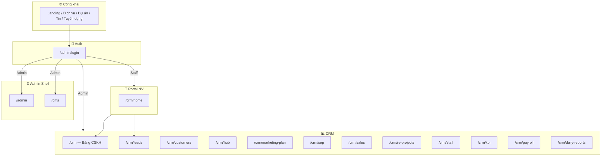
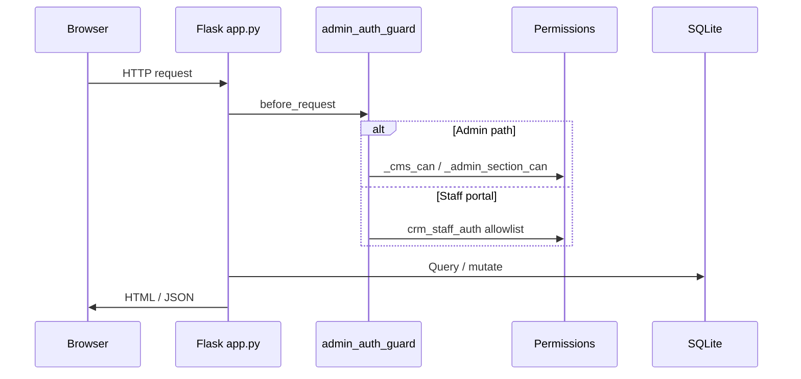
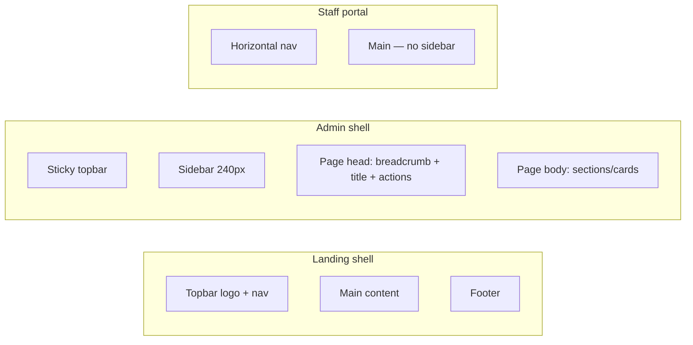

# PTT Advertising — Product Spec & UI/UX

> **Phiên bản:** 2026-05 · **Codebase:** `PTT/` · **Production:** `https://pttads.vn` · **Local:** `http://127.0.0.1:5050`

Tài liệu tổng hợp **đặc tả chức năng (Spec)** và **hướng dẫn giao diện (UI/UX)** cho hệ thống PTT Website Suite (Landing + CMS + CRM).  
**Spec hệ thống đầy đủ:** [`SPEC_HE_THONG_PTT.md`](SPEC_HE_THONG_PTT.md) · **Agency target:** [`SPEC_AGENCY_OPERATING_PLATFORM.md`](SPEC_AGENCY_OPERATING_PLATFORM.md) · **Agency UI Phase 1:** [`SPEC_UI_UX_AGENCY.md`](SPEC_UI_UX_AGENCY.md) · **SEO/AEO OS:** [`SPEC_SEO_AEO_OPERATING_SYSTEM.md`](SPEC_SEO_AEO_OPERATING_SYSTEM.md) · [`SPEC_UI_UX_SEO_AEO.md`](SPEC_UI_UX_SEO_AEO.md) · Tham chiếu: [`HE_THONG_PTT.md`](HE_THONG_PTT.md) · [`HUONG_DAN_SU_DUNG_PTT.md`](HUONG_DAN_SU_DUNG_PTT.md) · [`PHAN_QUYEN_HUONG_DAN.md`](PHAN_QUYEN_HUONG_DAN.md)

---

## Mục lục

1. [Tổng quan sản phẩm](#1-tổng-quan-sản-phẩm)
2. [Personas & phạm vi người dùng](#2-personas--phạm-vi-người-dùng)
3. [Functional Spec — Module & tính năng](#3-functional-spec--module--tính-năng)
4. [Technical Spec — Kiến trúc & dữ liệu](#4-technical-spec--kiến-trúc--dữ-liệu)
5. [Information Architecture (IA)](#5-information-architecture-ia)
6. [UI/UX — Design System](#6-uiux--design-system)
7. [UI/UX — Layout & Navigation](#7-uiux--layout--navigation)
8. [UI/UX — Screen Inventory](#8-uiux--screen-inventory)
9. [UI/UX — Patterns & Components](#9-uiux--patterns--components)
10. [UI/UX — Responsive & Accessibility](#10-uiux--responsive--accessibility)
11. [Phụ lục — Ma trận quyền ↔ Menu](#11-phụ-lục--ma-trận-quyền--menu)

---

## 1. Tổng quan sản phẩm

### 1.1. Vision

PTT là **nền tảng all-in-one** cho agency quảng cáo / BĐS:

| Lớp | Mục tiêu |
|-----|----------|
| **Landing công khai** | Thu hút khách, showcase dịch vụ & dự án, thu lead/form |
| **CMS** | Quản trị thương hiệu, nội dung, chat marketing AI |
| **CRM nội bộ** | CSKH, lead, kinh doanh, dự án BĐS, nhân sự, KPI, lương |

### 1.2. Stack

| Thành phần | Công nghệ |
|------------|-----------|
| Backend | Python 3, Flask 3, SQLite |
| Frontend | Jinja2, Vanilla JS, CSS custom properties |
| Auth | Flask session (`ptt_session`, 14 ngày), PBKDF2-SHA256 |
| Export | openpyxl (Excel), reportlab (PDF) |
| Deploy | Gunicorn (`gunicorn.conf.py`), port mặc định **5050** |

### 1.3. Sơ đồ hệ thống



---

## 2. Personas & phạm vi người dùng

| Persona | Đăng nhập | Shell UI | Mục tiêu chính |
|---------|-----------|----------|----------------|
| **Khách website** | Không | Landing | Xem dịch vụ, liên hệ, ứng tuyển |
| **Super Admin** | `/admin/login` | Sidebar đầy đủ | Toàn quyền hệ thống |
| **CMS Admin** | Cùng trên | Sidebar đầy đủ | Quản trị nội dung + CRM |
| **Biên tập / MKT** | Cùng trên | Sidebar (lọc quyền) | CMS + CRM theo vai trò/chức vụ |
| **NV CSKH (portal)** | Cùng trên | Nav ngang gọn | Case/lead được gán, KPI cá nhân |
| **NV Kinh doanh** | Admin hoặc portal | Tuỳ gán quyền | Pipeline, deal, dự án BĐS |

**Quy tắc auth:**

- Một **username — một mật khẩu** (đồng bộ `cms_admin_users` ↔ `crm_staff`).
- Ưu tiên đăng nhập: **CMS admin** trước → **portal nhân viên**.
- Phân quyền 2 lớp: **Vai trò CMS** (module Website) + **Chức vụ CRM** (section CRM).

---

## 3. Functional Spec — Module & tính năng

### 3.1. Landing (công khai)

| ID | Route | Chức năng | Input/Output |
|----|-------|-----------|--------------|
| L-01 | `/` | Hero, dịch vụ, dự án, tin, form liên hệ | Đọc `settings`, `services`, `projects`, `news` |
| L-02 | `/services/<slug>` | Chi tiết dịch vụ | Category + item từ CMS |
| L-03 | `/du-an/<id>` | Portfolio dự án | Admin CRUD |
| L-04 | `/tin-tuc/<id>` | Tin tức | Admin CRUD |
| L-05 | `/career` | Tuyển dụng + modal ứng tuyển | POST CV (PDF/DOC) |
| L-06 | `/chinh-sach-bao-mat` | Privacy policy | Static/CMS |

### 3.2. Admin Dashboard

| ID | Route | Chức năng |
|----|-------|-----------|
| A-01 | `/admin` | Quản lý **dự án portfolio** (CRUD) |
| A-02 | `/admin` | Quản lý **tin tức** (CRUD) |
| A-03 | `/admin` | **Kênh CRM** — dropdown kênh trên Bảng CSKH |

**Quyền:** module `projects`, `news`, `crm_lead_channels` (`cms_permissions.py`).

### 3.3. CMS

| ID | Tab / Section | Chức năng |
|----|---------------|-----------|
| C-01 | Cài đặt trang | Thương hiệu, hero, liên hệ, footer, mega menu |
| C-02 | Dịch vụ | Category + item dịch vụ (builder JSON) |
| C-03 | Chat Marketing | Cấu hình chatbox AI + hội thoại 7 bước |
| C-04 | Chat export | Export MD/HTML/JSON, Excel kế hoạch MKT |
| C-05 | Phân quyền | Ma trận vai trò CMS + chức vụ CRM + gán user |

### 3.4. CRM — CSKH & Khách hàng

| ID | Route | Chức năng |
|----|-------|-----------|
| R-01 | `/crm` | Phễu bán hàng, workspace NV, **Kanban** case |
| R-02 | `/crm` | Tạo yêu cầu CSKH, playbook 6 bước |
| R-03 | `/crm/customers` | Hồ sơ KH, timeline, hợp đồng |
| R-04 | Widget | Trợ lý AI playbook (floating) |

**Trạng thái case:** pipeline Kanban, assign NV, SLA, báo cáo chăm sóc.

### 3.5. CRM — Lead

| ID | Route | Chức năng |
|----|-------|-----------|
| R-10 | `/crm/leads` | Danh sách lead, scoring, tier, SLA |
| R-11 | Config global | Scoring, duplicate policy, assign strategy |
| R-12 | Per-project | Webhook FB, Form ID, pool NV theo dự án BĐS |
| R-13 | API | Facebook Lead Ads webhook, rescore, assign |

### 3.6. CRM — Marketing

| ID | Route | Chức năng |
|----|-------|-----------|
| R-20 | `/crm/hub` | Chiến dịch, hợp đồng, nhắc việc |
| R-21 | `/crm/marketing-plan` | KHTN / KHQT / CSKH segment |
| R-22 | `/crm/sop` | Template SOP + run (vd. `MKT-LAUNCH-14D`) |

### 3.7. CRM — Kinh doanh & Dự án BĐS

| ID | Route | Chức năng |
|----|-------|-----------|
| R-30 | `/crm/sales` | Pipeline KD: plans, funnel, prospects, deals, training, market, reports |
| R-31 | `/crm/re-projects` | Dự án BĐS: tổng quan, GTM, KPI, sản phẩm, rủi ro, ngân sách, lead webhook |

### 3.8. CRM — Nhân sự & Vận hành

| ID | Route | Chức năng |
|----|-------|-----------|
| R-40 | `/crm/staff` | Phòng ban, chức vụ, hồ sơ NV, import/export, login portal |
| R-41 | `/crm/kpi` | Chỉ tiêu, biểu đồ, cảnh báo, bản ghi KPI |
| R-42 | `/crm/payroll` | Thiết bị chấm công, attendance, bảng lương |
| R-43 | `/crm/daily-reports` | Báo cáo công việc ngày (NV nộp, quản lý duyệt) |

### 3.9. Portal nhân viên

| ID | Route | Chức năng |
|----|-------|-----------|
| P-01 | `/crm/home` | Dashboard cá nhân: KPI, lead, báo cáo |
| P-02 | Nav | Lead của tôi, KPI, BC ngày, CSKH, KH, chấm công |

**Giới hạn:** chỉ case/lead **được gán**; API allowlist (`crm_staff_auth.py`).

### 3.10. Non-functional requirements

| Hạng mục | Yêu cầu |
|----------|---------|
| **Bảo mật** | Session cookie, PBKDF2, API 403 theo quyền, staff scope theo assign |
| **Hiệu năng** | SQLite local; static minified; polling nhẹ CSKH |
| **i18n** | Tiếng Việt (UI labels, error messages) |
| **Export** | Excel KPI, lead, nhân sự, kế toán RE project |
| **Tích hợp** | Facebook Lead Ads webhook, máy chấm công (`/iclock/cdata`) |

---

## 4. Technical Spec — Kiến trúc & dữ liệu

### 4.1. Kiến trúc request



### 4.2. File module chính

| File | Trách nhiệm |
|------|-------------|
| `app.py` | Routes, API, DB init, guards (~16k LOC) |
| `cms_permissions.py` | Vai trò CMS, module, actions |
| `admin_page_permissions.py` | Section CRM, chức vụ, defaults MKT/CSKH/KD/VH |
| `crm_lead_store.py` | Lead CRUD, scoring, assign |
| `crm_project_webhooks.py` | Webhook per RE project |
| `crm_sales_pipeline.py` | Pipeline bán hàng |
| `marketing_chat_service.py` | Chatbox AI CMS |
| `unified_auth.py` | Login thống nhất admin + staff |

### 4.3. Bảng dữ liệu chính

| Nhóm | Bảng |
|------|------|
| CMS | `settings`, `cms_roles`, `cms_role_permissions`, `cms_admin_users` |
| CRM core | `crm_cases`, `crm_customers`, `crm_leads`, `crm_channels` |
| CRM org | `crm_departments`, `crm_positions`, `crm_staff`, `crm_position_section_permissions` |
| CRM ops | `crm_kpi_*`, `crm_attendance_*`, `crm_daily_work_reports` |
| RE | `crm_re_projects`, webhook config, products, budget… |
| Marketing | `crm_hub_*`, `crm_sop_*`, `crm_marketing_plan_*` |

### 4.4. Nhóm API (tóm tắt)

| Prefix | Mục đích |
|--------|----------|
| `/api/settings`, `/api/services` | CMS landing |
| `/api/projects`, `/api/news` | Admin content |
| `/api/crm/cases` | Bảng CSKH |
| `/api/crm/leads` | Lead management |
| `/api/crm/integration/webhooks/facebook` | FB Lead Ads |
| `/api/cms/permissions/*` | Ma trận quyền |
| `/api/crm/staff/*` | Nhân sự |
| `/api/crm/kpi/*` | KPI |
| `/api/crm/re-projects/*` | Dự án BĐS |

---

## 5. Information Architecture (IA)

### 5.1. Admin Sidebar (`admin_sidebar.html`)

```
Tổng quan
  └─ Bảng điều khiển          → /admin

Website
  ├─ Cài đặt trang            → /cms#cms-landing-settings
  ├─ Dịch vụ                  → /cms#cms-services
  ├─ Chat Marketing           → /cms#cms-mk-chat
  └─ Phân quyền               → /cms#cms-permissions

Nội dung site
  ├─ Dự án portfolio          → /admin#admin-projects
  ├─ Tin tức                  → /admin#admin-news
  └─ Kênh CRM                 → /admin#admin-channels

CRM · Chăm sóc KH
  ├─ Bảng CSKH                → /crm
  ├─ Khách hàng               → /crm/customers
  └─ Quản lý Lead             → /crm/leads

CRM · Marketing
  ├─ Hub · Hợp đồng           → /crm/hub
  ├─ Kế hoạch marketing       → /crm/marketing-plan
  └─ Quy trình SOP            → /crm/sop

CRM · Kinh doanh
  ├─ Kinh doanh               → /crm/sales
  └─ Dự án BĐS                → /crm/re-projects

CRM · Nhân sự
  ├─ Nhân viên                → /crm/staff
  ├─ BC công việc             → /crm/daily-reports
  ├─ KPI                      → /crm/kpi
  └─ Chấm công & lương        → /crm/payroll
```

**Gating:** `data-cms-nav` (vai trò CMS) · `data-admin-nav` (chức vụ CRM) · ẩn nhóm trống.

### 5.2. Staff portal nav

Trang chủ · Lead của tôi · KPI · Báo cáo ngày · Chăm sóc KH · Khách hàng · Chấm công · Đổi MK · Đăng xuất

---

## 6. UI/UX — Design System

### 6.1. Brand & Color Tokens

Nguồn: `static/styles.css`, `static/admin_shell.css`

| Token | Giá trị | Dùng cho |
|-------|---------|----------|
| `--primary` | `#398b43` | CTA, link active, accent |
| `--primary-700` | `#2f7238` | Text accent, sidebar label |
| `--brand-lime` | `#8cc63f` | Gradient highlight |
| `--bg` / `--app-bg-gradient` | `#ecf3ee` + radial | Nền app admin |
| `--surface` | `#ffffff` | Card, panel |
| `--text-strong` | `#0f2418` | Heading |
| `--text-subtle` | `#5c6f63` | Muted, secondary |
| `--border` | `rgba(57,139,67,0.16)` | Viền card |
| `--theme-color` | `#398b43` | Mobile browser chrome |

**Gradient thương hiệu (topbar admin):** `#2f7238` → `#398b43` → `#8cc63f`

### 6.2. Typography

| Vai trò | Font | Weight |
|---------|------|--------|
| Body UI | **Inter** | 400–700 |
| Heading / CTA | **Manrope** | 500–800 |
| Editorial (landing) | **Noto Serif** | 600–700 |

**Scale tham chiếu:**

| Element | Size | Weight |
|---------|------|--------|
| Page title (admin) | ~1.35–1.5rem | 700 |
| Nav link | 0.875–0.9rem | 500–600 |
| Nav group label | 0.68rem | 700, uppercase, letter-spacing 0.06em |
| Body | 16px base | 400 |
| Muted helper | 0.8125rem | 400 |

### 6.3. Spacing & Radius

| Token | Value |
|-------|-------|
| `--radius-sm` | 10px |
| `--radius-md` | 12px |
| `--radius-lg` | 16px |
| `--btn-radius` | 9999px (pill buttons) |
| Sidebar width | ~240px (desktop) |
| Topbar height | ~56px + 3px gradient strip |

### 6.4. Elevation & Shadow

```css
--shadow-green-sm: 0 4px 16px rgba(47, 114, 56, 0.08);
--shadow-green-md: 0 10px 32px rgba(47, 114, 56, 0.12);
--focus-ring: 0 0 0 3px rgba(57, 139, 67, 0.14);
```

Cards admin: nền trắng, viền xanh nhạt, shadow nhẹ; hover tăng contrast border primary.

### 6.5. Buttons

| Variant | Mô tả |
|---------|--------|
| **Primary** | Pill, gradient xanh `#4eb457` → `#2a7232`, min-height 52px |
| **Secondary** | Outline / nền `--surface-soft` |
| **Compact** | min-height 46px, dùng trong bảng/toolbar |
| **Logout** | Text button topbar, không CTA nổi |

States: `:hover` lift shadow · `:disabled` opacity 0.72 · `:focus-visible` ring xanh.

### 6.6. Form controls

- Input/select/textarea: border `--border`, radius 10px, focus `--focus-ring`
- Label: font-weight 600, margin-bottom 0.35rem
- Validation: inline error text đỏ; API error toast/alert trong modal

### 6.7. Iconography

Sidebar dùng **Unicode emoji/icon** nhẹ (◫ ⚙ ▦ 💬 🔐 📁 …) — không phụ thuộc icon font.  
CRM module có icon tab trong từng trang (consistent within page, not global library).

---

## 7. UI/UX — Layout & Navigation

### 7.1. Ba shell layout



| Shell | Template | Breakpoint behavior |
|-------|----------|---------------------|
| Public | `base.html` | Container max-width; mobile nav collapse |
| Admin | `admin_layout.html` | Sidebar → drawer + backdrop `<768px` |
| Staff | `admin_layout.html` + portal flag | Full-width; nav scroll horizontal mobile |

### 7.2. Admin page structure

Mọi trang admin/CRM dùng pattern:

```
┌─────────────────────────────────────────────────────────┐
│ TOPBAR: [☰] PTT Quản trị nội bộ    Trang chủ | User | ⎋ │
├──────────┬──────────────────────────────────────────────┤
│ SIDEBAR  │ PAGE HEAD                                    │
│ (groups) │  Breadcrumb (optional)                       │
│          │  H1 Title                                    │
│          │  Description                                 │
│          │                    [Primary actions →]       │
│          ├──────────────────────────────────────────────┤
│          │ PAGE BODY                                    │
│          │  ┌─ Card / Tab panel ─────────────────┐   │
│          │  │ data-admin-section="..."             │   │
│          │  └──────────────────────────────────────┘   │
└──────────┴──────────────────────────────────────────────┘
│ Floating: CRM Assistant widget (CRM pages only)         │
└─────────────────────────────────────────────────────────┘
```

### 7.3. Topbar admin

- Sticky `z-index: 120`
- Brand kicker "PTT" + title "Quản trị nội bộ"
- Links: Trang chủ (public), Đổi mật khẩu
- User block: tên + vai trò (truncate ellipsis)
- Hamburger toggle sidebar (mobile)

### 7.4. Sidebar admin

- Group label uppercase muted green
- Link: icon + label; `.is-active` = nền xanh nhạt + border
- Hidden items: `.admin-nav-hidden` / `.cms-nav-hidden` (`display: none`)
- Empty group: `.admin-nav-group--empty` ẩn cả nhóm

### 7.5. Landing public UX

- Hero full-width với CTA pill
- Section dịch vụ dạng grid card
- Marquee / trust signals (CMS-driven)
- Floating contact FAB (`_contact_fab.html`)
- Career modal overlay (`_career_modal.html`)

---

## 8. UI/UX — Screen Inventory

### 8.1. Auth

| Screen | File | UX notes |
|--------|------|----------|
| Login | `admin_login.html` | Form centered card; error inline; `next` redirect |
| Đổi MK | `account_password.html` | Old + new password; staff/admin shared |

### 8.2. Admin & CMS

| Screen | Key UI zones |
|--------|--------------|
| Dashboard | 3 section cards: Projects, News, Channels |
| CMS | Tab anchor nav (`#cms-*`); quick nav sticky; permissions matrix tables |
| CMS Chat | Launcher bubble bottom-right; panel slide-up; export toolbar |

### 8.3. CRM — pattern chung

Hầu hết trang CRM:

1. **Toolbar** — filter, search, export, primary CTA (`+ Tạo`)
2. **Tabs** — multi-section trong 1 route (vd. RE Projects: 8 tab)
3. **Data table** — sortable columns, row actions, pagination
4. **Modal** — create/edit (`.crm-modal-root`), không bị section readonly lock
5. **Empty state** — muted text + CTA tạo mới

| Screen | Đặc thù UX |
|--------|------------|
| `/crm` | Kanban columns + list view toggle; realtime poll badge |
| `/crm/customers` | Master-detail; timeline vertical |
| `/crm/leads` | Tier badges (hot/warm/cold); SLA countdown; config drawer |
| `/crm/hub` | 3 tabs: Campaigns, Contracts, Reminders |
| `/crm/re-projects` | Project picker sidebar + tab workspace; webhook copy URL |
| `/crm/sales` | 8 sub-sections funnel/deals |
| `/crm/staff` | Org tree table; modal login credentials |
| `/crm/kpi` | Chart + metric cards + editable grid |
| `/crm/payroll` | Device config + attendance calendar + salary table |
| `/crm/daily-reports` | Date picker + form narrative + manager review |

### 8.4. Staff portal home

`crm_staff_home.html` — cards: KPI snapshot, lead assigned count, quick links BC ngày.

### 8.5. Wireframe — Bảng CSKH (Kanban)

```
┌─────────────────────────────────────────────────────────────┐
│ Bảng CSKH          [Phễu] [Workspace] [Kanban●] [+ Tạo]     │
├─────────┬─────────┬─────────┬─────────┬─────────┬───────────┤
│ Tiếp nhận│ Đang XL │ Chờ KH  │ Hoàn tất│ Huỷ     │ ...       │
├─────────┼─────────┼─────────┼─────────┼─────────┼───────────┤
│ [Card]  │ [Card]  │         │ [Card]  │         │           │
│ Case #  │         │         │         │         │           │
│ KH name │         │         │         │         │           │
│ SLA ⏱  │         │         │         │         │           │
└─────────┴─────────┴─────────┴─────────┴─────────┴───────────┘
```

### 8.6. Wireframe — RE Projects

```
┌──────────┬──────────────────────────────────────────────────┐
│ Projects │ [Tổng quan][GTM][KPI][SP][Rủi ro][KT][Lead][...] │
│ list     ├──────────────────────────────────────────────────┤
│ • Dự án A│  Tab content: cards + tables + charts            │
│ • Dự án B│  Lead card: webhook URL, form IDs, staff pool     │
└──────────┴──────────────────────────────────────────────────┘
```

---

## 9. UI/UX — Patterns & Components

### 9.1. Permission gating (UI)

| Mechanism | Attribute | Behavior |
|-----------|-----------|----------|
| Hide nav link | `data-admin-nav`, `data-cms-nav` | No `view` → hidden |
| Hide section | `data-admin-section` | No `view` → `hidden` |
| Readonly section | same + no edit/create | Inputs disabled |
| Exempt controls | `data-admin-section-allow` | Modal buttons always active |
| Full access | `admin-app-layout--full-access` | Skip all gating |

Script: `admin_section_gating.js` · Bootstrap: `admin_grants_bootstrap.html`

### 9.2. CRM modal pattern

```
Overlay (fixed full screen, rgba backdrop)
  └─ .crm-modal-root
       ├─ Header: title + [×]
       ├─ Body: form grid 2-col desktop / 1-col mobile
       └─ Footer: [Huỷ] [Lưu]
```

- Focus trap implicit (browser default)
- ESC / click backdrop → close (per-page JS)

### 9.3. Table + bulk actions

- Header checkbox select all
- Row hover highlight `--primary-50`
- Sticky header on long lists
- Export button toolbar right-aligned

### 9.4. Status badges (semantic colors)

| Status | Color direction |
|--------|-----------------|
| Success / Done | Green soft bg |
| Warning / SLA | Amber |
| Danger / Overdue | Red soft bg |
| Neutral / Draft | Gray surface |

Lead tiers: Hot (red-orange), Warm (amber), Cold (blue-gray) — defined in `crm_leads.css`.

### 9.5. CRM Assistant widget

- Fixed bottom-right on `/crm/*` admin pages
- Collapsible panel; chat bubbles; suggested prompts
- Permission: section `crm_assistant`

### 9.6. Loading & feedback

- Fetch: `credentials: same-origin`; 401 → redirect login JSON
- Button loading: disabled + text change (per-module JS)
- Toast/status: `.muted.cms-perms-status` pattern for inline messages

---

## 10. UI/UX — Responsive & Accessibility

### 10.1. Breakpoints (implicit)

| Range | Behavior |
|-------|----------|
| `<768px` | Sidebar drawer; table horizontal scroll; stack form columns |
| `768–1024px` | Sidebar visible; compact padding |
| `>1024px` | Full admin layout; multi-column dashboards |

### 10.2. Accessibility checklist

| Item | Implementation |
|------|----------------|
| Skip link | `.skip-to-main` → `#main` |
| Landmarks | `<header role="banner">`, `<main id="main">`, `<nav aria-label>` |
| Focus visible | `:focus-visible` outline primary |
| Sidebar toggle | `aria-controls`, `aria-expanded` |
| Hidden nav | `aria-disabled="true"` on blocked links |
| Form labels | `<label>` + `aria-label` on matrix checkboxes |
| Color contrast | Text `#0f2418` on `#fff` — WCAG AA target |
| `theme-color` | `#398b43` mobile chrome |

### 10.3. Motion

- Transitions 0.15s ease (nav hover, sidebar)
- No autoplay animations critical path
- Respect `prefers-reduced-motion`: *chưa implement global — khuyến nghị bổ sung*

---

## 11. Phụ lục — Ma trận quyền ↔ Menu

### 11.1. Vai trò CMS → Menu Website

| Module ID | Menu label |
|-----------|------------|
| `landing_settings` | Cài đặt trang |
| `services_builder` | Dịch vụ |
| `mk_chat_config` | Chat Marketing |
| `permissions_matrix` | Phân quyền |
| `projects` | Dự án portfolio |
| `news` | Tin tức |
| `crm_lead_channels` | Kênh CRM |

### 11.2. Chức vụ CRM → Menu CRM

| Section ID (nav) | Menu label |
|------------------|------------|
| `crm_board_kanban` | Bảng CSKH |
| `crm_board_customers` | Khách hàng |
| `crm_leads` | Quản lý Lead |
| `crm_hub_campaigns` | Hub · Hợp đồng |
| `crm_mktplan` | Kế hoạch marketing |
| `crm_sop_runs` | Quy trình SOP |
| `crm_sales_overview` | Kinh doanh |
| `crm_re_projects` | Dự án BĐS |
| `crm_staff_roster` | Nhân viên |
| `crm_daily_work_report` | BC công việc |
| `crm_kpi_records` | KPI |
| `crm_payroll_attendance` | Chấm công & lương |

### 11.3. Gợi ý gán team (tham chiếu triển khai)

| Team | Vai trò CMS | Chức vụ | Script |
|------|-------------|---------|--------|
| Quản trị | `super_admin` / `cms_admin` | — | — |
| Kinh doanh | `viewer` | `KD-01` | `scripts/apply_team_permission_assignments.py` |
| CSKH | `viewer` | `CSKH-01` |同上 |
| Marketing | `marketing_lead` / `marketing_staff` | `MKT-01` / `MKT-02` |同上 |
| Vận hành/HR | `viewer` | `VH-01` |同上 |
| Biên tập web | `content_editor` | — | CMS UI |

---

## Tài liệu liên quan

| File | Nội dung |
|------|----------|
| [`HE_THONG_PTT.md`](HE_THONG_PTT.md) | Kiến trúc kỹ thuật chi tiết |
| [`HUONG_DAN_SU_DUNG_PTT.md`](HUONG_DAN_SU_DUNG_PTT.md) | Hướng dẫn người dùng từng module |
| [`PHAN_QUYEN_HUONG_DAN.md`](PHAN_QUYEN_HUONG_DAN.md) | Quy trình phân quyền |
| [`TEST_CASES_PTT.md`](TEST_CASES_PTT.md) | Test cases QA |

---

*Document generated from PTT codebase snapshot — 2026-05. Cập nhật khi thêm route/section mới.*
