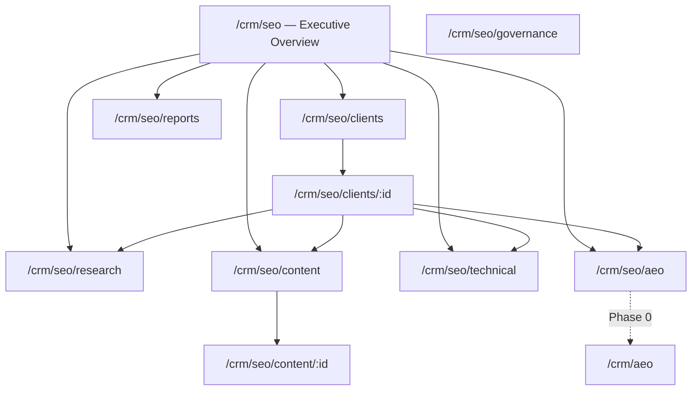
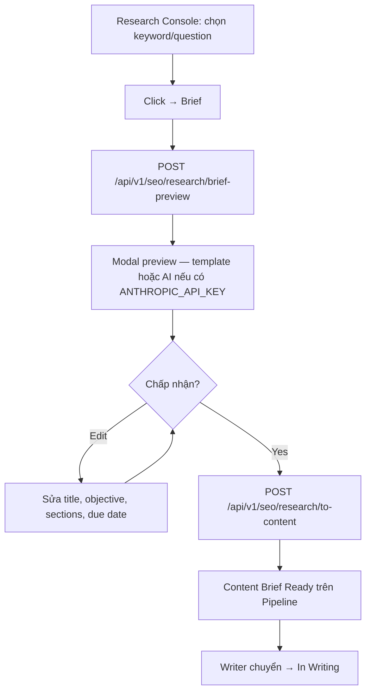
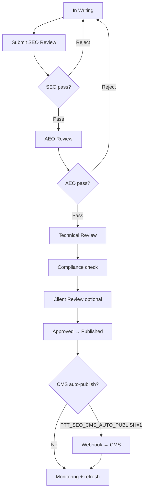
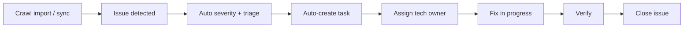
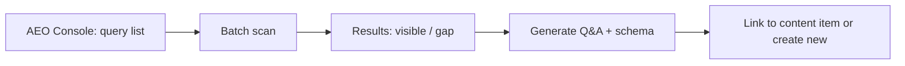
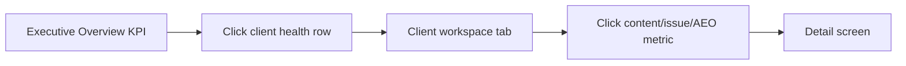

# SEO/AEO Enterprise OS — UI/UX Specification

> **Phiên bản:** 1.4 · **Ngày:** 2026-07-19  
> **Phạm vi:** SEO/AEO Ops UI — Flask admin (Phase 1–4) **+** Next.js Client Portal SEO (Phase 5C, flag `PTT_PORTAL_SEO_ENABLED`)  
> **Master spec:** [`SPEC_SEO_AEO_OPERATING_SYSTEM.md`](SPEC_SEO_AEO_OPERATING_SYSTEM.md) v1.4  
> **Kiến trúc:** [`specs/2026-07-19-seo-aeo-architecture.md`](specs/2026-07-19-seo-aeo-architecture.md)  
> **Storage policy:** [`specs/2026-07-19-seo-aeo-pg-cutover-policy.md`](specs/2026-07-19-seo-aeo-pg-cutover-policy.md) — feature mới backend PG-only  
> **Design system gốc:** [`SPEC_UI_UX_PTT.md`](SPEC_UI_UX_PTT.md) — **kế thừa tokens, không redesign**  
> **AEO MVP UI:** [`templates/crm_aeo.html`](../templates/crm_aeo.html) — migrate → AEO Console Phase 4

---

## Mục lục

1. [Tổng quan UX](#1-tổng-quan-ux)
2. [Personas & scenarios](#2-personas--scenarios)
3. [Information Architecture](#3-information-architecture)
4. [User flows](#4-user-flows)
5. [Screen inventory](#5-screen-inventory)
6. [Wireframe mô tả (ASCII)](#6-wireframe-mô-tả-ascii)
7. [Components](#7-components)
8. [States & feedback](#8-states--feedback)
9. [Permissions ↔ UI](#9-permissions--ui)
10. [Responsive & accessibility](#10-responsive--accessibility)
11. [Phase rollout UI map](#11-phase-rollout-ui-map)
12. [Handoff checklist](#12-handoff-checklist)

---

## 1. Tổng quan UX

### 1.1. Mục tiêu UX

| Mục tiêu | Metric UX |
|----------|-----------|
| Giảm thao tác thủ công | Brief auto-gen → edit < 5 phút |
| Tăng tốc review | SEO + AEO review trên cùng content detail |
| Trạng thái rõ ràng | Pipeline kanban: biết ngay blocker |
| Drill-down nhanh | Executive → Client → Content trong ≤ 3 clicks |
| Leadership + operator | Dual view: overview cards vs dense tables |
| Enterprise usability | Onboard strategist < 30 phút |

### 1.2. Nguyên tắc thiết kế

1. **Extend, don't replace** — giữ admin shell, sidebar, topbar từ `SPEC_UI_UX_PTT.md`
2. **Same design tokens** — `--primary`, Inter/Manrope, pill buttons, card pattern
3. **Progressive disclosure** — client workspace dùng tabs; advanced filters collapsible
4. **Ops-first + leadership view** — dense data tables cho operator; KPI cards cho executive
5. **Workflow-visible** — mọi content/issue hiển thị stage + next action
6. **Tiếng Việt** — labels, errors, empty states, tooltips
7. **Desktop-first** — enterprise B2B; responsive tablet minimum

### 1.3. Design system direction

| Thuộc tính | Hướng dẫn |
|------------|-----------|
| Layout | Clean grid, 12-col, dense data |
| Hierarchy | Strong typographic scale (h1→caption) |
| Color | Semantic system (status, severity, score) |
| Density | Compact tables, 40px row height |
| Noise | Minimal decoration; data > chrome |
| Typography | Inter body, Manrope headings (existing) |

### 1.4. Phạm vi UI theo phase

| Phase | Screens in scope |
|-------|------------------|
| **0** ✅ | AEO Workspace (`/crm/aeo`) |
| **1** | Executive Overview, Client SEO workspace, Settings |
| **2** | Research Console, Content Pipeline, Workflow approvals |
| **3** | Technical Console, Reporting Center (basic) |
| **4** | AEO Console v2, Authority Console, Freshness queue |
| **5** | Client portal (`/seo/*`), Experimentation UI (S-16) |
| **Gate E** | OKR tree S-05, CWV + crawl schedule S-09, Rank/SOV S-17, a11y partial |

---

## 2. Personas & scenarios

| Persona | Scenario | Entry point |
|---------|----------|-------------|
| **Executive** | Xem KPI tổng, client health, AI visibility | `/crm/seo` |
| **Head of SEO/AEO** | Review roadmap, approve initiatives | Client → Roadmap |
| **SEO Strategist** | Research keywords, tạo brief | Research Console |
| **AEO Strategist** | Monitor question coverage, scan AI | AEO Console |
| **Content Strategist** | Quản lý pipeline, assign writer | Content Pipeline |
| **Writer / Editor** | Viết, revision, submit review | Content detail |
| **Technical SEO** | Triage issues, assign fix | Technical Console |
| **Analyst** | Export report, annotate trends | Reporting Center |
| **QA / Compliance** | Review approval, policy check | Content detail → Governance |
| **Account Manager** | Client overview, delivery status | Client workspace |
| **Admin** | Integration setup, permissions | Client → Settings |

---

## 3. Information Architecture

### 3.1. Global navigation (sidebar)

Vị trí: **sau** `CRM · Agency Ops`, **trước** `CRM · Kinh doanh`.

```
CRM · SEO/AEO Ops                     [data-admin-nav="crm_seo_aeo"]
  ├─ Tổng quan                        → /crm/seo
  ├─ Khách hàng SEO                   → /crm/seo/clients
  ├─ Chiến lược                       → /crm/seo/strategy
  ├─ Nghiên cứu                       → /crm/seo/research
  ├─ Nội dung                         → /crm/seo/content
  ├─ Kỹ thuật                         → /crm/seo/technical
  ├─ AEO                              → /crm/seo/aeo  (redirect /crm/aeo Phase 0)
  ├─ Authority                        → /crm/seo/authority
  ├─ Báo cáo                          → /crm/seo/reports
  ├─ Rank tracker                     → /crm/seo/ranks  (Gate E6 — hub quick-link)
  ├─ Tự động hóa                      → /crm/seo/automations
  └─ Quản trị                         → /crm/seo/governance
```

**Phase 1 visible items:** Tổng quan, Khách hàng SEO, AEO (legacy), Quản trị (link SOP).  
**Phase 2+:** unlock Research, Nội dung, Chiến lược.  
**Phase 3+:** unlock Kỹ thuật, Báo cáo, Tự động hóa.  
**Phase 4+:** unlock Authority.

### 3.2. Client workspace navigation (tabs)

Route base: `/crm/seo/clients/:customer_id`

```
[Tổng quan] [Roadmap] [Tasks] [Nghiên cứu] [Nội dung] [Kỹ thuật] [AEO] [Authority] [Báo cáo] [Cài đặt]
```

Context bar luôn hiển thị: **Client name · Domain · Market · Owner · Contract tier**

### 3.3. Sitemap



### 3.4. Navigation rules

| Rule | Behavior |
|------|----------|
| Client chưa cấu hình domain | Banner vàng trên client workspace |
| Critical issues > 0 | Badge đỏ trên tab Kỹ thuật + sidebar |
| Content overdue | Badge cam trên tab Nội dung |
| AEO coverage < 50% | Badge vàng trên tab AEO |
| Sync job failed | Banner trên Tổng quan + Automations |
| Unread SEO alerts | Badge trên topbar bell |

---

## 4. User flows

### 4.1. Flow F1 — Research → Brief → Content



### 4.2. Flow F2 — Content → Publish



Gate E5 — [`seo-cms-webhook-pilot.md`](runbooks/seo-cms-webhook-pilot.md).

### 4.3. Flow F3 — Audit → Task → Fix



### 4.4. Flow F4 — AEO scan → Content gap



### 4.5. Flow F5 — Executive drill-down



---

## 5. Screen inventory

### 5.1. Bảng màn hình

| ID | Route | Tên màn | Persona | Phase | Priority |
|----|-------|---------|---------|-------|----------|
| **S-01** | `/crm/seo` | Executive Overview | Executive, Head | 1 | P0 |
| **S-02** | `/crm/seo/clients` | Danh sách client SEO | AM, Admin | 1 | P0 |
| **S-03** | `/crm/seo/clients/:id` | Client workspace (+ tab **Tasks**) | All SEO team | 1 | P0 |
| **S-04** | `/crm/seo/clients/:id/settings` | Client SEO settings | Admin, AM | 1 | P0 |
| **S-05** | `/crm/seo/strategy` | Strategy, OKR & Roadmap | Strategist, Head | 2 / **E1** | P1 |
| **S-06** | `/crm/seo/research` | Research Console (7 tabs) | Strategist | 2 | P0 |
| **S-07** | `/crm/seo/content` | Content Pipeline | Content team | 2 | P0 |
| **S-08** | `/crm/seo/content/:id` | Content detail | Writer, Editor | 2 | P0 |
| **S-09** | `/crm/seo/technical` | Technical Console | Tech SEO | 3 | P0 |
| **S-10** | `/crm/seo/aeo` | AEO Console | AEO Strategist | 0→4 | P0 |
| **S-11** | `/crm/seo/authority` | Authority Console | Strategist | 4 | P2 |
| **S-12** | `/crm/seo/reports` | Reporting Center (+ sparkline/bar charts) | Analyst, AM | 3 | P1 |
| **S-13** | `/crm/seo/automations` | Automations & Alerts | Admin, Head | 3 | P2 |
| **S-14** | `/crm/seo/governance` | Governance hub | QA, Head | 5A ✅ | P1 |
| **S-16** | `/crm/seo/experiments` | Experimentation console | Strategist, Head | 5B ✅ | P2 |
| **S-17** | `/crm/seo/ranks` | Rank tracker + SOV | Strategist, Analyst | **Gate E6** | P2 |
| **S-15** | `/crm/aeo` | AEO Workspace (legacy) | AEO team | 0 ✅ | — redirect **301** → `/crm/seo/aeo` |
| **P-SEO-01** | `/seo` (portal) | Client SEO dashboard + KPI widgets | Client viewer | 5C ✅ | P1 |
| **P-SEO-02** | `/seo/content` | Client content review | Client approver | 5C ✅ | P1 |

### 5.2. Templates & assets

| Screen | Template | JS/CSS |
|--------|----------|--------|
| S-01 | `templates/crm_seo_hub.html` | `static/crm_seo.css`, `static/crm_seo_hub.js`, `static/crm_seo_charts.js` |
| S-02–S-04 | `templates/crm_seo_clients.html`, `crm_seo_client.html` | `static/crm_seo_client.js` |
| S-05 | `templates/crm_seo_strategy.html` | `static/crm_seo_strategy.js` — OKR tree (Gate E1) |
| S-06 | `templates/crm_seo_research.html` | `static/crm_seo_research.js`, `static/crm_seo_a11y.js` — tabs + brief modal + autolink |
| S-07–S-08 | `templates/crm_seo_content_pipeline.html`, `crm_seo_content_detail.html` | `static/crm_seo_content.js` — 10-col kanban |
| S-09 | `templates/crm_seo_technical.html` | `static/crm_seo_technical.js` — CWV panel + crawl schedule (Gate E2/E3) |
| S-10 | `templates/crm_seo_aeo_console.html` | migrate from `crm_aeo.html` |
| S-11 | `templates/crm_seo_authority.html` | shared |
| S-12 | `templates/crm_seo_reports.html` | `static/crm_seo_reports.js`, `static/crm_seo_charts.js` |
| S-13 | `templates/crm_seo_automations.html` | shared |
| S-14 | `templates/crm_seo_governance.html` | `static/crm_seo_governance.js` |
| S-16 | `templates/crm_seo_experiments.html` | `static/crm_seo_experiments.js` |
| S-17 | `templates/crm_seo_ranks.html` | `static/crm_seo_ranks.js` — SOV cards + Capture SERP |
| S-15 | `templates/crm_aeo.html` | inline JS (legacy) |
| P-SEO-01 | `portal-web/src/app/seo/page.tsx` | `SeoWidgetsPanel.tsx`, `globals.css` — KPI + sparkline |

---

## 6. Wireframe mô tả (ASCII)

### S-01 — Executive Overview (`/crm/seo`)

```
┌─────────────────────────────────────────────────────────────────────────┐
│ [Topbar]  SEO/AEO Ops · Tổng quan              🔔(2)  [User] [Logout]  │
├──────────┬──────────────────────────────────────────────────────────────┤
│ Sidebar  │  Filter: [Tháng ▼] [Client ▼] [Market ▼]                    │
│ ...      │  ┌──────────┐ ┌──────────┐ ┌──────────┐ ┌──────────┐       │
│ SEO/AEO ▼│  │Organic   │ │AI Visib. │ │Critical  │ │Publish   │       │
│ · Tổng quan│ │+12.4%   │ │ 68% cov  │ │Issues: 3 │ │SLA: 94%  │       │
│ · Clients│  └──────────┘ └──────────┘ └──────────┘ └──────────┘       │
│ · ...    │                                                              │
│          │  ┌─ Growth trends ─────────────┐ ┌─ Client health ──────┐ │
│          │  │ [Sessions chart 90d]         │ │ Client    Health Score│ │
│          │  │                              │ │ ABC Corp  ● 82  [→]  │ │
│          │  └──────────────────────────────┘ │ XYZ Ltd   ○ 61  [→]  │ │
│          │                                    └──────────────────────┘ │
│          │  ┌─ Open critical issues ─────────────────────────────────┐ │
│          │  │ ⚠ 404 on /pricing — ABC Corp — 2d ago        [Fix →] │ │
│          │  └──────────────────────────────────────────────────────┘ │
│          │  ┌─ Content delivery status ──────────────────────────────┐ │
│          │  │ In Writing: 12 │ Review: 8 │ Overdue: 3               │ │
│          │  └──────────────────────────────────────────────────────┘ │
└──────────┴──────────────────────────────────────────────────────────────┘
```

### S-03 — Client workspace (`/crm/seo/clients/:id`)

```
┌─────────────────────────────────────────────────────────────────────────┐
│ ← Clients   ABC Corp · abccorp.vn · VN · AM: Nguyễn A · Tier: Pro     │
│ [Tổng quan] [Roadmap] [Tasks] [Nghiên cứu] [Nội dung] [Kỹ thuật] ...  │
├─────────────────────────────────────────────────────────────────────────┤
│ Tab Tasks: CRM service tasks (lifecycle) + technical issues mở         │
│ Tab Tổng quan: KPI cards · roadmap · opportunities · lifecycle table   │
└─────────────────────────────────────────────────────────────────────────┘
```

API Tasks: `GET /api/v1/seo/clients/:id/tasks` → `ptt_seo/client_tasks.py`.

### S-06 — Research Console (`/crm/seo/research`)

```
┌─────────────────────────────────────────────────────────────────────────┐
│ Nghiên cứu SEO/AEO          Client: [ABC Corp ▼]   [+ Import CSV]      │
│ Tabs: [Keywords] [Questions] [Entities] [Clusters] [SERP] [Pages]      │
│       [Opportunities]                                                   │
├─────────────────────────────────────────────────────────────────────────┤
│ Filter: [Intent ▼] [Cluster ▼]  Search: [____________]  [Lọc]         │
├──────────────┬──────┬──────┬────────┬─────────┬──────────┬─────────────┤
│ Keyword      │ Vol  │ KD   │ Intent │ Cluster │ Opp score│ Actions    │
├──────────────┼──────┼──────┼────────┼─────────┼──────────┼─────────────┤
│ dịch vụ seo  │ 2400 │ 42   │ comm.  │ SEO svc │ 78       │ [→ Brief]  │
└──────────────┴──────┴──────┴────────┴─────────┴──────────┴─────────────┘
│ Clusters tab: CRUD cluster · assign keyword                             │
│ SERP tab: capture via SerpAPI/DataForSEO (PTT_SERP_PROVIDER) or stub fallback │
│ Pages tab: sync page inventory từ GSC                                   │
│ [Entity graph drawer] · [Auto-link clusters — Gate E4] · [Brief modal]     │
└─────────────────────────────────────────────────────────────────────────┘
```

**API (Research P2 + E4):** `GET/POST .../research/clusters`, `GET/POST .../research/serp`, `GET/POST .../research/pages/sync-gsc`, `POST .../research/brief-preview`, `POST .../research/to-content`, `POST .../entities/autolink`.

### S-05 — Strategy & OKR (`/crm/seo/strategy`) — Gate E1

```
┌─────────────────────────────────────────────────────────────────────────┐
│ Chiến lược & OKR           Client: [ABC Corp ▼]  [Tải OKR] [Refresh KPI]│
├─────────────────────────────────────────────────────────────────────────┤
│ ┌─ Goal: Grow organic traffic (Q3-2026) ──────────────────────────────┐ │
│ │ KPIs: GSC clicks 820 / 1000 · Content published 12 / 20             │ │
│ │ Initiatives: Fix technical SEO · Content cluster expansion          │ │
│ └─────────────────────────────────────────────────────────────────────┘ │
│ Cross-client initiatives table (status / bucket filters)                  │
└─────────────────────────────────────────────────────────────────────────┘
```

API: `GET .../strategy/okr`, `POST .../strategy/goals`, `POST .../strategy/kpis`, `POST .../strategy/kpis/refresh`.  
🟡 Backlog: in-app KPI create/edit form (hiện dùng prompt + API).

### S-07 — Content Pipeline (`/crm/seo/content`)

```
┌─────────────────────────────────────────────────────────────────────────┐
│ Nội dung — Pipeline     Client: [All ▼]  [Làm mới] [Cần refresh]       │
├────┬──────┬─────────┬─────────┬─────────┬─────────┬─────────┬────┬────┤
│Idea│Brief │ Writing │ SEO Rev │ AEO Rev │ Tech Rev│Client Rev│Appr│ Pub│Ref│
│(3) │ (5)  │  (12)   │  (4)    │  (3)    │  (2)    │  (1)    │(2) │(8) │(1)│
│ ┌─┐│ ┌──┐ │  ┌────┐ │  ...    │  ...    │  ...    │  ...    │... │... │...│
│ │1││ │ 4│ │  │ ⚠ 7│ │         │         │         │         │    │    │   │
│ └─┘│ └──┘ │  └────┘ │         │         │         │         │    │    │   │
└────┴──────┴─────────┴─────────┴─────────┴─────────┴─────────┴────┴────┘
```

Kanban map `PIPELINE_COLUMNS` trong `ptt_seo/constants.py` — mỗi review stage một cột (Gate B).

### S-08 — Content detail (`/crm/seo/content/:id`)

```
┌─────────────────────────────────────────────────────────────────────────┐
│ ← Pipeline   "Hướng dẫn SEO local 2026"    Status: [AEO Review ▼]      │
│ Owner: Trần B · Due: 25/07 · Type: How-to · KW: seo local             │
├───────────────────────────────┬─────────────────────────────────────────┤
│ [Brief] [Outline] [Body]      │ Approval timeline                       │
│ [Metadata] [Schema] [Versions]│ ✓ Strategist  ✓ SEO  ○ AEO  ○ Client  │
│                               │                                         │
│ Body editor area              │ Scores                                  │
│                               │ SEO: 82  AEO: 71  Tech: —              │
│                               │                                         │
│                               │ AEO checklist (8/10)                   │
│                               │ ☐ Answer-first paragraph               │
│                               │ ☑ FAQ block present                    │
├───────────────────────────────┴─────────────────────────────────────────┤
│ [Reject] [Request revision] [Approve AEO → Technical Review]            │
└─────────────────────────────────────────────────────────────────────────┘
```

### S-09 — Technical Console (`/crm/seo/technical`)

```
┌─────────────────────────────────────────────────────────────────────────┐
│ Kỹ thuật SEO               Client: [ABC Corp ▼]   [Import crawl CSV]   │
│ ┌─ Severity matrix ─────────────────────────────────────────────────┐ │
│ │ Critical: 1  High: 4  Medium: 12  Low: 28                         │ │
│ └───────────────────────────────────────────────────────────────────┘ │
│ … Issue backlog · GSC/GA4 OAuth panels …                               │
│ ┌─ Core Web Vitals (Gate E3) ───────────────────────────────────────┐ │
│ │ Pass rate │ Avg LCP │ Avg CLS │ Perf score │ snapshot table        │ │
│ └───────────────────────────────────────────────────────────────────┘ │
│ ┌─ Crawl connector schedule (Gate E2) ────────────────────────────────┐ │
│ │ Frequency · webhook secret · POST /internal/crawl-ingest/:id       │ │
│ └───────────────────────────────────────────────────────────────────┘ │
└─────────────────────────────────────────────────────────────────────────┘
```

### S-10 — AEO Console (`/crm/seo/aeo`)

```
┌─────────────────────────────────────────────────────────────────────────┐
│ AEO Console                Client: [ABC Corp ▼]   [Batch scan]         │
│ ┌──────────┐ ┌──────────┐ ┌──────────┐ ┌──────────┐                    │
│ │Coverage  │ │Readiness │ │Citations │ │Mentions  │                    │
│ │  72%     │ │ avg 68   │ │  14/mo   │ │  +23%    │                    │
│ └──────────┘ └──────────┘ └──────────┘ └──────────┘                    │
│ Question coverage map + AI mention trend chart                          │
├─────────────────────────────────────────────────────────────────────────┤
│ (Extends Phase 0 crm_aeo.html: query table, scan, Q&A gen, schema)     │
└─────────────────────────────────────────────────────────────────────────┘
```

### S-12 — Reporting Center (`/crm/seo/reports`)

```
┌─────────────────────────────────────────────────────────────────────────┐
│ Báo cáo                    Dashboard: [Executive ▼]  Client: [ABC ▼]   │
│ [Tải] [Export PDF] [Export → ClickHouse]                               │
├─────────────────────────────────────────────────────────────────────────┤
│ KPI stat cards · GSC sparkline (28d) · Content/Severity bar charts     │
│ Lịch báo cáo tự động (CC/BCC, timezone VN) — cần crm_seo_aeo_settings │
└─────────────────────────────────────────────────────────────────────────┘
```

Charts: `static/crm_seo_charts.js` (`SeoCharts.renderSparkChart`, `renderBarChart`) — **chart data table fallback** (Gate E8 a11y).  
5D BI: export manual + timer + Grafana — [`runbooks/seo-aeo-clickhouse-bi.md`](runbooks/seo-aeo-clickhouse-bi.md).  
🟡 Backlog: organic revenue / attribution panel (Gate E7 API ready).

---

## 7. Components

Kế thừa [`SPEC_UI_UX_PTT.md` §9](SPEC_UI_UX_PTT.md) và [`SPEC_UI_UX_AGENCY.md` §7](SPEC_UI_UX_AGENCY.md); bổ sung:

| Component | Mô tả | CSS class |
|-----------|-------|-----------|
| **KPI card** | Metric + trend arrow + sparkline | `.seo-kpi-card` |
| **Score meter** | 0–100 circular/linear gauge | `.seo-score-meter` |
| **Trend chart** | Line/bar 7/30/90d | `.seo-trend-chart` |
| **Severity badge** | critical/high/medium/low | `.seo-severity-*` |
| **Workflow badge** | 13 content stages | `.seo-status-*` |
| **Kanban board** | Drag-drop columns | `.seo-kanban`, `.seo-kanban-col` |
| **Content card** | Pipeline card with due/owner | `.seo-content-card` |
| **Issue row** | URL + type + severity + SLA | `.seo-issue-row` |
| **Entity graph** | Node-link visualization | `.seo-entity-graph` (canvas/SVG) |
| **Approval timeline** | Horizontal step indicator | `.seo-approval-timeline` |
| **AEO checklist** | Scored checklist items | `.seo-aeo-checklist` |
| **Filter bar** | Multi-filter + search | `.seo-filter-bar` |
| **Version diff** | Side-by-side HTML diff | `.seo-version-diff` |
| **Alert drawer** | Right slide-over alerts | `.seo-alert-drawer` |
| **Opportunity score pill** | Color by score band | `.seo-opp-score` |
| **Client health dot** | green/yellow/red | `.seo-health-*` |
| **Sync status banner** | GSC/GA4 last sync | `.seo-sync-banner` |
| **Empty state** | Contextual CTA | `.seo-empty` |
| **OKR goal card** | Goal → KPI → initiative tree | `.seo-okr-goal`, `.seo-okr-kpi-list` (Gate E1) |
| **CWV stat grid** | Pass rate, LCP, CLS | `.seo-cwv-grid` (Gate E3) |

### 7.1. Semantic colors

#### Workflow status

| Status | Background | Text |
|--------|------------|------|
| `idea`, `researching` | `#f3f4f6` | `#6b7280` |
| `brief_ready`, `in_writing` | `#dbeafe` | `#1e40af` |
| `seo_review`, `aeo_review`, `technical_review` | `#fef3c7` | `#92400e` |
| `client_review` | `#ede9fe` | `#5b21b6` |
| `approved` | `#dcfce7` | `#166534` |
| `published`, `monitoring` | `#d1fae5` | `#065f46` |
| `refresh_required` | `#ffedd5` | `#c2410c` |
| `archived` | `#f3f4f6` | `#9ca3af` |

#### Severity

| Severity | Background | Text |
|----------|------------|------|
| `critical` | `#fee2e2` | `#991b1b` |
| `high` | `#ffedd5` | `#c2410c` |
| `medium` | `#fef3c7` | `#92400e` |
| `low` | `#f3f4f6` | `#6b7280` |

#### Opportunity score bands

| Score | Color |
|-------|-------|
| ≥ 70 | `#166534` (high) |
| 40–69 | `#92400e` (medium) |
| < 40 | `#6b7280` (low) |

#### AEO coverage

| Coverage | Health dot |
|----------|------------|
| ≥ 80% | green |
| 50–79% | yellow |
| < 50% | red |

### 7.2. Icons (inline SVG — match admin shell)

- Overview: layout-dashboard  
- Research: search  
- Content: file-text  
- Technical: wrench  
- AEO: sparkles / bot  
- Authority: shield-check  
- Reports: bar-chart  
- Governance: clipboard-check  
- Alert: triangle-alert  
- Sync: refresh-cw  

---

## 8. States & feedback

### 8.1. Loading

| Context | Pattern |
|---------|---------|
| Executive dashboard | Skeleton KPI cards 4-up |
| Research table | Skeleton rows 10 |
| Kanban board | Skeleton columns |
| Entity graph | Spinner + "Đang tải graph…" |
| AEO batch scan | Progress bar + "Scanning 3/20…" |
| Report export | Button disabled + spinner |

### 8.2. Empty states

| Màn | Message | CTA |
|-----|---------|-----|
| No SEO clients | "Chưa có khách hàng SEO/AEO." | [Thêm client SEO] |
| No keywords | "Chưa có keyword. Import hoặc thêm thủ công." | [Import CSV] [+ Thêm] |
| Empty pipeline column | "Không có nội dung ở giai đoạn này." | — |
| No technical issues | "Không có issue — site healthy ✓" | [Import crawl] |
| No AEO queries | "Chưa có câu hỏi AEO." | [+ Thêm câu hỏi] |
| No reports scheduled | "Chưa lên lịch báo cáo." | [Tạo lịch báo cáo] |

### 8.3. Errors

| Error | UX |
|-------|-----|
| Workflow transition invalid | Toast + highlight current stage |
| Missing required metadata | Inline field errors on Metadata tab |
| Schema validation fail | Block approve; show error list |
| GSC sync auth expired | Banner + link Settings → Integrations |
| AEO scan API fail | Row-level error badge + retry |
| Governance policy block | Modal with rule name + override (admin only) |

### 8.4. Success toasts

- "Brief đã được tạo"  
- "Nội dung chuyển sang SEO Review"  
- "Issue đã gán cho {assignee}"  
- "Báo cáo đã xuất PDF"  
- "Scan AEO hoàn tất — 8/10 visible"  
- "Cài đặt client đã lưu"

---

## 9. Permissions ↔ UI

> **Implemented:** `admin_page_permissions.py` (6 section definitions) + `ptt_seo/rbac.py` (route guards + `ui_caps()`).

### 9.1. Section keys

| Key | Mô tả | UI surfaces gated |
|-----|-------|-------------------|
| `crm_seo_aeo` | View module, hub, read-only | Sidebar nav, hub, client overview |
| `crm_seo_aeo_write` | Create/edit content, research | S-06 CRUD, S-07 create, brief modal accept |
| `crm_seo_aeo_approve` | Approval stages | S-08 approve/reject, workflow transitions |
| `crm_seo_aeo_technical` | Technical console write | S-09 import, issue create, CRM task |
| `crm_seo_aeo_settings` | Client settings, integrations | S-04 settings, OAuth, CMS, report schedules |
| `crm_seo_aeo_reports` | Export reports | S-12 PDF export, ClickHouse export button |

### 9.2. Default position grants

| Position | SEO/AEO keys |
|----------|--------------|
| **MKT-01** | All 6 keys (full) |
| **MKT-02** | `crm_seo_aeo` view + `crm_seo_aeo_write` + `crm_seo_aeo_reports` view |
| **KD-01** | `crm_seo_aeo` view + `crm_seo_aeo_settings` + `crm_seo_aeo_reports` view/export |

### 9.3. Action matrix (persona)

| Action | Super Admin | Head SEO | Strategist | Writer | Tech SEO | AM | Client |
|--------|:-----------:|:--------:|:----------:|:------:|:--------:|:--:|:------:|
| View overview | ✓ | ✓ | ✓ | ✓ | ✓ | ✓ | — |
| Client settings | ✓ | ✓ | — | — | — | ✓ | — |
| Research CRUD | ✓ | ✓ | ✓ | read | read | read | — |
| Content create/edit | ✓ | ✓ | ✓ | ✓ | — | — | — |
| SEO/AEO approve | ✓ | ✓ | ✓* | — | — | — | — |
| Technical issues write | ✓ | ✓ | read | — | ✓ | read | — |
| AEO scan | ✓ | ✓ | ✓ | — | — | read | — |
| Export reports | ✓ | ✓ | ✓ | — | — | ✓ | portal |
| Governance override | ✓ | ✓ | — | — | — | — | — |

\*Head/strategist cần `crm_seo_aeo_approve`, không chỉ `crm_seo_aeo`.

### 9.4. Template flags

Hub và content detail inject từ `seo_rbac.ui_caps(deps)`:

- `can_seo_write`, `can_seo_approve`, `can_seo_configure`, `can_seo_export`, `can_seo_technical`

**Client portal (Phase 5):** read-only reports + `client_review` approve only (`PTT_PORTAL_SEO_ENABLED`).

---

## 10. Responsive & accessibility

### 10.1. Breakpoints

| Breakpoint | SEO/AEO UI behavior |
|------------|---------------------|
| `<768px` | KPI cards 2×2; kanban → list view; graph hidden |
| `768–1024px` | KPI 4-up; kanban horizontal scroll |
| `≥1024px` | Full layout; entity graph drawer |
| `≥1440px` | Split pane content detail (editor + sidebar) |

### 10.2. Accessibility

| Requirement | Implementation | Trạng thái |
|-------------|----------------|------------|
| Focus visible | `--focus-ring` on all interactive | 🟡 Partial |
| Table headers | `<th scope="col">` | ✅ Most tables |
| Status not color-only | Text label + badge | ✅ |
| Kanban drag | Keyboard alternative: status dropdown | ✅ |
| Kanban arrow keys | `.seo-kanban-card` tabindex + ↑↓ | ✅ Gate E8 |
| Score meters | `aria-valuenow`, `aria-label` | ❌ Backlog |
| Charts | Data table fallback (`<details>`) | ✅ Gate E8 sparkline |
| Modals | `role="dialog"`, focus trap | ✅ Gate E8 (`crm_seo_a11y.js`) |
| Live updates | Scan progress `aria-live="polite"` | ❌ Backlog |

---

## 11. Phase rollout UI map

| Phase | Screens enabled | Sidebar items |
|-------|-----------------|---------------|
| **0** ✅ | S-15 `/crm/aeo` | — (legacy link in Marketing) |
| **1** | S-01, S-02, S-03, S-04 | Tổng quan, Khách hàng, AEO |
| **2** | + S-05, S-06, S-07, S-08 | + Chiến lược, Nghiên cứu, Nội dung |
| **3** | + S-09, S-12, S-13 | + Kỹ thuật, Báo cáo, Tự động hóa |
| **4** | + S-10 v2, S-11 | + Authority; AEO Console redesign |
| **5A** ✅ | + S-14 Governance hub, governance modal on S-08 | Hub quick-link (flag `PTT_SEO_GOVERNANCE_ENABLED`) |
| **5B** ✅ | + S-16 Experiments | Hub quick-link (flag `PTT_SEO_EXPERIMENTS_ENABLED`) |
| **5C** ✅ | + P-SEO-01…02 portal `/seo/*` | Portal nav (flag `PTT_PORTAL_SEO_ENABLED`) |
| **P2 Enterprise** ✅ | Research tabs (Clusters/SERP/Pages), S-12 charts, RBAC §9 UI flags | Hub + reports polish |
| **Gate B** ✅ | S-06 filters, S-07 review kanban, F1 brief modal, S-03 Tasks tab | `/crm/aeo` → 301 |
| **5D** ✅ | ClickHouse export on S-12; Grafana ops dashboard (Gate D) | Timer + [`seo-aeo-gate-d.md`](runbooks/seo-aeo-gate-d.md) |
| **Gate E** ✅ | S-05 OKR tree, S-09 CWV/crawl, S-17 ranks/SOV, a11y partial | [`seo-aeo-gate-e.md`](runbooks/seo-aeo-gate-e.md) |
| **Gate A** 🟡 | Prod pilot QA §12 + portal E2E | [`phase5-prod-signoff-checklist.md`](runbooks/phase5-prod-signoff-checklist.md) |

**Feature flags:** Disabled modules hidden from hub / redirect to SEO hub. Prod rollout: [`runbooks/seo-aeo-pg-oauth-uat-cutover.md`](runbooks/seo-aeo-pg-oauth-uat-cutover.md) §10.

---

## 12. Handoff checklist

### Design → Dev

- [x] Wireframes §6 approved (Gate B alignment 2026-07-19)
- [x] Tokens từ `SPEC_UI_UX_PTT.md` §6 — no new primary color
- [x] Screen IDs S-01…S-17 mapped to templates (`crm_seo_hub.html` = S-01)
- [x] Permission matrix §9 in `admin_page_permissions.py` + `ptt_seo/rbac.py`
- [x] API contracts per architecture spec §7 (research P2 endpoints)
- [x] Workflow status enum matches `seo_content.workflow_status`
- [x] AEO legacy `/crm/aeo` → **301** redirect to `/crm/seo/aeo` (`/crm/aeo/legacy` retained)

### Dev → QA

- [ ] Test: create client SEO settings → workspace visible
- [x] Test: research → brief modal → pipeline card appears (`test_seo_aeo_gate_b_ui.py`)
- [ ] Test: full approval chain content → published
- [x] Test: crawl import → issue → auto task (`test_seo_aeo_phase2_p2.py`)
- [ ] Test: AEO batch scan → coverage update
- [ ] Test: executive drill-down 3 clicks to detail
- [x] Test: RBAC — writer cannot approve (`test_seo_aeo_p2_enterprise.py`, `test_seo_aeo_p3_def.py`)
- [ ] Test: governance block publish without metadata
- [ ] Regression: existing CRM/AEO MVP unchanged
- [ ] Mobile smoke: overview + pipeline list view
- [x] Test: OKR tree + rank SOV (`test_seo_aeo_gate_e.py`)
- [ ] Test: CWV panel loads snapshots (S-09)
- [ ] Test: CMS auto-publish job on published transition (E5)
- [ ] Test: attribution summary API + future S-12 panel (E7)

### Copy deck (VN)

| Key | Text |
|-----|------|
| `seo.title` | SEO/AEO Ops |
| `seo.overview` | Tổng quan |
| `seo.clients` | Khách hàng SEO |
| `seo.research` | Nghiên cứu |
| `seo.content` | Nội dung |
| `seo.technical` | Kỹ thuật |
| `seo.aeo` | AEO |
| `seo.reports` | Báo cáo |
| `seo.pipeline.empty` | Chưa có nội dung trong pipeline |
| `seo.issue.critical.banner` | Có {n} issue nghiêm trọng cần xử lý |
| `seo.sync.failed` | Đồng bộ {source} thất bại — kiểm tra tích hợp |
| `seo.approve.confirm` | Xác nhận chuyển sang giai đoạn {stage}? |
| `seo.governance.block` | Không thể publish — thiếu {field} |
| `seo.brief.modal.title` | Tạo brief → Content |
| `seo.brief.source.ai` | Nguồn brief: AI (Anthropic) |
| `seo.brief.source.template` | Nguồn brief: template |
| `seo.research.tab.clusters` | Clusters |
| `seo.research.tab.serp` | SERP |
| `seo.research.tab.pages` | Pages |
| `seo.client.tab.tasks` | Tasks |
| `seo.okr.refresh` | Refresh KPI |
| `seo.cwv.empty` | Chưa có snapshot CWV |
| `seo.rank.sov` | Share of voice (top 10) |
| `seo.chart.fallback` | Bảng dữ liệu (a11y) |

---

## Lịch sử

| Version | Date | Change |
|---------|------|--------|
| 1.4 | 2026-07-19 | Gate E UI (S-05 OKR, S-09 CWV/crawl, S-17 ranks); portal scope fix; 5D ✅; a11y §10.2 status; F2 CMS auto-publish; S-17 inventory |
| 1.2 | 2026-07-19 | Gate B + P2: research tabs, RBAC §9 detail, S-07/S-12 wireframes, 5D partial, handoff |
| 1.1 | 2026-07-19 | Phase 5 UI shipped — S-14, S-16, portal P-SEO, feature flags |
| 1.0 | 2026-07-19 | Initial UI/UX spec — chuyển đổi từ docx PTTCOM |
