# Hướng dẫn đầy đủ: Lead → Chăm sóc khách hàng (Retain)

**Phiên bản:** 1.1 · 2026-07-06  
**Đối tượng:** AM, SP, Sales Lead, Director, Marketing, IT  
**Hệ thống:** PTTADS CRM — Service Lifecycle + Pre-sales trên Lead  
**Feature flag:** `PTT_PRESALES_ON_LEAD=1` (bắt buộc cho luồng mới)

**Tài liệu nguồn lead & setup:** [huong-dan-nguon-lead-va-setup.md](./huong-dan-nguon-lead-va-setup.md) (Facebook, Zalo, Webform, API)

---

## Mục lục

1. [Tổng quan luồng](#1-tổng-quan-luồng)
2. [Bản đồ URL & vai trò](#2-bản-đồ-url--vai-trò)
3. [Công đoạn 1 — Lead vào (tóm tắt)](#3-công-đoạn-1--lead-vào-tóm-tắt)
3b. [Nguồn lead & Setup — tài liệu riêng](#3b-nguồn-lead--setup--tài-liệu-riêng)
4. [Công đoạn 2 — Chăm sóc B2 (Liên hệ lần đầu)](#4-công-đoạn-2--chăm sóc-b2-liên-hệ-lần-đầu)
5. [Công đoạn 3 — Pre-sales trên Lead](#5-công-đoạn-3--pre-sales-trên-lead)
6. [Công đoạn 4 — Intake (Go / No-Go)](#6-công-đoạn-4--intake-go--no-go)
7. [Công đoạn 5 — Tư vấn (Consult)](#7-công-đoạn-5--tư-vấn-consult)
8. [Công đoạn 6 — Báo giá (Proposal)](#8-công-đoạn-6--báo-giá-proposal)
9. [Công đoạn 7 — Ký HĐ & chuyển Delivery](#9-công-đoạn-7--ký-hđ--chuyển-delivery)
10. [Công đoạn 8 — Onboarding](#10-công-đoạn-8--onboarding)
11. [Công đoạn 9 — Triển khai (Deliver)](#11-công-đoạn-9--triển-khai-deliver)
12. [Công đoạn 10 — Nghiệm thu (Handover)](#12-công-đoạn-10--nghiệm-thu-handover)
13. [Công đoạn 11 — Chăm sóc KH (Retain)](#13-công-đoạn-11--chăm-sóc-kh-retain)
14. [KPI nhân viên & đánh giá](#14-kpi-nhân-viên--đánh-giá)
15. [Phân công AM / SP](#15-phân-công-am--sp)
16. [Sơ đồ trạng thái & gate](#16-sơ-đồ-trạng-thái--gate)
17. [Test case tham chiếu](#17-test-case-tham-chiếu)
18. [Xử lý sự cố thường gặp](#18-xử-lý-sự-cố-thường-gặp)

---

## 1. Tổng quan luồng

Luồng chuẩn (Phương án A — Pre-sales trên Lead):

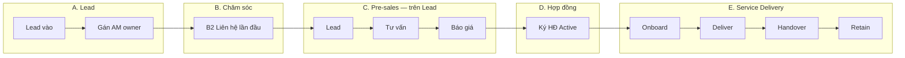

**7 giai đoạn Service Delivery** (sau khi ký HĐ, bắt đầu từ **Onboard**):

| # | Stage code | Tên trên UI | Giai đoạn |
|---|------------|-------------|-----------|
| 1 | `lead` | Lead | Pre-sales *(trên Lead, trước HĐ)* |
| 2 | `consult` | Tư vấn | Pre-sales |
| 3 | `proposal` | Báo giá | Pre-sales |
| 4 | `onboard` | Onboarding | Sau HĐ |
| 5 | `deliver` | Triển khai | Sau HĐ |
| 6 | `handover` | Nghiệm thu | Sau HĐ |
| 7 | `retain` | Chăm sóc | Sau HĐ — **bước cuối** |

**Nguyên tắc vận hành:**

- Chỉ chuyển **tuần tự 1 bước** (lùi 1 bước được phép).
- Phải **hoàn thành 100% task** giai đoạn hiện tại mới chuyển tiếp.
- Pre-sales **không tạo KH thật** cho đến khi HĐ **Active**.
- KPI AM/SP đọc từ dữ liệu thật — không nhập tay trên trang KPI (trừ **Target**).

---

## 2. Bản đồ URL & vai trò

| Công đoạn | URL | Ai làm |
|-----------|-----|--------|
| Danh sách Lead | `/crm/leads` | Marketing, AM |
| Chi tiết Lead + Pre-sales | `/crm/leads/{lead_id}` | AM |
| Intake BANT | `/crm/intake?lead_id={id}` | AM |
| Hợp đồng / Hub | `/crm/hub` | AM, Sales |
| Kanban Delivery | `/crm/service-delivery` | AM, SP, CS |
| Workflow từng KH | `/crm/service-delivery/{lifecycle_id}` | AM, SP |
| KPI nhân viên | `/crm/staff-kpi` | Quản lý, AM, SP |
| Dashboard tuần (Owner) | `/crm/owner-weekly` | Director |
| Dashboard tháng | `/crm/business-dashboard` | Executive |

**Đăng nhập:** `/admin` (port mặc định `5050` theo `.env`).

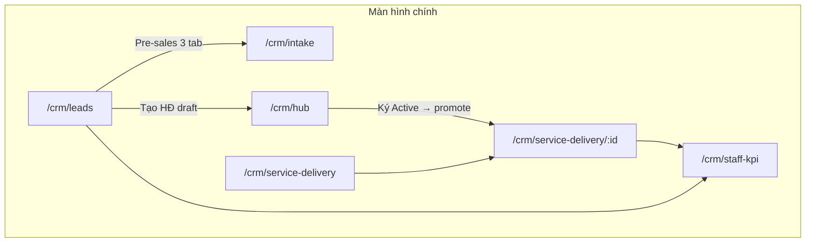

---

## 3. Công đoạn 1 — Lead vào (tóm tắt)

### Mục tiêu

Ghi nhận lead mới từ mọi nguồn → chấm điểm → **gán AM** (`owner_id`).

### Chu trình ingest → phân công

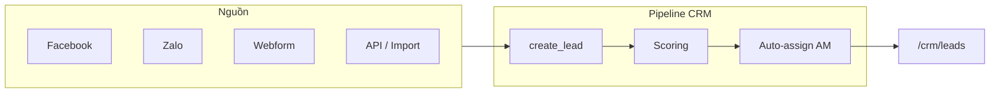

| Nguồn | Setup chi tiết |
|-------|----------------|
| Facebook Lead Ads | [Setup Facebook](./huong-dan-nguon-lead-va-setup.md#4-setup-facebook-lead-ads) |
| Zalo OA / Ads | [Setup Zalo](./huong-dan-nguon-lead-va-setup.md#5-setup-zalo-oa--zalo-ads) |
| Webform Landing | [Setup Webform](./huong-dan-nguon-lead-va-setup.md#6-setup-webform--landing-website) |
| API / Zapier | [Marketing Ingest](./huong-dan-nguon-lead-va-setup.md#7-api-marketing-ingest) |
| Nhập tay / CSV | [Mục 8](./huong-dan-nguon-lead-va-setup.md#8-nhập-tay-import-csv-api-tạo-lead) |

### Cách sử dụng (AM / Marketing sau khi lead đã vào)

| Bước | Thao tác | Ghi chú |
|------|----------|---------|
| 1 | Mở `/crm/leads` | Lọc theo nguồn (`Facebook`, `Zalo`, `Website`…) |
| 2 | Kiểm tra lead mới | Điểm, phân hạng hot/warm/cold |
| 3 | Xác nhận **Owner** | Auto-assign FR-05 hoặc gán tay |
| 4 | (Tuỳ chọn) Đổi owner | Lead detail → Phân công → sync AM lifecycle |

### Cấu hình phân lead (Director / IT)

`/crm/leads` → **「Cấu hình phân lead」** — chấm điểm, phương pháp phân, tab Facebook.

→ Chi tiết: [huong-dan-nguon-lead-va-setup.md §3](./huong-dan-nguon-lead-va-setup.md#3-cấu-hình-chung-trên-crm)

### Kết quả mong đợi

- Lead có `owner_id` = AM active.
- Sẵn sàng **Công đoạn 2** (B2).

---

## 3b. Nguồn lead & Setup — tài liệu riêng

Toàn bộ **chu trình quản lý lead từ nguồn**, sơ đồ minh hoạ, hướng dẫn setup Facebook / Zalo / Webform / API, checklist IT và test case ingest:

**→ [docs/crm/huong-dan-nguon-lead-va-setup.md](./huong-dan-nguon-lead-va-setup.md)**

---

## 4. Công đoạn 2 — Chăm sóc B2 (Liên hệ lần đầu)

### Mục tiêu

Liên hệ lead trong **48h**, xác nhận nhu cầu — **gate bắt buộc** trước Pre-sales.

### Cách sử dụng

| Bước | Thao tác | Chi tiết |
|------|----------|----------|
| 1 | Mở `/crm/leads/{lead_id}` | Tab hoạt động / chăm sóc |
| 2 | Gọi / nhắn lead | Ghi activity loại **call** hoặc **message** |
| 3 | Báo cáo chăm sóc | `care_stage_key = first_contact` |
| 4 | Cập nhật trạng thái | **Liên hệ OK** (`da_lien_he_thanh_cong`) |
| 5 | Hoàn thành bước B2 | API care-stages / nút hoàn thành pipeline |

### Sơ đồ gate

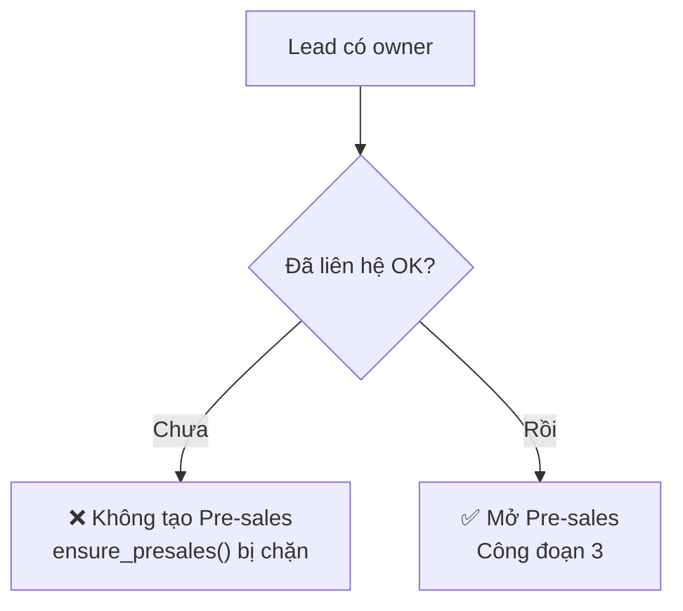

### Lỗi thường gặp

| Triệu chứng | Nguyên nhân | Cách xử lý |
|-------------|-------------|------------|
| «Chưa hoàn thành B2» | Chưa complete `first_contact` | Làm bước 2–5 ở trên |
| Không thấy nút Pre-sales | Flag tắt | Bật `PTT_PRESALES_ON_LEAD=1` |

---

## 5. Công đoạn 3 — Pre-sales trên Lead

### Mục tiêu

Bắt đầu quy trình **Lead → Tư vấn → Báo giá** trên lead (chưa có KH/HĐ).

### Cách sử dụng

| Bước | Thao tác | Chi tiết |
|------|----------|----------|
| 1 | `/crm/leads/{id}` | Panel **Pre-sales dịch vụ** |
| 2 | Chọn **dịch vụ** (1 trong 12 slug) | VD: `dich-vu-aeo`, `dich-vu-seo-local` |
| 3 | Bấm **Bắt đầu pre-sales** | Tạo `crm_lead_presales`, `assigned_am = owner` |
| 4 | Tab **Lead** | Làm từng task card → tick ✓ |
| 5 | Ghi chi phí pre-sales (nếu có) | Trong cap `PTT_PRESALES_COST_CAP_VND` |

### Sơ đồ 3 tab Pre-sales

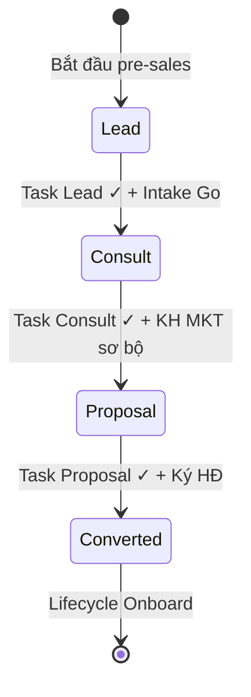

### Phân công tại giai đoạn này

| Vai trò | Cách gán | KPI |
|---------|----------|-----|
| **AM** | Tự động = `owner_id` lead | Intake, Go, chi phí pre-sales |
| **SP** | Chưa bắt buộc | — |

---

## 6. Công đoạn 4 — Intake (Go / No-Go)

### Mục tiêu

Quyết định có đi **Tư vấn** hay dừng funnel.

### Cách sử dụng

| Bước | Thao tác | Chi tiết |
|------|----------|----------|
| 1 | Trên panel Lead → link **Intake** | `/crm/intake?lead_id={id}` |
| 2 | Chọn mode | **Gọi điện (PHẦN A)** hoặc **Gặp trực tiếp (PHẦN B)** |
| 3 | Điền BANT, stakeholder | Lưu draft nếu cần |
| 4 | Hoàn thành phiên | `status = completed` |
| 5 | Chọn quyết định | **Go** / Nurture / **No-Go** |
| 6 | Quay Lead → tick ✓ task Lead | |
| 7 | **Chuyển bước → Tư vấn** | Gate kiểm BANT / No-Go |

### Sơ đồ quyết định Intake

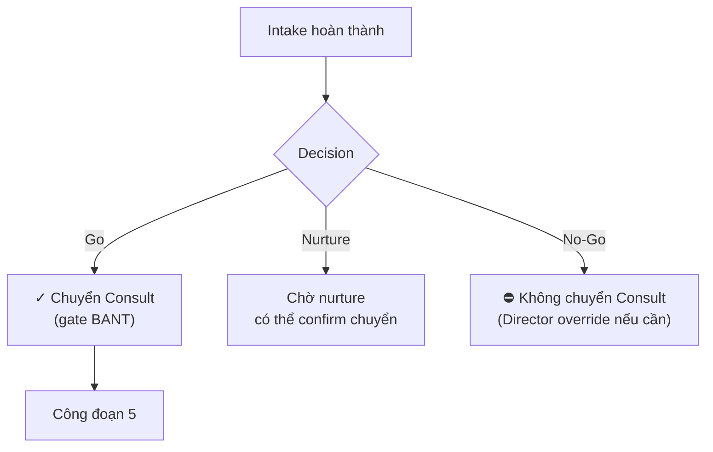

### KPI liên quan (`/crm/staff-kpi`)

- Intake hoàn thành
- Intake gọi ≤48h
- Go → Consult %
- Chi phí pre-sales / Go

---

## 7. Công đoạn 5 — Tư vấn (Consult)

### Mục tiêu

Audit / discovery — đủ dữ liệu để báo giá. **Không thu phí tư vấn** (pre-sales miễn phí).

### Cách sử dụng

| Bước | Thao tác | Chi tiết |
|------|----------|----------|
| 1 | Tab **Tư vấn** trên Lead | Xem Consult Brief (nếu có) |
| 2 | **Prefill form Consult** | Kéo dữ liệu từ Lead / Intake |
| 3 | Thu tài liệu KH | URL, GSC, Ads… theo dịch vụ |
| 4 | Điền task Consult → ✓ | SLA khuyến nghị ≤48h sau meeting |
| 5 | **AI Hỗ trợ** (tuỳ chọn) | Phân tích consult |
| 6 | Điền **KH Marketing sơ bộ** (R5) | Bắt buộc trước Proposal |
| 7 | **Chuyển bước → Báo giá** | Gate KH MKT sơ bộ |

**Tài liệu SOP chi tiết:** [consult-stage-am-sop.md](../runbooks/consult-stage-am-sop.md)

### Sơ đồ Consult

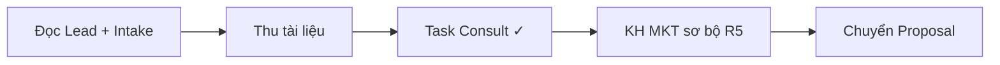

---

## 8. Công đoạn 6 — Báo giá (Proposal)

### Mục tiêu

Hoàn thiện báo giá, kiểm soát chi phí pre-sales, sẵn sàng ký HĐ.

### Cách sử dụng

| Bước | Thao tác | Chi tiết |
|------|----------|----------|
| 1 | Tab **Báo giá** | Task Proposal |
| 2 | **Tạo Proposal từ Consult** (tuỳ chọn) | `/crm/proposals` — prefill slug + ghi chú |
| 3 | Hoàn thành task Proposal → ✓ | |
| 4 | Kiểm tra **cap chi phí** | Banner đỏ nếu vượt cap |
| 5 | Meta: «Chờ ký HĐ → Lifecycle Onboard» | |

### Cap chi phí pre-sales

| Biến `.env` | Ý nghĩa |
|-------------|---------|
| `PTT_PRESALES_COST_CAP_VND` | Cap mặc định (VD: 3.000.000) |
| `PTT_PRESALES_CAP_STRICT=1` | Chặn ghi chi phí vượt cap |

---

## 9. Công đoạn 7 — Ký HĐ & chuyển Delivery

### Mục tiêu

Tạo **KH thật + Case**, promote sang Lifecycle **Onboard**.

### Cách sử dụng

| Bước | Thao tác | Chi tiết |
|------|----------|----------|
| 1 | **Tạo HĐ draft** | Panel Lead hoặc `/crm/hub` |
| 2 | KH placeholder | `[Lead #id] Chưa ký — …` (tự thay khi ký) |
| 3 | Hoàn thành mọi task Pre-sales | Lead + Consult + Proposal |
| 4 | Hub → Sửa HĐ → **Active (ký)** | `convert_lead_to_crm` + `promote_presales_to_lifecycle` |
| 5 | Kiểm tra Delivery | `/crm/service-delivery` — lifecycle mới ở **Onboard** |

### Sơ đồ promote

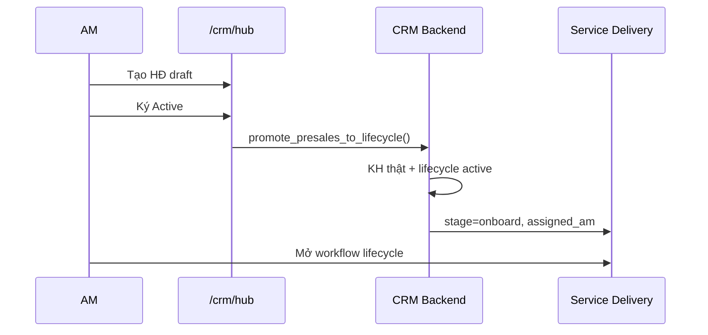

### Kết quả hệ thống

| Trường | Giá trị |
|--------|---------|
| `crm_lead_presales.status` | `converted` |
| `crm_service_lifecycle.status` | `active` |
| `crm_service_lifecycle.stage` | `onboard` |
| Task Lead/Consult/Proposal | Đã ✓ (auto hoặc promote) |

---

## 10. Công đoạn 8 — Onboarding

### Mục tiêu

Khởi động triển khai sau HĐ — gán SP, hoàn thành checklist onboard.

### Cách sử dụng

| Bước | Thao tác | Chi tiết |
|------|----------|----------|
| 1 | `/crm/service-delivery/{lifecycle_id}` | Workflow chi tiết |
| 2 | **Gán Specialist** | Dropdown SP → **Lưu SP** |
| 3 | (Tuỳ chọn) **Gợi ý từ task** | Sync tên từ field task Lead/Onboard |
| 4 | Hoàn thành task **Onboarding** | Tick ✓ từng task |
| 5 | Chuẩn bị **TMMT / KH Marketing chính thức** | R5 Product Model |
| 6 | **Chuyển → Triển khai** | Cần gate TMMT pass |

### Panel AM / SP trên workflow

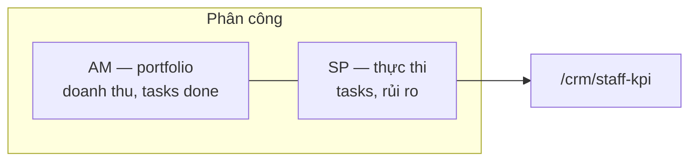

---

## 11. Công đoạn 9 — Triển khai (Deliver)

### Mục tiêu

Thực thi dịch vụ theo HĐ; ghi nhận chi phí delivery & thanh toán.

### Cách sử dụng

| Bước | Thao tác | Chi tiết |
|------|----------|----------|
| 1 | Xác nhận **gate TMMT** xanh | Panel Product Model trên workflow |
| 2 | **Chuyển → Triển khai** | Tuần tự từ Onboard |
| 3 | SP hoàn thành task Deliver | Retainer: task theo tháng |
| 4 | Ghi **chi phí delivery** | `cost_phase = delivery` |
| 5 | AM ghi **payment received** | Finance panel workflow |
| 6 | Theo dõi **rủi ro** (nếu có) | SP xử lý → KPI risks_resolved |

### Gate Onboard → Deliver

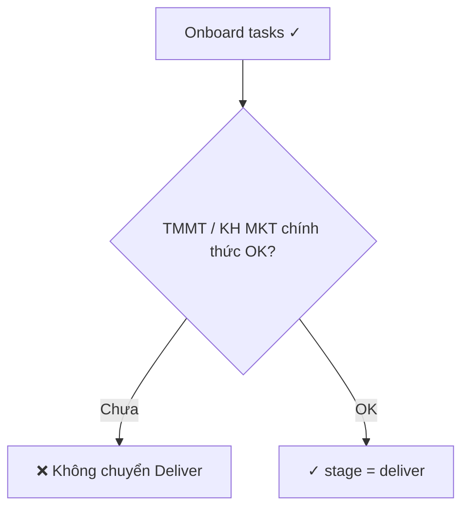

---

## 12. Công đoạn 10 — Nghiệm thu (Handover)

### Mục tiêu

Bàn giao kết quả cho khách hàng, xác nhận deliverable.

### Cách sử dụng

| Bước | Thao tác | Chi tiết |
|------|----------|----------|
| 1 | Hoàn thành task **Deliver** | 100% task stage deliver |
| 2 | **Chuyển → Nghiệm thu** | |
| 3 | Checklist handover | Biên bản, tài liệu bàn giao |
| 4 | Xác nhận KH OK | Ghi trong task / activity |
| 5 | Tick ✓ task Handover | |

---

## 13. Công đoạn 11 — Chăm sóc KH (Retain)

### Mục tiêu

**Bước cuối cùng** — duy trì quan hệ, renewal, upsell, giảm churn.

### Cách sử dụng

| Bước | Thao tác | Chi tiết |
|------|----------|----------|
| 1 | Hoàn thành Handover → **Chuyển → Chăm sóc** | `stage = retain` |
| 2 | Task chăm sóc định kỳ | Check-in, health scan |
| 3 | Renewal / upsell | HĐ mới → lifecycle mới hoặc mở rộng |
| 4 | Đóng lifecycle (nếu hết HĐ) | `status = closed` |
| 5 | Theo dõi churn | `/crm/owner-weekly` — retention WoW |

### Vòng đời sau Retain

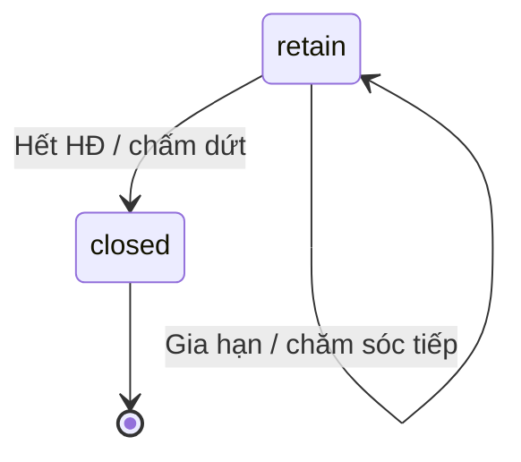

### Luồng đầy đủ (tóm tắt 1 trang)

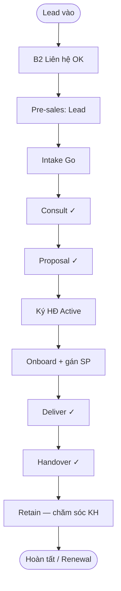

---

## 14. KPI nhân viên & đánh giá

### Trang KPI

**URL:** `/crm/staff-kpi` (menu CRM → **KPI AM/SP**)

### Cách đánh giá (3 bước)

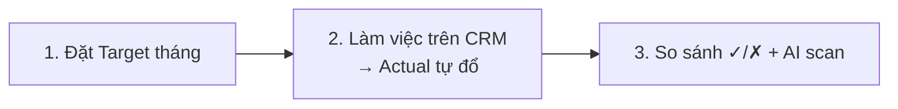

| Section | Metric | Nguồn dữ liệu |
|---------|--------|---------------|
| **AM (sau HĐ)** | Doanh thu, DV active, biên LN, công nợ | `assigned_am` + payments |
| **AM Lead** | Intake, Go→Consult, chi phí pre-sales | Lead / presales / intake |
| **SP** | Task done, backlog, rủi ro | `assigned_sp` + `done_by` |

### Banner chẩn đoán

Nếu thấy: *«NV có X lead nhưng 0 lifecycle»*:

1. Vào từng lead → tạo Pre-sales + Intake.
2. Bấm **Đồng bộ AM từ lead owner** trên trang KPI.
3. Đặt **Target** (không để toàn 0) để thấy ✓/✗.

### Dashboard cấp công ty

| Trang | Chu kỳ | Mục đích |
|-------|--------|----------|
| `/crm/owner-weekly` | Tuần | RAG owner, cash, pipeline |
| `/crm/business-dashboard` | Tháng | Executive KPI |
| `/crm/kpi` | Tháng | KPI thủ công theo chức danh *(khác lifecycle)* |

---

## 15. Phân công AM / SP

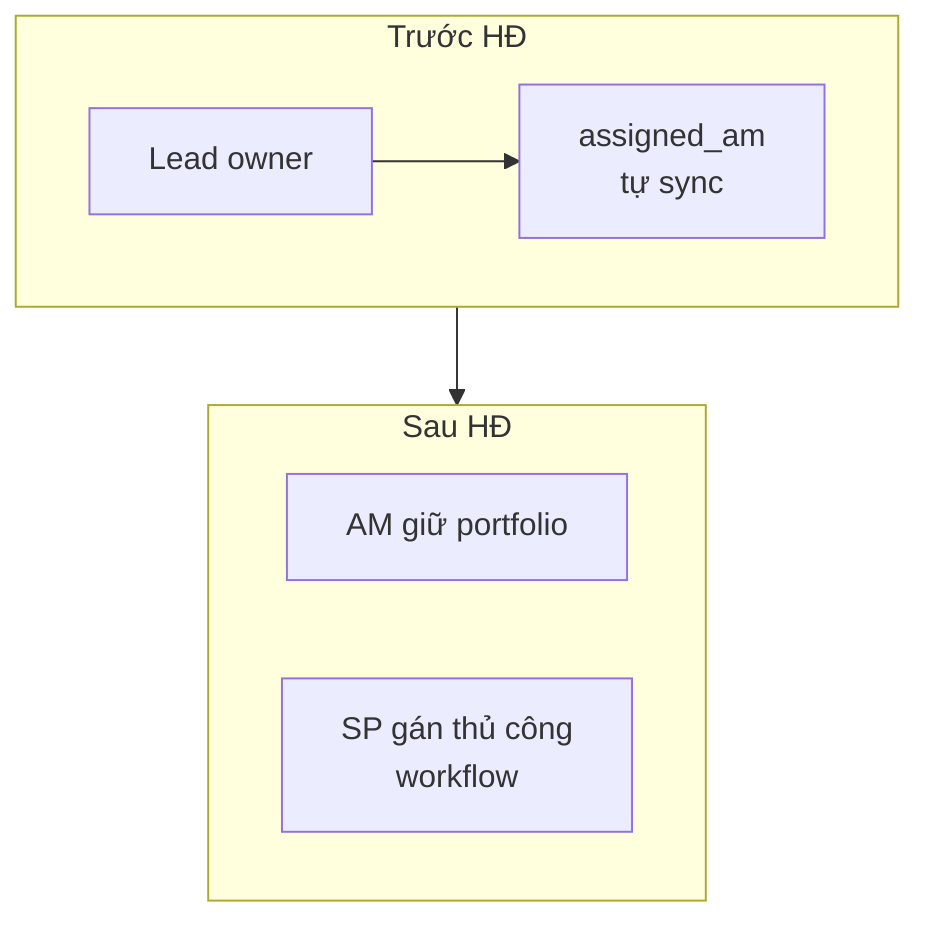

| Vai trò | Gán ở đâu | Giai đoạn chính |
|---------|-----------|-----------------|
| **AM** | Owner lead (auto) | Lead → Retain |
| **SP** | Workflow → Gán Specialist | Onboard → Retain |

**Đổi AM:** đổi owner trên Lead → lifecycle sync `assigned_am`.

---

## 16. Sơ đồ trạng thái & gate

### Gate tổng hợp

| # | Gate | Chặn gì |
|---|------|---------|
| G1 | B2 `first_contact` | Tạo Pre-sales |
| G2 | Task Lead ✓ + Intake Go | Lead → Consult |
| G3 | No-Go / BANT thấp | Consult (trừ Director override) |
| G4 | KH MKT sơ bộ R5 | Consult → Proposal |
| G5 | Cap pre-sales | Ghi chi phí (strict mode) |
| G6 | Task cả 3 stage pre-sales | Promote / ký HĐ |
| G7 | TMMT / KH MKT chính thức | Onboard → Deliver |
| G8 | Task stage hiện tại ✓ | Mọi chuyển bước lifecycle |

### Ma trận công đoạn × màn hình

| Công đoạn | Màn hình chính | Chuyển bước |
|-----------|----------------|-------------|
| Lead vào | `/crm/leads` | — |
| B2 | `/crm/leads/{id}` | Care pipeline |
| Pre-sales Lead | Lead panel tab Lead | → Consult |
| Intake | `/crm/intake?lead_id=` | — |
| Consult | Lead panel tab Tư vấn | → Proposal |
| Proposal | Lead panel tab Báo giá | → Ký HĐ |
| Onboard → Retain | `/crm/service-delivery/{id}` | Nút **Chuyển →** |

---

## 17. Test case tham chiếu

Bộ test tự động trong repo (pytest / unittest):

| ID | Mô tả | File test |
|----|-------|-----------|
| TC-A02 | Pre-sales chặn trước B2 | `tests/test_crm_lead_presales.py` |
| TC-B03 | Intake Go → Consult | `tests/test_crm_lead_presales.py` |
| TC-B06 | Promote → Onboard | `tests/test_crm_lead_presales.py` |
| TC-C04 | Không nhảy stage | `tests/test_crm_service_lifecycle.py` |
| TC-C05 | Task chưa xong → chặn | `tests/test_crm_service_lifecycle.py` |
| TC-D03 | Banner KPI gap | `tests/test_crm_staff_kpi_readiness.py` |
| TC-D04 | Backfill AM | `tests/test_crm_svc_lead_am_sync.py` |

**Smoke test thủ công:** [presales-on-lead-pilot-checklist.md](./presales-on-lead-pilot-checklist.md)

---

## 18. Xử lý sự cố thường gặp

| Vấn đề | Nguyên nhân | Cách xử lý |
|--------|-------------|------------|
| KPI toàn 0 | Chưa Pre-sales / Intake / lifecycle | Làm Công đoạn 3–7; xem banner KPI |
| «Chưa hoàn thành B2» | Gate care | Công đoạn 2 |
| «Chưa hoàn thành task giai đoạn …» | Task chưa ✓ | Tick task trước khi chuyển bước |
| «TMMT chưa đủ» | Thiếu KH MKT chính thức | Điền R5 trên workflow |
| Ký HĐ lỗi promote | Task pre-sales thiếu | ✓ cả 3 tab Lead/Consult/Proposal |
| Lifecycle không gán AM | `lead_id` null | Gắn lead; **Đồng bộ AM** trên KPI |
| Không thấy Pre-sales panel | Flag tắt | `PTT_PRESALES_ON_LEAD=1` + restart Flask |

### Lệnh hữu ích

```bash
# Restart Flask (local)
cd PTTADS && PORT=5050 python3 app.py

# Backfill lifecycle draft cũ → presales
python3 scripts/backfill_draft_lifecycle_to_presales.py --dry-run

# Chạy test regression
python3 -m pytest tests/test_crm_lead_presales.py tests/test_crm_service_lifecycle.py -q
```

---

## Phụ lục — Checklist nhanh AM (1 deal)

- [ ] Lead có owner = tôi
- [ ] B2 Liên hệ OK
- [ ] Pre-sales bắt đầu (chọn đúng dịch vụ)
- [ ] Intake completed + **Go**
- [ ] Consult ✓ + KH MKT sơ bộ
- [ ] Proposal ✓ + trong cap chi phí
- [ ] HĐ draft → **Active**
- [ ] Workflow Onboard: gán SP
- [ ] TMMT OK → Deliver → Handover → **Retain**
- [ ] Payment received + Target KPI tháng

---

**Liên quan:** [README CRM](./README.md) · [Nguồn lead & Setup FB/Zalo/Webform](./huong-dan-nguon-lead-va-setup.md) · [Checklist pilot Pre-sales](./presales-on-lead-pilot-checklist.md) · [SOP Consult](../runbooks/consult-stage-am-sop.md)
