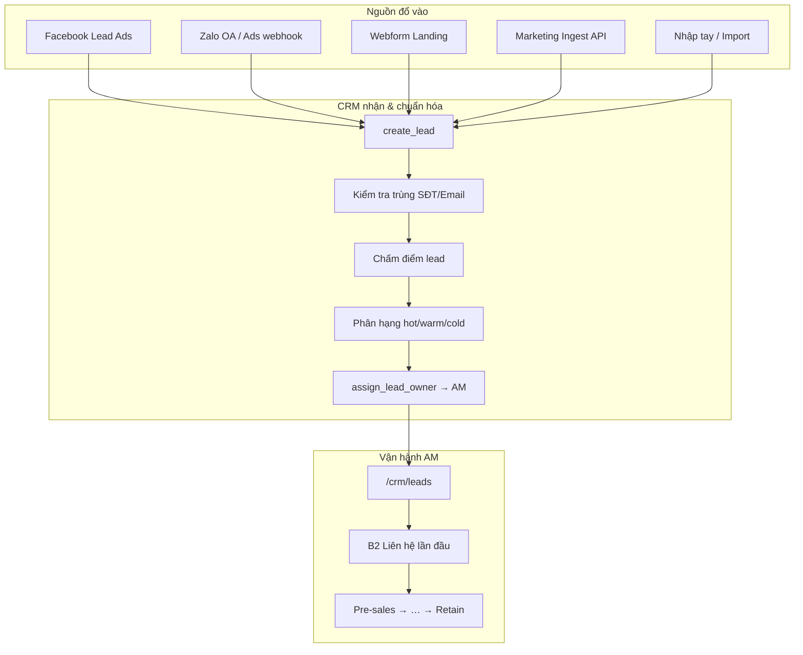
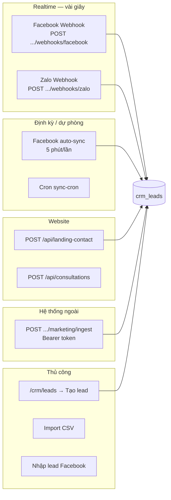
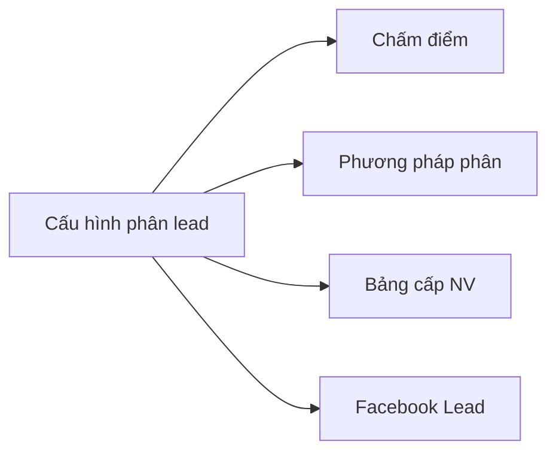
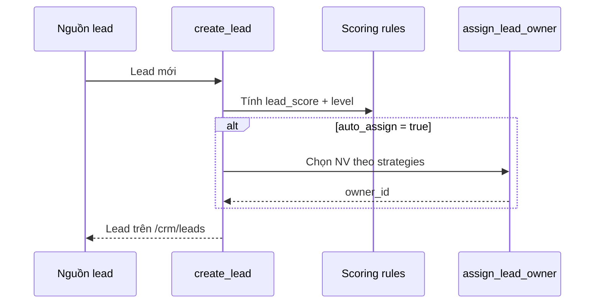
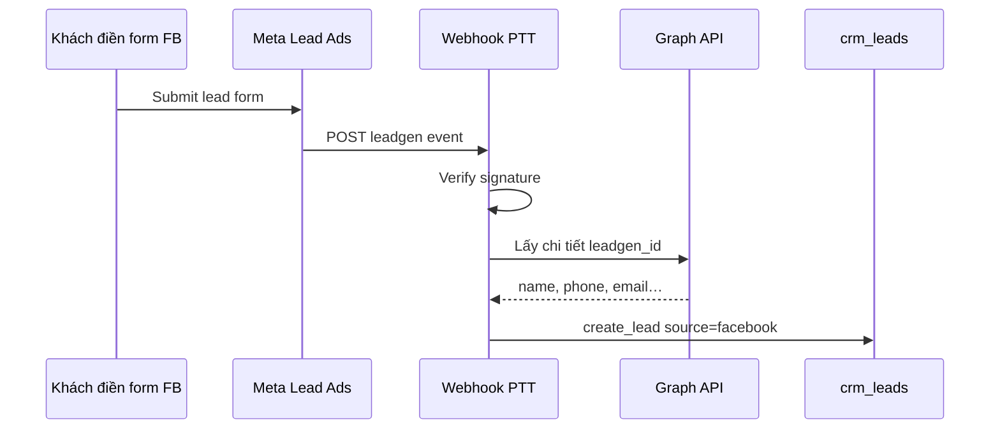
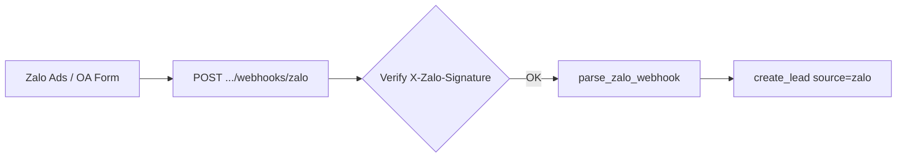
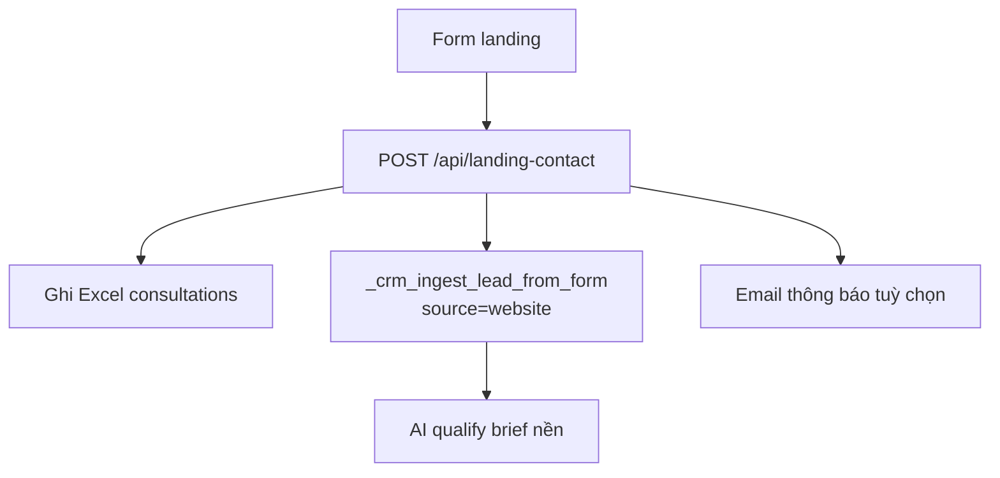
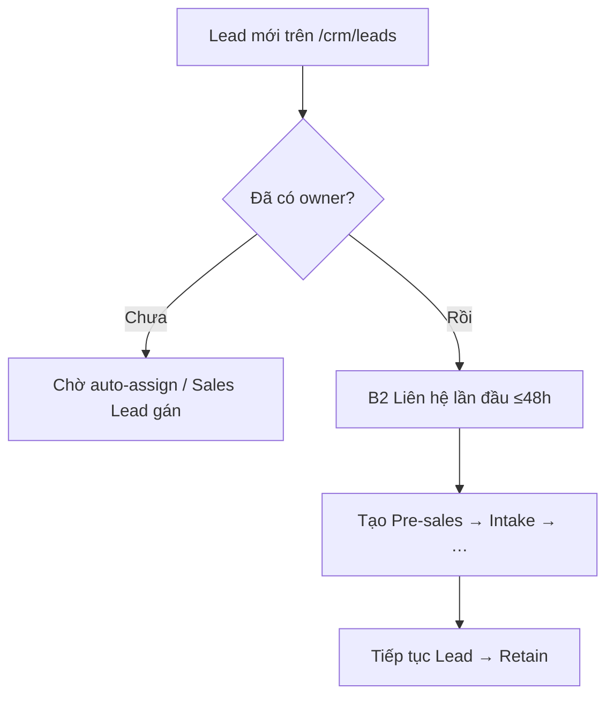

# Chu trình quản lý Lead từ nguồn & Hướng dẫn Setup

**Phiên bản:** 1.0 · 2026-07-06  
**Đối tượng:** Marketing, IT, Sales Lead, Director  
**Liên quan:** [Hướng dẫn Lead → Retain](./huong-dan-day-du-lead-den-cham-soc-khach-hang.md)

---

## Mục lục

1. [Chu trình tổng quát](#1-chu-trình-tổng-quat)
2. [Nguồn lead trong hệ thống](#2-nguồn-lead-trong-hệ-thống)
3. [Cấu hình chung trên CRM](#3-cấu-hình-chung-trên-crm)
4. [Setup Facebook Lead Ads](#4-setup-facebook-lead-ads)
5. [Setup Zalo OA / Zalo Ads](#5-setup-zalo-oa--zalo-ads)
6. [Setup Webform / Landing website](#6-setup-webform--landing-website)
7. [API Marketing Ingest](#7-api-marketing-ingest)
8. [Nhập tay, Import CSV, API tạo lead](#8-nhập-tay-import-csv-api-tạo-lead)
9. [Sau khi lead vào — AM làm gì](#9-sau-khi-lead-vào--am-làm-gì)
10. [Xử lý sự cố ingest](#10-xử-lý-sự-cố-ingest)
11. [Test case nguồn lead](#11-test-case-nguồn-lead)

---

## 1. Chu trình tổng quát

Mọi nguồn lead đều đi qua **một pipeline chuẩn** trước khi vào Pre-sales / Service Delivery:



### Thời điểm ghi nhận

| Trường | Ý nghĩa |
|--------|---------|
| `created_at` | Lúc bản ghi tạo trên CRM |
| `received_at` (meta) | **Thời điểm lead đổ về** — ưu tiên từ webhook/form (FB, Zalo, web…) |

### Nguồn (`source`) trên CRM

| Code | Nhãn UI |
|------|---------|
| `website` | Website / Form |
| `facebook` | Facebook |
| `zalo` | Zalo |
| `google_ads` | Google Ads |
| `referral` | Giới thiệu |
| `import` | Import file |
| `api` | API |
| `manual` | Nhập tay |
| `email` | Email |
| `other` | Khác |

---

## 2. Nguồn lead trong hệ thống



| Nguồn | Endpoint / UI | `source` | Auto-assign |
|-------|---------------|----------|-------------|
| Facebook webhook | `POST /api/crm/integration/webhooks/facebook` | `facebook` | Có (nếu bật trong config) |
| Facebook sync | Nút «Đồng bộ ngay» / auto-sync | `facebook` | Có |
| Zalo webhook | `POST /api/crm/integration/webhooks/zalo` | `zalo` | Có |
| Landing form | `POST /api/landing-contact` | `website` | Có |
| Marketing API | `POST /api/crm/integration/marketing/ingest` | `marketing` / tùy payload | Có |
| Nhập tay | `POST /api/crm/leads` | `manual` | Có |
| Import CSV | UI Leads | `import` | Theo config |
| Nhập FB thủ công | `POST /api/crm/integration/facebook/leads` | `facebook` | Có |

**URL production mẫu** (thay domain của bạn):

```
https://pttads.vn/api/crm/integration/webhooks/facebook
https://pttads.vn/api/crm/integration/webhooks/zalo
https://pttads.vn/api/crm/integration/marketing/ingest
https://pttads.vn/api/landing-contact
```

**Webhook theo dự án BĐS** (slug):

```
https://pttads.vn/api/crm/integration/webhooks/facebook/{slug}
https://pttads.vn/api/crm/integration/webhooks/zalo/{slug}
```

Slug map với `re_project` — dùng khi nhiều dự án, mỗi dự án một verify token / routing riêng.

---

## 3. Cấu hình chung trên CRM

### Mở màn hình cấu hình

1. Đăng nhập `/admin` → `/crm/leads`
2. Nút **「Cấu hình phân lead」** (cần quyền `crm_leads` → configure)
3. Các tab:



| Tab | Nội dung |
|-----|----------|
| **Chấm điểm** | Rubric D1–D6, rule scoring, ngưỡng hot/warm/cold |
| **Phương pháp phân** | Bật **Tự động phân lead**; thứ tự strategy (khu vực, sản phẩm, round-robin, hot priority…) |
| **Bảng cấp NV** | Map phân hạng lead → cấp nhân viên |
| **Facebook Lead** | Page ID, Form ID, webhook, auto-sync (xem mục 4) |

### Ghi chú nhân viên (quan trọng cho auto-assign)

Tại `/crm/staff`, field **Ghi chú / notes** nên có:

- Khu vực phụ trách: `q.7, q.2, thủ đức`
- Sản phẩm: `căn hộ, aeo, seo local`
- Thế mạnh: `việt kiều, bđs cao cấp`

Hệ thống dùng text này khi chạy strategy **phân theo khu vực / sản phẩm**.

### Luồng auto-assign (FR-05)



API lưu config: `PUT /api/crm/leads/config`

---

## 4. Setup Facebook Lead Ads

### 4.1. Sơ đồ tích hợp



### 4.2. Biến môi trường (`.env`)

Thêm vào `PTTADS/.env` và **restart Flask**:

```env
# Facebook Lead Ads
CRM_FACEBOOK_VERIFY_TOKEN=your_random_verify_string
CRM_FACEBOOK_APP_SECRET=your_meta_app_secret
CRM_FACEBOOK_PAGE_ACCESS_TOKEN=your_long_lived_page_token

# Tuỳ chọn — URL callback công khai (mặc định pttads.vn)
# CRM_FACEBOOK_WEBHOOK_URL=https://your-domain.vn/api/crm/integration/webhooks/facebook

# Cron đồng bộ dự phòng (dùng chung marketing secret)
CRM_MARKETING_INGEST_SECRET=your_random_secret
# CRM_FACEBOOK_SYNC_SECRET=...   # hoặc riêng cho sync API
```

| Biến | Bắt buộc | Mục đích |
|------|----------|----------|
| `CRM_FACEBOOK_VERIFY_TOKEN` | Có (webhook) | Meta gửi khi subscribe webhook |
| `CRM_FACEBOOK_APP_SECRET` | Khuyến nghị | Verify `X-Hub-Signature-256` |
| `CRM_FACEBOOK_PAGE_ACCESS_TOKEN` | Có (lấy chi tiết lead) | Graph API enrich leadgen |
| `CRM_MARKETING_INGEST_SECRET` | Cho sync/cron | Bearer token API sync |

### 4.3. Meta Developer — đăng ký Webhook

1. Vào [Meta for Developers](https://developers.facebook.com/) → App → **Webhooks**
2. Object: **Page** → Subscribe field: **`leadgen`**
3. **Callback URL:**

   ```
   https://YOUR-DOMAIN/api/crm/integration/webhooks/facebook
   ```

   ⚠️ **Không** thêm dấu `/` cuối URL (Meta có thể 404 → `delivery.rejected`).

4. **Verify token:** cùng giá trị `CRM_FACEBOOK_VERIFY_TOKEN`
5. Subscribe Page cần nhận lead

### 4.4. Nginx (production)

Tham khảo `deploy/nginx-facebook-webhook.conf`:

- Proxy tới Flask/gunicorn
- Forward header `X-Hub-Signature-256`
- Redirect URL có trailing slash

### 4.5. Cấu hình trên CRM UI

`/crm/leads` → **Cấu hình phân lead** → tab **Facebook Lead**:

| Tuỳ chọn | Khuyến nghị |
|----------|-------------|
| Bật lấy lead tự động | ✓ |
| Facebook Page ID | ID Page chạy quảng cáo |
| Form ID | Danh sách form (phẩy `,`) — để trống = mọi form trên Page |
| Nhận qua Webhook | ✓ (realtime) |
| Tự động đồng bộ nền | ✓ (5 phút, dự phòng) |
| Tối ưu dữ liệu | ✓ |
| Chấm điểm → phân công | ✓ |

**Lưu cấu hình** → bấm **「Đồng bộ ngay từ Facebook」** để test.

### 4.6. API bổ sung

| Method | Endpoint | Mục đích |
|--------|----------|----------|
| GET | `/api/crm/integration/facebook/status` | Trạng thái tích hợp |
| POST | `/api/crm/integration/facebook/sync` | Đồng bộ thủ công (admin) |
| POST | `/api/crm/integration/facebook/sync-auto` | Sync gần đây |
| POST | `/api/crm/integration/facebook/sync-cron` | Cron (Bearer secret) |
| POST | `/api/crm/integration/facebook/leads` | Nhập tay 1 lead FB |

**Nhập tay trên UI:** `/crm/leads` → **「Nhập lead Facebook」** (khi webhook lỗi / test).

### 4.7. Kiểm tra webhook hoạt động

1. Meta Events Manager → Webhooks → **Test**
2. Trên CRM: tab Facebook → dòng trạng thái `last_webhook_at`, `last_webhook_created`
3. `/crm/leads` → lead mới `source = Facebook`
4. Log server: `ptt.facebook.webhook`

---

## 5. Setup Zalo OA / Zalo Ads

### 5.1. Sơ đồ



### 5.2. Biến môi trường

```env
CRM_ZALO_WEBHOOK_SECRET=your_zalo_oa_secret
# CRM_ZALO_WEBHOOK_URL=https://your-domain.vn/api/crm/integration/webhooks/zalo
```

Nếu **chưa** cấu hình secret → dev mode bỏ qua verify (không dùng production).

### 5.3. Cấu hình trên Zalo OA / Zalo Ads

1. Zalo OA Console → **Webhook**
2. **Callback URL:**

   ```
   https://YOUR-DOMAIN/api/crm/integration/webhooks/zalo
   ```

3. Secret / App secret → gán vào `CRM_ZALO_WEBHOOK_SECRET`
4. Subscribe event: **`user_submit_info`**, tin nhắn form, v.v.

### 5.4. Payload hỗ trợ

Hệ thống parse:

- Payload phẳng: `{ "full_name", "phone", "email", "need", ... }`
- Event Zalo: `user_submit_info`, `oa_send_text`, `user_send_text`, `follow`
- Mảng `events[]` lồng nhau

**Bắt buộc:** có **SĐT hoặc email hợp lệ** — nếu thiếu → `skipped`.

### 5.5. Campaign → dự án BĐS

Webhook gửi `campaign_id` / `utm_campaign` → CRM map sang `re_project_id` (nếu cấu hình trong dự án).

URL slug:

```
POST /api/crm/integration/webhooks/zalo/{project_slug}
```

### 5.6. Kiểm tra

```bash
curl -X POST https://YOUR-DOMAIN/api/crm/integration/webhooks/zalo \
  -H "Content-Type: application/json" \
  -H "X-Zalo-Signature: <hmac nếu bật secret>" \
  -d '{"full_name":"Test Zalo","phone":"0901234567","need":"Quan tâm SEO"}'
```

Kỳ vọng: `201`, `created_count >= 1`, lead trên `/crm/leads` nguồn **Zalo**.

---

## 6. Setup Webform / Landing website

### 6.1. Form trên Landing PTT (sẵn có)

Trang public (VD: `/` landing) — form `#contact-form`:

```html
<form id="contact-form" data-landing-contact="/api/landing-contact" ...>
```

**Luồng khi khách submit:**



| Loại form | Trường bắt buộc |
|-----------|-----------------|
| **Full** | Họ tên, email, SĐT, ngân sách, công ty |
| **Quick (FAB)** | Họ tên, email + message |

Lead CRM: `source = website`, `meta.ingest_channel = website_form`.

### 6.2. Form dịch vụ chi tiết

`POST /api/consultations` — form tư vấn theo dịch vụ (slug + budget + goal…):

- Ghi Excel + email
- *(Không tự tạo `crm_leads` trực tiếp — dùng landing-contact hoặc marketing ingest nếu cần CRM)*

### 6.3. Tích hợp webform site khác

**Cách 1 — Gọi Marketing Ingest** (khuyến nghị cho site ngoài):

Xem [mục 7](#7-api-marketing-ingest).

**Cách 2 — Proxy qua landing API:**

Site khác POST JSON tới `/api/landing-contact` (CORS có thể cần cấu hình thêm trên Flask).

**Cách 3 — Zapier / Make:**

Webhook → `POST /api/crm/integration/marketing/ingest` với Bearer token.

### 6.4. UTM & dự án

Form có thể gửi thêm (JSON):

```json
{
  "utm_campaign": "campaign_seo_q3",
  "re_project_code": "VGP",
  "ingest_site": "landing-partner-xyz"
}
```

CRM map campaign / project code → `re_project_id` khi có cấu hình.

### 6.5. SMTP email (tuỳ chọn)

```env
SMTP_HOST=smtp.gmail.com
SMTP_PORT=587
SMTP_USERNAME=...
SMTP_PASSWORD=...
SMTP_FROM=noreply@your-domain.vn
```

Lead vẫn vào CRM nếu email fail — chỉ mất thông báo mail.

---

## 7. API Marketing Ingest

Dùng cho **hệ thống marketing bên ngoài**, landing partner, automation.

### 7.1. Bật API

```env
CRM_MARKETING_INGEST_SECRET=your_long_random_secret
```

Restart Flask. Nếu thiếu secret → API trả `503`.

### 7.2. Gọi API

```http
POST /api/crm/integration/marketing/ingest
Authorization: Bearer YOUR_SECRET
Content-Type: application/json

{
  "name": "Nguyễn Văn A",
  "phone": "0909123456",
  "email": "a@example.com",
  "company": "Công ty ABC",
  "message": "Cần tư vấn SEO",
  "channel": "google_ads",
  "lead_source": "marketing",
  "utm_campaign": "seo_brand_2026",
  "auto_assign": true
}
```

| Field | Bắt buộc | Ghi chú |
|-------|----------|---------|
| `name` | Có | |
| `phone` hoặc `email` | Một trong hai | |
| `channel` | Không | Map kênh CRM |
| `utm_campaign` | Không | Gắn campaign |
| `re_project_id` / `re_project_code` | Không | Dự án BĐS |
| `auto_assign` | Không | Mặc định `true` |

**Lưu ý:** Endpoint này tạo **Case CRM** (`crm_cases`) + event — luồng case/khách hàng marketing. Lead agency thuần thường dùng `POST /api/crm/leads` hoặc webhook Zalo/FB.

### 7.3. Tạo lead CRM trực tiếp (API)

```http
POST /api/crm/leads
Content-Type: application/json
(Cookie session admin hoặc token nội bộ)

{
  "full_name": "...",
  "phone": "...",
  "email": "...",
  "source": "api",
  "region": "q.7",
  "product_interest": "dich-vu-aeo",
  "need": "..."
}
```

---

## 8. Nhập tay, Import CSV, API tạo lead

### 8.1. Nhập tay

1. `/crm/leads` → **「+ Tạo lead」**
2. Điền form → **Lưu lead**
3. `source = manual` (hoặc chọn nguồn)
4. Auto-assign chạy nếu bật trong config

### 8.2. Import CSV

1. `/crm/leads` → **Import CSV**
2. Map cột: tên, SĐT, email, nguồn…
3. `source = import`

### 8.3. Gộp trùng

Khi SĐT/email trùng policy → UI gợi ý merge (`/api/crm/leads/{id}/merge`).

---

## 9. Sau khi lead vào — AM làm gì



| Bước | Thao tác | SLA |
|------|----------|-----|
| 1 | Nhận thông báo lead (UI / refresh list) | Ngay |
| 2 | Gọi lead — ghi activity | ≤48h |
| 3 | Hoàn thành B2 | Trước Pre-sales |
| 4 | Pre-sales + Intake | Theo SOP |
| 5 | Theo [hướng dẫn đầy đủ](./huong-dan-day-du-lead-den-cham-soc-khach-hang.md) | — |

**KPI:** `/crm/staff-kpi` — metric Lead chỉ có số sau Intake / lifecycle gắn AM.

---

## 10. Xử lý sự cố ingest

| Triệu chứng | Nguyên nhân | Cách xử lý |
|-------------|-------------|------------|
| FB webhook verify fail | Sai `VERIFY_TOKEN` | Khớp Meta ↔ `.env` |
| FB lead không vào CRM | Thiếu `PAGE_ACCESS_TOKEN` | Cấp token Graph, sync lại |
| Meta `delivery.rejected` | URL 404/5xx, trailing `/` | Sửa Nginx + URL Meta |
| Chữ ký FB invalid | Sai `APP_SECRET` | Kiểm tra secret, không quote thừa |
| Zalo 401 | Sai signature secret | `CRM_ZALO_WEBHOOK_SECRET` |
| Zalo skipped | Thiếu SĐT/email | Sửa form Zalo gửi phone |
| Webform không có lead CRM | Exception ingest | Xem log Flask; Excel vẫn có = API chạy |
| Marketing ingest 503 | Thiếu secret | `CRM_MARKETING_INGEST_SECRET` |
| Lead không auto-assign | Tắt config / không NV phù hợp | Bật tab Phương pháp phân; kiểm tra notes NV |
| Trùng lead | Policy duplicate | Merge hoặc reject |

### Lệnh kiểm tra nhanh

```bash
# Trạng thái Facebook
curl -s -b "session=..." https://localhost:5050/api/crm/integration/facebook/status

# Test sync (admin session)
curl -X POST https://localhost:5050/api/crm/integration/facebook/sync \
  -H "Cookie: ..."

# Regression test
cd PTTADS && python3 -m pytest tests/test_crm_facebook_leads.py tests/test_crm_leads.py -q
```

---

## 11. Test case nguồn lead

| ID | Nguồn | Mô tả | File test |
|----|-------|-------|-----------|
| TC-S01 | Facebook | Parse webhook payload | `tests/test_crm_facebook_leads.py` |
| TC-S02 | Facebook | Verify signature | `tests/test_crm_facebook_leads.py` |
| TC-S03 | Zalo | Parse user_submit_info | `tests/test_crm_lead_webhooks.py` (nếu có) |
| TC-S04 | Website | `received_at` = created_at khi không meta | `tests/test_crm_leads.py` |
| TC-S05 | Assign | auto_assign theo strategy | `tests/test_crm_lead_auto_assign.py` |
| TC-S06 | Duplicate | Trùng SĐT policy | `tests/test_crm_leads.py` |
| TC-S07 | Config | Lưu facebook_config | UI + `PUT /api/crm/leads/config` |

**Smoke test Facebook:** [presales-on-lead-pilot-checklist.md](./presales-on-lead-pilot-checklist.md)

---

## Phụ lục — Checklist IT go-live nguồn lead

- [ ] `.env`: Facebook verify + app secret + page token
- [ ] `.env`: Zalo secret (nếu dùng)
- [ ] `.env`: `CRM_MARKETING_INGEST_SECRET`
- [ ] Nginx proxy webhook HTTPS
- [ ] Meta subscribe `leadgen` + test delivery OK
- [ ] CRM: bật tab Facebook + Page/Form ID
- [ ] CRM: bật auto-assign + scoring
- [ ] Test landing form → lead `website` trên `/crm/leads`
- [ ] Test Zalo webhook → lead `zalo`
- [ ] AM được đào tạo B2 → Pre-sales

---

**Tiếp theo:** [Hướng dẫn Lead → Retain](./huong-dan-day-du-lead-den-cham-soc-khach-hang.md)
