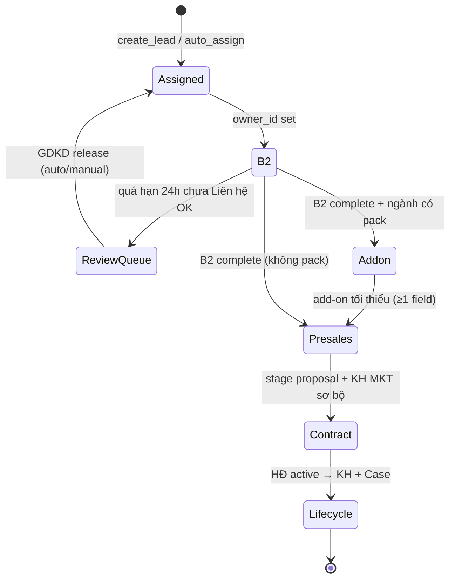

# PTTADS Product Model v1

**Phạm vi:** CRM Lead funnel B2-only (R1–R6, P1–P3). RE project đã gỡ khỏi funnel lead; bảng `crm_re_projects` vẫn phục vụ admin/kế toán.

**Cập nhật:** 2026-07-05 (P4 — blueprint + JS modules + spec)

---

## 1. State machine (lead funnel)



| Bước UI | Key | Gate mở bước tiếp |
|---------|-----|-------------------|
| Phân công | `assigned` | `owner_id` |
| B2 chăm sóc | `b2` | `presales_care_gate.complete` (Liên hệ OK) |
| Add-on ngành | `addon` | `industry_addon` có pack → ≥1 trường `data` |
| Pre-sales | `presales` | `PTT_PRESALES_ON_LEAD`; stage advance rules |
| HĐ draft | `contract` | `proposal` + `contract.id` |
| Lifecycle | `lifecycle` | `converted_customer_id` / handoff |

**Tra soát B2:** Lead `review_queue.active` chặn AM (trừ GDKD). Inbox GDKD lọc `review_queue_only`.

---

## 2. Gates (server + UI)

| Gate | Module | Điều kiện |
|------|--------|-----------|
| B2 care | `crm_lead_care_pipeline` | Stage `first_contact` + báo cáo `da_lien_he_thanh_cong` |
| B2 deadline | `crm_lead_review_queue` | `b2_review_queue_enabled`, `b2_contact_deadline_hours` (mặc định 24h) |
| Pre-sales care | `crm_lead_presales.require_presales_care_gate` | B2 complete trước mọi thao tác pre-sales |
| Add-on ngành | `crm_lead_industry_addon` | Pack từ `traits_json` catalog ngành |
| KH MKT sơ bộ | `crm_lead_presales_marketing_plan` | Validation @ Proposal trên lead |
| TMMT chính thức | `crm_lead_presales_marketing_plan` | Validation @ Deliver trên lifecycle |
| Auto-assign | `crm_lead_auto_assign` | Pool `industry_slug × service_slug` (không RE) |

---

## 3. HTTP API (Product Model blueprints)

Base auth: session CRM + `_admin_section_can("crm_leads", action)`.

### Catalog — `blueprints/catalog.py`

| Method | Path | Action |
|--------|------|--------|
| GET | `/crm/catalog` | Trang admin catalog |
| GET | `/api/crm/catalog` | Payload public (labels + slugs) |
| GET/POST | `/api/crm/catalog/services` | CRUD dịch vụ |
| GET/POST/PATCH | `/api/crm/catalog/industries` | CRUD ngành (+ `traits` PATCH P2) |
| GET/POST/PATCH/DELETE | `/api/crm/assign-scopes` | Phạm vi RR phân lead |

### Leads product — `blueprints/leads.py`

| Method | Path | Mô tả |
|--------|------|--------|
| POST | `/api/crm/leads/review-queue/sync` | Job sync inbox (`?dry_run=1`) |
| POST | `/api/crm/leads/<id>/review-queue/release` | `{mode: auto\|manual, owner_id?}` |
| GET/PATCH | `/api/crm/leads/<id>/industry-addon` | `{data: {field_key: value}}` |

### Pre-sales plan — `blueprints/presales.py`

| Method | Path | Mô tả |
|--------|------|--------|
| GET/PATCH | `/api/crm/leads/<id>/presales/marketing-plan` | KH MKT sơ bộ (cần `PTT_PRESALES_ON_LEAD`) |

### Lifecycle plan — `blueprints/lifecycle.py`

| Method | Path | Mô tả |
|--------|------|--------|
| GET/PATCH | `/api/crm/service-lifecycle/<id>/marketing-plan` | TMMT @ Deliver |

**Đăng ký:** `register_crm_product_blueprints(app)` trong `app.py` (sau định nghĩa route, trước `init_db()`).

---

## 4. Frontend modules (P4)

| File | Vai trò |
|------|---------|
| `static/crm/lead-workspace.js` | Funnel + gate checklist (P1) |
| `static/crm/lead-review.js` | Inbox tra soát GDKD |
| `static/crm/lead-addon.js` | Panel add-on ngành |
| `static/crm_leads.js` | Orchestrator (list + detail + care) |
| `static/crm_lead_presales.js` | Pre-sales panel + KH MKT sơ bộ |

Load order (templates `crm_leads.html`, `crm_lead_detail.html`): workspace → review → addon → `crm_leads.js` → presales (nếu bật).

---

## 5. Catalog & assign (R3–R4)

- **Dịch vụ / ngành:** slug canonical, bootstrap mặc định, admin CRUD tại `/crm/catalog`.
- **Traits ngành:** JSON `traits.addon_pack` — fields `text` / `select` (P2 admin editor).
- **Assign scope:** `(staff_id, industry_slug, service_slug)` với `*` wildcard; RR trong pool matching lead.

---

## 6. P3 — Gỡ RE khỏi lead

- Migration `product_model_p3_re_detach_v1` (`crm_lead_product_model_p3.py`).
- Facebook webhook → `industry_slug` (mặc định `khac`), không map `re_project_id`.
- `hide_re_lead_fields: true` trong template kwargs.

---

## 7. Kiểm tra

```bash
cd PTTADS
python3 -m pytest tests/test_lead_care_pipeline.py tests/test_crm_lead_presales.py \
  tests/test_lead_review_queue.py tests/test_crm_lead_catalog.py \
  tests/test_crm_lead_assign_r4.py tests/test_crm_lead_presales_marketing_plan.py \
  tests/test_crm_lead_industry_addon_r6.py tests/test_crm_p2.py tests/test_crm_p3.py \
  tests/test_crm_leads.py -q
python3 scripts/demo_product_model_r123.py
```

---

## 8. Module map (Python)

| Module | Vai trò |
|--------|---------|
| `crm_lead_care_pipeline.py` | Pipeline B2-only |
| `crm_lead_review_queue.py` | Tra soát 24h |
| `crm_lead_catalog.py` | Catalog DV + ngành |
| `crm_lead_assign_scope.py` | RR × ngành × DV |
| `crm_lead_presales*.py` | Pre-sales + KH MKT |
| `crm_lead_industry_addon.py` | Add-on ngành |
| `crm_lead_product_model_p3.py` | Migration gỡ RE |
| `crm_lead_auto_assign.py` | Auto-assign post-P3 |
| `crm_http/deps.py` | Lazy deps cho blueprints |
