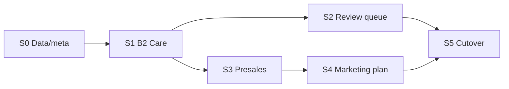

# Wave B4 — CRM Lead Funnel (Dev Plan)

> **Phạm vi:** Port workflow kinh doanh Lead funnel từ Flask/Python sang Nest + ops-web — **FR-CRM-04** (B2 review queue) và **FR-CRM-05** (presales gates + KH MKT sơ bộ).  
> **Không nhầm với:** Meta Horizon 1 **B4** (campaign write pilot) trong [`horizon1-meta-ads-migration-checklist.md`](./horizon1-meta-ads-migration-checklist.md).

**Trạng thái:** Implemented (Nest SQLite bridge + ops-web v1) · deploy: `./scripts/wave_b4_deploy.sh`  
**Cập nhật:** 2026-07-23  
**Production:** Staff/API `https://rs.pttads.vn` · ops-web `/crm/leads/*`

---

## 1. Mục tiêu & DoD

### Business outcome

Staff AM làm **B2 → Pre-sales → HĐ draft** trên ops-web; GDKD xử lý **inbox tra soát** khi quá hạn B2 — **không mở Flask** `/crm/leads`.

### Definition of Done (Wave B4)

| # | Tiêu chí | Verify |
|---|----------|--------|
| D1 | AM tick **Liên hệ OK** trên `/crm/leads/:id` | `presales_care_gate.complete = true` |
| D2 | Presales bị chặn trước B2 complete | TC-A02 · `test_crm_lead_presales.py` |
| D3 | GDKD inbox `/crm/leads/review-queue` + release auto/manual | `test_lead_review_queue.py` |
| D4 | Cron sync review queue 24h prod | systemd timer hoặc internal POST |
| D5 | Pre-sales 3 stage (lead → consult → proposal) + marketing plan @ proposal | pilot checklist |
| D6 | `./scripts/wave1_full_gate.sh` PASS | Wave 1 full retire funnel Flask |
| D7 | Env `PTT_CRM_LEADS_FUNNEL_NEST=1` (prod) | fallback Flask tắt |

**Phase 2 execution plan:** “100% lead mới qua PG; staff dùng ops-web lead hàng ngày” — **chưa đạt** nếu B2/review queue/presales vẫn Flask.

---

## 2. Tiên quyết

| Item | Ghi chú |
|------|---------|
| Wave B1–B2.5 | Agency client + hub map PG đã deploy |
| Horizon 1 Meta (B3.x) | Có thể song song; không bỏ M1-G08 soak nếu đã APPLY |
| `PTT_PRESALES_ON_LEAD=1` | Bắt buộc cho presales trên lead |
| `PTT_PRESALES_COST_CAP_VND` | (tuỳ chọn) cap chi phí pre-contract |
| Product model | [`product-model-v1.md`](../product-model-v1.md) — state machine B2-only |
| FR master | [`SPEC_AGENCY_OPERATING_PLATFORM.md`](../SPEC_AGENCY_OPERATING_PLATFORM.md) § FR-CRM-04, FR-CRM-05 |

**Out of scope Wave B4 (Wave B5+):**

- Service delivery lifecycle workflow (Onboard → Retain)
- Hub HĐ promote → SOP auto-start
- FR-CRM-06 link `lead.campaign_id` ↔ hub map (có thể slice nhỏ cuối B4 nếu hub map B2.5 đã ổn)
- FR-CRM-02 auto-assign (Nest assign rules — track riêng nếu chưa PG)
- FR-CRM-03 SLA push Zalo/email (cron riêng)

---

## 3. Hiện trạng (baseline)

| Layer | Có gì | Thiếu gì |
|-------|--------|----------|
| **Python/Flask** | Logic đầy đủ + pytest | `/api/crm/leads/*` — ops-web vẫn `leadLegacyFetch` |
| **Nest `/api/v1/leads`** | list/get/create/patch cơ bản (PG) | `meta_json`, care, `review_queue`, presales |
| **ops-web** | `/crm/leads`, `/crm/leads/[id]` — assign/activity | Funnel B2, inbox GDKD, presales panel |
| **PG `crm_leads`** | OLTP ingest cơ bản | Funnel columns + presales tables trên PG |

### Python modules cần port (source of truth)

| Module | FR | Nest target |
|--------|-----|-------------|
| `crm_lead_care_pipeline.py` | B2 gate | `leads-care/care-pipeline.util.ts` |
| `crm_lead_review_queue.py` | FR-CRM-04 | `leads-review-queue/review-queue.util.ts` |
| `crm_lead_presales.py` | FR-CRM-05 core | `leads-presales/presales.service.ts` |
| `crm_lead_presales_contract.py` | proposal → HĐ | presales promote (S3b) |
| `crm_lead_presales_marketing_plan.py` | KH MKT sơ bộ | `presales-marketing-plan.service.ts` |
| `crm_lead_industry_addon.py` | add-on ngành | (optional slice sau S3) |

### Chiến lược

Port logic sang Nest **theo slice S0→S5**, giữ **parity test** với pytest hiện có — **không rewrite** business rules từ đầu.

---

## 4. Kiến trúc Nest (mới)

```
services/ptt-crm-api/src/leads/
├── leads.module.ts
├── leads.controller.ts              # mở rộng
├── leads-care/                      # B2 gate
│   ├── leads-care.service.ts
│   ├── leads-care.controller.ts
│   └── care-pipeline.util.ts
├── leads-review-queue/              # FR-CRM-04
│   ├── review-queue.service.ts
│   ├── review-queue.controller.ts
│   └── review-queue.util.ts
└── leads-presales/                  # FR-CRM-05
    ├── presales.service.ts
    ├── presales.controller.ts
    ├── presales-marketing-plan.service.ts
    └── presales.repository.ts
```

**Guards mới:**

- `StaffLeadsGdkdGuard` — release review queue
- Mở rộng `StaffLeadsWriteGuard` — chặn AM khi `review_queue.active`

**Response mở rộng (`LeadV1`):** `review_queue`, `presales_care_gate`, `care_pipeline`, `presales` summary.

---

## 5. Sprint breakdown

### Sprint 0 — Nền tảng dữ liệu (~3–5 ngày) **BLOCKER**

| # | Task | Done when |
|---|------|-----------|
| S0.1 | ADR: PG-only vs SQLite bridge tạm | Doc ngắn trong `docs/specs/` |
| S0.2 | DDL PG: `crm_leads.meta_json JSONB`, `care_stage_current`, `care_stages_done_json`, `assigned_at` | Migration apply VPS |
| S0.3 | DDL PG: `crm_lead_presales`, `crm_lead_presales_tasks` (mirror SQLite) | Migration apply VPS |
| S0.4 | Nest `LeadsRepository`: đọc/ghi funnel fields | Unit test mapper |
| S0.5 | Dual-write tạm (nếu SQLite vẫn master funnel) | Không mất `review_queue` state |
| S0.6 | Mở rộng OpenAPI/types ops-web | `LeadV1` fields documented |

**Lưu ý:** Nếu prod funnel vẫn SQLite OLTP → Sprint 0 dùng `SqliteLeadsFunnelRepository` (pattern `cases/`, `intake/`), PG sau.

---

### Sprint 1 — B2 Care pipeline (~5 ngày)

**Spec:** `presales_care_gate.complete` = stage `first_contact` + báo cáo `da_lien_he_thanh_cong`  
**Port:** `crm_lead_care_pipeline.py`

#### Nest API

| Method | Path | Hành vi |
|--------|------|---------|
| GET | `/api/v1/leads/:id/care-pipeline` | Trạng thái B2 + checklist |
| POST | `/api/v1/leads/:id/care-pipeline/complete` | `{ stage, care_status, ... }` |
| GET | `/api/v1/leads/:id/care-reports` | (optional) list báo cáo B2 |

#### Tasks

| ID | Layer | Task |
|----|-------|------|
| N1.1 | Nest | `care-pipeline.util.ts` — `CONTACT_OK_CARE_STATUS`, `presales_care_gate_state()` |
| N1.2 | Nest | `LeadsCareService` — validate owner, ghi `care_stages_done_json`, activity |
| N1.3 | Nest | Block presales mutations nếu gate chưa complete |
| N1.4 | Nest | Tests — port `test_crm_lead_presales.py` (blocked until B2) |
| U1.1 | ops-web | Panel **B2 — Liên hệ lần đầu** trên `/crm/leads/[id]` |
| U1.2 | ops-web | Banner `presales_care_gate` locked/unlocked |
| U1.3 | ops-web | `fetchLeadCarePipeline` / `completeCareStage` trong `api.ts` |

**UAT:** TC-A02 bước 1 — presales vẫn chặn trước B2 complete.

---

### Sprint 2 — Review queue GDKD (FR-CRM-04, ~5–7 ngày)

**Port:** `crm_lead_review_queue.py`  
**Workflow:** assign → quá 24h chưa Liên hệ OK → `meta.review_queue.active` → GDKD release

#### Nest API

| Method | Path | Cap | Hành vi |
|--------|------|-----|---------|
| GET | `/api/v1/leads/review-queue` | GDKD view | List `review_queue_only` |
| GET | `/api/v1/leads/review-queue/count` | GDKD | Badge nav |
| POST | `/api/v1/leads/review-queue/sync` | internal/cron | `sync_b2_review_queue()` |
| POST | `/api/v1/leads/:id/review-queue/release` | GDKD write | `{ mode: auto\|manual, owner_id? }` |

#### Tasks

| ID | Layer | Task |
|----|-------|------|
| N2.1 | Nest | `review-queue.util.ts` — sync, release, `review_queue_public_state` |
| N2.2 | Nest | Config `b2_review_queue_enabled`, `b2_contact_deadline_hours` |
| N2.3 | Nest | Guard AM — PATCH/assign/care chặn khi `review_queue.active` |
| N2.4 | Ops | Cron `ptt-lead-review-queue-sync.timer` → Nest internal |
| N2.5 | Nest | `GET /api/v1/leads?review_queue_only=1` / `hide_review_queue=1` |
| N2.6 | Nest | Tests — port `tests/test_lead_review_queue.py` |
| U2.1 | ops-web | Trang `/crm/leads/review-queue` (port `lead-review.js`) |
| U2.2 | ops-web | Badge OpsNav từ `/review-queue/count` |
| U2.3 | ops-web | Banner **Phải tra soát** trên lead detail |
| U2.4 | ops-web | Release modal auto vs manual + chọn owner |

**Verify:** `demo_product_model_r123.py` — overdue → sync → queue → release.

---

### Sprint 3 — Presales core (FR-CRM-05, ~7–10 ngày)

**Port:** `crm_lead_presales.py`, `crm_lead_presales_contract.py`  
**Env:** `PTT_PRESALES_ON_LEAD=1`

#### Nest API

| Method | Path | Hành vi |
|--------|------|---------|
| GET | `/api/v1/leads/:id/presales` | `get_by_lead` + tasks by stage |
| POST | `/api/v1/leads/:id/presales` | `ensure_presales` — **require B2 gate** |
| POST | `/api/v1/leads/:id/presales/advance` | `{ to_stage: consult\|proposal }` |
| PATCH | `/api/v1/leads/:id/presales/tasks/:taskId` | `{ is_done, form_data, notes }` |
| POST | `/api/v1/leads/:id/presales/promote` | (S3b) → lifecycle draft |

#### Tasks

| ID | Layer | Task |
|----|-------|------|
| N3.1 | Nest | `PresalesRepository` — CRUD presales + tasks |
| N3.2 | Nest | `ensure_presales` — seed tasks; `assigned_am = owner` |
| N3.3 | Nest | `advance` — `PresalesAdvanceError` parity Python |
| N3.4 | Nest | `require_presales_care_gate()` trên mọi mutation |
| N3.5 | Nest | Consult stage cần intake session completed |
| N3.6 | Nest | Tests — port `test_crm_lead_presales.py` |
| U3.1 | ops-web | Panel Pre-sales — stages lead → consult → proposal |
| U3.2 | ops-web | Task checklist per stage |
| U3.3 | ops-web | Nút **Bắt đầu pre-sales** + chọn `service_slug` |
| U3.4 | ops-web | Nút **Chuyển giai đoạn** disabled until tasks done |
| U3.5 | ops-web | Funnel stepper (port `lead-workspace.js`) |

---

### Sprint 4 — Marketing plan @ Proposal (~5 ngày)

**Port:** `crm_lead_presales_marketing_plan.py`

#### Nest API

| Method | Path | Hành vi |
|--------|------|---------|
| GET | `/api/v1/leads/:id/presales/marketing-plan` | KH MKT sơ bộ @ proposal |
| PATCH | `/api/v1/leads/:id/presales/marketing-plan` | Validate `PRELIMINARY_*` keys |
| GET | `/api/v1/leads/:id/presales/marketing-plan/validation` | `{ ok, missing_fields[] }` |

#### Tasks

| ID | Layer | Task |
|----|-------|------|
| N4.1 | Nest | Port validation keys + block advance/contract |
| N4.2 | Nest | Tests — `test_crm_lead_presales_marketing_plan.py` |
| U4.1 | ops-web | Form KH MKT sơ bộ (north_star, objectives, strategy) |
| U4.2 | ops-web | Validation banner trước chốt proposal / HĐ draft |

---

### Sprint 5 — Wire-up & cutover Flask (~3 ngày)

| ID | Task |
|----|------|
| N5.1 | ops-web: bỏ `leadLegacyFetch` cho funnel endpoints → Nest v1 |
| N5.2 | Feature flag `PTT_CRM_LEADS_FUNNEL_NEST=1` — fallback Flask khi `0` |
| N5.3 | `./scripts/wave1_full_gate.sh` PASS trên VPS |
| N5.4 | Registry env `PTT_FLASK_CRM_LEADS_FUNNEL_RETIRED=1` |
| N5.5 | Manual UAT: [`presales-on-lead-pilot-checklist.md`](../crm/presales-on-lead-pilot-checklist.md) + TC-A02 |

**Deploy script (TODO):** `scripts/wave_b4_deploy.sh` + `scripts/wave_b4_smoke.sh`

---

## 6. Phụ thuộc sprint



S2 và S3 có thể **song song** sau S1 (2 dev).

---

## 7. Mapping test → gate

| Test file | Sprint | Gate |
|-----------|--------|------|
| `tests/test_lead_care_pipeline.py` | S1 | B2 gate |
| `tests/test_crm_lead_presales.py` | S1+S3 | FR-CRM-05, TC-A02 |
| `tests/test_lead_review_queue.py` | S2 | FR-CRM-04 |
| `tests/test_crm_lead_presales_marketing_plan.py` | S4 | TMMT sơ bộ |
| `./scripts/wave1_full_gate.sh` | S5 | Wave 1 full DoD |

Chạy local trước mỗi sprint merge:

```bash
cd /var/www/ptt  # hoặc repo root local
python3 -m pytest tests/test_lead_review_queue.py tests/test_lead_care_pipeline.py \
  tests/test_crm_lead_presales.py tests/test_crm_lead_presales_marketing_plan.py -q
cd services/ptt-crm-api && npm test -- --testPathPattern='leads|review|presales|care'
```

---

## 8. Ước lượng effort

| Sprint | Nest | ops-web | QA |
|--------|------|---------|-----|
| S0 | 3–5d | — | — |
| S1 | 3d | 2d | 1d |
| S2 | 4d | 3d | 1d |
| S3 | 5d | 4d | 2d |
| S4 | 3d | 2d | 1d |
| S5 | 2d | 1d | 2d |
| **Tổng** | **~20d** | **~12d** | **~7d** |

~6–8 tuần (1 full-stack dev) hoặc ~4 tuần (2 dev song song S2/S3).

---

## 9. Shortcut tracks (nếu cần demo nhanh)

| Track | Việc | Trade-off |
|-------|------|-----------|
| **A — Proxy** | Nest forward `/api/v1/leads/...` → Flask `/api/crm/leads/...` | Nhanh; vẫn phụ thuộc Flask |
| **B — UI only** | ops-web gọi Flask trực tiếp (giữ `leadLegacyFetch`) | Không đạt Wave 1 full retire |
| **C — Đúng spec** | S0→S5 port logic | **Khuyến nghị** cho bàn giao khách |

---

## 10. Sau Wave B4 — Flask còn gì?

Hoàn thành B4 **không** tắt Flask toàn hệ thống. Vẫn còn (Wave B5–B7):

| Module | Wave |
|--------|------|
| Service delivery lifecycle (Hub → SOP → workflow) | B5 |
| Launch QA + Creative brief | B6 |
| Offboard + **Phase 5 stop `ptt.service`** | B7 |

Chi tiết: [`crm-flask-retirement-master-checklist.md`](./crm-flask-retirement-master-checklist.md).

Python **workers** (`ptt_worker`, FB autosync, Temporal) **giữ** — khác Flask HTTP.

---

## 11. Checklist PO (sign-off Wave B4)

- [ ] AM làm B2 + presales trên `https://rs.pttads.vn/crm/leads/[id]` (không Flask)
- [ ] GDKD inbox `https://rs.pttads.vn/crm/leads/review-queue`
- [ ] Cron sync review queue 24h chạy prod
- [ ] `pytest` funnel + `wave1_full_gate` PASS
- [ ] TC-A02 + [`presales-on-lead-pilot-checklist.md`](../crm/presales-on-lead-pilot-checklist.md) signed
- [ ] `PTT_CRM_LEADS_FUNNEL_NEST=1` trên prod

---

## 12. Tài liệu liên quan

| Doc | Mục đích |
|-----|----------|
| [`product-model-v1.md`](../product-model-v1.md) | State machine + gates |
| [`docs/crm/huong-dan-day-du-lead-den-cham-soc-khach-hang.md`](../crm/huong-dan-day-du-lead-den-cham-soc-khach-hang.md) | UAT manual flow |
| [`SPEC_MIGRATION_FLASK_EXECUTION_PLAN.md`](../SPEC_MIGRATION_FLASK_EXECUTION_PLAN.md) | Strangler master |
| [`wave-b2.5-agency-hub-provisioning.md`](./wave-b2.5-agency-hub-provisioning.md) | Hub map PG (FR-CRM-06 prep) |
| [`wave-b2-agency-workflows.md`](./wave-b2-agency-workflows.md) | Agency side effects (đã xong) |

---

## 13. Bước tiếp theo (implement)

1. **Sprint 0:** ADR store + DDL migration + Nest repository mapper  
2. **Sprint 1:** `leads-care` module + ops-web B2 panel  
3. Song song plan S2/S3 sau khi S1 merge staging
