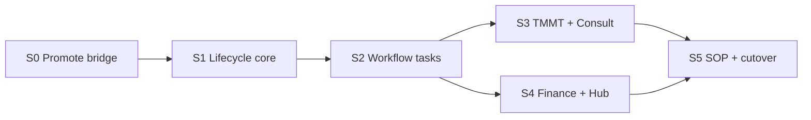

# Wave B5 — Service Delivery Lifecycle (Dev Plan)

> **Phạm vi:** Port workflow **Ký HĐ → Service Delivery (Onboard → Retain)** từ Flask/Python sang Nest + ops-web — **FR-SD-01** (Hub promote → lifecycle + SOP), workflow tasks 12 dịch vụ, TMMT @ Deliver, finance handoff.  
> **Không nhầm với:** Wave **5** Flask retirement (RE Projects + Payroll) trong [`crm-flask-retirement-master-checklist.md`](./crm-flask-retirement-master-checklist.md).

**Trạng thái:** Planning · chưa implement  
**Cập nhật:** 2026-07-23

### DoD checklist (Wave B5)

| Hạng mục | Trạng thái | Verify |
|----------|------------|--------|
| Promote presales → lifecycle (S0) | TODO | `POST /api/v1/leads/:id/presales/promote` · `test_crm_lead_presales.py` |
| Hub contract Active hook | TODO | `test_crm_lead_presales_contract.py` |
| Lifecycle kanban + advance gates (S1) | TODO | ops-web `/crm/service-delivery` |
| Workflow tasks seed + tick (S2) | TODO | `test_crm_svc_tasks.py` |
| TMMT @ Deliver gate (S3) | TODO | `test_crm_lead_presales_marketing_plan.py` |
| Finance cost transfer (S4) | TODO | `test_crm_svc_finance_presales_on_lead.py` |
| Hub → SOP auto-start (S5) | TODO | FR-SD-02 · SOP run created on campaign launch |
| wave_b5_gate + pytest parity | TODO | `./scripts/wave_b5_gate.sh` (TODO create) |

**Production:** Staff/API `https://rs.pttads.vn` · ops-web `/crm/service-delivery/*`

---

## 1. Mục tiêu & DoD

### Business outcome

Sau Wave B4, AM ký HĐ trên Hub → lifecycle **Onboard** xuất hiện trên ops-web; AM/SP làm **workflow 7 stage** (task checklist, gate TMMT, gán SP) → **Deliver → Handover → Retain** — **không mở Flask** `/crm/service-delivery` HTML.

### Definition of Done (Wave B5)

| # | Tiêu chí | Verify |
|---|----------|--------|
| D1 | Presales 3 stage ✓ → Hub ký Active → lifecycle `stage=onboard`, `status=active` | §9 UAT công đoạn 7 |
| D2 | Kanban 7 cột + card link workflow detail | `/crm/service-delivery` |
| D3 | Advance stage tuần tự; block khi task chưa ✓ | `validate_stage_advance` parity |
| D4 | Gate TMMT trước Onboard → Deliver | `validate_lifecycle_deliver_advance` |
| D5 | Gán AM/SP; task seed theo 12 `service_slug` | `test_crm_svc_tasks.py` |
| D6 | TMMT chính thức GET/PATCH trên lifecycle | Product model R5 |
| D7 | Chi phí pre-sales transfer sang lifecycle sau promote | `test_crm_svc_presales_cap_l35.py` |
| D8 | Hub Active → SOP run (FR-SD-01) | Manual Hub UAT |
| D9 | `./scripts/wave_b5_gate.sh` PASS | env flags prod |
| D10 | Env `PTT_CRM_SERVICE_DELIVERY_NEST=1` | fallback Flask tắt |

**Product model handoff:** B4 kết thúc ở **HĐ draft + presales proposal**; B5 bắt đầu từ **promote → lifecycle**.

---

## 2. Tiên quyết

| Item | Ghi chú |
|------|---------|
| **Wave B4 prod sign-off** | Presales 3 tab + KH MKT sơ bộ @ proposal — blocker cho promote |
| `PTT_PRESALES_ON_LEAD=1` | Bắt buộc trên prod |
| `PTT_CRM_LEADS_FUNNEL_NEST=1` | Funnel Nest active (B4) |
| Wave B2.5 | Hub map PG · agency client provisioning |
| Product model | [`product-model-v1.md`](../product-model-v1.md) — lifecycle TMMT @ Deliver |
| FR master | [`SPEC_AGENCY_OPERATING_PLATFORM.md`](../SPEC_AGENCY_OPERATING_PLATFORM.md) § FR-SD-01–03, BC-09 gates |
| UAT flow | [`huong-dan-day-du-lead-den-cham-soc-khach-hang.md`](../crm/huong-dan-day-du-lead-den-cham-soc-khach-hang.md) §9–13 |

**Out of scope Wave B5 (Wave B6+):**

- Launch QA + Creative brief (**B6**)
- Offboard + Phase 5 stop `ptt.service` (**B7**)
- FR-CRM-02 auto-assign (track riêng)
- FR-CRM-03 SLA push Zalo/email (cron riêng)
- FR-SD-05 Temporal workflow lifecycle stages (P2 — sau B5)
- Wave 6 Finance dashboards (`/crm/financials`, owner-weekly) — track Flask retirement Wave 6
- SOP step template editor (Wave 3 còn Flask readonly — chỉ consume runs trong B5)

---

## 3. Hiện trạng (baseline)

| Layer | Có gì | Thiếu gì |
|-------|--------|----------|
| **Python/Flask** | Logic đầy đủ + pytest (~10 modules) | Flask HTTP removed khỏi repo; logic vẫn source of truth |
| **Nest `service-lifecycle/`** | CRUD list/detail/patch; SQLite repo | Tasks, gates, events API, promote hook |
| **Nest `leads-presales/`** | ensure/advance/tasks/marketing-plan (B4) | **`POST .../presales/promote` (S3b deferred)** |
| **Nest `sop/`** | templates + runs MVP | Auto-start on campaign launch |
| **ops-web** | List + detail stage dropdown MVP | Kanban, task checklist, TMMT/finance panels |
| **Wave 3 gates** | Module exists (`wave3_gate.sh` PASS) | Parity business rules chưa port |

### Python modules cần port (source of truth)

| Module | FR / Gate | Nest target |
|--------|-----------|-------------|
| `crm_lead_presales_contract.py` | HĐ draft + ký Active | `leads-presales/contract.service.ts` |
| `crm_lead_convert.py` | Lead → KH thật + Case | `leads-convert/` hoặc trong contract |
| `crm_lead_presales.py` (`promote_presales_to_lifecycle`) | FR-SD-01 | `leads-presales/promote.service.ts` |
| `crm_service_lifecycle.py` | 7 stage + gates | mở rộng `service-lifecycle/` |
| `crm_svc_tasks.py` | Workflow tasks | `service-lifecycle/tasks/` |
| `crm_svc_workflow_steps.py` (onboard→retain) | 12 slug seed | `lifecycle-workflow-steps.data.json` |
| `crm_lead_presales_marketing_plan.py` (lifecycle) | TMMT @ Deliver | `lifecycle-marketing-plan.service.ts` |
| `crm_svc_consult_bridge.py` | Consult brief/prefill | `lifecycle-consult/` |
| `crm_svc_finance.py` (lifecycle slice) | cost transfer, payment gate | `lifecycle-finance/` hoặc `svc-finance/` |
| `crm_svc_presales.py` | cap + presales-summary | `lifecycle-presales-summary.service.ts` |
| Hub contract hook | FR-SD-01 | `agency/` event hoặc contracts module |
| SOP auto-start | FR-SD-02 | `sop/sop-auto-start.service.ts` |

### Chiến lược

Port logic sang Nest **theo slice S0→S5**, giữ **parity test** với pytest hiện có — **không rewrite** business rules từ đầu. Store: **SQLite bridge** (pattern B4 ADR) cho lifecycle + svc_tasks; PG cutover deferred.

---

## 4. Kiến trúc Nest (mở rộng)

```
services/ptt-crm-api/src/
├── leads/
│   └── leads-presales/
│       ├── presales-promote.service.ts      # S0 — promote → lifecycle
│       └── presales-contract.service.ts     # S0 — HĐ draft + on_signed
├── leads-convert/                           # S0 — convert_lead_to_crm (optional module)
│   └── leads-convert.service.ts
└── service-lifecycle/
    ├── service-lifecycle.controller.ts      # mở rộng routes
    ├── service-lifecycle.service.ts
    ├── service-lifecycle-sqlite.repository.ts
    ├── lifecycle-stage.util.ts              # validate_stage_advance, next_stage
    ├── tasks/
    │   ├── lifecycle-tasks.service.ts
    │   ├── lifecycle-tasks.controller.ts
    │   └── lifecycle-tasks.repository.ts
    ├── lifecycle-marketing-plan.service.ts  # TMMT @ Deliver
    ├── lifecycle-consult.service.ts         # consult-brief, prefill
    ├── lifecycle-finance.service.ts         # presales-summary, payment gate
    └── lifecycle-workflow-steps.data.json   # onboard/deliver/handover/retain × 12 slug
```

**Guards:**

- `StaffServiceLifecycleViewGuard` / `StaffServiceLifecycleWriteGuard` (đã có — mở rộng caps)
- Stage advance: server-side `validate_stage_advance` — không tin UI

**ops-web routes:**

| Route | Mô tả |
|-------|--------|
| `/crm/service-delivery` | Kanban 7 cột + funnel widget |
| `/crm/service-delivery/[id]` | Workflow tabs + tasks + AM/SP + gates |

---

## 5. Sprint breakdown

### Sprint 0 — Promote bridge (S3b deferred B4, ~5–7 ngày) **BLOCKER** ✅ code v1

**Spec:** [`2026-07-23-wave-b5-s0-promote-bridge-design.md`](../specs/2026-07-23-wave-b5-s0-promote-bridge-design.md)  
**Nâng cấp:** 2 bước AM submit → GDKD approve; `crm_contract_approvals` + events; readiness checklist; seed onboard+ tasks (fix Python seed skip).

**Gate:** `./scripts/wave_b5_s0_gate.sh`

#### Nest API

| Method | Path | Hành vi |
|--------|------|---------|
| POST | `/api/v1/leads/:id/presales/contract` | Tạo HĐ draft + KH placeholder |
| PATCH | `/api/v1/leads/:id/presales/contract/:contractId` | Cập nhật draft |
| POST | `/api/v1/leads/:id/presales/contract/:contractId/activate` | Ký Active → convert + promote |
| POST | `/api/v1/leads/:id/presales/promote` | Promote trực tiếp (internal / test) |
| POST | `/api/crm/hub/contracts/:id/activate` | (hoặc hook agency) Hub → on_contract_signed |

#### Tasks

| ID | Layer | Task |
|----|-------|------|
| N0.1 | Nest | ADR store lifecycle + svc_tasks (SQLite bridge, mirror B4 ADR) |
| N0.2 | Nest | `PresalesPromoteService` — port `promote_presales_to_lifecycle()` |
| N0.3 | Nest | Gate: 100% presales tasks Lead/Consult/Proposal trước promote |
| N0.4 | Nest | `PresalesContractService` — placeholder KH, draft HĐ, `on_contract_signed` |
| N0.5 | Nest | `LeadsConvertService` — port `convert_lead_to_crm()` |
| N0.6 | Nest | Clone marketing plan sơ bộ → lifecycle TMMT draft |
| N0.7 | Nest | Transfer presales expenses → lifecycle_id (`crm_svc_finance`) |
| N0.8 | Nest | Tests — `test_crm_lead_presales.py` (promote), `test_crm_lead_presales_contract.py` |
| U0.1 | ops-web | Nút **Tạo HĐ draft** + **Ký Active** trên lead detail (hoặc link Hub) |
| U0.2 | ops-web | Banner post-promote → link `/crm/service-delivery/[id]` |

**Done when:** Hub ký Active → lifecycle Onboard visible; presales `status=converted`.

---

### Sprint 1 — Lifecycle core + kanban (~5–7 ngày)

**Port:** `crm_service_lifecycle.py` (CRUD, events, advance gates)

#### Nest API

| Method | Path | Hành vi |
|--------|------|---------|
| GET | `/api/crm/service-lifecycle` | List + filter slug/am_id/include_draft |
| GET | `/api/crm/service-lifecycle/:id` | Detail + events |
| POST | `/api/crm/service-lifecycle` | create_draft / confirm |
| PATCH | `/api/crm/service-lifecycle/:id` | Advance stage, notes, assigned_am/sp |
| GET | `/api/crm/service-lifecycle/:id/advance-info` | `{ can_advance_forward, block_reason, progress }` |
| GET | `/api/crm/service-lifecycle/:id/events` | Lịch sử transitions |

#### Tasks

| ID | Layer | Task |
|----|-------|------|
| N1.1 | Nest | `lifecycle-stage.util.ts` — `VALID_STAGES`, `validate_stage_advance`, `get_stage_advance_info` |
| N1.2 | Nest | Events table write on every stage change |
| N1.3 | Nest | Block sequential skip; allow backward free |
| N1.4 | Nest | Tests — port `tests/test_crm_service_lifecycle.py` |
| U1.1 | ops-web | Kanban 7 cột `/crm/service-delivery` |
| U1.2 | ops-web | Card → link detail; filter AM/service |
| U1.3 | ops-web | Advance button + block_reason banner |
| U1.4 | ops-web | AM/SP assignment dropdown |

**UAT:** §10 công đoạn 8 — mở workflow, gán SP.

---

### Sprint 2 — Workflow tasks engine (~7–10 ngày)

**Port:** `crm_svc_tasks.py`, `crm_svc_workflow_steps.py` (stages onboard/deliver/handover/retain)

#### Nest API

| Method | Path | Hành vi |
|--------|------|---------|
| GET | `/api/crm/service-lifecycle/:id/tasks` | Tasks grouped by stage |
| GET | `/api/crm/service-lifecycle/:id/progress` | `{ stage: { done, total } }` |
| PATCH | `/api/crm/service-lifecycle/:id/tasks/:taskId` | `{ is_done, form_data, notes }` |
| POST | `/api/crm/service-lifecycle/:id/tasks` | Custom task (`is_custom=1`) |
| POST | `/api/crm/service-lifecycle/:id/tasks/:taskId/ai-assist` | AI draft (optional S2+) |

#### Tasks

| ID | Layer | Task |
|----|-------|------|
| N2.1 | Nest | Export `SERVICE_WORKFLOW_STEPS` onboard→retain → JSON seed |
| N2.2 | Nest | `LifecycleTasksRepository` — schema `crm_svc_tasks` |
| N2.3 | Nest | Seed tasks on promote (copy ✓ from presales for lead/consult/proposal) |
| N2.4 | Nest | `is_stage_complete` / `get_progress` parity |
| N2.5 | Nest | Recurring deliver tasks (12 tháng) for `RECURRING_DELIVER_SLUGS` |
| N2.6 | Nest | Tests — port `tests/test_crm_svc_tasks.py` |
| U2.1 | ops-web | Workflow detail — tabs 7 stage |
| U2.2 | ops-web | Task checklist per tab + tick ✓ |
| U2.3 | ops-web | Progress bar per stage |
| U2.4 | ops-web | Form fields render from `form_fields` JSON |

**Done when:** Cannot advance until 100% tasks in current stage.

---

### Sprint 3 — TMMT + Consult bridge (~5 ngày)

**Port:** `crm_lead_presales_marketing_plan.py` (lifecycle), `crm_svc_consult_bridge.py`

#### Nest API

| Method | Path | Hành vi |
|--------|------|---------|
| GET | `/api/crm/service-lifecycle/:id/marketing-plan` | TMMT chính thức |
| PATCH | `/api/crm/service-lifecycle/:id/marketing-plan` | Validate R5 keys |
| GET | `/api/crm/service-lifecycle/:id/marketing-plan/validation` | Gate preview |
| GET | `/api/crm/service-lifecycle/:id/consult-brief` | Aggregated brief panel |
| POST | `/api/crm/service-lifecycle/:id/consult-prefill` | Prefill Consult task |

#### Tasks

| ID | Layer | Task |
|----|-------|------|
| N3.1 | Nest | `validate_lifecycle_deliver_advance()` — block Onboard→Deliver |
| N3.2 | Nest | Wire gate into `validate_stage_advance` when `to_stage=deliver` |
| N3.3 | Nest | Consult brief + prefill parity |
| N3.4 | Nest | Tests — `test_crm_lead_presales_marketing_plan.py`, `test_crm_svc_consult_bridge.py` |
| U3.1 | ops-web | TMMT panel @ Deliver tab |
| U3.2 | ops-web | Gate banner (xanh/đỏ) trước **Chuyển → Triển khai** |
| U3.3 | ops-web | Consult brief sidebar (optional) |

**UAT:** §11 công đoạn 9 — gate TMMT xanh mới Deliver.

---

### Sprint 4 — Finance handoff + Hub hook (~5 ngày)

**Port:** `crm_svc_finance.py`, `crm_svc_presales.py`, Hub contract activation

#### Nest API

| Method | Path | Hành vi |
|--------|------|---------|
| GET | `/api/crm/service-lifecycle/:id/presales-summary` | Chi phí pre-sales cohort |
| POST | `/api/crm/service-lifecycle/:id/expenses` | Ghi chi phí delivery |
| POST | `/api/crm/service-lifecycle/:id/payments` | Payment received |
| GET | `/api/crm/service-lifecycle/funnel-stats` | Go→Consult→Proposal widget |

#### Tasks

| ID | Layer | Task |
|----|-------|------|
| N4.1 | Nest | Expense link on promote (đã seed S0 — verify idempotent) |
| N4.2 | Nest | Payment gate Handover→Retain (nếu billing policy yêu cầu) |
| N4.3 | Nest | Hub `ContractActivated` → call promote pipeline |
| N4.4 | Nest | Tests — `test_crm_svc_finance_presales_on_lead.py`, `test_crm_svc_presales_cap_l35.py` |
| U4.1 | ops-web | Finance panel on workflow (cost + payment) |
| U4.2 | ops-web | Funnel stats widget on kanban |
| U4.3 | ops-web | Link lifecycle ↔ Hub campaign/contract |

---

### Sprint 5 — SOP integration + cutover (~5 ngày)

**Port:** SOP auto-start, overdue escalate (FR-SD-02, FR-SD-03)

#### Tasks

| ID | Layer | Task |
|----|-------|------|
| N5.1 | Nest | On Hub Active / campaign launch → `POST /api/crm/sop/runs` auto |
| N5.2 | Nest | Link `campaign_id` ↔ lifecycle |
| N5.3 | Ops | Cron SOP overdue → email manager (hoặc Nest job) |
| N5.4 | Nest | Feature flag `PTT_CRM_SERVICE_DELIVERY_NEST=1` |
| N5.5 | Nest | Registry `PTT_FLASK_CRM_SERVICE_LIFECYCLE_RETIRED=1` |
| N5.6 | Ops | `./scripts/wave_b5_gate.sh` + `wave_b5_pytest_parity.sh` |
| N5.7 | Ops | `./scripts/wave_b5_deploy.sh` + smoke |
| U5.1 | ops-web | Link workflow → SOP run tasks |
| U5.2 | QA | Manual UAT §9–13 full flow on prod |

**Deploy script (TODO):** `scripts/wave_b5_deploy.sh`, `scripts/wave_b5_smoke.sh`, `scripts/wave_b5_gate.sh`

---

## 6. Phụ thuộc sprint



S3 và S4 có thể **song song** sau S2.

**Blocker ngoài plan:** Wave B4 prod sign-off (presales complete trước promote).

---

## 7. Mapping test → gate

| Test file | Sprint | Gate / FR |
|-----------|--------|-----------|
| `tests/test_crm_lead_presales.py` (promote) | S0 | FR-SD-01 |
| `tests/test_crm_lead_presales_contract.py` | S0 | HĐ Active |
| `tests/test_crm_service_lifecycle.py` | S1 | Stage advance |
| `tests/test_crm_svc_tasks.py` | S2 | Task engine |
| `tests/test_crm_lead_presales_marketing_plan.py` (lifecycle) | S3 | TMMT @ Deliver |
| `tests/test_crm_svc_consult_bridge.py` | S3 | Consult brief |
| `tests/test_crm_svc_finance_presales_on_lead.py` | S4 | Cost transfer |
| `tests/test_crm_svc_presales_cap_l35.py` | S4 | Cap parity |
| `./scripts/wave3_gate.sh` | S5 | Wave 3 module base (regression) |
| `./scripts/wave_b5_gate.sh` | S5 | Wave B5 DoD |

Chạy local trước mỗi sprint merge:

```bash
cd /var/www/ptt  # hoặc repo root local
python3 -m pytest \
  tests/test_crm_lead_presales.py \
  tests/test_crm_lead_presales_contract.py \
  tests/test_crm_service_lifecycle.py \
  tests/test_crm_svc_tasks.py \
  tests/test_crm_lead_presales_marketing_plan.py \
  tests/test_crm_svc_consult_bridge.py \
  tests/test_crm_svc_finance_presales_on_lead.py \
  -q
cd services/ptt-crm-api && npm test -- --testPathPattern='service-lifecycle|presales-promote|lifecycle-tasks'
```

---

## 8. Env flags (prod)

Merge vào VPS `.env` (extend [`deploy/env.crm-flask-migration.example`](../../deploy/env.crm-flask-migration.example)):

```bash
# Wave B5 — Service delivery Nest cutover
PTT_CRM_SERVICE_DELIVERY_NEST=1
PTT_CRM_SERVICE_LIFECYCLE_UPSTREAM=ops-web
PTT_FLASK_CRM_SERVICE_LIFECYCLE_RETIRED=1
PTT_PRESALES_PROMOTE_NEST=1
WAVE_B5_EXPECT_OPS_WEB=1

# SOP (FR-SD-02/03) — after S5
PTT_SOP_AUTO_START_ON_LAUNCH=1
PTT_SOP_OVERDUE_ESCALATE=1
```

---

## 9. Ước lượng effort

| Sprint | Nest | ops-web | QA |
|--------|------|---------|-----|
| S0 | 5d | 2d | 1d |
| S1 | 4d | 3d | 1d |
| S2 | 6d | 4d | 2d |
| S3 | 3d | 2d | 1d |
| S4 | 4d | 2d | 1d |
| S5 | 3d | 2d | 2d |
| **Tổng** | **~25d** | **~15d** | **~8d** |

~8–10 tuần (1 full-stack dev) hoặc ~5–6 tuần (2 dev song song S3/S4).

---

## 10. Shortcut tracks (nếu cần demo nhanh)

| Track | Việc | Trade-off |
|-------|------|-----------|
| **A — Proxy** | Nest forward lifecycle routes → Python worker/legacy | Nhanh; không retire Flask semantics |
| **B — UI only** | ops-web gọi `/api/crm/service-lifecycle` Nest MVP (stage dropdown) | Không có tasks/gates — demo yếu |
| **C — Đúng spec** | S0→S5 port logic + pytest parity | **Khuyến nghị** cho bàn giao khách |

---

## 11. Lifecycle gates (BC-09 reference)

| Gate | Điều kiện | Module |
|------|-----------|--------|
| Presales complete | 100% task Lead/Consult/Proposal | `crm_lead_presales` |
| HĐ Active | Hub promote | `crm_lead_presales_contract` |
| Task stage | 100% task stage hiện tại | `crm_svc_tasks` |
| TMMT R5 | Onboard → Deliver | `crm_lead_presales_marketing_plan` |
| Payment | Handover → Retain | `crm_svc_finance` |

Stage machine: `lead → consult → proposal → onboard → deliver → handover → retain`  
(Presales stages map vào lifecycle trước Onboard; sau promote bắt đầu từ **onboard**.)

---

## 12. Sau Wave B5 — còn gì?

| Module | Wave |
|--------|------|
| Launch QA + Creative brief | **B6** |
| Offboard + stop `ptt.service` | **B7** |
| Finance dashboards (Wave 6 Flask retirement) | Wave 6 |
| Temporal lifecycle (FR-SD-05) | Backlog P2 |

Chi tiết Flask retirement: [`crm-flask-retirement-master-checklist.md`](./crm-flask-retirement-master-checklist.md).

---

## 13. Checklist PO (sign-off Wave B5)

- [ ] B4 signed — presales 3 tab + KH MKT sơ bộ trên prod
- [ ] Hub ký HĐ Active → lifecycle Onboard (không Flask)
- [ ] AM/SP workflow `/crm/service-delivery/[id]` — tick tasks, advance stages
- [ ] Gate TMMT block Deliver khi chưa đủ
- [ ] Chi phí pre-sales hiển thị trên lifecycle sau promote
- [ ] SOP run xuất hiện sau campaign launch (nếu FR-SD-02 trong scope release)
- [ ] `pytest` lifecycle + `wave_b5_gate.sh` PASS
- [ ] Manual UAT §9–13 signed
- [ ] `PTT_CRM_SERVICE_DELIVERY_NEST=1` trên prod

---

## 14. Tài liệu liên quan

| Doc | Mục đích |
|-----|----------|
| [`wave-b4-crm-lead-funnel-dev-plan.md`](./wave-b4-crm-lead-funnel-dev-plan.md) | Tiền đề B4 · S3b promote deferred |
| [`2026-07-23-wave-b4-funnel-store-adr.md`](../specs/2026-07-23-wave-b4-funnel-store-adr.md) | SQLite bridge pattern (reuse B5) |
| [`2026-06-22-service-lifecycle-design.md`](../specs/2026-06-22-service-lifecycle-design.md) | Schema + 7 hàm public |
| [`2026-06-22-service-workflow-engine-design.md`](../superpowers/specs/2026-06-22-service-workflow-engine-design.md) | Workflow detail page |
| [`2026-07-02-lead-presales-then-lifecycle-design.md`](../superpowers/specs/2026-07-02-lead-presales-then-lifecycle-design.md) | Promote handoff |
| [`product-model-v1.md`](../product-model-v1.md) | TMMT @ Deliver |
| [`huong-dan-day-du-lead-den-cham-soc-khach-hang.md`](../crm/huong-dan-day-du-lead-den-cham-soc-khach-hang.md) | UAT §9–13 |
| [`presales-on-lead-pilot-checklist.md`](../crm/presales-on-lead-pilot-checklist.md) | B4 pilot (tiên quyết) |
| [`wave-b2.5-agency-hub-provisioning.md`](./wave-b2.5-agency-hub-provisioning.md) | Hub PG |
| [`crm-flask-retirement-master-checklist.md`](./crm-flask-retirement-master-checklist.md) | Wave 3/5/6 context |

---

## 15. Bước tiếp theo (implement)

1. **Sprint 0:** ADR lifecycle store + `PresalesPromoteService` + contract activate hook  
2. **Sprint 1:** Kanban + `validate_stage_advance`  
3. Song song S3/S4 sau S2 nếu 2 dev  
4. Tạo `scripts/wave_b5_gate.sh` khi S0 merge (pattern `wave_b4_gate.sh`)
