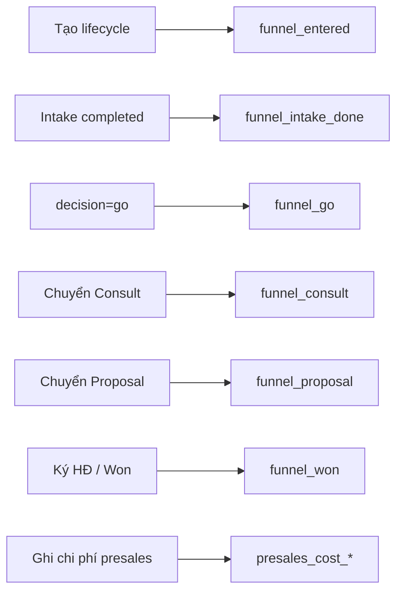

# Design: Lead KPI + Chi phí Pre-contract + Funnel Stats

**Ngày:** 2026-06-30  
**Phiên bản:** 1.0  
**Stack:** Flask 3 + SQLite, Anthropic Haiku, Jinja2 + Vanilla JS  
**Nguyên tắc:** Simplicity First · Surgical Changes · Single source of truth  
**Phụ thuộc:**
- [Lead Intake System](./2026-06-30-lead-intake-system-design.md)
- [Consult Stage System](./2026-06-30-consult-stage-system-design.md) (funnel C6 — gộp module)
- [KPI Staff Performance](../superpowers/specs/2026-06-23-kpi-staff-performance-design.md)
- [Profit & Cost Tracking](../superpowers/specs/2026-06-23-profit-cost-tracking-design.md)
- **P0 đã triển khai:** `crm_leads.owner_id` → `crm_service_lifecycle.assigned_am`

---

## 1. Vấn đề cần giải quyết

### 1.1 Bối cảnh nghiệp vụ

| Khái niệm | Ý nghĩa |
|-----------|---------|
| **Doanh thu KH** | Tiền KH trả PTT — chỉ sau **ký HĐ** (Onboard+) |
| **Consult miễn phí** | KH không trả phí tư vấn/audit (đã xác nhận Q6) |
| **Chi phí nội bộ PTT** | Lương AM, điện thoại, đi lại, công qualify… — **bắt đầu từ Lead** |

Giai đoạn **Lead** (và tiếp theo Consult pre-contract) là **pre-sales**: PTT đã tốn chi phí nhưng CRM **chưa đo** hiệu quả AM và **chưa ghi** chi phí theo funnel.

### 1.2 Hiện trạng codebase (2026-06-30)

| Thành phần | Trạng thái | Hạn chế |
|------------|------------|---------|
| `assigned_am` sync từ lead owner | ✅ P0 | Chưa có KPI gắn AM ở stage Lead |
| `crm_svc_kpi.py` — AM metrics | ✅ | Chỉ `received_revenue`, `active_services`, margin — **sau HĐ** |
| `crm_svc_finance.py` — expenses | ✅ | Ghi theo lifecycle; **không** phân pre/post contract; UI thiên deliver |
| `get_intake_stats()` | ✅ | Chỉ **team-level** coverage + BANT TB; không theo AM |
| Lead Intake spec §12 KPI | ⚠️ Doc | Một phần chưa code (48h phone, Go→Consult…) |
| Consult spec §9 funnel | ⚠️ C6 | Chưa triển khai `get_funnel_stats()` |
| Module `crm_leads` assign/competency | ✅ | Rubric lead riêng; **không** nối Service Delivery KPI |

### 1.3 Mục tiêu (v1)

1. **Target + actual KPI Lead theo AM** — đo effort pre-contract gắn `assigned_am`.
2. **Chi phí pre-contract** — ghi nhận phone/đi lại/công lead trên lifecycle **trước ký HĐ**, tách khỏi P&L triển khai.
3. **Funnel stats** — dashboard team + filter AM: Lead → Consult → Proposal → Won, kèm chi phí tích lũy.
4. **Không** thay đổi định nghĩa doanh thu KH; **không** thu phí Consult.

---

## 2. Phạm vi

### In scope (v1)

| # | Hạng mục |
|---|----------|
| 1 | Module `crm_svc_presales.py` — metrics Lead, funnel, pre-sales cost summary |
| 2 | Mở rộng `crm_svc_expenses` — `cost_phase`, `lifecycle_stage` (migration) |
| 3 | Category chi phí pre-sales (enum cố định) |
| 4 | Metric keys AM mới trong `crm_svc_kpi_targets` |
| 5 | `get_am_lead_metrics()`, `get_funnel_stats()`, `get_presales_cost_summary()` |
| 6 | API JSON + widget `/crm/service-delivery` + section Lead trên `/crm/staff-kpi` |
| 7 | Panel **Pre-sales** trên workflow (stage `lead` \| `consult` \| `proposal`, status `draft`) |
| 8 | Tests TDD |

### Out of scope (v1)

- Tự động cấp phát lương AM theo giờ (payroll integration)
- VoIP / CDR tự động ghi cước điện thoại
- Thu phí tư vấn / hóa đơn Consult riêng
- KPI SP chi tiết ở giai đoạn Lead (chỉ AM v1)
- BI warehouse / export Power BI

---

## 3. Kiến trúc

```
┌─────────────────┐     ┌──────────────────────────┐
│ crm_leads       │     │ crm_lead_intake_sessions │
│ owner_id        │────▶│ decision, bant, mode     │
└────────┬────────┘     └────────────┬─────────────┘
         │ sync P0                   │
         ▼                           ▼
┌─────────────────────────────────────────────────────┐
│ crm_service_lifecycle (assigned_am, stage, status) │
└────────┬───────────────────────────────┬──────────┘
         │                               │
         ▼                               ▼
┌────────────────────┐         ┌─────────────────────┐
│ crm_svc_expenses   │         │ crm_svc_presales    │
│ cost_phase=presales│◀────────│ get_am_lead_metrics │
│ lifecycle_stage    │         │ get_funnel_stats    │
└────────────────────┘         │ get_presales_summary│
         ▲                       └──────────┬──────────┘
         │                                  │
┌────────┴────────┐              ┌──────────▼──────────┐
│ crm_svc_kpi     │              │ UI: service-delivery │
│ targets (lead_*)│              │ staff-kpi (AM Lead)  │
└─────────────────┘              └─────────────────────┘
```

**Luồng dữ liệu:**

1. Lead có owner → `assigned_am` (P0).
2. AM làm Intake / task Lead → events có timestamp + `assigned_am`.
3. AM ghi chi phí pre-sales trên workflow (tab Lead hoặc panel Pre-sales).
4. Cuối tháng: `get_am_lead_metrics(am_id, year, month)` so với targets.
5. Director xem `get_funnel_stats()` + chi phí / deal won trên kanban.

---

## 4. Chi phí pre-contract

### 4.1 Migration `crm_svc_expenses`

Thêm cột (idempotent migration trong `ensure_schema`):

```sql
ALTER TABLE crm_svc_expenses ADD COLUMN cost_phase TEXT NOT NULL DEFAULT 'delivery';
-- 'presales' | 'delivery'

ALTER TABLE crm_svc_expenses ADD COLUMN lifecycle_stage TEXT NOT NULL DEFAULT '';
-- 'lead' | 'consult' | 'proposal' | '' (legacy = delivery phase)
```

**Quy tắc ghi nhận:**

| `cost_phase` | Khi nào | Ghi vào P&L margin HĐ |
|--------------|---------|------------------------|
| `presales` | lifecycle `status=draft` hoặc stage ∈ {lead, consult, proposal} | **Không** trừ vào margin post-HĐ; hiển thị riêng **CAC / pre-sales burn** |
| `delivery` | stage ≥ onboard hoặc legacy rows | Có — như hiện tại (`get_summary`) |

**Backward compat:** Rows cũ `cost_phase='delivery'`, `lifecycle_stage=''`.

### 4.2 Category pre-sales (v1)

| Key | Label | Ví dụ |
|-----|-------|-------|
| `dien_thoai` | Điện thoại / SIM / VoIP | Cước gọi lead, SMS |
| `di_lai` | Đi lại / gặp KH | Xăng, Grab, cafe meeting |
| `cong_lead` | Công AM Lead / Intake | Ước tính block giờ (manual VND) |
| `cong_tu_van` | Công Consult (miễn phí KH) | Audit/discovery — chi phí nội bộ |
| `cong_cu` | Công cụ / phần mềm | Tool audit, subscription prorate |
| `khac_presales` | Khác (pre-sales) | In ấn, tài liệu |

Category `delivery` hiện có (`nhan-cong`, `cong-cu`, …) **giữ nguyên** cho post-HĐ.

### 4.3 API chi phí (mở rộng)

| Method | Path | Ghi chú |
|--------|------|---------|
| POST | `/api/crm/svc-expenses` | Thêm optional `cost_phase`, `lifecycle_stage`; default suy từ lifecycle hiện tại |
| GET | `/api/crm/service-lifecycle/<id>/presales-summary` | `{ total_presales_vnd, by_category[], expense_count }` |

**Validation:** Chỉ cho `cost_phase=presales` khi lifecycle `status != 'active'` HOẶC stage trước `onboard`.

### 4.4 UI workflow — panel Pre-sales

Vị trí: `crm_service_workflow.html`, dưới section Nhân sự, **hiện khi** `lifecycle.status == 'draft'` hoặc stage ∈ {lead, consult, proposal}.

Nội dung:

- Tổng chi phí pre-sales (VND)
- Nút **+ Ghi chi phí pre-sales** (modal: category, amount, date, ghi chú)
- Dòng nhắc: *「Khách chưa trả — đây là chi phí nội bộ PTT」*
- **Không** hiển thị như doanh thu; tách biệt block Finance (HĐ)

---

## 5. KPI Lead theo AM

### 5.1 Metric keys mới (`role='am'`)

| metric_key | Label UI | Công thức actual (tháng Y-M) | Gợi ý target |
|------------|----------|--------------------------------|--------------|
| `lead_intake_completed` | Intake hoàn thành | COUNT sessions `status=completed` WHERE lifecycle `assigned_am=staff` AND `completed_at` LIKE 'Y-M%' | 15–30 / tháng |
| `lead_phone_within_48h_pct` | Intake gọi ≤48h | % lifecycles (assigned AM) có session `mode=phone` completed trong 48h kể từ `lifecycle.created_at` | ≥90% |
| `lead_go_decisions` | Quyết định Go | COUNT intake sessions `decision=go` completed, lifecycle assigned AM | 8–20 |
| `lead_to_consult_pct` | Go → chuyển Consult | lifecycles stage≥consult AND có intake go / lifecycles có intake go (assigned AM) | ≥35% |
| `lead_task_done` | Task Lead ✓ | COUNT lifecycles assigned AM có 100% task stage `lead` done trong tháng (first completion) | Tuỳ team |
| `lead_avg_phone_minutes` | TB phút gọi Intake | AVG(`completed_at - started_at`) sessions `mode=phone`, assigned AM | 15–25 |
| `presales_cost_vnd` | Chi phí pre-sales tháng | SUM expenses `cost_phase=presales`, lifecycle assigned AM, `expense_on` trong tháng | Cap nội bộ |

**Lưu ý:** `received_revenue` **giữ nguyên** — KPI post-HĐ; không trộn vào Lead section.

### 5.2 Public API

```python
# crm_svc_presales.py

def get_am_lead_metrics(
    conn: sqlite3.Connection, staff_id: int, year: int, month: int
) -> dict[str, Any]:
    """Actuals cho metric_key lead_* + presales_cost_vnd."""

def get_presales_cost_summary(
    conn: sqlite3.Connection, lifecycle_id: int
) -> dict[str, Any]:
    """Tổng + breakdown category cho một lifecycle."""

def get_funnel_stats(
    conn: sqlite3.Connection,
    *,
    am_id: int | None = None,
    service_slug: str | None = None,
    period_start: str | None = None,
    period_end: str | None = None,
) -> dict[str, Any]:
    """Funnel team hoặc theo AM — xem §6."""
```

Mở rộng `crm_svc_kpi.get_am_metrics()` **không** gộp lead metrics — tách section UI tránh nhầm doanh thu.

### 5.3 UI `/crm/staff-kpi`

Thêm section **「AM — Giai đoạn Lead (Pre-sales)」** dưới section AM hiện tại:

- 4–6 card: actual vs target (cùng pattern input target onblur)
- AI scan riêng prompt `_AM_LEAD_PROMPT` (optional L4)

---

## 6. Funnel stats

### 6.1 Cohort funnel (v1)

Denominator: lifecycles **tạo trong kỳ** (hoặc có intake completed trong kỳ — config `cohort_mode`, default `lifecycle_created`).

| Stage | Điều kiện đạt | Metric key |
|-------|---------------|------------|
| **Lead entered** | lifecycle tồn tại | `funnel_entered` |
| **Intake done** | ≥1 session completed | `funnel_intake_done` |
| **Go** | latest intake `decision=go` | `funnel_go` |
| **Consult** | `stage` index ≥ consult | `funnel_consult` |
| **Proposal** | stage ≥ proposal | `funnel_proposal` |
| **Won** | lifecycle `status=closed` won HOẶC contract signed | `funnel_won` |

**Tỷ lệ chuyển:**

- `go_to_consult_pct` = funnel_consult / funnel_go
- `consult_to_proposal_7d_pct` = proposal within 7d of stage_entered consult / funnel_consult
- `proposal_to_won_pct` = funnel_won / funnel_proposal

**Chi phí funnel:**

- `presales_cost_total_vnd` — SUM presales expenses lifecycles trong cohort
- `presales_cost_per_go_vnd` = total / funnel_go (nếu go > 0)
- `presales_cost_per_won_vnd` = total / funnel_won

### 6.2 API

| Method | Path | Query |
|--------|------|-------|
| GET | `/api/crm/service-lifecycle/funnel-stats` | `am_id`, `service_slug`, `from`, `to` |
| GET | `/api/crm/intake/stats` | Giữ; delegate thêm `by_am[]` optional |

### 6.3 UI `/crm/service-delivery`

Widget hàng mới **「Funnel Pre-sales」**:

- Mini funnel bar: Entered → Intake → Go → Consult → Proposal → Won
- % chuyển + tổng chi phí pre-sales cohort tháng
- Filter AM (dropdown staff có assigned lifecycles)

**Gộp Consult C6:** Implement funnel trong `crm_svc_presales.get_funnel_stats()` — Consult plan C6 gọi module này, không duplicate.

### 6.4 Mapping lifecycle event ↔ metric (1 dòng / sự kiện)

Sự kiện = hành động ghi vào CRM (code hoặc UI). Metric = cột funnel / AM actual **tính lại** khi aggregate (không cần bảng event riêng v1).



| # | Lifecycle event (trigger) | Stage sau event | Nguồn code / UI | Metric funnel | Metric AM (tháng) | Metric chi phí |
|---|---------------------------|-----------------|-----------------|---------------|-------------------|----------------|
| 1 | **Tạo draft lifecycle** | `lead` | `create_draft_lifecycle`, API POST lifecycle | `funnel_entered` +1 | — | — |
| 2 | **Gán owner lead → AM** | (giữ `lead`) | P0 `sync_assigned_am_*`, `/crm/leads` assign | Gán `assigned_am` cho mọi metric AM/funnel filter | Mọi KPI AM gắn `staff_id=assigned_am` | — |
| 3 | **Bắt đầu Intake session** | `lead` | `/crm/intake` create session | — | (denominator 48h bắt đầu) | — |
| 4 | **Hoàn thành Intake (bất kỳ mode)** | `lead` | `complete_session()` | `funnel_intake_done` +1 | `lead_intake_completed` +1 | — |
| 5 | **Hoàn thành Intake `mode=phone`** | `lead` | `complete_session()` | (kèm #4) | `lead_avg_phone_minutes` (duration) | — |
| 6 | **Intake phone ≤48h** từ `lifecycle.created_at` | `lead` | #4 + timestamp | — | `lead_phone_within_48h_pct` ↑ | — |
| 7 | **Intake `decision=go`** | `lead` | `complete_session()` merge BANT | `funnel_go` +1 | `lead_go_decisions` +1 | — |
| 8 | **Intake `decision=nurture/no_go`** | `lead` | `complete_session()` | Không + `funnel_go` | Không + `lead_go_decisions` | — |
| 9 | **Hoàn thành Intake `mode=in_person`** (Go) | `lead` | `complete_session()` | — | `in_person_before_consult_pct` (numerator khi sau #10) | — |
| 10 | **Tick ✓ 100% task stage Lead** | `lead` | `crm_svc_tasks` is_done | — | `lead_task_done` +1 (tháng first complete) | — |
| 11 | **Chuyển stage → Consult** | `consult` | `advance_stage(..., 'consult')` + event log | `funnel_consult` +1 | `lead_to_consult_pct` (numerator nếu có Go) | Panel presales: stage=`consult` |
| 12 | **Chuyển stage → Proposal** | `proposal` | `advance_stage(..., 'proposal')` | `funnel_proposal` +1 | `consult_to_proposal_7d_pct` (nếu ≤7d từ `stage_entered_at` consult) | Panel presales: stage=`proposal` |
| 13 | **Ghi chi phí pre-sales** | lead/consult/proposal | POST `/api/crm/svc-expenses` `cost_phase=presales` | `presales_cost_total_vnd` ↑ | `presales_cost_vnd` ↑ | `get_presales_cost_summary` lifecycle |
| 14 | **Ký HĐ → activate lifecycle** | `onboard` | `activate_lifecycle(contract_id)` | — (cohort vẫn đếm Won ở #15) | Pre-sales KPI **dừng**; chuyển `received_revenue` scope | Chi phí mới default `delivery` |
| 15 | **Lifecycle Won** | `closed` / active+contract | CRM close / contract | `funnel_won` +1 | — | `presales_cost_per_won_vnd` ↓ denominator |
| 16 | **Lifecycle Lost** | `lost` | CRM close | Không + `funnel_won` | — | Chi phí presales vẫn trong cohort burn |

**Tỷ lệ derived (không phải event riêng):**

| Tỷ lệ | Tử số (event) | Mẫu số (event) |
|-------|---------------|----------------|
| `go_to_consult_pct` | #11 `funnel_consult` | #7 `funnel_go` |
| `lead_to_consult_pct` (AM) | #11 trong tháng | #7 cùng AM |
| `consult_to_proposal_7d_pct` | #12 trong 7d sau #11 | #11 |
| `lead_phone_within_48h_pct` | #6 | #1 cùng cohort AM |
| `in_person_before_consult_pct` | #9 trước #11 (Go leads) | #7 |
| `presales_cost_per_go_vnd` | SUM #13 | #7 |
| `presales_cost_per_won_vnd` | SUM #13 | #15 |

**Không map (ngoài gói pre-sales):**

| Event | Stage | Metric |
|-------|-------|--------|
| Task Deliver / Handover ✓ | deliver, handover | SP `tasks_completed` |
| Payment received | onboard+ | AM `received_revenue` |
| Expense `cost_phase=delivery` | onboard+ | `get_summary` margin |

---

## 7. Chính sách đã xác nhận (ảnh hưởng KPI)

| Chủ đề | Quyết định | Ảnh hưởng metric |
|--------|------------|------------------|
| Consult miễn phí | Q6 — KH không trả | `cong_tu_van` = chi phí nội bộ, không revenue |
| BANT Go ≥22 | Sign-off 2026-06-30 | `lead_go_decisions` dùng decision Intake, không đổi code threshold ở L2 |
| Nurture block Consult | Q2 | `lead_to_consult_pct` chỉ tính lead Go |
| in_person trước Consult sâu | Q5 | Metric bổ sung L3: `in_person_before_consult_pct` |

---

## 8. RACI

| Hoạt động | AM | Sales lead | Director | CRM admin |
|-----------|----|------------|----------|-----------|
| Ghi chi phí pre-sales | R | I | I | — |
| Đặt target Lead KPI tháng | I | R | A | C |
| Xem funnel dashboard | R | R | R | C |
| Cap chi phí / lead | I | C | A | — |

---

## 9. Tests

| File | Case |
|------|------|
| `tests/test_crm_svc_presales.py` | lead metrics; funnel ratios; presales summary |
| `tests/test_crm_svc_finance.py` | extend: cost_phase presales; get_summary excludes presales from delivery margin |
| `tests/test_crm_svc_kpi.py` | extend: lead targets get/set |

---

## 10. Kế hoạch triển khai

Chi tiết task: [../superpowers/plans/2026-06-30-lead-kpi-precontract-cost.md](../superpowers/plans/2026-06-30-lead-kpi-precontract-cost.md)

| Phase | Thời gian | Deliverable |
|-------|-----------|-------------|
| **L1** | 3 ngày | Migration expenses + presales API + panel workflow |
| **L2** | 3 ngày | `get_am_lead_metrics` + staff-kpi section + targets |
| **L3** | 3 ngày | `get_funnel_stats` + service-delivery widget (thay C6 funnel) |
| **L4** | 2 ngày | AI lead performance scan + cap alert (optional) |

**Thứ tự phụ thuộc:** P0 ✅ → L1 → L2 ∥ L3 (song song được) → L4.

---

## 11. Tiêu chí hoàn thành (v1)

- [ ] AM ghi được chi phí pre-sales trên workflow stage Lead
- [ ] Tổng pre-sales tách khỏi margin HĐ trên cùng lifecycle
- [ ] `/crm/staff-kpi` có section Lead với ≥4 metric actual vs target
- [ ] `/crm/service-delivery` hiển thị funnel + chi phí cohort tháng
- [ ] Funnel stats filter theo `assigned_am`
- [ ] Tests pass; docs CRM hub cập nhật

---

## 12. Tài liệu liên quan

- [SOP Consult — chính sách doanh thu](../runbooks/consult-stage-am-sop.md)
- [BANT sign-off](../runbooks/consult-stage-bant-signoff.md)
- [CRM docs hub](../crm/README.md)

---

*PTT Advertising Solutions · CRM Service Delivery · Pre-sales KPI Program*
