# Architecture Phase 1 — Agency Platform Foundation

> **Phiên bản:** 1.0 · **Ngày:** 2026-07-17  
> **Phạm vi:** PRD Phase 1 (4–8 tuần) — Flask strangler + worker + PostgreSQL sidecar  
> **PRD:** [`2026-07-17-prd-phase-1.md`](2026-07-17-prd-phase-1.md)  
> **Master spec:** [`SPEC_AGENCY_OPERATING_PLATFORM.md`](../SPEC_AGENCY_OPERATING_PLATFORM.md)  
> **UI/UX:** [`SPEC_UI_UX_AGENCY.md`](../SPEC_UI_UX_AGENCY.md)

---

## Mục lục

1. [Tổng quan kiến trúc](#1-tổng-quan-kiến-trúc)
2. [C4 Level 1 — System Context](#2-c4-level-1--system-context)
3. [C4 Level 2 — Containers](#3-c4-level-2--containers)
4. [C4 Level 3 — Components (Phase 1)](#4-c4-level-3--components-phase-1)
5. [Luồng dữ liệu chính](#5-luồng-dữ-liệu-chính)
6. [Mô hình dữ liệu Phase 1](#6-mô-hình-dữ-liệu-phase-1)
7. [Job queue & worker](#7-job-queue--worker)
8. [Integration points](#8-integration-points)
9. [Deployment topology](#9-deployment-topology)
10. [Security Phase 1](#10-security-phase-1)
11. [Observability](#11-observability)
12. [ADR — Architecture Decision Records](#12-adr--architecture-decision-records)
13. [Evolution path → Phase 2](#13-evolution-path--phase-2)

---

## 1. Tổng quan kiến trúc

Phase 1 **không thay thế** Flask monolith. Kiến trúc **Strangler Fig**:

- **Flask** vẫn serve CRM UI + legacy API + SQLite OLTP cho leads.
- **PostgreSQL** mới: client registry, job queue, domain events outbox, KPI definitions.
- **ptt-worker** process riêng: dequeue jobs, gọi CRM ingest, notification.
- **Redis** (optional Phase 1): cache nhẹ; có thể defer nếu RabbitMQ đủ.
- **RabbitMQ** hoặc **PG-backed queue** (PRD ưu tiên RabbitMQ trong Docker Compose; fallback PG `job_queue` poll nếu VPS chưa cài broker).

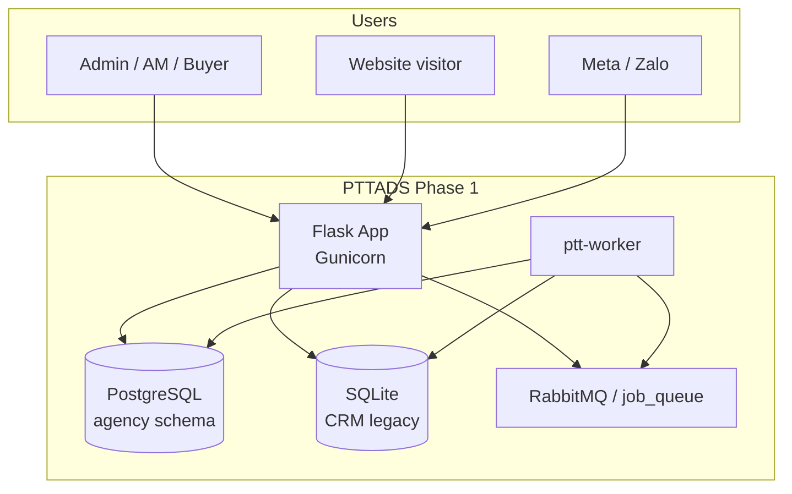

**Nguyên tắc:**

1. Webhook ACK nhanh (<2s) — persist job rồi return 200.
2. Idempotency ở job layer + CRM layer.
3. CRM business logic **reuse** `crm_lead_webhooks.ingest_webhook_leads` — không rewrite.
4. Correlation ID xuyên suốt webhook → job → ingest.

---

## 2. C4 Level 1 — System Context

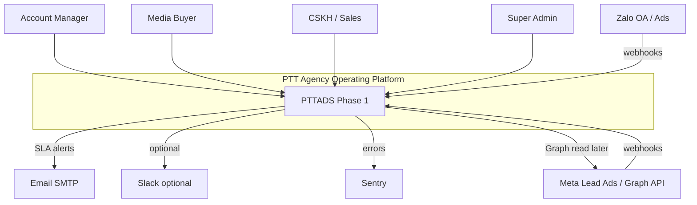

| Actor / System | Interaction Phase 1 |
|----------------|---------------------|
| Admin, AM, Buyer, CSKH | Flask admin UI + staff portal (unchanged shell) |
| Meta, Zalo | Webhook POST v1 (+ legacy routes) |
| Website visitor | Landing forms → queue |
| SMTP | SLA breach emails |
| Sentry | Exception tracking |
| PostgreSQL | Client, queue, events (new) |
| SQLite | CRM leads, hub, SOP (existing) |

---

## 3. C4 Level 2 — Containers

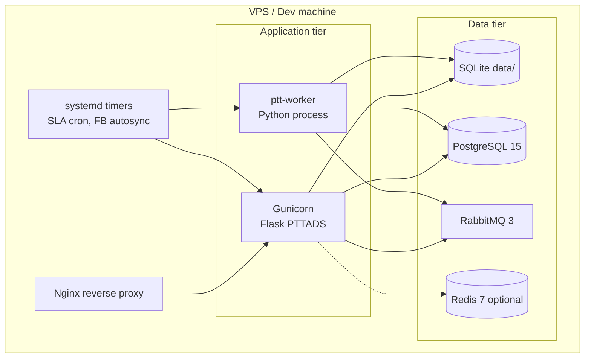

| Container | Tech | Trách nhiệm Phase 1 |
|-----------|------|---------------------|
| **Nginx** | nginx | TLS, proxy `pttads.vn`, rate limit webhook |
| **Flask (Gunicorn)** | Python 3, Flask 3 | UI, API, webhook ingress, enqueue |
| **ptt-worker** | Python 3 | Dequeue, ingest CRM, notify, DLQ |
| **SQLite** | file `data/*.db` | CRM OLTP (unchanged primary) |
| **PostgreSQL** | PG 15 | `clients`, `job_queue`, `domain_events`, `kpi_definitions` |
| **RabbitMQ** | 3.x | Queue `ptt.jobs`, `ptt.events` (optional events Phase 1) |
| **Redis** | 7 | Defer: session cache later |
| **systemd** | timers | SLA 5min, existing FB sync |

---

## 4. C4 Level 3 — Components (Phase 1)

### 4.1. Flask application

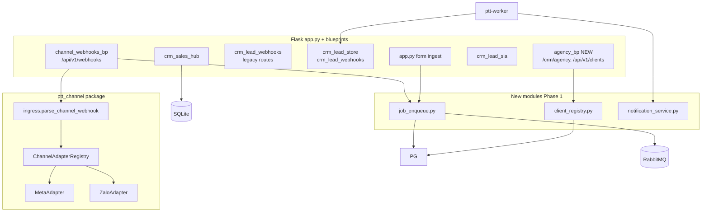

| Component | File (đề xuất) | Mô tả |
|-----------|----------------|-------|
| `channel_webhooks_bp` | `blueprints/channel_webhooks.py` | Parse + enqueue (extend) |
| `agency_bp` | `blueprints/agency.py` | Client UI + REST |
| `job_enqueue` | `ptt_jobs/enqueue.py` | Write PG + publish RMQ |
| `job_handlers` | `ptt_jobs/handlers/` | `ingest_lead`, `notify_sla`, `form_ingest` |
| `client_registry` | `ptt_agency/clients.py` | CRUD PG clients |
| `notification_service` | `ptt_agency/notify.py` | Email, Slack, inbox record |
| `ingest_monitor` | `blueprints/agency.py` | DLQ list, replay |

### 4.2. ptt-worker

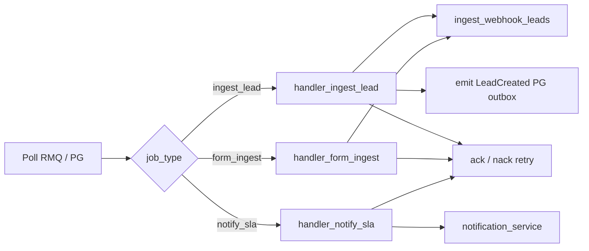

**Concurrency:** 1 worker process Phase 1 (VPS); scale horizontal Phase 2.

---

## 5. Luồng dữ liệu chính

### 5.1. Webhook v1 → Queue → CRM

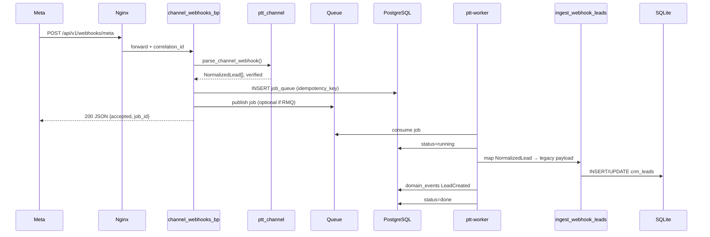

### 5.2. Form ingest (landing)

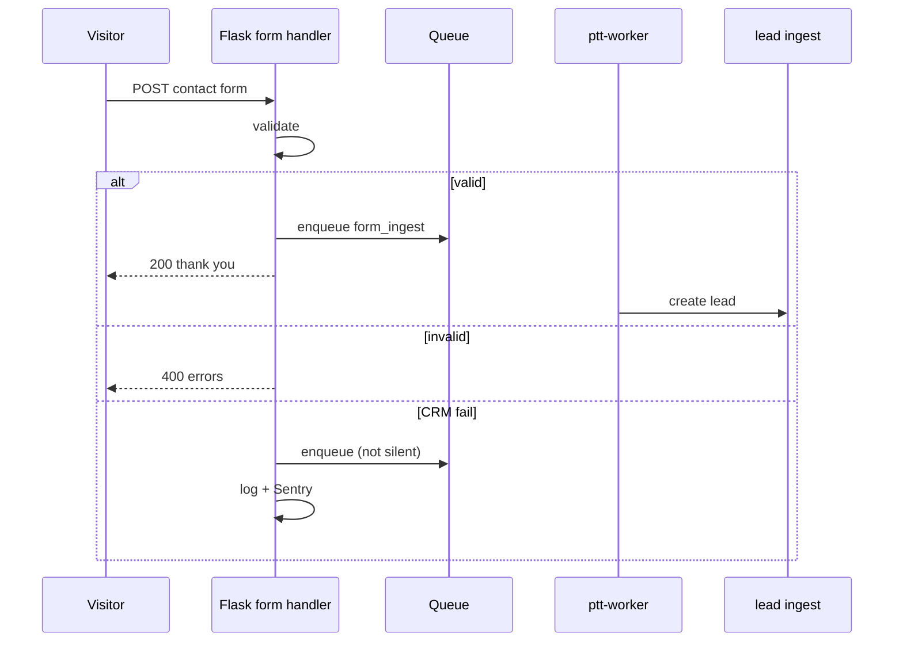

### 5.3. SLA notification cron

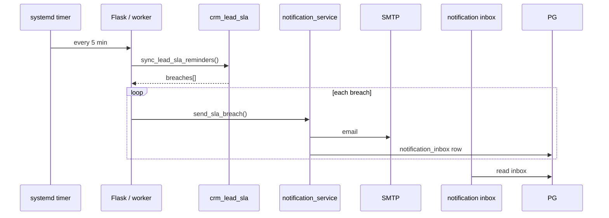

### 5.4. Client onboarding

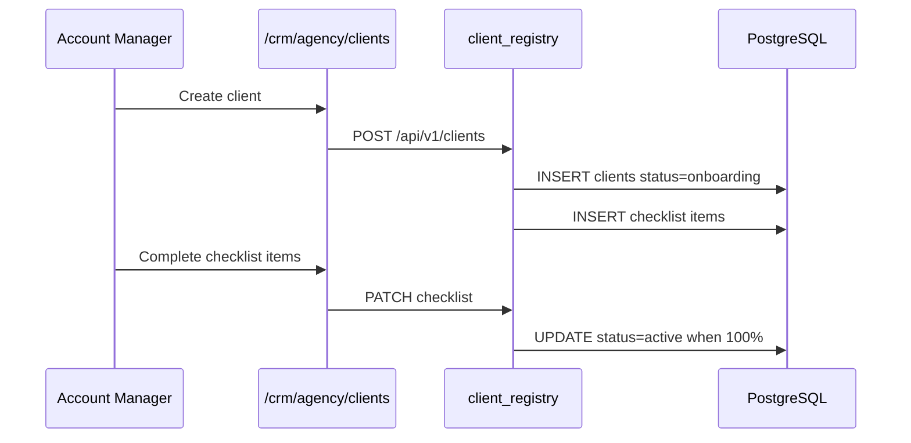

---

## 6. Mô hình dữ liệu Phase 1

### 6.1. PostgreSQL (agency schema)

Phase 1 **chỉ** các bảng sau trên PG — CRM leads vẫn SQLite.

| Table | Purpose |
|-------|---------|
| `clients` | Agency client registry |
| `client_onboarding_items` | Checklist rows |
| `client_channel_accounts` | Meta page / ad account IDs |
| `job_queue` | Job state + idempotency |
| `domain_events` | Outbox (LeadCreated, …) |
| `notification_inbox` | In-app notifications |
| `kpi_definitions` | KPI dictionary seed |

**ER diagram (Phase 1 subset):**

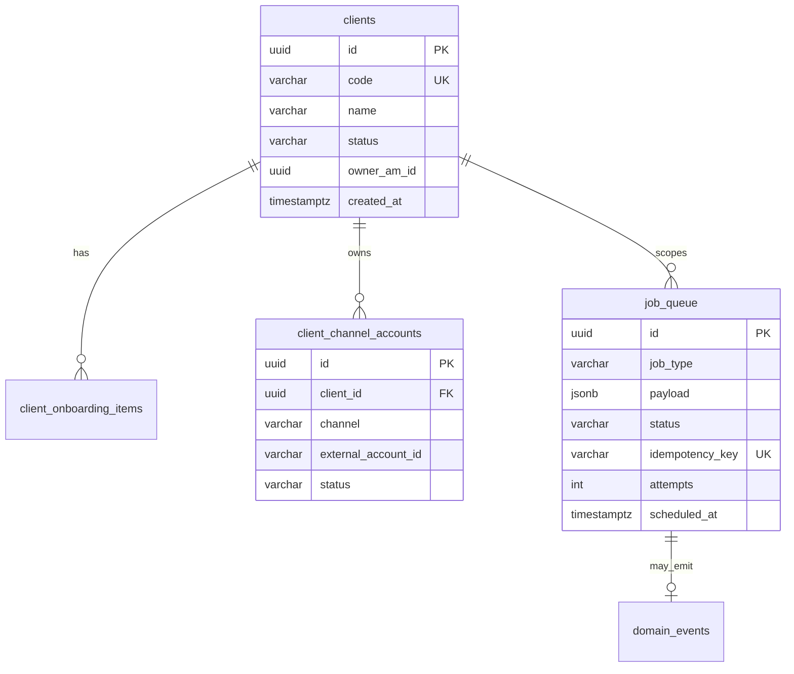

### 6.2. SQLite (unchanged — CRM)

Lead ingest vẫn ghi `crm_leads` + related. **Bridge field Phase 1:**

- `crm_leads.meta_json` hoặc column mới `agency_client_code` (optional migration SQLite nhỏ).
- Hub: `crm_hub_campaigns.meta_campaign_id` hoặc column `facebook_campaign_id`.

Chi tiết: `docs/specs/2026-07-17-sqlite-pg-migration.md` (artifact kèm implementation).

### 6.3. Idempotency keys

| Job type | Key format |
|----------|------------|
| `ingest_lead` | `ingest:{channel}:{external_lead_id}` |
| `form_ingest` | `form:{form_id}:{email_hash}:{date_bucket}` |
| `notify_sla` | `sla:{object_type}:{object_id}:{breach_at}` |

---

## 7. Job queue & worker

### 7.1. Job types Phase 1

| job_type | Publisher | Handler | Max retry |
|----------|-----------|---------|-----------|
| `ingest_lead` | webhook v1 | `handler_ingest_lead` | 5 |
| `form_ingest` | landing form | `handler_form_ingest` | 5 |
| `notify_sla` | SLA cron | `handler_notify_sla` | 3 |

### 7.2. State machine

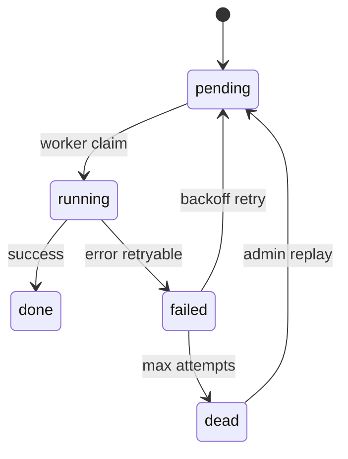

### 7.3. RabbitMQ topology (recommended)

```
Exchange: ptt.jobs (direct)
  Queue: ptt.jobs.ingest     routing_key: ingest_lead
  Queue: ptt.jobs.forms      routing_key: form_ingest
  Queue: ptt.jobs.notify     routing_key: notify_sla
  DLQ:   ptt.jobs.dlq        x-dead-letter
```

**Fallback (VPS không RMQ):** Worker poll `SELECT ... FROM job_queue WHERE status='pending' FOR UPDATE SKIP LOCKED`.

### 7.4. Worker deployment

```ini
# /etc/systemd/system/ptt-worker.service
[Unit]
Description=PTT Agency job worker
After=network.target postgresql.service rabbitmq-server.service

[Service]
WorkingDirectory=/var/www/qlptt
EnvironmentFile=/var/www/qlptt/.env
ExecStart=/var/www/qlptt/.venv/bin/python -m ptt_worker
Restart=always

[Install]
WantedBy=multi-user.target
```

---

## 8. Integration points

### 8.1. API surface Phase 1

| Method | Path | Auth | Mô tả |
|--------|------|------|-------|
| GET/POST | `/api/v1/webhooks/{channel}` | Public + signature | ✅ Exists — extend enqueue |
| GET | `/api/v1/channels` | Public | ✅ Exists |
| GET/POST/PATCH | `/api/v1/clients` | Admin session | Client CRUD |
| GET/PATCH | `/api/v1/clients/{id}/checklist` | Admin session | Onboarding |
| GET/POST | `/api/v1/clients/{id}/channel-accounts` | Admin session | Link Meta |
| GET | `/api/v1/jobs` | Admin | Ingest monitor |
| POST | `/api/v1/jobs/{id}/replay` | Admin | DLQ replay |
| GET/PATCH | `/api/v1/notifications` | Staff session | Inbox |
| GET | `/health` | Public | App health |
| GET | `/health/worker` | Admin | Queue lag |

### 8.2. Feature flags (env)

| Flag | Default | Mô tả |
|------|---------|-------|
| `PTT_WEBHOOK_V1_ENQUEUE` | `0` | Bật enqueue từ v1 webhook |
| `PTT_WEBHOOK_V1_PRIMARY` | `0` | Tắt legacy sau UAT |
| `PTT_CLIENT_STRICT_ONBOARDING` | `1` | Block active without checklist |
| `PTT_WORKER_ENABLED` | `1` | Worker consume jobs |
| `SLACK_WEBHOOK_URL` | empty | Optional Slack |

### 8.3. ChannelAdapter wiring

```python
# Pseudocode — channel_webhooks.py after parse
if current_app.config["PTT_WEBHOOK_V1_ENQUEUE"]:
    for lead in normalized_leads:
        enqueue_job(
            "ingest_lead",
            payload=lead.to_dict(),
            idempotency_key=f"ingest:{channel}:{lead.external_id}",
            client_id=client_id,
        )
    return jsonify({"accepted": True, "count": len(normalized_leads)})
# else: legacy inline ingest (deprecated path)
```

---

## 9. Deployment topology

### 9.1. Development (Docker Compose)

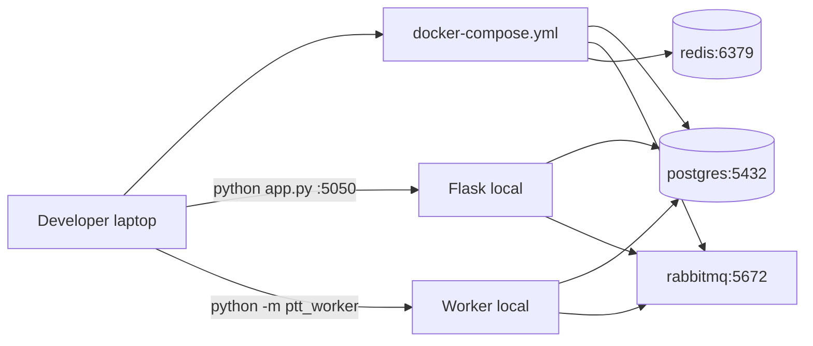

### 9.2. Production VPS (Phase 1)

```
/var/www/qlptt/
├── app.py / Gunicorn :8007
├── ptt_worker/
├── data/*.db          # SQLite CRM
├── .env
└── docker/            # PG + RMQ containers OR native packages

Nginx:
  pttads.vn → 127.0.0.1:8007
  limit_req zone=webhook burst=20
```

| Service | Port | Notes |
|---------|------|-------|
| Gunicorn | 8007 | Existing `mrap` service |
| PostgreSQL | 5432 | localhost only |
| RabbitMQ | 5672 | localhost; management 15672 internal |
| ptt-worker | — | systemd |

### 9.3. Network & firewall

- Webhook endpoints: public HTTPS only.
- PG, RMQ: bind `127.0.0.1`.
- Worker: no inbound ports.

---

## 10. Security Phase 1

| Control | Implementation |
|---------|----------------|
| Webhook verify | Meta HMAC, Zalo signature (existing) |
| Admin API | Flask session + `_admin_section_can("crm_agency")` |
| Idempotency | Prevent replay abuse |
| Rate limit | Nginx `limit_req` on `/api/v1/webhooks/` |
| Secrets | `.env` on VPS; Phase 2 Vault |
| PII logs | Mask phone/email in worker logs |
| SQL injection | Parameterized queries PG + SQLite |

**Không Phase 1:** Keycloak, JWT client portal, RLS PG (client_id filter in app layer).

---

## 11. Observability

### 11.1. Logging schema

```json
{
  "ts": "2026-07-17T00:00:00+07:00",
  "level": "info",
  "correlation_id": "wh-abc123",
  "component": "ptt_worker",
  "job_id": "uuid",
  "job_type": "ingest_lead",
  "client_id": "uuid",
  "duration_ms": 120,
  "message": "ingest done"
}
```

### 11.2. Metrics (Phase 1 minimal)

| Metric | Source |
|--------|--------|
| `ptt_jobs_pending` | COUNT job_queue pending |
| `ptt_jobs_dead` | COUNT dead |
| `ptt_webhook_accepted_total` | Counter Flask |
| `ptt_ingest_duration_ms` | Histogram worker |

Prometheus exporter — stretch; Phase 1 có thể SQL query + admin UI.

### 11.3. Sentry tags

`correlation_id`, `job_type`, `channel`, `client_code`

---

## 12. ADR — Architecture Decision Records

### ADR-001: Dual database (SQLite + PostgreSQL) Phase 1

**Status:** Accepted  
**Context:** CRM 80 modules on SQLite; migrate risky in 8 weeks.  
**Decision:** PG for new agency domain only; CRM stays SQLite.  
**Consequences:** No FK cross-DB; bridge via `client_code` in lead meta. Phase 1b migrates leads to PG.

### ADR-002: Reuse Flask + worker, defer NestJS

**Status:** Accepted  
**Context:** Team familiar Flask; NestJS needs parallel maintenance.  
**Decision:** NestJS starts Phase 1b after queue stable.  
**Consequences:** Faster delivery; technical debt documented.

### ADR-003: RabbitMQ with PG queue fallback

**Status:** Accepted  
**Context:** VPS may lack RabbitMQ initially.  
**Decision:** Abstract `JobBroker` interface; RMQ preferred, PG poll fallback.  
**Consequences:** Two code paths to test.

### ADR-004: Webhook async via queue

**Status:** Accepted  
**Context:** Meta expects fast 200; ingest can be slow.  
**Decision:** ACK after enqueue, not after CRM write.  
**Consequences:** Meta may retry; idempotency mandatory.

### ADR-005: UI in Flask admin (not Next.js) Phase 1

**Status:** Accepted  
**Context:** PRD 4–8 weeks; existing admin shell.  
**Decision:** New sidebar group Agency Ops in Jinja.  
**Consequences:** SPEC_UI_UX_AGENCY defines screens; Next.js Phase 3.

---

## 13. Evolution path → Phase 2

→ Chi tiết: [`2026-07-17-architecture-phase-2.md`](2026-07-17-architecture-phase-2.md)

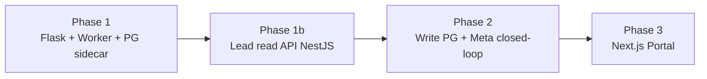

| Phase | Architecture change |
|-------|---------------------|
| **1b** | NestJS read API; PG migration leads begin | [`2026-07-17-phase-1b-roadmap.md`](2026-07-17-phase-1b-roadmap.md) |
| **2** | PG `crm_leads` OLTP; Nest write; `daily_performance`; CAPI pilot | [`2026-07-17-architecture-phase-2.md`](2026-07-17-architecture-phase-2.md) |
| **3** | Next.js client portal; Temporal workflows |
| **4** | Deprecate Flask; Kafka if scale |

---

## Phụ lục — File structure đề xuất

```
PTTADS/
  blueprints/
    agency.py                 # NEW
    channel_webhooks.py       # EXTEND enqueue
  ptt_agency/
    __init__.py
    clients.py
    notify.py
  ptt_jobs/
    __init__.py
    enqueue.py
    broker.py                 # RMQ + PG fallback
    handlers/
      ingest_lead.py
      form_ingest.py
      notify_sla.py
  ptt_worker/
    __init__.py
    __main__.py               # python -m ptt_worker
  docker-compose.yml
  docs/specs/
    2026-07-17-postgresql-ddl-v1.sql
    2026-07-17-sqlite-pg-migration.md
    events/catalog.yaml
```

---

| Version | Date | Change |
|---------|------|--------|
| 1.0 | 2026-07-17 | Initial Architecture Phase 1 |
