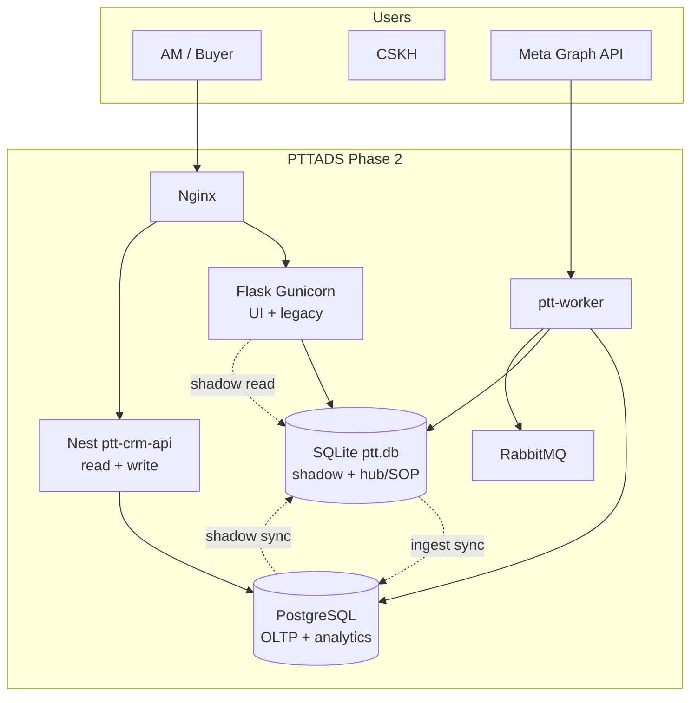
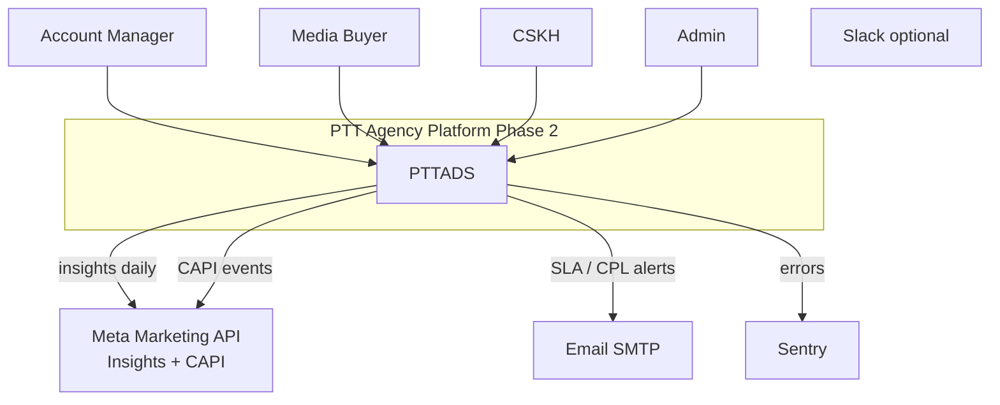
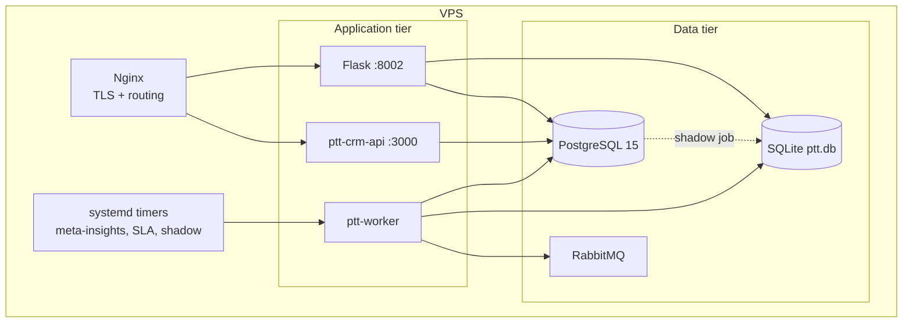
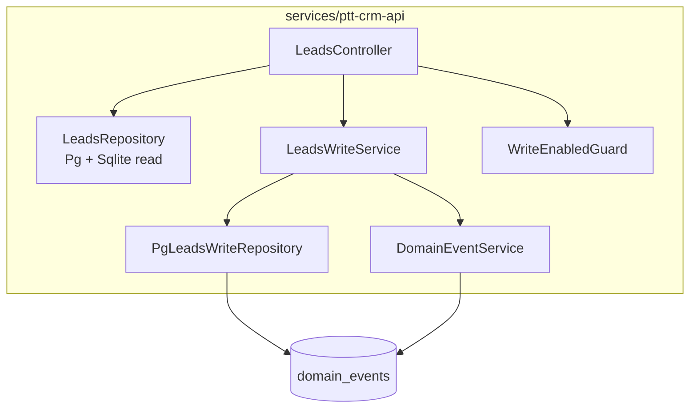
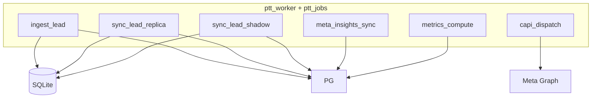
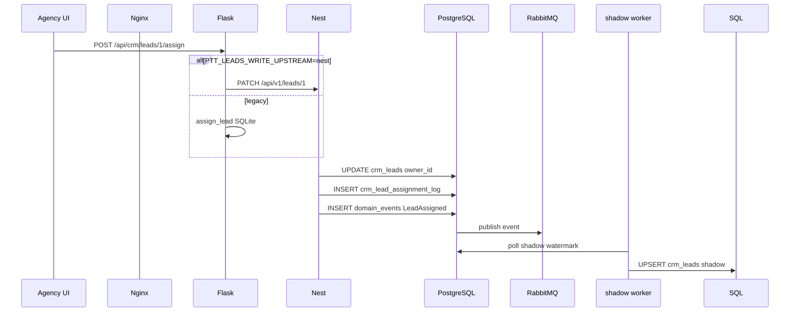
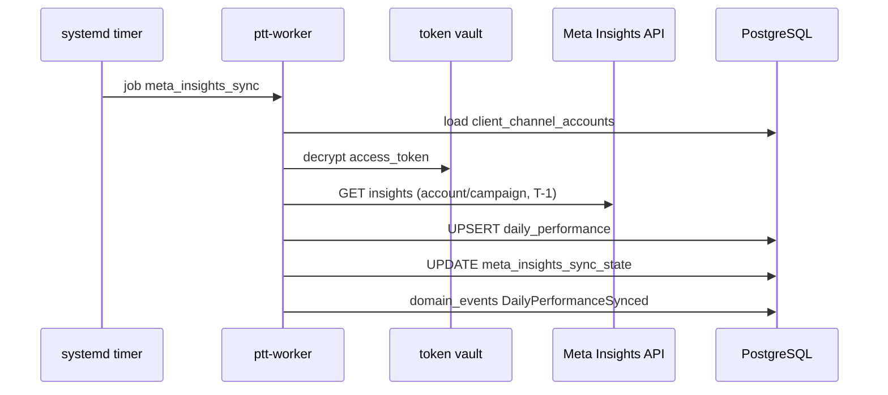
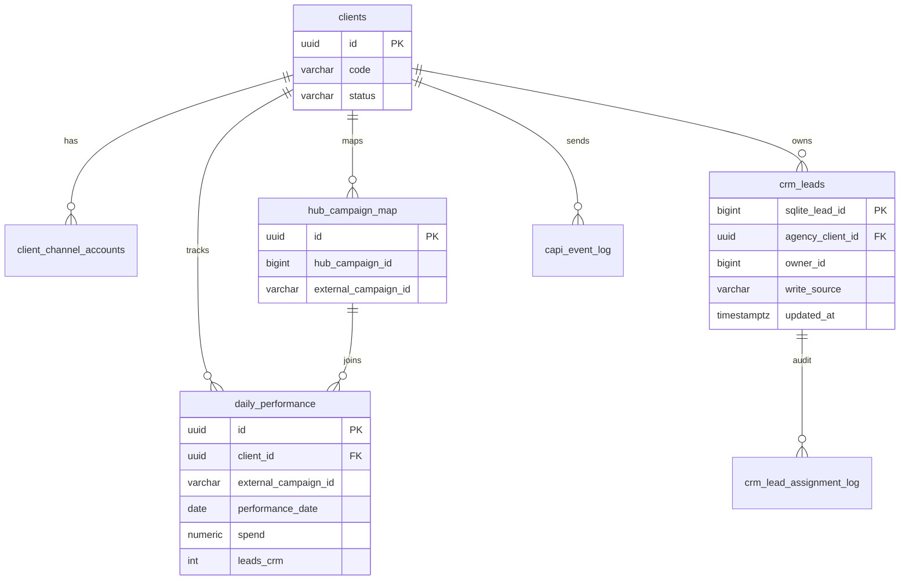
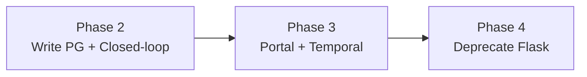

# Architecture Phase 2 — CRM Write OLTP + Meta Closed-Loop

> **Phiên bản:** 1.0 · **Ngày:** 2026-07-17  
> **Phạm vi:** PRD Phase 2 (10–14 tuần) — Nest write PG primary, Meta insights, CPL/CAPI  
> **PRD:** [`2026-07-17-prd-phase-2.md`](2026-07-17-prd-phase-2.md)  
> **Phase 1:** [`2026-07-17-architecture-phase-1.md`](2026-07-17-architecture-phase-1.md)  
> **Phase 1b:** [`2026-07-17-phase-1b-roadmap.md`](2026-07-17-phase-1b-roadmap.md)  
> **DDL v3:** [`2026-07-17-postgresql-ddl-v3-leads-oltp.sql`](2026-07-17-postgresql-ddl-v3-leads-oltp.sql), [`2026-07-17-postgresql-ddl-v3-performance.sql`](2026-07-17-postgresql-ddl-v3-performance.sql)

---

## Mục lục

1. [Tổng quan](#1-tổng-quan)
2. [C4 Level 1 — System Context](#2-c4-level-1--system-context)
3. [C4 Level 2 — Containers](#3-c4-level-2--containers)
4. [C4 Level 3 — Components](#4-c4-level-3--components)
5. [Luồng dữ liệu — Track W (write)](#5-luồng-dữ-liệu--track-w-write)
6. [Luồng dữ liệu — Track M (closed-loop)](#6-luồng-dữ-liệu--track-m-closed-loop)
7. [Mô hình dữ liệu Phase 2](#7-mô-hình-dữ-liệu-phase-2)
8. [Sync & migration strategy](#8-sync--migration-strategy)
9. [Job types & workers](#9-job-types--workers)
10. [Deployment topology](#10-deployment-topology)
11. [Security Phase 2](#11-security-phase-2)
12. [Observability](#12-observability)
13. [ADR — Architecture Decision Records](#13-adr--architecture-decision-records)
14. [Evolution → Phase 3](#14-evolution--phase-3)

---

## 1. Tổng quan

Phase 2 **mở rộng** strangler đã có sau Phase 1 + 1b:

| Giai đoạn trước | Phase 2 thay đổi |
|-----------------|------------------|
| SQLite `ptt.db` = CRM OLTP | **PG `crm_leads` = OLTP primary** (write + read Nest) |
| PG `crm_leads` = read replica | Promoted; FK `clients`; assignment log PG |
| Nest read-only PG | Nest **write** prod (`POST/PATCH /api/v1/leads`) |
| Hub map trong SQLite UI | **`hub_campaign_map`** PG cache + insights join |
| KPI definitions seed only | **`daily_performance`** + metrics engine CPL/ROAS |
| Ingest → SQLite only | Ingest vẫn SQLite **hoặc** queue → PG (transition); shadow sync |



**Nguyên tắc Phase 2:**

1. **Write authoritative on PG** sau cutover — Nest PATCH assign là source of truth.
2. **SQLite shadow** giữ rollback ≤ 5 phút (`PTT_LEADS_WRITE_UPSTREAM=flask`).
3. **Closed-loop** tách analytics OLTP (`daily_performance`) khỏi CRM OLTP (`crm_leads`).
4. **Cross-DB bridge** qua `hub_campaign_map` + `sqlite_lead_id` — không FK SQLite↔PG.
5. **Events bắt buộc RMQ** — `LeadAssigned`, `DailyPerformanceSynced`.

---

## 2. C4 Level 1 — System Context



| Actor / System | Interaction Phase 2 |
|----------------|---------------------|
| AM, Buyer | CPL dashboard; Hub map; client performance tab |
| CSKH | Assign lead (UI → Nest write or Flask proxy) |
| Meta | Insights API read; CAPI server-side events |
| PostgreSQL | CRM OLTP + performance + events |
| SQLite | Hub, SOP, cases; lead shadow |

---

## 3. C4 Level 2 — Containers



| Container | Tech | Trách nhiệm Phase 2 |
|-----------|------|---------------------|
| **Nginx** | nginx | Read/write route flags; inject `X-PTT-Internal-Key` |
| **Flask** | Gunicorn | CRM UI, Hub, SOP, legacy assign proxy |
| **Nest CRM API** | Node 22, Nest 10 | `GET/POST/PATCH /api/v1/leads`; health |
| **ptt-worker** | Python | ingest, meta_insights_sync, shadow_sync, capi_dispatch |
| **PostgreSQL** | PG 15 | OLTP leads, performance, vault, events |
| **SQLite** | ptt.db | Shadow + modules chưa migrate |
| **RabbitMQ** | 3.x | `ptt.events` consumers |

---

## 4. C4 Level 3 — Components

### 4.1. NestJS `ptt-crm-api`



### 4.2. Python worker extensions



### 4.3. Flask (unchanged core + proxy)

- Agency Ops UI: performance tab (new)
- `/api/crm/leads/:id/assign` → optional proxy Nest PATCH (`PTT_LEADS_WRITE_UPSTREAM=nest`)
- Hub UI writes → sync `hub_campaign_map` PG

---

## 5. Luồng dữ liệu — Track W (write)

### 5.1. Assign lead (target state)



### 5.2. Create lead (Phase 2 prod)

```
POST /api/v1/leads → Nest → PG crm_leads (new sqlite_lead_id from PG sequence)
→ domain_events LeadCreated
→ (optional) shadow → SQLite
```

Staging id range ≥ 900M (B9) deprecated for prod — use unified id allocator.

### 5.3. Rollback write

```
PTT_LEADS_WRITE_UPSTREAM=flask
→ Flask assign_lead SQLite OLTP
→ pause PG primary writes
→ optional: PG→SQLite reconcile export
```

---

## 6. Luồng dữ liệu — Track M (closed-loop)

### 6.1. Daily Meta insights



### 6.2. CPL computation

```
daily_performance (spend)
  JOIN hub_campaign_map (external_campaign_id)
  JOIN crm_leads count by campaign/day (leads_crm)
  → metrics_snapshots (kpi_code=CPL)
  → Agency Ops UI
```

Formula: `CPL = spend / NULLIF(leads_crm, 0)` per campaign per day.

### 6.3. CAPI (pilot)

```
LeadCreated (domain_events)
  → job capi_dispatch (async, PTT_CAPI_ENABLED=1)
  → Meta Graph POST /{pixel_id}/events
  → capi_event_log (dedup event_id)
```

Không block ingest path — failure logged only.

---

## 7. Mô hình dữ liệu Phase 2

### 7.1. Entity relationship (PG core)



### 7.2. Database roles

| Store | Phase 2 role | Cutover |
|-------|--------------|---------|
| `crm_leads` (PG) | **OLTP primary** | Week 8–9 PRD |
| `ptt.db` crm_leads | Shadow + rollback | Read fallback until Phase 3 |
| `daily_performance` | Analytics OLTP | New |
| `hub_campaign_map` | Campaign bridge | Seed from SQLite Hub |
| `client_channel_accounts` | Token vault | Extend columns v3 |

### 7.3. LeadV1 id stability

`LeadV1.id` = `crm_leads.sqlite_lead_id` **unchanged** — tránh break API contract v1.

---

## 8. Sync & migration strategy

### 8.1. Phases of sync mode

| Phase | `sync_mode` | Direction | Primary |
|-------|-------------|-----------|---------|
| 1b | `sqlite_to_pg` | SQLite → PG | SQLite |
| 2 transition | `sqlite_to_pg` + shadow | Both | PG write, SQLite shadow |
| 2 steady | `pg_primary` | PG → SQLite shadow | PG |
| Rollback | `sqlite_to_pg` | Pause shadow | SQLite |

### 8.2. Watermark tables

| Table | Purpose |
|-------|---------|
| `crm_leads_sync_state` | SQLite → PG ingest sync (Phase 1b) |
| `crm_leads_shadow_state` | PG → SQLite shadow (Phase 2) |
| `meta_insights_sync_state` | Meta API daily job |

### 8.3. DDL apply order

```
v1 → v2 → v3-leads-oltp → v3-performance
./scripts/apply_pg_ddl_v3.sh
```

Post-apply: `VALIDATE CONSTRAINT crm_leads_agency_client_fk`

---

## 9. Job types & workers

| job_type | Handler | Schedule | Phase |
|----------|---------|----------|-------|
| `ingest_lead` | existing | on webhook | 1 |
| `sync_lead_replica` | SQLite→PG | post-ingest + cron | 1b |
| `sync_lead_shadow` | PG→SQLite | cron 1 min | **2** |
| `meta_insights_sync` | new | daily 02:00 | **2** |
| `metrics_compute` | new | after insights | **2** |
| `capi_dispatch` | new | on LeadCreated | **2** pilot |

Enqueue via existing `job_queue` + RMQ fan-out for events.

---

## 10. Deployment topology

```
pttads.vn
  /api/v1/leads      → Nest :3000 (read+write flags)
  /api/crm/*         → Flask :8002
  /crm/agency/*      → Flask UI

api.pttads.vn
  /api/v1/leads      → Nest (S2S + internal key)

Services:
  ptt.service          Flask Gunicorn
  ptt-crm-api.service  Nest dist/main.js
  ptt-worker.service   python -m ptt_worker
  ptt-meta-insights.timer  daily
```

Docker Compose local: add env `PTT_LEADS_WRITE_ENABLED`, mount PG only (SQLite optional for shadow dev).

---

## 11. Security Phase 2

| Layer | Phase 2 |
|-------|---------|
| Nest write | `X-PTT-Internal-Key` required prod |
| Token vault | `access_token_encrypted` AES-GCM; key `PTT_TOKEN_VAULT_KEY` |
| CAPI | Per-client pixel; no token in logs |
| Nginx | Rate limit insights cron endpoint |
| PG | FK clients; row-level by client_id in API |

JWT/Keycloak — defer Phase 2.1 if needed; internal key sufficient for strangler.

---

## 12. Observability

| Signal | Source | Alert |
|--------|--------|-------|
| Nest write 5xx | Sentry | > 0.1% |
| Shadow lag | `crm_leads_shadow_state` | > 5 min |
| Meta sync fail | `meta_insights_sync_state.last_error` | any account fail |
| CPL stale | max(`daily_performance.performance_date`) | > 2 days |
| CAPI error rate | `capi_event_log.status=failed` | > 5% pilot |
| LeadAssigned lag | `published_at - created_at` | > 30s |

Dashboards: reuse Sentry + SQL cron checks (Phase 1 pattern).

---

## 13. ADR — Architecture Decision Records

### ADR-006: PG crm_leads as OLTP primary (Phase 2)

**Status:** Proposed  
**Context:** Phase 1b read replica proven; Nest write staging POC done.  
**Decision:** Promote PG `crm_leads` to write primary; keep `sqlite_lead_id` as API id.  
**Consequences:** Dual sync complexity; shadow required for rollback.

### ADR-007: SQLite shadow not immediate delete

**Status:** Proposed  
**Context:** Hub/SOP/cases still SQLite; rollback requirement ≤ 5 min.  
**Decision:** PG→SQLite shadow job; Flask modules unchanged Phase 2.  
**Consequences:** Temporary dual storage; reconcile cron mandatory.

### ADR-008: hub_campaign_map PG cache

**Status:** Proposed  
**Context:** Hub campaigns live in SQLite; insights need PG join.  
**Decision:** Denormalized `hub_campaign_map` synced from Hub UI saves.  
**Consequences:** Eventual consistency; UI must upsert map on save.

### ADR-009: CAPI async non-blocking

**Status:** Proposed  
**Context:** CAPI failures must not block lead ingest.  
**Decision:** Separate `capi_dispatch` job; log-only pilot.  
**Consequences:** Match rate measured post-hoc.

### ADR-010: daily_performance separate from crm_leads

**Status:** Proposed  
**Context:** Insights volume + retention differ from CRM OLTP.  
**Decision:** Dedicated table; metrics_snapshots for aggregates.  
**Consequences:** Join via hub_campaign_map + date.

---

## 14. Evolution → Phase 3

→ Chi tiết: [`2026-07-17-prd-phase-3.md`](2026-07-17-prd-phase-3.md) · [`2026-07-17-architecture-phase-3.md`](2026-07-17-architecture-phase-3.md)



| Phase | Change |
|-------|--------|
| **3** | Next.js client portal; creative approval; Google Ads |
| **3** | Stop SQLite shadow; cases/hub migrate PG |
| **4** | Flask read-only → retire; ClickHouse events |

---

## Phụ lục — File structure Phase 2

```
PTTADS/
  docs/specs/
    2026-07-17-prd-phase-2.md
    2026-07-17-architecture-phase-2.md          # this doc
    2026-07-17-postgresql-ddl-v3-leads-oltp.sql
    2026-07-17-postgresql-ddl-v3-performance.sql
  scripts/
    apply_pg_ddl_v3.sh
    dual_run_write_check.py                     # TODO W7
  services/ptt-crm-api/
    src/leads/leads-write.service.ts            # ✅ B9
    src/events/domain-event.service.ts
  ptt_jobs/handlers/
    meta_insights_sync.py                       # TODO M2
    sync_lead_shadow.py                         # TODO W2
    capi_dispatch.py                            # TODO M5
  ptt_metrics/
    compute.py                                  # TODO M4
```

---

| Version | Date | Change |
|---------|------|--------|
| 1.0 | 2026-07-17 | Initial Architecture Phase 2 |
