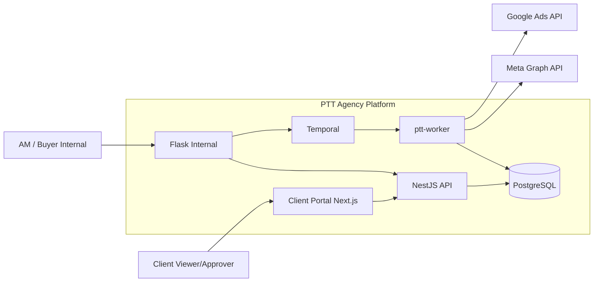
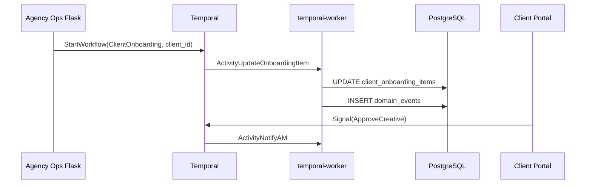
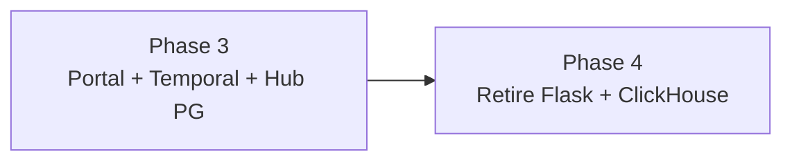

# Architecture Phase 3 — Portal + Temporal + Hub PG Migration

> **Phiên bản:** 1.0 · **Ngày:** 2026-07-17  
> **PRD:** [`2026-07-17-prd-phase-3.md`](2026-07-17-prd-phase-3.md)  
> **Phase 2 architecture:** [`2026-07-17-architecture-phase-2.md`](2026-07-17-architecture-phase-2.md)

---

## Mục lục

1. [Context & goals](#1-context--goals)
2. [System context](#2-system-context)
3. [Container diagram](#3-container-diagram)
4. [Track P — Client Portal](#4-track-p--client-portal)
5. [Track T — Temporal](#5-track-t--temporal)
6. [Track G — Google Ads](#6-track-g--google-ads)
7. [Track D — Data migration](#7-track-d--data-migration)
8. [Auth model](#8-auth-model)
9. [API surface](#9-api-surface)
10. [Deployment topology](#10-deployment-topology)
11. [ADRs (proposed)](#11-adrs-proposed)
12. [Evolution → Phase 4](#12-evolution--phase-4)

---

## 1. Context & goals

Phase 2 established:

- PostgreSQL `crm_leads` OLTP (assign/status write via Nest)
- Meta closed-loop (`daily_performance`, CPL/ROAS stub)
- Flask strangler + SQLite shadow for rollback

Phase 3 adds **external client access** and **durable workflows** without retiring Flask (Phase 4).

**Design principles:**

- Portal **reads** performance via Nest API — không duplicate business logic trong Next.js.
- Temporal **orchestrates**; PG remains source of truth for CRM/agency data.
- Hub/SOP migration **strangler** — feature flags per module, same pattern as leads.

---

## 2. System context



---

## 3. Container diagram

| Container | Tech | Responsibility Phase 3 |
|-----------|------|------------------------|
| **portal-web** | Next.js 14 App Router | Client UI; BFF optional |
| **ptt-crm-api** | NestJS | Leads, performance, portal auth API |
| **ptt (Flask)** | Gunicorn | Agency Ops; workflow start; legacy modules |
| **ptt-worker** | Python | Google insights sync; CAPI; hub sync jobs |
| **temporal-server** | Temporal | Workflow state |
| **temporal-worker** | Python/TS | Workflow activities |
| **ptt-postgres** | PostgreSQL 15 | All agency OLTP + performance |
| **ptt.db** | SQLite | Legacy hub/SOP until D2 complete |

---

## 4. Track P — Client Portal

### 4.1 Routing

| Host | App |
|------|-----|
| `pttads.vn` | Flask (internal) — unchanged Phase 3 |
| `api.pttads.vn` | NestJS |
| `portal.pttads.vn` | Next.js client portal **new** |

### 4.2 Pages (MVP)

| Route | Data source |
|-------|-------------|
| `/login` | Nest `POST /api/v1/portal/auth/login` |
| `/dashboard` | `GET /api/v1/performance?client_id=` |
| `/creatives` | `GET /api/v1/creatives/pending` + Temporal signal |
| `/settings` | Client branding (optional) |

### 4.3 BFF decision

**MVP:** Portal calls Nest directly (CORS + JWT).  
**Later:** Next.js Route Handlers as BFF if cookie/session complexity grows.

---

## 5. Track T — Temporal

### 5.1 Workflows (initial catalog)

| Workflow | Trigger | Outcome |
|----------|---------|---------|
| `ClientOnboardingWorkflow` | AM creates client | All onboarding items done |
| `LaunchQAWorkflow` | Campaign launch request | QA checklist signed |
| `CreativeApprovalWorkflow` | Creative upload vN | Client approver signal |

Specs live in `docs/specs/workflows/` (to create).

### 5.2 Integration pattern



### 5.3 Coexistence with SOP DB

Phase 3 **does not delete** SQLite SOP. New launches use Temporal; legacy SOP runs read-only until migrated (ADR-012).

---

## 6. Track G — Google Ads

Mirror Meta pattern:

```
ptt_google/
  insights_sync.py      # daily T-1
  token_vault.py        # reuse ptt_agency.channel_vault
```

| Component | Reuse from Meta |
|-----------|-----------------|
| `daily_performance` | Same table, `channel='google'` |
| `hub_campaign_map` | Same table, `channel='google'` |
| Worker timer | `ptt-google-insights.timer` |
| Alert | Same Sentry pattern as Meta |

---

## 7. Track D — Data migration

### 7.1 Migration order (Phase 3)

| Order | Domain | Flag |
|-------|--------|------|
| 1 | `hub_campaign_map` already PG | — |
| 2 | Hub campaign metadata PG | `PTT_HUB_READ_SOURCE=pg` |
| 3 | SOP templates/runs PG | `PTT_SOP_READ_SOURCE=pg` |
| 4 | Lead shadow off | `PTT_LEAD_SHADOW_SYNC=0` |
| 5 | `crm_cases` | Spike / defer |

### 7.2 Shadow sunset criteria

- Phase 2 write soak ≥ 30d prod 0 mismatch
- No rollback drill failure in 30d
- Flask modules that read leads use Nest/PG only

---

## 8. Auth model

### Phase 3 MVP (proposed ADR-011)

| Actor | Mechanism |
|-------|-----------|
| Internal (Flask) | Session cookie (existing) |
| S2S (Nest) | `X-PTT-Internal-Key` |
| Portal client | JWT `sub=user_id`, claim `client_id`, `role=viewer|approver` |

**Token TTL:** 8h access + refresh rotation.  
**Phase 3.1:** Keycloak OIDC federation for enterprise clients.

Portal **must not** use Flask session — separate origin `portal.pttads.vn`.

---

## 9. API surface

### New Nest modules (proposed)

| Method | Path | Purpose |
|--------|------|---------|
| POST | `/api/v1/portal/auth/login` | Client login |
| GET | `/api/v1/portal/me` | Profile + client scope |
| GET | `/api/v1/performance` | Exists Phase 2 — extend auth |
| GET | `/api/v1/creatives/pending` | Portal inbox |
| POST | `/api/v1/creatives/:id/approve` | Signal Temporal |
| POST | `/api/v1/workflows/:type/start` | Internal + AM only |

Flask: thin proxy deprecated for portal — portal → Nest only.

---

## 10. Deployment topology

### VPS (production)

```
/var/www/ptt/                    Flask + worker + scripts
/var/www/ptt/services/ptt-crm-api  Nest
/var/www/ptt/services/portal-web   Next.js standalone
/opt/temporal/                     Temporal server (or Temporal Cloud)
```

### New systemd units (proposed)

| Unit | Purpose |
|------|---------|
| `ptt-portal.service` | Next.js `node server.js` |
| `ptt-temporal-worker.service` | Python temporal worker |
| `ptt-google-insights.timer` | Google daily sync |

### Docker Compose (dev)

Extend `docker-compose.yml`:

- `temporal` + `temporal-ui`
- `portal-web` dev

---

## 11. ADRs (proposed)

| ADR | Decision |
|-----|----------|
| **ADR-011** | Portal JWT via Nest MVP; Keycloak Phase 3.1 |
| **ADR-012** | Temporal for new workflows; SOP DB legacy read until Phase 4 |
| **ADR-013** | Google adapter mirrors Meta module layout |
| **ADR-014** | Hub PG primary with 30d SQLite fallback read |

---

## 12. Evolution → Phase 4



| Phase | Change |
|-------|--------|
| **4** | Flask read-only → retire; internal UI Next.js |
| **4** | Campaign write Meta with approval |
| **4** | ClickHouse event analytics |

---

| Version | Date | Change |
|---------|------|--------|
| 1.0 | 2026-07-17 | Initial Architecture Phase 3 planning |
