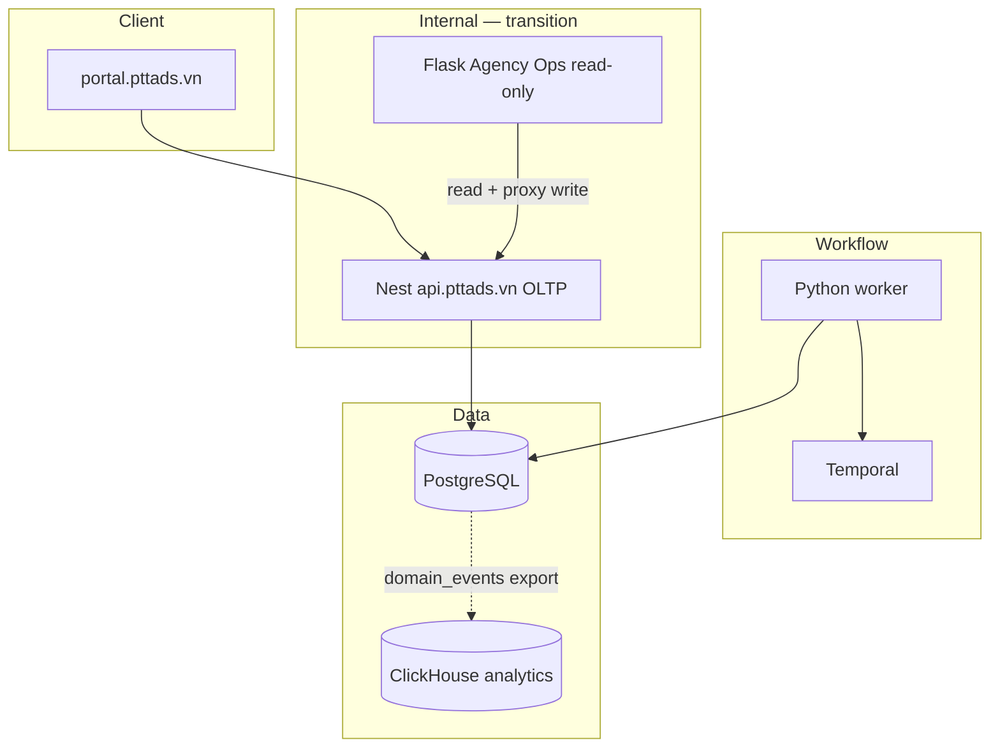

# Architecture Phase 4 — Scale & Flask Sunset

> **Version:** 1.0 · **Date:** 2026-07-17

## 1. Context

Phase 3 delivered client portal, Temporal workflows, Hub/SOP PG migration scaffold. Phase 4 **retires Flask write paths** and adds **approved Meta campaign mutations**.

## 2. Topology

## 3. Track F1 — Campaign write

| Layer | Component |
|-------|-----------|
| API | `POST /api/v1/campaign-writes` (internal) |
| API | `POST /api/v1/campaign-writes/:id/approve` |
| WF | `CampaignWriteApprovalWorkflow` |
| Execute | `ptt_meta.campaign_write.apply_daily_budget` |
| Audit | `domain_events` `CampaignBudgetChangeExecuted` |

## 4. Track F3 — Flask sunset

| Stage | Flag | Behavior |
|-------|------|----------|
| Dual | default | Flask read+write SQLite legacy |
| Readonly | `PTT_FLASK_MONOLITH_MODE=readonly` | GET OK; mutating routes 503 |
| Retired | `PTT_FLASK_MONOLITH_MODE=retired` | Health only; nginx → Nest |

## 5. Track F4 — ClickHouse

- Table `ptt.domain_events` — MergeTree, partition by month
- Job `scripts/export_domain_events_clickhouse.sh` daily
- No OLTP dependency on CH

## 6. ADRs

| ADR | Decision |
|-----|----------|
| ADR-012 | Temporal owns campaign write approval; no SOP code-gate |
| ADR-014 | Hub PG primary; SQLite Hub retired Phase 4 end |
