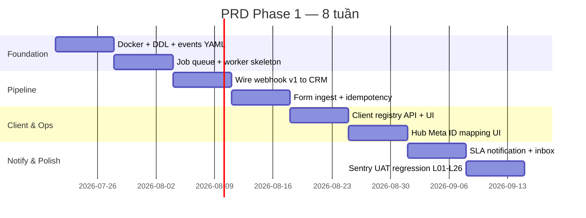

# PRD Phase 1 — Agency Platform Foundation

> **Phiên bản:** 1.0 · **Ngày:** 2026-07-17  
> **Thời gian:** 4–8 tuần (1 squad: 1 BE + 1 FE/part-time + 1 QA/part-time)  
> **Trạng thái:** Approved for planning  
> **Master spec:** [`SPEC_AGENCY_OPERATING_PLATFORM.md`](../SPEC_AGENCY_OPERATING_PLATFORM.md)  
> **Kiến trúc:** [`2026-07-17-architecture-phase-1.md`](2026-07-17-architecture-phase-1.md)  
> **UI/UX:** [`SPEC_UI_UX_AGENCY.md`](../SPEC_UI_UX_AGENCY.md)

---

## 1. Tóm tắt

Phase 1 xây **nền vận hành agency** trên PTTADS hiện tại: hoàn thiện hạ tầng (PostgreSQL, queue, worker), nối webhook đa kênh vào CRM, thêm **Client registry**, **SLA notification**, và **UI Agency Ops** trong Flask admin — **không** rewrite NestJS/Next.js trong cửa sổ 4–8 tuần này.

**Mục tiêu kinh doanh:**

- Lead từ Meta/Zalo/form **không mất**, ingest **idempotent**, có DLQ replay.
- Agency quản lý **client** (khách hàng agency) tách biệt lead/end-customer.
- AM/Buyer thấy **trạng thái pipeline ingest + SLA** realtime.
- Hub campaign có **mapping Meta campaign ID** (chuẩn bị closed-loop Phase 2).

**North-star metric Phase 1:** 100% webhook lead qua queue; SLA breach notify trong ≤5 phút; 0 silent fail form ingest.

---

## 2. Phạm vi

### 2.1. In scope (Must-have)

| ID | Epic | Mô tả ngắn |
|----|------|------------|
| E1 | **Infrastructure** | Docker Compose (PG, Redis, RabbitMQ), DDL v1, dev parity |
| E2 | **Job queue & worker** | `ptt-worker`: dequeue, retry, DLQ, idempotency |
| E3 | **Webhook pipeline** | v1 webhook → queue → `ingest_webhook_leads`; legacy song song |
| E4 | **Client registry** | CRUD client, onboarding checklist, channel account link |
| E5 | **Form ingest reliability** | Landing/career form → queue; alert khi fail |
| E6 | **Notification & SLA** | Cron 5 phút; email (+ Slack optional); lead/case SLA |
| E7 | **Agency Ops UI** | Màn hình Flask: clients, ingest monitor, Hub map, notification inbox |
| E8 | **Observability** | Sentry, structured JSON logs, health endpoints |
| E9 | **KPI dictionary seed** | Bảng `kpi_definitions`; CPL formula document-only (chưa auto sync Meta) |

### 2.2. Stretch (Nice-to-have nếu còn buffer tuần 7–8)

| ID | Epic | Ghi chú |
|----|------|---------|
| S1 | Hub → SOP auto-start khi gán Meta campaign ID | Hook đơn giản, không Temporal |
| S2 | AI auto-classify on ingest | Rule-first; OpenAI optional |
| S3 | Zalo autosync worker | Mirror FB autosync pattern |

### 2.3. Out of scope (Phase 1 PRD — defer)

| Hạng mục | Phase defer | Lý do |
|----------|-------------|-------|
| NestJS API + dual-run CRM | Phase 1b / 2 | >8 tuần; cần DDL ổn định trước |
| Next.js Internal / Client Portal | Phase 3 | UI Phase 1 = Flask extension |
| Meta Marketing API daily insights | Phase 2 | Cần asset registry + token vault |
| CAPI collector | Phase 2 | Phụ thuộc tracking layer |
| Campaign write / budget approval workflow | Phase 3 | Temporal |
| PostgreSQL cutover production (full migrate CRM) | Phase 1b | Phase 1: PG cho client/queue/events; CRM vẫn SQLite primary |
| Keycloak / JWT portal | Phase 2 | Giữ Flask session Phase 1 |

---

## 3. Personas & jobs-to-be-done

| Persona | Job Phase 1 | Success |
|---------|-------------|---------|
| **Super Admin** | Cấu hình client, channel account, xem DLQ | Onboard client <30 phút |
| **AM** | Theo dõi SLA lead client; xem ingest status | Nhận notify khi breach |
| **Media Buyer** | Gán Hub campaign ↔ Meta ID | Map 1-click, không duplicate |
| **CSKH / Sales** | Lead mới từ webhook xuất hiện như cũ | Zero regression L01–L26 |
| **DevOps** | Deploy worker + queue; replay DLQ | Runbook rõ, alert Sentry |

---

## 4. User stories & acceptance criteria

### Epic E1 — Infrastructure

| Story | Acceptance criteria |
|-------|---------------------|
| US-E1-01 Dev env | `docker compose up` → PG, Redis, RabbitMQ healthy; README có env vars |
| US-E1-02 DDL v1 | File SQL apply được; tables: `clients`, `client_channel_accounts`, `job_queue`, `domain_events`, `kpi_definitions` |
| US-E1-03 Migration matrix | Doc map SQLite tables ↔ PG; CRM lead vẫn SQLite Phase 1 |

### Epic E2 — Job queue & worker

| Story | Acceptance criteria |
|-------|---------------------|
| US-E2-01 Enqueue | API/worker ghi job `status=pending`; UNIQUE `idempotency_key` |
| US-E2-02 Process | Worker poll/dequeue; `running` → `done` / `failed` |
| US-E2-03 Retry | Max 5 attempts exponential backoff |
| US-E2-04 DLQ | Sau max retry → `dead`; admin API/list UI replay |
| US-E2-05 systemd | `ptt-worker.service` + timer hoặc long-running process doc |

### Epic E3 — Webhook pipeline

| Story | Acceptance criteria |
|-------|---------------------|
| US-E3-01 Meta v1 | POST `/api/v1/webhooks/meta` → enqueue `ingest_lead` → CRM lead created |
| US-E3-02 Zalo v1 | POST `/api/v1/webhooks/zalo` tương tự |
| US-E3-03 Idempotent | Cùng `leadgen_id` 2 lần → 1 lead; job dedupe |
| US-E3-04 Client header | `X-PTT-Client-Id` gán vào lead meta / client link |
| US-E3-05 Legacy parity | Legacy FB route vẫn hoạt động; feature flag chuyển dần |
| US-E3-06 Tests | Unit + integration: fixture meta/zalo → lead in SQLite |

### Epic E4 — Client registry

| Story | Acceptance criteria |
|-------|---------------------|
| US-E4-01 CRUD client | `code`, `name`, `industry`, `owner_am_id`, `status` |
| US-E4-02 Checklist | 12 mục onboarding; `active` blocked until 100% (configurable strict mode) |
| US-E4-03 Channel account | Link Meta page/ad account ID per client |
| US-E4-04 List/filter | UI filter by status, AM, industry |

### Epic E5 — Form ingest reliability

| Story | Acceptance criteria |
|-------|---------------------|
| US-E5-01 No silent fail | Form error → job failed + log + optional email admin |
| US-E5-02 Retry | Transient DB error → retry queue |
| US-E5-03 Career → lead | Career apply tạo lead (stretch: backlog nếu hết time) |

### Epic E6 — Notification & SLA

| Story | Acceptance criteria |
|-------|---------------------|
| US-E6-01 SLA cron | Timer 5 phút gọi `sync_lead_sla_reminders` |
| US-E6-02 Email notify | Breach gửi email owner + AM (env SMTP) |
| US-E6-03 Inbox UI | `/crm/agency/notifications` — unread, mark read |
| US-E6-04 Slack optional | Webhook Slack nếu `SLACK_WEBHOOK_URL` set |

### Epic E7 — Agency Ops UI

| Story | Acceptance criteria |
|-------|---------------------|
| US-E7-01 Sidebar group | Nhóm **Agency Ops** trong admin sidebar |
| US-E7-02 Client screens | List, detail, checklist (xem UI spec) |
| US-E7-03 Ingest monitor | Queue depth, failed jobs, replay button (admin) |
| US-E7-04 Hub map UI | Hub campaign row: field Meta Campaign ID + validate format |
| US-E7-05 Permissions | `crm_agency` section; AM read; admin write |

### Epic E8 — Observability

| Story | Acceptance criteria |
|-------|---------------------|
| US-E8-01 Sentry | Flask + worker DSN; errors grouped |
| US-E8-02 JSON logs | `correlation_id` từ webhook → job → ingest |
| US-E8-03 Health | `/health` app; `/health/worker` queue lag metric |

### Epic E9 — KPI dictionary

| Story | Acceptance criteria |
|-------|---------------------|
| US-E9-01 Seed | INSERT CPL, SPEND, LEADS, ROAS definitions |
| US-E9-02 Admin read | `/crm/agency/kpi-definitions` read-only list |

---

## 5. Timeline (8 tuần)

| Tuần | Deliverable | Exit criteria |
|------|-------------|---------------|
| **1** | Docker Compose, DDL v1, event catalog YAML, migration matrix doc | Dev stack up locally |
| **2** | `ptt-worker`, `job_queue` table, enqueue/dequeue tests | Job lifecycle green |
| **3** | Webhook v1 → queue → CRM (Meta); correlation logs | Meta fixture → lead |
| **4** | Zalo v1; form ingest queue; idempotency hardening | No duplicate leads |
| **5** | Client CRUD (PG); onboarding checklist UI | Create client E2E |
| **6** | Hub Meta campaign ID; ingest monitor UI; DLQ replay | Buyer maps campaign |
| **7** | SLA cron + email + notification inbox | Breach → email ≤5 min |
| **8** | Sentry, KPI seed, UAT, deploy staging VPS | Sign-off checklist §7 |

**Compression 4 tuần:** Gộp W1–2, bỏ stretch, defer Zalo v1 sang tuần 5 post-release.

---

## 6. Dependencies & risks

| Risk | Impact | Mitigation |
|------|--------|------------|
| PG + SQLite dual-write confusion | Data drift | Phase 1: PG chỉ client/queue; CRM SQLite unchanged |
| Meta webhook downtime during cutover | Mất lead | Legacy route parallel; flag `PTT_WEBHOOK_V1_PRIMARY` |
| Worker không chạy trên VPS | Queue backlog | systemd unit + alert queue depth |
| Scope creep NestJS | Trễ 8 tuần | NestJS explicit out of scope PRD này |
| SMTP không cấu hình | SLA notify fail | Fallback log + inbox UI vẫn hiện |

---

## 7. Definition of Done — Phase 1 PRD

- [ ] `docker compose up` documented; DDL v1 applied on dev PG
- [ ] 100% Meta webhook test traffic qua queue idempotent
- [ ] Client registry: tạo client + checklist + link channel account
- [ ] Form contact không silent fail (logged + queued)
- [ ] SLA cron + email notify hoạt động staging
- [ ] Agency Ops UI: clients, ingest monitor, Hub map, notifications
- [ ] Sentry nhận error staging
- [ ] Regression: test cases **L01–L26**, **TC-FLOW-*** lead ingest paths pass
- [ ] Runbook: worker restart, DLQ replay, webhook rollback
- [ ] Stakeholder sign-off AM + Admin

**Không thuộc DoD Phase 1 PRD:** NestJS dual-run, Meta insights API, client portal Next.js.

---

## 8. Metrics & KPI theo dõi

| Metric | Target Phase 1 |
|--------|----------------|
| Webhook ACK p95 | < 2s |
| Job success rate | > 99% (excl. invalid payload) |
| Duplicate lead rate | 0% |
| SLA notify latency | ≤ 5 phút sau breach |
| DLQ depth (prod) | < 5 jobs sustained |
| UAT regression pass | 100% critical path |

---

## 9. Artifacts bắt buộc (output tài liệu + code)

| Artifact | Path |
|----------|------|
| PRD (tài liệu này) | `docs/specs/2026-07-17-prd-phase-1.md` |
| PRD Phase 2 | `docs/specs/2026-07-17-prd-phase-2.md` |
| Architecture Phase 1 | `docs/specs/2026-07-17-architecture-phase-1.md` |
| UI/UX Agency | `docs/SPEC_UI_UX_AGENCY.md` |
| DDL v1 | `docs/specs/2026-07-17-postgresql-ddl-v1.sql` |
| Migration matrix | `docs/specs/2026-07-17-sqlite-pg-migration.md` |
| Event catalog | `docs/specs/events/catalog.yaml` |
| Docker Compose | `docker-compose.yml` |
| Worker | `ptt_worker/` | ✅ |
| Job queue lib | `ptt_jobs/` | ✅ |

---

## 10. Lịch sử

| Version | Date | Change |
|---------|------|--------|
| 1.0 | 2026-07-17 | Initial PRD Phase 1 — 4–8 weeks foundation scope |
