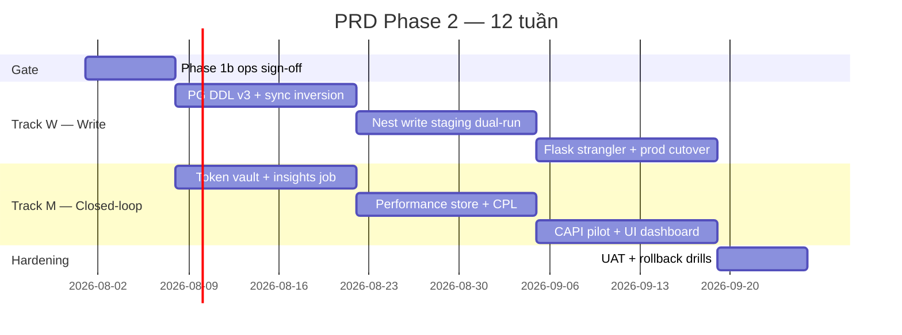

# PRD Phase 2 — CRM Write Cutover + Meta Closed-Loop

> **Phiên bản:** 1.0 · **Ngày:** 2026-07-17  
> **Thời gian:** 10–14 tuần (1 squad: 1 BE + 1 FE/part-time + 1 QA/part-time; có thể song song 2 track sau gate)  
> **Trạng thái:** Draft for planning  
> **Master spec:** [`SPEC_AGENCY_OPERATING_PLATFORM.md`](../SPEC_AGENCY_OPERATING_PLATFORM.md) §13.1 Phase 2  
> **Phase 1 PRD:** [`2026-07-17-prd-phase-1.md`](2026-07-17-prd-phase-1.md)  
> **Phase 1b roadmap:** [`2026-07-17-phase-1b-roadmap.md`](2026-07-17-phase-1b-roadmap.md)  
> **Write cutover ticket:** [`2026-07-17-phase-2-write-cutover-ticket.md`](2026-07-17-phase-2-write-cutover-ticket.md)  
> **Migration matrix:** [`2026-07-17-sqlite-pg-migration.md`](2026-07-17-sqlite-pg-migration.md)

---

## Mục lục

1. [Tóm tắt](#1-tóm-tắt)
2. [Điều kiện tiên quyết (Phase 1b gate)](#2-điều-kiện-tiên-quyết-phase-1b-gate)
3. [Phạm vi](#3-phạm-vi)
4. [Personas & jobs-to-be-done](#4-personas--jobs-to-be-done)
5. [User stories & acceptance criteria](#5-user-stories--acceptance-criteria)
6. [Timeline](#6-timeline)
7. [Kiến trúc & data flow](#7-kiến-trúc--data-flow)
8. [Feature flags & rollback](#8-feature-flags--rollback)
9. [Dependencies & risks](#9-dependencies--risks)
10. [Definition of Done](#10-definition-of-done)
11. [Metrics & KPI](#11-metrics--kpi)
12. [Artifacts](#12-artifacts)
13. [Lịch sử](#13-lịch-sử)

---

## 1. Tóm tắt

Phase 2 đóng **hai vòng còn thiếu** sau Phase 1 + 1b:

1. **CRM write strangler** — promote PostgreSQL `crm_leads` từ read replica lên **OLTP primary** cho assign/create; NestJS phục vụ write prod; Flask/SQLite (`ptt.db`) thu hẹp dần.
2. **Meta ads closed-loop** — đồng bộ spend/insights từ Meta Marketing API, tính **CPL/ROAS**, gửi **CAPI** server-side, dashboard cho AM/Buyer theo Hub campaign map.

**Mục tiêu kinh doanh:**

- AM/Buyer thấy **CPL và spend thật** theo campaign Meta đã map Hub — không còn nhập tay spreadsheet.
- Phân công lead (`assign`) qua Nest **không mất dữ liệu**, có event `LeadAssigned` → notification/SLA.
- `ptt.db` vẫn tồn tại Phase 2 (fallback/read legacy) nhưng **write lead chính chuyển PG**.

**North-star metric Phase 2:**

- **Write:** 0 lead loss trong dual-run write soak staging ≥ 48h; rollback write ≤ 5 phút.
- **Closed-loop:** Daily Meta sync success ≥ 99%; CPL dashboard lag ≤ 24h; CAPI match rate baseline đo được.

---

## 2. Điều kiện tiên quyết (Phase 1b gate)

Không bắt đầu Phase 2 code production cho đến khi **Phase 1b DoD ops** pass trên **staging**:

| Gate | Tiêu chí |
|------|----------|
| G1 | Phase 1 PRD DoD §7 signed (pipeline ingest, Agency Ops UI) |
| G2 | Nest read prod/staging: dual-run Flask SQLite vs Nest PG **diff 0%** ≥ 7 ngày |
| G3 | B8 read cutover prod **hoặc** staging soak ≥ 14 ngày với `PTT_LEADS_READ_UPSTREAM=nest` |
| G4 | B9 write POC staging: `POST/PATCH /api/v1/leads` + `LeadAssigned` outbox verified |
| G5 | `PTT_EVENT_PUBLISH_RMQ=1` staging; events publish ≤ 30s |
| G6 | Hub campaign ↔ Meta campaign ID map có ≥ 1 client pilot |
| G7 | Regression L01–L26 + Agency A-01–A-09 pass sau read cutover |

---

## 3. Phạm vi

### 3.1. In scope (Must-have)

#### Track W — CRM write cutover (Strangler #4)

| ID | Epic | Mô tả ngắn |
|----|------|------------|
| W1 | **PG OLTP schema v3** | `crm_leads` primary: FK `clients`, indexes, bỏ “replica-only” semantics |
| W2 | **Sync inversion** | PG primary → SQLite shadow (fallback) hoặc stop SQLite lead writes |
| W3 | **Nest write prod** | Freeze OpenAPI write; `PTT_LEADS_WRITE_ENABLED=1` staging → prod |
| W4 | **Assign + status** | `PATCH /api/v1/leads/:id` — owner_id, status; full `LeadAssigned` |
| W5 | **Create lead v1** | `POST /api/v1/leads` production (không chỉ staging id ≥ 900M) |
| W6 | **Flask strangler** | Legacy `/api/crm/leads/*/assign` proxy hoặc UI gọi v1 |
| W7 | **Write dual-run staging** | So sánh Flask SQLite write vs Nest PG write (field-level) |
| W8 | **Rollback runbook** | `PTT_LEADS_WRITE_UPSTREAM=flask`; drill documented |

#### Track M — Meta closed-loop (U-P1-01 → U-P1-03)

| ID | Epic | Mô tả ngắn |
|----|------|------------|
| M1 | **Asset registry + token vault** | Meta ad account / page token per client; encrypt at rest |
| M2 | **Meta insights sync** | Daily job: spend, impressions, clicks, leads (account/campaign level) |
| M3 | **Performance store** | PG `daily_performance` (or extend DDL v3); keyed by client + campaign + date |
| M4 | **Metrics engine** | CPL, CPA, ROAS từ spend + lead count; dùng `kpi_definitions` |
| M5 | **CAPI collector** | Server-side events: Lead, Purchase stub; dedup với pixel |
| M6 | **Closed-loop UI** | Agency Ops: campaign performance tab; CPL vs target |

### 3.2. Stretch (Nice-to-have)

| ID | Epic | Ghi chú |
|----|------|---------|
| S1 | **LeadScored full** | AI score → `LeadScored` event + RMQ consumer (không chỉ score stub B9) |
| S2 | **Zalo autosync insights** | Mirror Meta pattern khi Zalo API sẵn sàng |
| S3 | **Win rate by campaign** | Lead won / total leads join Hub map |
| S4 | **Slack digest CPL** | Weekly AM digest nếu CPL > threshold |

### 3.3. Out of scope (defer Phase 3+)

| Hạng mục | Phase defer | Lý do |
|----------|-------------|-------|
| Next.js client portal | Phase 3 | ADR-005 |
| Temporal workflow / creative approval | Phase 3 | U-P2-01 |
| Campaign write Meta (budget change prod) | Phase 3–4 | U-P3-01; cần approval workflow |
| Google Ads adapter | Phase 3 | U-P2-04 |
| Deprecate Flask monolith | Phase 4 | U-P3-06 |
| Hub / SOP full PG migrate | Phase 2+ | Migration matrix order #6 |
| `crm_cases`, `crm_staff` PG migrate | Phase 2+ | Sau leads stable |
| ClickHouse / Kafka | Phase 4 | Volume chưa đủ |

---

## 4. Personas & jobs-to-be-done

| Persona | Job Phase 2 | Success |
|---------|-------------|---------|
| **Super Admin** | Cutover write; cấu hình Meta token vault | Rollback drill pass; token rotate không downtime |
| **AM** | Xem CPL/ROAS theo client campaign | Dashboard T-1 data; alert CPL vượt ngưỡng |
| **Media Buyer** | Map Hub ↔ Meta; so spend vs lead | 1 campaign row → spend + leads + CPL |
| **CSKH / Sales** | Assign lead qua UI như cũ | Zero regression assign flow |
| **DevOps** | RMQ consumers; sync cron; Sentry | Meta sync fail → alert; queue depth OK |

---

## 5. User stories & acceptance criteria

### Track W — CRM write

#### Epic W1 — PG OLTP schema v3

| Story | Acceptance criteria |
|-------|---------------------|
| US-W1-01 DDL v3 | Migration SQL: `crm_leads` PK, FK `agency_client_id` → `clients.id`, indexes |
| US-W1-02 Backfill | Script migrate PG replica rows → v3; reconcile count match SQLite |
| US-W1-03 Deprecate replica flags | Doc: `sync_version` semantics OLTP not replica |

#### Epic W2 — Sync inversion

| Story | Acceptance criteria |
|-------|---------------------|
| US-W2-01 PG primary write | Nest assign updates PG first |
| US-W2-02 Shadow sync | Job `sync_lead_shadow` SQLite ← PG (lag ≤ 1 min) hoặc read-only SQLite |
| US-W2-03 Reconcile bidirectional | `reconcile_leads` mode pg-primary; mismatch alert |

#### Epic W3 — Nest write prod

| Story | Acceptance criteria |
|-------|---------------------|
| US-W3-01 OpenAPI freeze | Promote `leads-v1-write.openapi.yaml` draft → v1.0 frozen |
| US-W3-02 Auth hardening | Prod: `X-PTT-Internal-Key` required; staging dual auth OK |
| US-W3-03 Feature flag | `PTT_LEADS_WRITE_ENABLED=0` default prod until cutover window |

#### Epic W4 — Assign + events

| Story | Acceptance criteria |
|-------|---------------------|
| US-W4-01 PATCH assign | `owner_id` + `assigned_by` → PG update |
| US-W4-02 LeadAssigned | Outbox row + RMQ publish ≤ 30s |
| US-W4-03 Idempotency | Same assign 2x → 1 event (idempotency key catalog) |

#### Epic W5 — Create lead

| Story | Acceptance criteria |
|-------|---------------------|
| US-W5-01 POST create | Valid body → 201 LeadV1; id stable across read API |
| US-W5-02 Client scope | `client_id` required or inferred from auth context |
| US-W5-03 No SQLite write | Prod cutover: create không ghi `ptt.db` (shadow async OK) |

#### Epic W6 — Flask strangler

| Story | Acceptance criteria |
|-------|---------------------|
| US-W6-01 Legacy proxy | `/api/crm/leads/:id/assign` → internal Nest PATCH (feature flag) |
| US-W6-02 UI parity | Agency Ops assign modal unchanged UX |
| US-W6-03 Audit log | Assignment log vẫn query được (PG or synced SQLite) |

#### Epic W7 — Write dual-run staging

| Story | Acceptance criteria |
|-------|---------------------|
| US-W7-01 Compare script | `dual_run_write_check.py` sample N assigns |
| US-W7-02 Soak 48h | Staging automated assign + reconcile 0 mismatch |

#### Epic W8 — Rollback

| Story | Acceptance criteria |
|-------|---------------------|
| US-W8-01 Flag rollback | `PTT_LEADS_WRITE_UPSTREAM=flask` → Flask SQLite write |
| US-W8-02 Runbook | `docs/runbooks/cutover-leads-write-phase2.md` |
| US-W8-03 Drill | Documented drill ≤ 5 min on staging |

---

### Track M — Meta closed-loop

#### Epic M1 — Asset registry + token vault

| Story | Acceptance criteria |
|-------|---------------------|
| US-M1-01 Channel accounts | Extend `client_channel_accounts`: token encrypted, expiry |
| US-M1-02 Admin UI | Agency Ops: connect Meta ad account per client |
| US-M1-03 Token refresh | Long-lived token refresh job; alert 7 days before expiry |

#### Epic M2 — Meta insights sync

| Story | Acceptance criteria |
|-------|---------------------|
| US-M2-01 Daily cron | systemd/timer `meta-insights-sync` 02:00 UTC+7 |
| US-M2-02 API scope | `ads_read`, insights fields: spend, impressions, clicks, actions |
| US-M2-03 Campaign map | Join `meta_campaign_id` from Hub map → performance rows |
| US-M2-04 Retry | Failed account → job retry; DLQ after 5 attempts |

#### Epic M3 — Performance store

| Story | Acceptance criteria |
|-------|---------------------|
| US-M3-01 DDL | Table `daily_performance` (client_id, channel, campaign_id, date, spend, …) |
| US-M3-02 Upsert idempotent | UNIQUE (client_id, campaign_id, date) |
| US-M3-03 API read | `GET /api/v1/performance?client_id=&from=&to=` (Nest or Flask) |

#### Epic M4 — Metrics engine

| Story | Acceptance criteria |
|-------|---------------------|
| US-M4-01 CPL | `spend / leads_count` per campaign per day |
| US-M4-02 ROAS | Stub nếu chưa có revenue; document formula |
| US-M4-03 KPI seed | Use `kpi_definitions` CPL, ROAS, SPEND |
| US-M4-04 Event | Optional `DailyPerformanceSynced` → metrics subscribers |

#### Epic M5 — CAPI collector

| Story | Acceptance criteria |
|-------|---------------------|
| US-M5-01 Lead event | On `LeadCreated` → CAPI Lead event (staging pilot) |
| US-M5-02 Dedup | `event_id` + `event_name` dedup window Meta spec |
| US-M5-03 Config | Per-client pixel_id + access token from vault |
| US-M5-04 Observability | Log match rate / error rate; không block ingest |

#### Epic M6 — Closed-loop UI

| Story | Acceptance criteria |
|-------|---------------------|
| US-M6-01 Campaign tab | Client detail: table date, spend, leads, CPL |
| US-M6-02 Hub link | Row click → Hub campaign |
| US-M6-03 Target CPL | Show delta vs client target (manual config Phase 2) |

---

## 6. Timeline

**Đề xuất 12 tuần** — Track W và M song song sau tuần 2 (khác owner BE nếu có 2 người).



| Tuần | Track W | Track M | Exit criteria |
|------|---------|---------|---------------|
| **1** | Gate review; DDL v3 draft | Asset vault schema + UI mock | Sign-off G1–G7 |
| **2–3** | PG v3 apply staging; sync inversion POC | Meta insights job dev account | Insights row in PG |
| **4–5** | Nest write freeze; dual-run write script | `daily_performance` + CPL job | CPL computed 1 campaign |
| **6–7** | Staging soak 48h; Flask proxy assign | CAPI Lead pilot 1 client | LeadAssigned E2E |
| **8–9** | Prod write cutover (flag); rollback drill | Closed-loop UI tab | AM sees CPL dashboard |
| **10–11** | Shadow SQLite stable; doc migration | Meta sync prod all mapped clients | Sync success ≥ 99% |
| **12** | UAT L01–L26 + regression | Stakeholder sign-off AM | Phase 2 DoD §10 |

**Compression 8 tuần:** Defer CAPI (M5) và create lead prod (W5) → Phase 2.1; chỉ assign cutover + insights + CPL.

---

## 7. Kiến trúc & data flow

### 7.1. Write path (target end Phase 2)

```
Agency UI / API
  → Nginx → Nest PATCH /api/v1/leads/:id
  → PostgreSQL crm_leads (PRIMARY)
  → domain_events LeadAssigned
  → RMQ → notification_service
  → (async) shadow sync → SQLite ptt.db [optional fallback read]
```

### 7.2. Meta closed-loop

```
Hub Campaign (meta_campaign_id)
  → meta-insights-sync (daily)
  → daily_performance (PG)
  → metrics engine (CPL, ROAS)
  → Agency Ops UI

LeadCreated (ingest)
  → CAPI collector (async)
  → Meta Graph API events
```

### 7.3. Database roles sau Phase 2

| Store | Role |
|-------|------|
| **PostgreSQL `crm_leads`** | OLTP primary (write + read Nest) |
| **SQLite `ptt.db`** | Shadow / legacy modules (cases, hub, SOP); lead read fallback until Phase 3 |
| **PostgreSQL `daily_performance`** | Analytics OLTP |
| **PostgreSQL `domain_events`** | Outbox (LeadAssigned, DailyPerformanceSynced) |

---

## 8. Feature flags & rollback

| Flag | Default Phase 2 start | Prod cutover | Mô tả |
|------|----------------------|--------------|-------|
| `PTT_LEADS_READ_UPSTREAM` | `nest` | `nest` | Read đã cutover Phase 1b |
| `PTT_LEADS_WRITE_ENABLED` | `0` | `1` (cutover window) | Nest write routes |
| `PTT_LEADS_WRITE_UPSTREAM` | `flask` | `nest` | Nginx/app routing write |
| `PTT_LEAD_SHADOW_SYNC` | `0` | `1` | PG → SQLite shadow |
| `PTT_META_INSIGHTS_SYNC` | `0` | `1` | Daily insights job |
| `PTT_CAPI_ENABLED` | `0` | `1` (pilot clients) | CAPI collector |
| `PTT_EVENT_PUBLISH_RMQ` | `1` | `1` | Required Phase 2 |

**Rollback write:** `PTT_LEADS_WRITE_UPSTREAM=flask` + disable Nest write + resume SQLite assign.

**Rollback closed-loop:** `PTT_META_INSIGHTS_SYNC=0`; dashboard shows last good sync timestamp.

---

## 9. Dependencies & risks

| Risk | Impact | Mitigation |
|------|--------|------------|
| PG/SQLite drift sau write cutover | Sai owner_id, mất audit | Shadow sync + reconcile cron; dual-run staging |
| Meta token expiry | Mất insights | Vault + refresh job + alert |
| CAPI misconfig | Duplicate/off events | Staging pilot; feature flag per client |
| Scope: write + closed-loop cùng lúc | Trễ 12 tuần | Track song song; compression defer CAPI |
| Hub map incomplete | CPL sai campaign | Block CPL UI until map validated |
| Assign regression | CSKH blocked | Flask proxy; rollback drill before prod |

---

## 10. Definition of Done

### Track W — Write

- [ ] PG DDL v3 applied staging + prod
- [ ] Nest `POST/PATCH /api/v1/leads` prod with auth
- [ ] `LeadAssigned` → outbox → RMQ verified
- [ ] Write dual-run staging 0% mismatch ≥ 48h
- [ ] Prod cutover + rollback drill documented
- [ ] Flask legacy assign proxied or UI migrated
- [ ] OpenAPI write v1 frozen in CI

### Track M — Closed-loop

- [ ] ≥ 3 clients pilot: Meta token + Hub map + daily sync
- [ ] `daily_performance` populated T-1
- [ ] CPL dashboard Agency Ops live
- [ ] CAPI Lead event pilot ≥ 1 client (stretch → Phase 2.1 OK)
- [ ] Meta sync alert on failure

### Cross-cutting

- [ ] Regression L01–L26 pass
- [ ] Sentry dashboards: Nest write, Meta sync, CAPI errors
- [ ] Runbooks: write rollback, token refresh, insights replay
- [ ] Stakeholder sign-off AM + Admin
- [ ] `ptt.db` backup policy documented (still required)

**Không thuộc DoD Phase 2:** Deprecate Flask, Next portal, campaign budget write Meta.

---

## 11. Metrics & KPI

| Metric | Target Phase 2 |
|--------|----------------|
| Write dual-run mismatch rate | 0% staging soak |
| Write rollback time | ≤ 5 phút |
| Nest write API p95 | < 500ms |
| Meta insights sync success | ≥ 99% accounts/day |
| Performance data lag | ≤ 24h (T-1) |
| CPL dashboard load p95 | < 2s |
| CAPI event error rate | < 5% (pilot) |
| LeadAssigned publish latency | ≤ 30s |
| UAT regression pass | 100% critical path |

---

## 12. Artifacts

| Artifact | Path | Phase 2 action |
|----------|------|----------------|
| PRD Phase 2 (tài liệu này) | `docs/specs/2026-07-17-prd-phase-2.md` | ✅ |
| Architecture Phase 2 | `docs/specs/2026-07-17-architecture-phase-2.md` | ✅ |
| PG DDL v3 leads OLTP | `docs/specs/2026-07-17-postgresql-ddl-v3-leads-oltp.sql` | ✅ |
| PG DDL v3 performance | `docs/specs/2026-07-17-postgresql-ddl-v3-performance.sql` | ✅ |
| Apply DDL v3 script | `scripts/apply_pg_ddl_v3.sh` | ✅ |
| OpenAPI write frozen | `schemas/crm/leads-v1-write.openapi.yaml` | Promote W3 |
| Runbook write cutover | `docs/runbooks/cutover-leads-write-phase2.md` | Tạo W8 |
| Meta insights worker | `ptt_jobs/handlers/meta_insights_sync.py` | Tạo M2 |
| CAPI module | `ptt_channel/capi/` or `ptt_meta/capi/` | Tạo M5 |
| Dual-run write CLI | `scripts/dual_run_write_check.py` | Tạo W7 |

---

## 13. Lịch sử

| Version | Date | Change |
|---------|------|--------|
| 1.0 | 2026-07-17 | Initial PRD Phase 2 — CRM write cutover + Meta closed-loop |

---

*Phase 2 bắt đầu sau Phase 1b ops gate. Code Phase 1b (B0–B9) đã sẵn: Nest read PG, write staging POC, sync SQLite→PG, dual-run read.*
