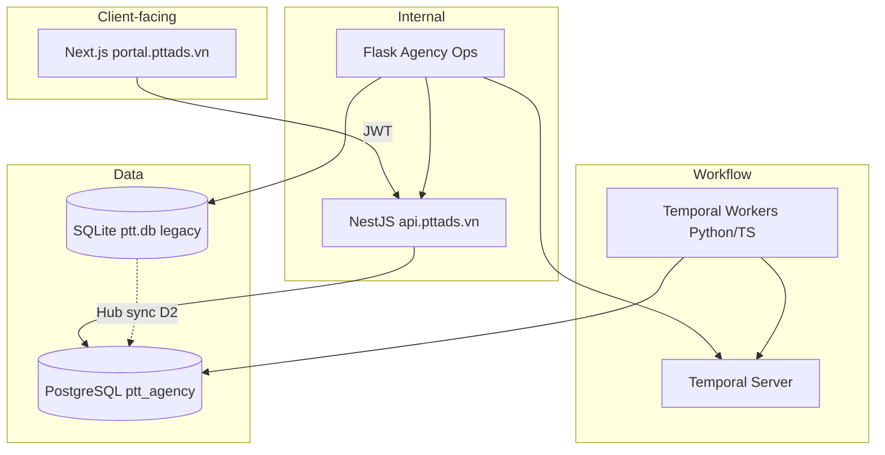

# PRD Phase 3 — Client Portal + Workflow + PG Migration (Hub/SOP)

> **Phiên bản:** 1.0 · **Ngày:** 2026-07-17  
> **Thời gian đề xuất:** 12–16 tuần (1 squad BE + 1 FE Next.js + 1 QA part-time; Temporal có thể spike tuần 1–2)  
> **Trạng thái:** Draft for planning  
> **Master spec:** [`SPEC_AGENCY_OPERATING_PLATFORM.md`](../SPEC_AGENCY_OPERATING_PLATFORM.md) §14.3 (U-P2-01 → U-P2-04)  
> **Phase 2 PRD:** [`2026-07-17-prd-phase-2.md`](2026-07-17-prd-phase-2.md)  
> **Architecture Phase 2:** [`2026-07-17-architecture-phase-2.md`](2026-07-17-architecture-phase-2.md)  
> **Migration matrix:** [`2026-07-17-sqlite-pg-migration.md`](2026-07-17-sqlite-pg-migration.md)

---

## Mục lục

1. [Tóm tắt](#1-tóm-tắt)
2. [Điều kiện tiên quyết (Phase 2 gate)](#2-điều-kiện-tiên-quyết-phase-2-gate)
3. [Phase 2.1 bridge (tuỳ chọn sprint 0)](#3-phase-21-bridge-tuỳ-chọn-sprint-0)
4. [Phạm vi](#4-phạm-vi)
5. [Personas & jobs-to-be-done](#5-personas--jobs-to-be-done)
6. [User stories & acceptance criteria](#6-user-stories--acceptance-criteria)
7. [Timeline đề xuất](#7-timeline-đề-xuất)
8. [Kiến trúc tóm tắt](#8-kiến-trúc-tóm-tắt)
9. [Dependencies & risks](#9-dependencies--risks)
10. [Definition of Done](#10-definition-of-done)
11. [Out of scope (Phase 4+)](#11-out-of-scope-phase-4)
12. [Artifacts cần tạo](#12-artifacts-cần-tạo)
13. [Lịch sử](#13-lịch-sử)

---

## 1. Tóm tắt

Phase 3 mở **lớp client-facing** và **workflow engine** trên nền Phase 2 (PG leads OLTP + Meta closed-loop), đồng thời tiếp tục **strangler** SQLite → PostgreSQL cho Hub và SOP.

**Ba trụ cột:**

1. **Client Portal (Next.js)** — client viewer/approver xem báo cáo CPL/ROAS, duyệt creative, ticket (scoped JWT).
2. **Temporal workflows** — onboarding client, launch QA checklist, creative approval (thay SOP code-gates một phần).
3. **Channel & data expansion** — Google Ads adapter (mirror Meta); Hub/SOP migrate PG; sunset lead shadow SQLite khi ổn định.

**Mục tiêu kinh doanh:**

- Client thấy performance T-1 **trên portal riêng** — giảm email/PDF thủ công từ AM.
- Launch campaign có **checklist có audit trail** — không skip bước TMMT / QA.
- Một codebase API (Nest + PG) phục vụ **internal Flask + portal Next.js**.

**North-star metrics Phase 3:**

- **Portal:** ≥ 5 client active login/tháng; report page p95 < 2s.
- **Workflow:** Launch QA completion rate ≥ 95%; median approval time đo được.
- **Migration:** Hub campaign map 100% trên PG cho pilot clients; lead shadow lag N/A (shadow off).

---

## 2. Điều kiện tiên quyết (Phase 2 gate)

Không kickoff Phase 3 implementation cho đến khi **Phase 2 DoD §10** pass (ops, không chỉ code):

| Gate | Tiêu chí | Evidence |
|------|----------|----------|
| G1 | Prod write cutover PATCH assign/status | Runbook §4–§8 + rollback drill |
| G2 | 48h write soak (timer thật) | `write-soak-evidence.jsonl` |
| G3 | Closed-loop ≥ 3 clients | `phase2-ops-gate-report.json` |
| G4 | AM + Admin sign-off | `phase2-uat-signoff.json` |
| G5 | Sentry Phase 2 dashboards | Runbook configured |
| G6 | Meta token refresh + insights replay runbooks | Drill documented |
| G7 | Regression L01–L26 critical pass | QA sign-off |

**Planning-only:** Có thể bắt đầu Phase 3 **design + spike** song song khi G1–G3 staging pass; **prod portal** cần G1–G7.

---

## 3. Phase 2.1 bridge (tuỳ chọn sprint 0)

Các hạng mục defer từ Phase 2 — khuyến nghị **1–2 sprint** trước portal:

| ID | Epic | Mô tả | Blocker portal? |
|----|------|-------|-----------------|
| W5 | POST create lead prod | `POST /api/v1/leads` id allocator prod; không dùng range 900M | Không (portal read-heavy) |
| M5+ | CAPI prod pilot | Lead + Purchase; match rate dashboard | Không |
| M4+ | ROAS thật | `value_numeric` khi có conversion_value | Có (portal ROAS column) |
| AUTH | JWT / Keycloak spike | Portal auth — **blocker P1 portal** | **Có** |

**Quyết định planning:** Phase 3 Sprint 0 = **AUTH spike + W5** (parallel); portal MVP có thể dùng internal-key proxy staging trước Keycloak prod.

---

## 4. Phạm vi

### 4.1. In scope (Must-have)

#### Track P — Client Portal (U-P2-02, ADR-005 evolution)

| ID | Epic | Mô tả ngắn |
|----|------|------------|
| P1 | **Portal app scaffold** | Next.js 14 App Router; `portal.pttads.vn`; CI deploy |
| P2 | **Client auth** | JWT scoped `client_id`; roles viewer / approver |
| P3 | **Performance dashboard** | CPL, spend, leads T-7/T-30 từ `daily_performance` API |
| P4 | **Creative approval UI** | List pending creatives; approve/reject → Temporal signal |
| P5 | **Audit & branding** | Logo client; export PDF optional (stretch) |

#### Track T — Temporal workflows (U-P2-01, U-P2-03)

| ID | Epic | Mô tả ngắn |
|----|------|------------|
| T1 | **Temporal infra** | Docker Compose dev; VPS worker systemd; namespace `ptt-agency` |
| T2 | **Client onboarding WF** | Stages: contract → assets → map → launch ready |
| T3 | **Launch QA WF** | Checklist FR-CO-04; block launch until pass |
| T4 | **Creative approval WF** | Versioning; approver signal; notify AM |
| T5 | **Flask/Nest integration** | Start workflow từ Agency Ops; status API |

#### Track G — Google Ads (U-P2-04)

| ID | Epic | Mô tả ngắn |
|----|------|------------|
| G1 | **Google channel account** | Vault token; `client_channel_accounts.channel=google` |
| G2 | **Insights sync job** | Mirror `ptt_meta.insights_sync` → `ptt_google.insights_sync` |
| G3 | **Hub map extension** | `hub_campaign_map.channel=google` |
| G4 | **Portal + Agency UI** | Google spend row trong performance tab |

#### Track D — PG migration & shadow sunset (matrix #4–5)

| ID | Epic | Mô tả ngắn |
|----|------|------------|
| D1 | **Hub PG read API** | Nest or Flask v1: campaigns, map CRUD on PG |
| D2 | **Hub SQLite → PG sync** | One-way; Hub UI reads PG primary |
| D3 | **SOP PG schema** | `sop_templates`, `sop_runs` DDL v4 |
| D4 | **Lead shadow off** | `PTT_LEAD_SHADOW_SYNC=0` prod after 30d soak |
| D5 | **cases/staff** | Spike only — full migrate defer nếu risk cao |

### 4.2. Stretch (Nice-to-have)

| ID | Epic | Ghi chú |
|----|------|---------|
| S1 | Metabase dashboards (U-P2-05) | AM internal; portal embed optional |
| S2 | Unified Lead/Case policy (U-P2-06) | Policy engine light |
| S3 | AI daily digest 8h (U-P2-08) | Slack/email CPL anomaly |
| S4 | RE plan approval gates (U-P2-07) | RE module |
| S5 | Email adapter stub (U-P3-02 preview) | Phase 4 full |

### 4.3. Out of scope Phase 3

→ Xem [§11](#11-out-of-scope-phase-4)

---

## 5. Personas & jobs-to-be-done

| Persona | Job Phase 3 | Success |
|---------|-------------|---------|
| **Client Viewer** | Xem CPL/spend campaign tuần | Login portal; data T-1; mobile OK |
| **Client Approver** | Duyệt creative / launch checklist | 1-click approve; email notify |
| **AM** | Mời client portal; theo dõi onboarding WF | Onboarding stage visible; không duplicate nhập liệu |
| **Media Buyer** | Google + Meta trong một CPL view | 2 channel rows / campaign map |
| **PM / QA** | Launch QA không skip bước | Temporal history + sign-off |
| **DevOps** | Temporal + Next deploy; PG migration | Worker health; rollback Hub về SQLite doc |

---

## 6. User stories & acceptance criteria

### Track P — Portal

| Story | Acceptance criteria |
|-------|---------------------|
| US-P1-01 Login | Client user JWT; chỉ thấy `client_id` scoped data |
| US-P1-02 Performance page | Chart/table spend, leads, CPL 7/30 ngày; API Nest `GET /api/v1/performance` |
| US-P1-03 Creative inbox | Pending list; approve → workflow signal; 403 cross-client |
| US-P1-04 Session security | HTTP-only cookie or Bearer; CSRF; logout |
| US-P1-05 Staging E2E | Playwright: login → performance → approve mock |

### Track T — Temporal

| Story | Acceptance criteria |
|-------|---------------------|
| US-T1-01 Worker deploy | `temporal worker` systemd; task queue `ptt-agency` |
| US-T2-01 Onboarding | AM start WF; checklist items map `client_onboarding_items` |
| US-T3-01 Launch QA | Cannot mark `launch_ready` until QA steps pass |
| US-T4-01 Creative | Upload v2 → pending approval → client signal → approved |
| US-T5-01 Observability | Temporal UI + Sentry on activity failure |

### Track G — Google

| Story | Acceptance criteria |
|-------|---------------------|
| US-G1-01 OAuth / token | Google Ads refresh token in vault |
| US-G2-01 Daily sync | `daily_performance` rows channel=google |
| US-G3-01 Map | Hub campaign external ID = Google campaign ID |

### Track D — Migration

| Story | Acceptance criteria |
|-------|---------------------|
| US-D1-01 Hub PG primary | New map writes PG; SQLite read-only fallback 30d |
| US-D2-01 Shadow off runbook | Doc + flag; dual-run not required post-sunset |
| US-D3-01 SOP read PG | Existing SOP UI reads PG with feature flag |

---

## 7. Timeline đề xuất

| Tuần | Track | Deliverable |
|------|-------|-------------|
| 0 (bridge) | 2.1 + AUTH | W5 prod create; Keycloak/JWT spike; ROAS fix |
| 1–2 | T1, P1 | Temporal dev stack; Next.js scaffold + deploy staging |
| 3–4 | P2, P3 | Client auth; performance dashboard (Meta data) |
| 5–6 | T2, T3 | Onboarding + Launch QA workflows |
| 7–8 | P4, T4 | Creative approval portal + WF |
| 9–10 | G1–G4 | Google adapter + UI |
| 11–12 | D1–D4 | Hub PG migration; shadow sunset plan |
| 13–14 | QA | UAT portal + WF; regression; runbooks |
| 15–16 | Buffer | Metabase stretch; RE gates stretch |

**Parallelization:** P (portal) và T (Temporal) song song sau tuần 2; G (Google) sau P3 API ổn; D (migration) song song tuần 9+.

---

## 8. Kiến trúc tóm tắt

→ Chi tiết: [`2026-07-17-architecture-phase-3.md`](2026-07-17-architecture-phase-3.md)

---

## 9. Dependencies & risks

| Risk | Mitigation |
|------|------------|
| Phase 2 prod cutover chưa xong | Hard gate §2; portal chỉ staging |
| Keycloak scope creep | MVP: JWT issued by Nest auth module; Keycloak Phase 3.1 |
| Temporal ops mới | Compose dev; 1 workflow pilot trước creative |
| Hub migration regression | Feature flag `PTT_HUB_READ_SOURCE=pg`; dual-read 30d |
| Google API quota / OAuth | 1 client pilot; stub mode như Meta |
| Team capacity (1 FE Next.js) | Portal MVP 3 pages; defer PDF export |

---

## 10. Definition of Done

### Track P — Portal

- [ ] `portal.pttads.vn` staging + prod TLS
- [ ] ≥ 3 pilot clients onboarded portal users
- [ ] Performance page data = Agency Ops CPL tab (same API)
- [ ] Creative approve E2E with Temporal
- [ ] Security review: scoped JWT, no cross-tenant leak

### Track T — Workflow

- [ ] Temporal worker HA (restart policy)
- [ ] Onboarding + Launch QA + Creative WF in prod
- [ ] Runbook: workflow replay / cancel / admin override

### Track G — Google

- [ ] ≥ 1 client Google sync T-1
- [ ] CPL tab shows Meta + Google rows

### Track D — Migration

- [ ] Hub map CRUD on PG primary
- [ ] Lead shadow off prod (post 30d write soak Phase 2)
- [ ] Migration runbook + rollback

### Cross-cutting

- [ ] Regression L01–L26 + portal E2E pass
- [ ] Sentry project `ptt-portal`
- [ ] AM + Client approver UAT sign-off
- [ ] Phase 3 architecture doc v1.0 frozen

---

## 11. Out of scope (Phase 4+)

| Hạng mục | Phase | Lý do |
|----------|-------|-------|
| Deprecate Flask monolith | 4 | U-P3-06; cần portal + Nest coverage 100% |
| Campaign write Meta (budget) | 4 | U-P3-01; approval + audit |
| ClickHouse / Kafka | 4 | U-P3-03/04; volume |
| TikTok / LinkedIn | 4 | U-P3-05 |
| Public site Next.js rewrite | 4 | BC-10; tách khỏi portal |
| Full `crm_cases` PG migrate | 3.1/4 | Risk; spike only Phase 3 |

---

## 12. Artifacts cần tạo

| Artifact | Path | Owner | When |
|----------|------|-------|------|
| Architecture Phase 3 | `docs/specs/2026-07-17-architecture-phase-3.md` | Architect | W0 |
| Temporal workflow specs | `docs/specs/workflows/` | BE | W1 |
| Portal UI spec | `docs/SPEC_UI_UX_CLIENT_PORTAL.md` | FE/UX | W1 |
| PG DDL v4 Hub/SOP | `docs/specs/2026-07-17-postgresql-ddl-v4-hub-sop.sql` | BE | W9 |
| ADR-011 Portal auth | `docs/specs/adr-011-portal-auth.md` | Architect | W0 |
| ADR-012 Temporal vs SOP DB | `docs/specs/adr-012-temporal-sop.md` | Architect | W1 |
| Runbook portal deploy | `docs/runbooks/deploy-client-portal.md` | DevOps | W2 |
| Implementation plan (portal) | `docs/superpowers/plans/2026-07-17-client-portal.md` | Eng | After PRD sign-off |

---

## 13. Lịch sử

| Version | Date | Change |
|---------|------|--------|
| 1.0 | 2026-07-17 | Initial Phase 3 PRD — planning kickoff |
