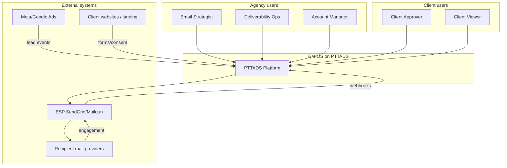
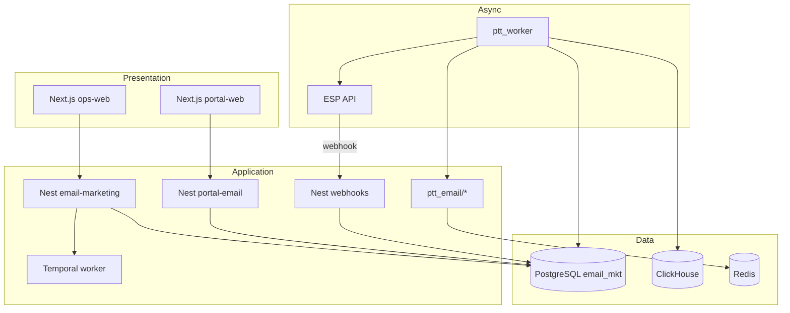
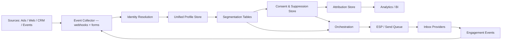

# Email Marketing Enterprise OS — System Architecture

> **Phiên bản:** 1.3 · **Ngày:** 2026-07-20  
> **Admin UI:** ops-web `ops.pttads.vn/email/*` · **API:** Nest `email-marketing/` · **Portal:** Next.js + Nest  
> **Parent spec:** [`SPEC_EMAIL_MARKETING_OPERATING_SYSTEM.md`](../SPEC_EMAIL_MARKETING_OPERATING_SYSTEM.md) v1.3  
> **Migration:** [`SPEC_MIGRATION_FLASK_TO_NEXT.md`](../SPEC_MIGRATION_FLASK_TO_NEXT.md) Track E  
> **Nguồn:** Enterprise Email Marketing architecture doc (PTTCOM) + PTTADS platform analysis  

---

## Mục lục

1. [C4 Context](#1-c4-context)
2. [C4 Containers](#2-c4-containers)
3. [C4 Components — `ptt_email`](#3-c4-components--ptt_email)
4. [Data architecture](#4-data-architecture)
5. [PostgreSQL DDL v1](#5-postgresql-ddl-v1)
6. [ClickHouse schema](#6-clickhouse-schema)
7. [API specification](#7-api-specification)
8. [Event catalog extensions](#8-event-catalog-extensions)
9. [Job types & workers](#9-job-types--workers)
10. [Temporal workflows](#10-temporal-workflows)
11. [ESP integration](#11-esp-integration)
12. [Security & compliance](#12-security--compliance)
13. [Deployment](#13-deployment)
14. [ADRs](#14-adrs)

---

## 1. C4 Context



**System boundary:** EM-OS nằm trong PTTADS, tích hợp CRM/agency platform có sẵn, giao tiếp ESP bên ngoài cho delivery.

---

## 2. C4 Containers

| Container | Technology | Responsibility |
|-----------|------------|----------------|
| **ops-web Admin UI** | Next.js 14 | `ops.pttads.vn/email/*` ops consoles |
| **Nest email-marketing** | NestJS 10 | `/api/v1/email/*` REST + public capture |
| **Nest portal-email** | NestJS 10 | `/api/v1/portal/email/*` client-scoped |
| **Nest webhooks** | NestJS 10 | `/api/v1/webhooks/email` ESP ingress |
| `ptt_email` domain package | Python | Business logic (workers — no HTTP) |
| `ptt_worker` | Python daemon | Send queue, segment refresh, webhook jobs |
| **portal-web** | Next.js 14 | `portal.pttads.vn/email/*` client UI |
| PostgreSQL `email_mkt.*` | PG 15 | OLTP source of truth |
| ClickHouse | CH 24.8 | Analytics OLAP |
| Temporal | Temporal 1.26 | Approvals, journeys |
| Redis | Redis 7 | Cache, rate limits |
| Grafana | Grafana | Ops dashboards |



---

## 3. C4 Components — `ptt_email`

```
ptt_email/
├── __init__.py
├── db.py                 # PG connection, CRM bridge (pattern ptt_seo/db.py)
├── schema.py             # DDL helpers, migrations
├── rbac.py               # Permission helpers
├── constants.py          # Status enums, feature flags
├── workspace.py          # Client email workspace
├── capture.py            # Forms, landing capture
├── consent.py            # Consent registry, preference center tokens
├── profile.py            # Contacts, identity resolution
├── suppression.py        # Suppression master
├── segments.py           # Segment definitions + materialization
├── eligibility.py        # Pre-send eligibility checks
├── campaigns.py          # Broadcast campaigns
├── journeys.py           # Automation graphs
├── triggers.py             # Event triggers
├── templates.py          # Master templates + blocks
├── render.py             # HTML render + personalization
├── preflight.py          # QA checks before send
├── sender.py             # Queue enqueue, ESP dispatch
├── deliverability.py     # Domain health, bounces, complaints
├── warm_up.py            # IP/domain warm-up schedules
├── analytics.py          # OLTP metrics aggregation
├── bi_clickhouse.py      # CH export (pattern ptt_seo/bi_clickhouse.py)
├── attribution.py        # Revenue / pipeline attribution
├── governance.py         # Rules engine (global/brand/market)
├── workflow.py           # Approval state machine helpers
├── notify.py             # Slack/Teams alerts
├── cron.py               # Scheduled jobs entry
└── experiments.py        # A/B testing
```

**Blueprint Flask:** ~~`blueprints/email_marketing.py`~~ — **không dùng** (superseded ADR-EM-10 v1.3)  
**Nest modules:** `services/ptt-crm-api/src/email-marketing/`, `portal-email/`  
**ops-web:** `services/ops-web/src/app/email/**`

---

## 4. Data architecture

Theo tài liệu nguồn — vòng lặp dữ liệu khép kín:



### 4.1. Storage policy

| Data type | Store | Retention |
|-----------|-------|-----------|
| Contacts, consent, campaigns | PostgreSQL | Indefinite (client active) |
| Send queue (hot) | PostgreSQL | 90 days after send |
| Engagement events (hot) | PostgreSQL | 30 days → archive CH |
| Analytics aggregates | ClickHouse | 24 months |
| Audit log | PostgreSQL | 7 years (compliance) |
| ESP raw webhook payload | PostgreSQL JSONB | 90 days |

### 4.2. Multi-client isolation

- Mọi bảng có `client_id UUID NOT NULL REFERENCES clients(id)`
- Row-level filter trong `ptt_email/db.py`: `WHERE client_id = :client_id`
- Portal JWT carries `client_id` — Nest guard rejects cross-tenant
- Suppression có scope: `global` | `client` | `brand`

---

## 5. PostgreSQL DDL v1

File triển khai: `deploy/sql/email_mkt_pg_schema.sql`

```sql
-- Schema: email_mkt
-- Apply: psql $DATABASE_URL -f deploy/sql/email_mkt_pg_schema.sql

CREATE SCHEMA IF NOT EXISTS email_mkt;

-- Workspace per client
CREATE TABLE email_mkt.workspaces (
    id                  UUID PRIMARY KEY DEFAULT gen_random_uuid(),
    client_id           UUID NOT NULL REFERENCES clients (id) ON DELETE CASCADE,
    name                VARCHAR(255) NOT NULL,
    default_from_name   VARCHAR(128),
    default_from_email  VARCHAR(255),
    default_reply_to    VARCHAR(255),
    esp_provider        VARCHAR(32) NOT NULL DEFAULT 'sendgrid',
    esp_account_ref     UUID REFERENCES client_channel_accounts (id),
    daily_send_cap      INT NOT NULL DEFAULT 10000,
    frequency_cap_7d    INT NOT NULL DEFAULT 5,
    timezone            VARCHAR(64) NOT NULL DEFAULT 'Asia/Ho_Chi_Minh',
    status              VARCHAR(32) NOT NULL DEFAULT 'active',
    meta                JSONB NOT NULL DEFAULT '{}'::jsonb,
    created_at          TIMESTAMPTZ NOT NULL DEFAULT NOW(),
    updated_at          TIMESTAMPTZ NOT NULL DEFAULT NOW(),
    UNIQUE (client_id)
);

-- Unified contacts
CREATE TABLE email_mkt.contacts (
    id                  UUID PRIMARY KEY DEFAULT gen_random_uuid(),
    client_id           UUID NOT NULL REFERENCES clients (id) ON DELETE CASCADE,
    email               VARCHAR(320) NOT NULL,
    email_normalized    VARCHAR(320) NOT NULL,
    first_name          VARCHAR(128),
    last_name           VARCHAR(128),
    crm_customer_id     TEXT,
    crm_lead_id         TEXT,
    lifecycle_stage     VARCHAR(32) DEFAULT 'subscriber',
    locale              VARCHAR(16) DEFAULT 'vi-VN',
    timezone            VARCHAR(64),
    attributes          JSONB NOT NULL DEFAULT '{}'::jsonb,
    created_at          TIMESTAMPTZ NOT NULL DEFAULT NOW(),
    updated_at          TIMESTAMPTZ NOT NULL DEFAULT NOW(),
    UNIQUE (client_id, email_normalized)
);

CREATE INDEX idx_contacts_client ON email_mkt.contacts (client_id);
CREATE INDEX idx_contacts_crm ON email_mkt.contacts (client_id, crm_customer_id);

-- Consent registry (append-only)
CREATE TABLE email_mkt.consent_records (
    id                  UUID PRIMARY KEY DEFAULT gen_random_uuid(),
    client_id           UUID NOT NULL REFERENCES clients (id) ON DELETE CASCADE,
    contact_id          UUID NOT NULL REFERENCES email_mkt.contacts (id) ON DELETE CASCADE,
    topic               VARCHAR(64) NOT NULL DEFAULT 'marketing',
    status              VARCHAR(32) NOT NULL
                        CHECK (status IN ('opted_in', 'opted_out', 'pending_confirm')),
    source              VARCHAR(64) NOT NULL,
    source_url          TEXT,
    ip_address          INET,
    user_agent          TEXT,
    consent_version     VARCHAR(32),
    recorded_at         TIMESTAMPTZ NOT NULL DEFAULT NOW(),
    recorded_by         TEXT
);

CREATE INDEX idx_consent_contact ON email_mkt.consent_records (contact_id, topic, recorded_at DESC);

-- Suppression master
CREATE TABLE email_mkt.suppression_entries (
    id                  UUID PRIMARY KEY DEFAULT gen_random_uuid(),
    client_id           UUID REFERENCES clients (id) ON DELETE CASCADE,
    email_normalized    VARCHAR(320) NOT NULL,
    reason              VARCHAR(32) NOT NULL
                        CHECK (reason IN (
                            'unsubscribe', 'complaint', 'hard_bounce',
                            'manual', 'legal_hold', 'global_block'
                        )),
    scope               VARCHAR(16) NOT NULL DEFAULT 'client'
                        CHECK (scope IN ('client', 'global', 'brand')),
    source_send_id      UUID,
    expires_at          TIMESTAMPTZ,
    created_at          TIMESTAMPTZ NOT NULL DEFAULT NOW(),
    created_by          TEXT
);

CREATE UNIQUE INDEX idx_suppression_unique
    ON email_mkt.suppression_entries (COALESCE(client_id, '00000000-0000-0000-0000-000000000000'::uuid), email_normalized, reason)
    WHERE expires_at IS NULL;

-- Segments
CREATE TABLE email_mkt.segments (
    id                  UUID PRIMARY KEY DEFAULT gen_random_uuid(),
    client_id           UUID NOT NULL REFERENCES clients (id) ON DELETE CASCADE,
    name                VARCHAR(255) NOT NULL,
    segment_type        VARCHAR(32) NOT NULL DEFAULT 'dynamic'
                        CHECK (segment_type IN ('static', 'dynamic', 'lifecycle', 'rfm')),
    definition_json     JSONB NOT NULL DEFAULT '{}'::jsonb,
    member_count        INT NOT NULL DEFAULT 0,
    last_computed_at    TIMESTAMPTZ,
    refresh_cron        VARCHAR(64),
    status              VARCHAR(32) NOT NULL DEFAULT 'active',
    created_at          TIMESTAMPTZ NOT NULL DEFAULT NOW(),
    updated_at          TIMESTAMPTZ NOT NULL DEFAULT NOW()
);

CREATE TABLE email_mkt.segment_members (
    segment_id          UUID NOT NULL REFERENCES email_mkt.segments (id) ON DELETE CASCADE,
    contact_id          UUID NOT NULL REFERENCES email_mkt.contacts (id) ON DELETE CASCADE,
    computed_at         TIMESTAMPTZ NOT NULL DEFAULT NOW(),
    PRIMARY KEY (segment_id, contact_id)
);

-- Templates
CREATE TABLE email_mkt.templates (
    id                  UUID PRIMARY KEY DEFAULT gen_random_uuid(),
    client_id           UUID NOT NULL REFERENCES clients (id) ON DELETE CASCADE,
    name                VARCHAR(255) NOT NULL,
    subject_template    TEXT NOT NULL,
    html_body           TEXT NOT NULL,
    text_body           TEXT,
    blocks_json         JSONB NOT NULL DEFAULT '[]'::jsonb,
    locale              VARCHAR(16) DEFAULT 'vi-VN',
    version             INT NOT NULL DEFAULT 1,
    status              VARCHAR(32) NOT NULL DEFAULT 'draft',
    created_at          TIMESTAMPTZ NOT NULL DEFAULT NOW(),
    updated_at          TIMESTAMPTZ NOT NULL DEFAULT NOW()
);

-- Campaigns
CREATE TABLE email_mkt.campaigns (
    id                  UUID PRIMARY KEY DEFAULT gen_random_uuid(),
    client_id           UUID NOT NULL REFERENCES clients (id) ON DELETE CASCADE,
    workspace_id        UUID NOT NULL REFERENCES email_mkt.workspaces (id),
    name                VARCHAR(255) NOT NULL,
    campaign_type       VARCHAR(32) NOT NULL DEFAULT 'broadcast',
    segment_id          UUID REFERENCES email_mkt.segments (id),
    template_id         UUID NOT NULL REFERENCES email_mkt.templates (id),
    status              VARCHAR(32) NOT NULL DEFAULT 'draft'
                        CHECK (status IN (
                            'draft', 'pending_approval', 'approved', 'scheduled',
                            'sending', 'sent', 'paused', 'cancelled', 'failed'
                        )),
    scheduled_at        TIMESTAMPTZ,
    sent_at             TIMESTAMPTZ,
    audience_count      INT,
    approval_id         UUID,
    experiment_config   JSONB NOT NULL DEFAULT '{}'::jsonb,
    meta                JSONB NOT NULL DEFAULT '{}'::jsonb,
    created_by          TEXT,
    created_at          TIMESTAMPTZ NOT NULL DEFAULT NOW(),
    updated_at          TIMESTAMPTZ NOT NULL DEFAULT NOW()
);

-- Send queue
CREATE TABLE email_mkt.send_queue (
    id                  UUID PRIMARY KEY DEFAULT gen_random_uuid(),
    client_id           UUID NOT NULL REFERENCES clients (id) ON DELETE CASCADE,
    campaign_id         UUID REFERENCES email_mkt.campaigns (id),
    journey_step_id     UUID,
    contact_id          UUID NOT NULL REFERENCES email_mkt.contacts (id),
    status              VARCHAR(32) NOT NULL DEFAULT 'pending'
                        CHECK (status IN (
                            'pending', 'processing', 'sent', 'delivered',
                            'bounced', 'failed', 'skipped', 'cancelled'
                        )),
    skip_reason         VARCHAR(64),
    scheduled_at        TIMESTAMPTZ NOT NULL DEFAULT NOW(),
    sent_at             TIMESTAMPTZ,
    esp_message_id      VARCHAR(255),
    esp_provider        VARCHAR(32),
    subject_rendered    TEXT,
    personalization     JSONB NOT NULL DEFAULT '{}'::jsonb,
    tracking_id         UUID NOT NULL DEFAULT gen_random_uuid(),
    attempts            INT NOT NULL DEFAULT 0,
    last_error          TEXT,
    created_at          TIMESTAMPTZ NOT NULL DEFAULT NOW()
);

CREATE INDEX idx_send_queue_pending
    ON email_mkt.send_queue (status, scheduled_at)
    WHERE status IN ('pending', 'processing');

CREATE INDEX idx_send_queue_campaign ON email_mkt.send_queue (campaign_id);

-- Engagement events (hot store)
CREATE TABLE email_mkt.engagement_events (
    id                  UUID PRIMARY KEY DEFAULT gen_random_uuid(),
    client_id           UUID NOT NULL,
    send_id             UUID REFERENCES email_mkt.send_queue (id),
    contact_id          UUID REFERENCES email_mkt.contacts (id),
    event_type          VARCHAR(32) NOT NULL
                        CHECK (event_type IN (
                            'delivered', 'open', 'click', 'reply',
                            'unsubscribe', 'complaint', 'bounce_soft', 'bounce_hard'
                        )),
    occurred_at         TIMESTAMPTZ NOT NULL,
    url                 TEXT,
    user_agent          TEXT,
    ip_address          INET,
    raw_payload         JSONB,
    created_at          TIMESTAMPTZ NOT NULL DEFAULT NOW()
);

CREATE INDEX idx_engagement_send ON email_mkt.engagement_events (send_id, event_type);

-- Sending domains
CREATE TABLE email_mkt.domains (
    id                  UUID PRIMARY KEY DEFAULT gen_random_uuid(),
    client_id           UUID NOT NULL REFERENCES clients (id) ON DELETE CASCADE,
    domain              VARCHAR(255) NOT NULL,
    spf_status          VARCHAR(16) DEFAULT 'unknown',
    dkim_status         VARCHAR(16) DEFAULT 'unknown',
    dmarc_status        VARCHAR(16) DEFAULT 'unknown',
    last_checked_at     TIMESTAMPTZ,
    warm_up_stage       INT NOT NULL DEFAULT 0,
    daily_volume_cap    INT,
    status              VARCHAR(32) NOT NULL DEFAULT 'pending',
    created_at          TIMESTAMPTZ NOT NULL DEFAULT NOW(),
    UNIQUE (client_id, domain)
);

-- Governance
CREATE TABLE email_mkt.rules (
    id                  UUID PRIMARY KEY DEFAULT gen_random_uuid(),
    scope               VARCHAR(16) NOT NULL CHECK (scope IN ('global', 'brand', 'market', 'client')),
    client_id           UUID REFERENCES clients (id) ON DELETE CASCADE,
    rule_type           VARCHAR(64) NOT NULL,
    config_json         JSONB NOT NULL DEFAULT '{}'::jsonb,
    priority            INT NOT NULL DEFAULT 100,
    enabled             BOOLEAN NOT NULL DEFAULT TRUE,
    created_at          TIMESTAMPTZ NOT NULL DEFAULT NOW()
);

CREATE TABLE email_mkt.audit_log (
    id                  BIGSERIAL PRIMARY KEY,
    client_id           UUID,
    actor               TEXT NOT NULL,
    action              VARCHAR(64) NOT NULL,
    entity_type         VARCHAR(64) NOT NULL,
    entity_id           UUID,
    before_json         JSONB,
    after_json          JSONB,
    ip_address          INET,
    created_at          TIMESTAMPTZ NOT NULL DEFAULT NOW()
);

CREATE INDEX idx_audit_client ON email_mkt.audit_log (client_id, created_at DESC);
```

---

## 6. ClickHouse schema

File: `deploy/clickhouse/init-email-facts.sql`

```sql
CREATE TABLE IF NOT EXISTS email_send_facts (
    client_id       UUID,
    campaign_id     UUID,
    send_id         UUID,
    contact_id      UUID,
    sent_date       Date,
    sent_at         DateTime,
    status          LowCardinality(String),
    esp_provider    LowCardinality(String)
) ENGINE = MergeTree()
PARTITION BY toYYYYMM(sent_date)
ORDER BY (client_id, sent_date, campaign_id);

CREATE TABLE IF NOT EXISTS email_engagement_facts (
    client_id       UUID,
    campaign_id     UUID,
    send_id         UUID,
    event_type      LowCardinality(String),
    event_date      Date,
    occurred_at     DateTime,
    url             String DEFAULT ''
) ENGINE = MergeTree()
PARTITION BY toYYYYMM(event_date)
ORDER BY (client_id, event_date, campaign_id, event_type);

CREATE TABLE IF NOT EXISTS email_deliverability_daily (
    client_id       UUID,
    domain          String,
    metric_date     Date,
    sent_count      UInt64,
    delivered_count UInt64,
    bounce_hard     UInt64,
    bounce_soft     UInt64,
    complaint_count UInt64,
    unsubscribe_count UInt64
) ENGINE = SummingMergeTree()
PARTITION BY toYYYYMM(metric_date)
ORDER BY (client_id, domain, metric_date);
```

Export timer: `ptt-email-clickhouse-export.timer` (pattern SEO Gate D).

---

## 7. API specification

OpenAPI contracts: `schemas/email/` (tạo Phase 0).

### 7.1. Internal REST (`/api/v1/email/`)

Auth: Nest **staff JWT** / Keycloak + `StaffRbacGuard`

| Method | Path | Description | RBAC |
|--------|------|-------------|------|
| GET | `/workspaces` | List workspaces | `crm_email_mkt` |
| POST | `/workspaces` | Create workspace | `crm_email_mkt_settings` |
| GET | `/contacts` | List/search contacts | `crm_email_mkt` |
| POST | `/contacts/import` | Bulk import | `crm_email_mkt_write` |
| GET | `/consent` | Consent registry query | `crm_email_mkt_compliance` |
| POST | `/consent` | Record consent | public capture / compliance |
| GET | `/suppression` | List suppression | `crm_email_mkt_compliance` |
| POST | `/suppression` | Add suppression | `crm_email_mkt_compliance` |
| GET/POST | `/segments` | CRUD segments | write |
| POST | `/segments/:id/compute` | Enqueue segment refresh job | write |
| GET/POST | `/templates` | CRUD templates | write |
| POST | `/templates/:id/preflight` | Run QA | write |
| GET/POST | `/campaigns` | CRUD campaigns | write |
| POST | `/campaigns/:id/submit` | Submit approval → Temporal | write |
| POST | `/campaigns/:id/schedule` | Schedule send | approve |
| POST | `/campaigns/:id/cancel` | Cancel | approve |
| GET | `/deliverability/domains` | Domain health | deliverability |
| POST | `/deliverability/domains/:id/verify` | Enqueue DNS check job | deliverability |
| GET | `/reports/campaigns/:id` | Campaign stats | reports |
| GET | `/reports/deliverability` | Scorecard | reports |

### 7.2. Public endpoints (Next.js or Nest public controller)

| Method | Path | Description |
|--------|------|-------------|
| GET | `/email/preferences/:token` | Preference center (ops-web public route) |
| POST | `/email/preferences/:token` | Update preferences |
| GET | `/email/unsubscribe/:token` | One-click unsubscribe |
| POST | `/api/v1/email/capture` | Form submission (Nest, no auth) |

### 7.3. Portal NestJS (`/portal/v1/email/`)

| Method | Path | Scope |
|--------|------|-------|
| GET | `/campaigns` | client_id JWT |
| GET | `/campaigns/:id/stats` | client_id JWT |
| GET | `/approvals/pending` | approver role |
| POST | `/approvals/:id/approve` | approver role |
| POST | `/approvals/:id/reject` | approver role |

---

## 8. Event catalog extensions

Thêm vào `docs/specs/events/catalog.yaml`:

```yaml
  - name: ConsentRecorded
    version: 1
    publisher: email_capture
    subscribers: [email_profile, audit_service]
    aggregate_type: contact
    payload:
      required: [contact_id, client_id, topic, status]
    idempotency_key: "consent:{contact_id}:{topic}:{recorded_at}"

  - name: EmailCampaignApproved
    version: 1
    publisher: workflow
    subscribers: [email_sender]
    aggregate_type: campaign
    payload:
      required: [campaign_id, client_id, approved_by]
    idempotency_key: "email_campaign:{campaign_id}:approved"

  - name: EmailSent
    version: 1
    publisher: email_sender
    subscribers: [email_analytics, metrics_engine]
    aggregate_type: send
    payload:
      required: [send_id, campaign_id, client_id, contact_id]
    idempotency_key: "email_send:{send_id}:sent"

  - name: EmailEngagementReceived
    version: 1
    publisher: email_adapter
    subscribers: [email_analytics, email_segment]
    aggregate_type: engagement
    payload:
      required: [send_id, event_type, occurred_at]
    idempotency_key: "email_engagement:{send_id}:{event_type}:{occurred_at}"

  - name: ContactSuppressed
    version: 1
    publisher: email_deliverability
    subscribers: [email_sender, notification_service]
    aggregate_type: contact
    payload:
      required: [email, client_id, reason]
    idempotency_key: "suppression:{client_id}:{email}:{reason}"

  - name: DeliverabilityAlertRaised
    version: 1
    publisher: email_deliverability
    subscribers: [notification_service]
    aggregate_type: domain
    payload:
      required: [client_id, domain, alert_type, severity]
    idempotency_key: "deliverability:{domain}:{alert_type}:{raised_at}"
```

---

## 9. Job types & workers

Handlers in `ptt_jobs/handlers/email_*.py`:

| Job type | Handler | Trigger |
|----------|---------|---------|
| `email_segment_compute` | Rebuild segment members | Cron / manual |
| `email_campaign_prepare` | Eligibility → enqueue sends | After approval |
| `email_send_batch` | ESP API batch send | Worker poll |
| `email_engagement_ingest` | Process webhook events | Webhook |
| `email_bounce_process` | Hard bounce → suppression | Event ingest |
| `email_complaint_process` | Complaint → suppression + alert | Event ingest |
| `email_domain_verify` | DNS SPF/DKIM/DMARC check | Daily timer |
| `email_warm_up_tick` | Increment warm-up volume | Daily timer |
| `email_clickhouse_export` | PG → CH sync | Hourly timer |
| `email_attribution_rollup` | CRM deals → attribution | Daily timer |

Worker config (reuse `ptt_worker`):

```bash
python -m ptt_worker --handlers email_send_batch,email_engagement_ingest,email_segment_compute
```

Systemd: `deploy/ptt-email-send-worker.service`, `deploy/ptt-email-clickhouse-export.timer`.

---

## 10. Temporal workflows

| Workflow | File | Purpose |
|----------|------|---------|
| `EmailCampaignApprovalWorkflow` | `ptt_temporal/workflows/email_campaign_approval.py` | Multi-stage approval (strategist → compliance → client) |
| `EmailJourneyWorkflow` | `ptt_temporal/workflows/email_journey.py` | Long-running journey state |
| `EmailDeliverabilityRecoveryWorkflow` | `ptt_temporal/workflows/email_deliverability_recovery.py` | Pause → diagnose → warm-up restore |

Pattern: clone `ptt_temporal/workflows/seo_content_approval.py` + `campaign_write_approval.py`.

---

## 11. ESP integration

### 11.1. EmailAdapter implementation

Extend `ptt_channel/adapters/email.py`:

```python
# Capabilities (already declared)
supports_webhooks=True
supports_campaign_write=True
supports_audience_sync=True

# Methods to implement
validate_credentials()      # API key test call
parse_webhook()             # Signature verify + parse
normalize_event()           # Already stubbed for open/click/unsubscribe
send_batch(messages[])      # NEW — batch send API
sync_suppression()          # NEW — pull ESP suppression list
```

### 11.2. SendGrid mapping

| EM-OS concept | SendGrid API |
|---------------|--------------|
| Send | `POST /v3/mail/send` |
| Batch | Personalizations array |
| Webhook | Event Webhook → `/api/v1/webhooks/email` |
| Domain | Domain Authentication API |
| Suppression | Suppression Groups API |

### 11.3. Throttling

- Worker reads `daily_send_cap` + `warm_up_stage` from `email_mkt.domains`
- Redis token bucket: `email:throttle:{client_id}:{domain}` 
- Default: 100 emails/batch, 1 batch/second (configurable)

---

## 12. Security & compliance

| Requirement | Implementation |
|-------------|----------------|
| Consent proof | Append-only `consent_records` + audit |
| One-click unsubscribe | RFC 8058 List-Unsubscribe-Post header |
| GDPR / PDPA | Export/delete contact API; legal hold flag |
| Credential storage | `client_channel_accounts.credential_ref` → secrets vault (env/VPS) |
| Webhook verification | ESP HMAC signature |
| PII in logs | Redact email in application logs; full in audit only |
| Cross-tenant | Mandatory `client_id` filter; portal JWT scope |

---

## 13. Deployment

### 13.1. Feature flags rollout

```bash
# Phase 0 — schema only
PTT_EMAIL_ENABLED=0

# Phase 2 — internal pilot
PTT_EMAIL_ENABLED=1
PTT_EMAIL_SEND_ENABLED=1
PTT_EMAIL_PORTAL_ENABLED=0

# Phase 4 — client portal
PTT_EMAIL_PORTAL_ENABLED=1
```

### 13.2. New systemd units

| Unit | Schedule |
|------|----------|
| `ptt-email-send-worker.service` | Always on |
| `ptt-email-segment-refresh.timer` | Hourly |
| `ptt-email-domain-verify.timer` | Daily 06:00 |
| `ptt-email-clickhouse-export.timer` | Hourly |
| `ptt-email-deliverability-scan.timer` | Every 15 min |

### 13.3. Nginx routes

```nginx
# Internal Ops (ops.pttads.vn)
location /email {
    proxy_pass http://127.0.0.1:3200;
}
location /api/v1/email {
    proxy_pass http://127.0.0.1:3000;
}
location /api/v1/webhooks/email {
    proxy_pass http://127.0.0.1:3000;
}

# Public preference / unsub (same ops-web or dedicated public host)
location /email/preferences {
    proxy_pass http://127.0.0.1:3200;
}
location /email/unsubscribe {
    proxy_pass http://127.0.0.1:3200;
}

# Client portal (portal.pttads.vn)
location /email {
    proxy_pass http://127.0.0.1:3100;
}
```

**Không proxy Flask** cho EM-OS routes (nginx → ops-web :3200 + Nest :3000).

---

## 14. ADRs

| ID | Decision | Status |
|----|----------|--------|
| ADR-EM-01 | PostgreSQL-only for EM-OS | Accepted |
| ADR-EM-02 | ESP via ChannelAdapter | Accepted |
| ADR-EM-03 | PG send queue + worker (not sync) | Accepted |
| ADR-EM-04 | Temporal for approval + journeys | Accepted |
| ADR-EM-05 | ClickHouse for engagement analytics | Accepted |
| ADR-EM-06 | SendGrid primary ESP Phase 1 | Proposed |
| ADR-EM-07 | No bulk send via legacy Flask smtplib | Accepted — marketing bulk qua ESP + worker |
| ADR-EM-08 | Consent append-only, no UPDATE | Accepted |
| ADR-EM-09 | Federated governance (CoE + pod) | Accepted |
| ADR-EM-10 | Admin UI ops-web + REST Nest `email-marketing/` | Accepted v1.3 — supersedes Flask v1.2 |
| ADR-EM-11 | Portal client on Nest/Next only | Accepted — tách client-facing khỏi admin ops-web |

---

## Lịch sử

| Version | Date | Change |
|---------|------|--------|
| 1.3 | 2026-07-20 | Admin Flask removed — ops-web + Nest `email-marketing/` (ADR-EM-10 superseded) |
| 1.2 | 2026-07-19 | Admin Flask; portal Next/Nest (superseded by 1.3) |
| 1.0 | 2026-07-19 | Initial architecture |

---

## Phụ lục: Org model vận hành trên PTTADS

Theo tài liệu nguồn — ánh xạ team PTT:

| Team nguồn | Team PTT | Tooling |
|------------|----------|---------|
| Email CoE | MKT Head + standards | E-13 Governance, template library |
| Client Delivery Pods | AM + Email Strategist per client | E-02 Workspace, E-08 Campaigns |
| Data & BI | Analytics (reuse SEO BI pattern) | E-12 Reports, Grafana |
| Deliverability | Ops/Tech (new role or SEO tech extend) | E-11 Deliverability |
| Compliance / Legal | QA/Compliance | E-04 Consent, audit log |

SLA targets align với Agency Platform OLAs — xem [`SPEC_AGENCY_OPERATING_PLATFORM.md`](../SPEC_AGENCY_OPERATING_PLATFORM.md) §11.
