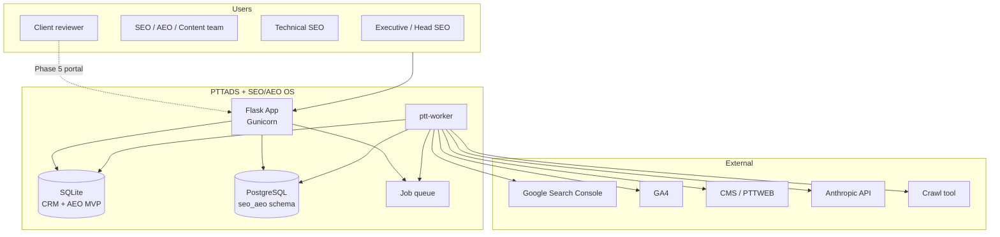
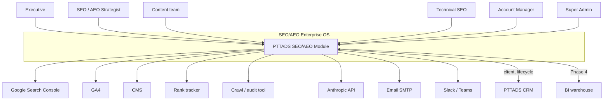
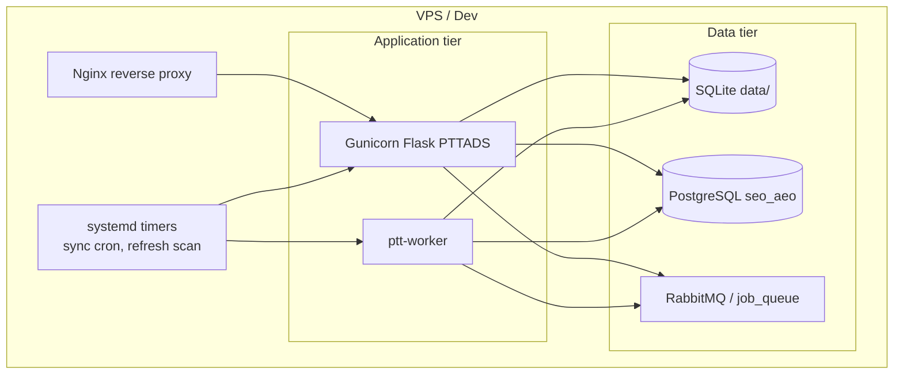
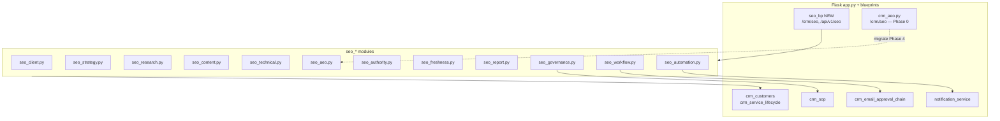
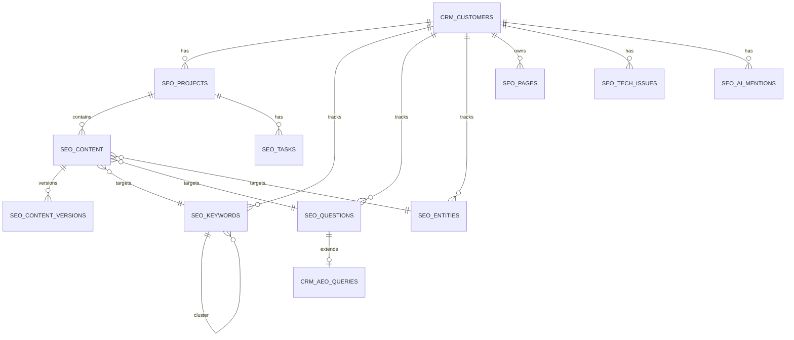
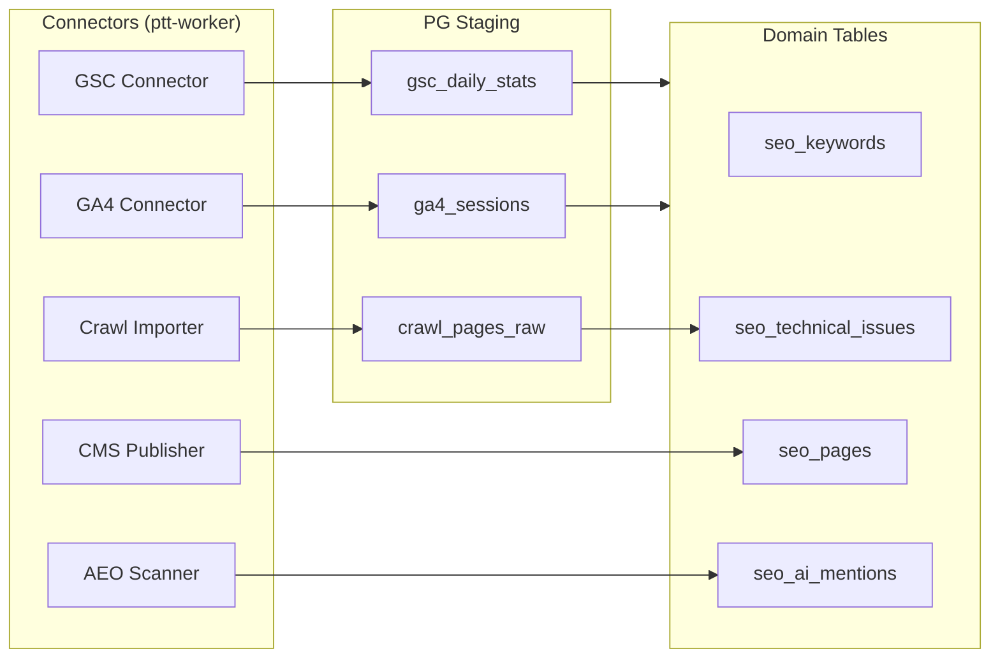

# Architecture — SEO/AEO Enterprise Operating System

> **Phiên bản:** 1.4 · **Ngày:** 2026-07-19  
> **Phạm vi:** Target architecture (Phase 0–5 + Gate B/C/D/E) — Flask strangler + workers + PostgreSQL sidecar  
> **Trạng thái code:** Phase 0–5 + Gate B/C/D/E ✅ shipped; **Gate A prod pilot** pending  
> **Storage policy (2026-07-19):** [`2026-07-19-seo-aeo-pg-cutover-policy.md`](2026-07-19-seo-aeo-pg-cutover-policy.md) — **no new SQLite SEO schema**  
> **Master spec:** [`SPEC_SEO_AEO_OPERATING_SYSTEM.md`](../SPEC_SEO_AEO_OPERATING_SYSTEM.md) v1.4  
> **UI/UX:** [`SPEC_UI_UX_SEO_AEO.md`](../SPEC_UI_UX_SEO_AEO.md) v1.4  
> **Runbooks:** [`seo-aeo-gate-e.md`](../runbooks/seo-aeo-gate-e.md) · [`phase5-prod-signoff-checklist.md`](../runbooks/phase5-prod-signoff-checklist.md)

---

## Mục lục

1. [Tổng quan kiến trúc](#1-tổng-quan-kiến-trúc)
2. [C4 Level 1 — System Context](#2-c4-level-1--system-context)
3. [C4 Level 2 — Containers](#3-c4-level-2--containers)
4. [C4 Level 3 — Components](#4-c4-level-3--components)
5. [7-Layer architecture mapping](#5-7-layer-architecture-mapping)
6. [Mô hình dữ liệu](#6-mô-hình-dữ-liệu)
7. [API specification](#7-api-specification)
8. [Job queue & async processing](#8-job-queue--async-processing)
9. [Integration architecture](#9-integration-architecture)
10. [Deployment topology](#10-deployment-topology)
11. [Security & RBAC](#11-security--rbac)
12. [Observability](#12-observability)
13. [ADR — Architecture Decision Records](#13-adr--architecture-decision-records)
14. [Evolution path theo phase](#14-evolution-path-theo-phase)

---

## 1. Tổng quan kiến trúc

SEO/AEO OS được triển khai theo **Strangler Fig Pattern** trên nền PTTADS:

- **Flask monolith** serve UI (Jinja2) + REST API + webhook ingress
- **SQLite** — CRM OLTP legacy (leads, customers, AEO MVP) — **read bridge only** cho SEO/AEO sau Phase 3.5
- **PostgreSQL** — SEO/AEO domain tables (`seo_aeo.*`), sync staging, job queue — **write primary từ Phase 3.5**
- **ptt-worker** — async sync (GSC, GA4, crawl import, AEO batch scan, report gen)
- **Anthropic API** — AEO scan, brief generation, content scoring

> **⚠️ Policy 2026-07-19:** Phase 1–3 implement tạm trên SQLite là **legacy debt**. Team **không thêm** bảng/cột/feature SEO mới vào SQLite. Phase 3.5 cutover bắt buộc trước Phase 4.



**Nguyên tắc:**

1. **Client isolation** — mọi query filter theo `customer_id` / `client_id`
2. **Workflow-first** — state machine cho content, issues, approvals
3. **Async by default** — sync/import/report chạy qua worker, không block UI
4. **Reuse PTTADS** — customers, lifecycle, SOP, notifications, RBAC
5. **Incremental migration** — AEO MVP (`crm_aeo_*`) giữ backward compat, wrap dần

---

## 2. C4 Level 1 — System Context



| Actor / System | Interaction |
|----------------|-------------|
| SEO/AEO team | Flask admin UI `/crm/seo/*`, `/crm/aeo/*` |
| Executive | Executive Overview dashboard |
| Client reviewer | Client portal view (Phase 5) |
| GSC / GA4 | OAuth + daily sync via worker |
| CMS | Publish webhook / API (Phase 2) |
| Anthropic | AEO scan, brief gen, scoring |
| CRM | Shared `crm_customers`, service lifecycle |
| Crawl tool | CSV/API import → technical issues |

---

## 3. C4 Level 2 — Containers



| Container | Tech | Trách nhiệm |
|-----------|------|-------------|
| **Nginx** | nginx | TLS, proxy, rate limit API |
| **Flask (Gunicorn)** | Python 3, Flask 3 | SEO/AEO UI, REST API, enqueue |
| **ptt-worker** | Python 3 | GSC/GA4 sync, crawl import, batch AEO, reports |
| **SQLite** | file `data/*.db` | CRM OLTP, AEO MVP — **không** SEO domain writes sau Phase 3.5 |
| **PostgreSQL** | PG 15 | `seo_aeo.*` domain tables — **source of truth** SEO/AEO |
| **RabbitMQ / PG queue** | 3.x / PG poll | `seo.sync`, `seo.report`, `seo.scan` |
| **systemd timers** | cron | Daily sync, freshness scan, alert check |

---

## 4. C4 Level 3 — Components

### 4.1. Flask application — SEO/AEO modules



### 4.2. Module responsibilities

| Module | File | Trách nhiệm chính |
|--------|------|-------------------|
| Client workspace | `seo_client.py` | SEO settings, brand kit, integrations per client |
| Strategy | `ptt_seo/strategy_okr.py` (+ `seo_strategy.py`) | Roadmap, initiatives, **OKR/KPI tree** (Gate E1) |
| Research | `ptt_seo/seo_research.py` | Keywords, questions, entities, clusters, **entity autolink** (E4) |
| Content | `ptt_seo/seo_content.py` | Pipeline, briefs, versions, publish checklist, **CMS auto-publish hook** (E5) |
| Technical | `ptt_seo/seo_technical.py` | Issues, crawl data, schema validation |
| CWV | `ptt_seo/cwv.py` | PageSpeed ingest + **CRM CWV API/UI** (Gate D/E3) |
| Crawl connector | `ptt_seo/crawl_connector.py` | Scheduled webhook ingest (Gate E2) |
| Rank live | `ptt_seo/rank_live.py` | SERP capture + share of voice (Gate E6) |
| Attribution | `ptt_seo/attribution.py` | Organic revenue summary from GA4 cols (Gate E7) |
| CMS publish | `ptt_seo/cms_publish.py` | Webhook jobs, `maybe_auto_publish` (Gate E5) |
| AEO | `seo_aeo.py` | Coverage, scoring, AI visibility (wrap `crm_aeo`) |
| Authority | `seo_authority.py` | Mentions, citations, backlink review |
| Freshness | `seo_freshness.py` | Decay scoring, refresh queue |
| Report | `seo_report.py` | Dashboards, scheduled exports |
| Workflow | `seo_workflow.py` | Tasks, approvals, audit trail |
| Governance | `seo_governance.py` | Policy engine, required fields, SOP link |
| Automation | `seo_automation.py` | Alert rules, sync triggers |

### 4.3. Intelligence Engine (Layer 4)

Chạy trong worker + on-demand API:

| Engine | Input | Output |
|--------|-------|--------|
| Keyword scorer | volume, difficulty, intent, business value | opportunity score |
| Question mapper | PAA, SERP, AI snapshots | question matrix |
| Entity graph builder | pages, schema, mentions | entity graph JSON |
| AEO readiness scorer | content body, schema, entities | 0–100 score + checklist |
| Technical detector | crawl CSV/API | issues with severity |
| Freshness scorer | traffic/rank decay signals | refresh priority |
| Anomaly detector | time-series metrics | alert events |

---

## 5. 7-Layer architecture mapping

| Layer | PTTADS implementation | Storage |
|-------|----------------------|---------|
| **L1 Strategy** | `strategy_okr.py`, `seo_strategy.py`, S-05 UI | PG `seo_initiatives`, `seo_strategy_goals`, `seo_strategy_kpis` |
| **L2 Data Inputs** | Connectors in worker | PG staging tables |
| **L3 Data Foundation** | Normalized views | PG + optional BI export |
| **L4 Intelligence** | Scoring functions in `seo_*` | PG computed columns / cache |
| **L5 Workflow** | `seo_content.py`, `seo_workflow.py` | PG + SQLite tasks |
| **L6 Governance** | `seo_governance.py`, `/crm/sop` | PG policies + SOP link |
| **L7 Output** | `seo_report.py`, dashboards | PG aggregates + cache |

---

## 6. Mô hình dữ liệu

### 6.1. ERD tổng quan



**Mapping client:** `seo_* .customer_id` → `crm_customers.id` (FK).

### 6.2. Core tables (PostgreSQL schema `seo_aeo`)

#### `seo_projects`

```sql
CREATE TABLE seo_aeo.seo_projects (
    id              SERIAL PRIMARY KEY,
    customer_id     INTEGER NOT NULL,  -- FK crm_customers.id (app-level)
    lifecycle_id    INTEGER,           -- FK crm_service_lifecycle.id
    name            TEXT NOT NULL DEFAULT '',
    project_type    TEXT NOT NULL DEFAULT 'seo',  -- seo | aeo | hybrid
    status          TEXT NOT NULL DEFAULT 'active',
    start_date      DATE,
    end_date        DATE,
    owner_staff_id  INTEGER,
    created_at      TIMESTAMPTZ NOT NULL DEFAULT NOW(),
    updated_at      TIMESTAMPTZ NOT NULL DEFAULT NOW()
);
CREATE INDEX idx_seo_projects_customer ON seo_aeo.seo_projects (customer_id);
```

#### `seo_keywords`

```sql
CREATE TABLE seo_aeo.seo_keywords (
    id              SERIAL PRIMARY KEY,
    customer_id     INTEGER NOT NULL,
    phrase          TEXT NOT NULL,
    volume          INTEGER,
    difficulty      NUMERIC(5,2),
    cpc             NUMERIC(10,2),
    intent          TEXT,              -- informational | commercial | transactional | navigational
    cluster_id      INTEGER REFERENCES seo_aeo.seo_keywords(id),
    business_value  TEXT,              -- low | medium | high
    seasonality     JSONB DEFAULT '{}',
    opportunity_score NUMERIC(5,2),
    status          TEXT NOT NULL DEFAULT 'active',
    created_at      TIMESTAMPTZ NOT NULL DEFAULT NOW()
);
CREATE INDEX idx_seo_keywords_customer ON seo_aeo.seo_keywords (customer_id);
CREATE INDEX idx_seo_keywords_cluster ON seo_aeo.seo_keywords (cluster_id);
```

#### `seo_questions`

```sql
CREATE TABLE seo_aeo.seo_questions (
    id              SERIAL PRIMARY KEY,
    customer_id     INTEGER NOT NULL,
    question_text   TEXT NOT NULL,
    intent          TEXT,
    funnel_stage    TEXT,              -- awareness | consideration | decision
    source          TEXT,              -- manual | paa | ai_snapshot | research
    answer_score    NUMERIC(5,2),
    aeo_query_id    INTEGER,           -- link crm_aeo_queries.id (SQLite, app-level)
    status          TEXT NOT NULL DEFAULT 'active',
    created_at      TIMESTAMPTZ NOT NULL DEFAULT NOW()
);
```

#### `seo_entities`

```sql
CREATE TABLE seo_aeo.seo_entities (
    id                SERIAL PRIMARY KEY,
    customer_id       INTEGER NOT NULL,
    entity_name       TEXT NOT NULL,
    entity_type       TEXT NOT NULL,   -- brand | product | author | expert | category | competitor | location
    same_as           JSONB DEFAULT '[]',
    confidence_score  NUMERIC(5,2),
    notes             TEXT DEFAULT '',
    created_at        TIMESTAMPTZ NOT NULL DEFAULT NOW()
);
```

#### `seo_pages`

```sql
CREATE TABLE seo_aeo.seo_pages (
    id                SERIAL PRIMARY KEY,
    customer_id       INTEGER NOT NULL,
    url               TEXT NOT NULL,
    title             TEXT DEFAULT '',
    slug              TEXT DEFAULT '',
    content_type      TEXT,
    schema_type       TEXT,
    primary_keyword_id INTEGER REFERENCES seo_aeo.seo_keywords(id),
    primary_question_id INTEGER REFERENCES seo_aeo.seo_questions(id),
    primary_entity_id  INTEGER REFERENCES seo_aeo.seo_entities(id),
    status            TEXT NOT NULL DEFAULT 'unknown',
    last_crawled_at   TIMESTAMPTZ,
    created_at        TIMESTAMPTZ NOT NULL DEFAULT NOW(),
    UNIQUE (customer_id, url)
);
```

#### `seo_content`

```sql
CREATE TABLE seo_aeo.seo_content (
    id                SERIAL PRIMARY KEY,
    project_id        INTEGER NOT NULL REFERENCES seo_aeo.seo_projects(id),
    customer_id       INTEGER NOT NULL,
    title             TEXT NOT NULL DEFAULT '',
    slug              TEXT DEFAULT '',
    content_type      TEXT NOT NULL,   -- blog | pillar | service | landing | faq | ...
    workflow_status   TEXT NOT NULL DEFAULT 'idea',
    target_keyword_id INTEGER REFERENCES seo_aeo.seo_keywords(id),
    target_question_id INTEGER REFERENCES seo_aeo.seo_questions(id),
    target_entity_id  INTEGER REFERENCES seo_aeo.seo_entities(id),
    intent            TEXT,
    funnel_stage      TEXT,
    schema_type       TEXT,
    owner_staff_id    INTEGER,
    due_date          DATE,
    publish_date      DATE,
    refresh_date      DATE,
    brief_json        JSONB DEFAULT '{}',
    outline_json      JSONB DEFAULT '{}',
    body_html         TEXT DEFAULT '',
    seo_score         NUMERIC(5,2),
    aeo_score         NUMERIC(5,2),
    created_at        TIMESTAMPTZ NOT NULL DEFAULT NOW(),
    updated_at        TIMESTAMPTZ NOT NULL DEFAULT NOW()
);
CREATE INDEX idx_seo_content_status ON seo_aeo.seo_content (customer_id, workflow_status);
```

**Workflow status enum:** `idea`, `researching`, `brief_ready`, `in_writing`, `seo_review`, `aeo_review`, `technical_review`, `client_review`, `approved`, `published`, `monitoring`, `refresh_required`, `archived`.

#### `seo_content_versions`

```sql
CREATE TABLE seo_aeo.seo_content_versions (
    id              SERIAL PRIMARY KEY,
    content_id      INTEGER NOT NULL REFERENCES seo_aeo.seo_content(id) ON DELETE CASCADE,
    version_number  INTEGER NOT NULL,
    body_html       TEXT DEFAULT '',
    changes_summary TEXT DEFAULT '',
    created_by      INTEGER,
    created_at      TIMESTAMPTZ NOT NULL DEFAULT NOW()
);
```

#### `seo_technical_issues`

```sql
CREATE TABLE seo_aeo.seo_technical_issues (
    id              SERIAL PRIMARY KEY,
    customer_id     INTEGER NOT NULL,
    page_id         INTEGER REFERENCES seo_aeo.seo_pages(id),
    url             TEXT NOT NULL,
    issue_type      TEXT NOT NULL,
    severity        TEXT NOT NULL DEFAULT 'medium',  -- critical | high | medium | low
    status          TEXT NOT NULL DEFAULT 'detected',
    description     TEXT DEFAULT '',
    impact_notes    TEXT DEFAULT '',
    assignee_id     INTEGER,
    discovered_at   TIMESTAMPTZ NOT NULL DEFAULT NOW(),
    resolved_at     TIMESTAMPTZ,
    verified_at     TIMESTAMPTZ
);
CREATE INDEX idx_seo_issues_customer_status ON seo_aeo.seo_technical_issues (customer_id, status);
CREATE INDEX idx_seo_issues_severity ON seo_aeo.seo_technical_issues (customer_id, severity);
```

#### `seo_ai_mentions`

```sql
CREATE TABLE seo_aeo.seo_ai_mentions (
    id              SERIAL PRIMARY KEY,
    customer_id     INTEGER NOT NULL,
    platform        TEXT NOT NULL,     -- chatgpt | perplexity | google_aio | claude | other
    query_text      TEXT NOT NULL,
    source_url      TEXT,
    citation_status TEXT,              -- cited | mentioned | absent
    brand_visible   BOOLEAN DEFAULT FALSE,
    detected_at     TIMESTAMPTZ NOT NULL DEFAULT NOW(),
    scan_id         INTEGER            -- link crm_aeo_scans if migrated
);
```

#### `seo_initiatives` (Strategy)

```sql
CREATE TABLE seo_aeo.seo_initiatives (
    id              SERIAL PRIMARY KEY,
    customer_id     INTEGER NOT NULL,
    project_id      INTEGER REFERENCES seo_aeo.seo_projects(id),
    title           TEXT NOT NULL,
    description     TEXT DEFAULT '',
    impact          TEXT,              -- low | medium | high
    effort          TEXT,
    kpi_target      JSONB DEFAULT '{}',
    owner_staff_id  INTEGER,
    deadline        DATE,
    status          TEXT NOT NULL DEFAULT 'planned',
    roadmap_bucket  TEXT,              -- 30d | 60d | 90d
    created_at      TIMESTAMPTZ NOT NULL DEFAULT NOW()
);
```

#### `seo_sync_runs` (Integration staging)

```sql
CREATE TABLE seo_aeo.seo_sync_runs (
    id              SERIAL PRIMARY KEY,
    customer_id     INTEGER NOT NULL,
    source          TEXT NOT NULL,     -- gsc | ga4 | crawl | rank
    status          TEXT NOT NULL DEFAULT 'pending',
    started_at      TIMESTAMPTZ,
    finished_at     TIMESTAMPTZ,
    rows_imported   INTEGER DEFAULT 0,
    error_message   TEXT,
    payload_meta    JSONB DEFAULT '{}'
);
```

### 6.3. AEO MVP migration (Phase 0 → 4)

| SQLite (hiện tại) | Target |
|-------------------|--------|
| `crm_aeo_queries` | `seo_questions` + backward view |
| `crm_aeo_scans` | `seo_ai_mentions` + scan history |
| `crm_aeo_content` | `seo_content` (type=faq) |

Migration strategy: Phase 1–3 shipped on SQLite (legacy). **Phase 3.5:** backfill + `SEO_AEO_DB=pg`. Phase 4: AEO legacy dual-write → PG read. Phase 4 end: drop SQLite `seo_*` + deprecate `crm_aeo_*`.

### 6.4. Client SEO settings (extend)

Lưu trong `seo_aeo.seo_client_settings`:

```sql
CREATE TABLE seo_aeo.seo_client_settings (
    customer_id       INTEGER PRIMARY KEY,
    domains           JSONB DEFAULT '[]',
    markets           JSONB DEFAULT '[]',
    languages         JSONB DEFAULT '["vi"]',
    industry          TEXT DEFAULT '',
    brand_guidelines  JSONB DEFAULT '{}',
    seo_guidelines    JSONB DEFAULT '{}',
    aeo_guidelines    JSONB DEFAULT '{}',
    compliance_rules  JSONB DEFAULT '{}',
    integrations      JSONB DEFAULT '{}',  -- encrypted refs
    contract_tier     TEXT DEFAULT 'standard',
    approvers         JSONB DEFAULT '[]',
    updated_at        TIMESTAMPTZ NOT NULL DEFAULT NOW()
);
```

### 6.5. Gate E tables (PostgreSQL `seo_aeo`)

DDL: `deploy/sql/seo_aeo_gate_e.sql` (+ enterprise rank/CMS tables in `seo_aeo_enterprise.sql`).

#### `seo_strategy_goals` / `seo_strategy_kpis` (E1)

```sql
CREATE TABLE seo_aeo.seo_strategy_goals (
    id              SERIAL PRIMARY KEY,
    customer_id     INTEGER NOT NULL,
    title           TEXT NOT NULL,
    period          TEXT NOT NULL DEFAULT '',
    status          TEXT NOT NULL DEFAULT 'active',
    sort_order      INTEGER NOT NULL DEFAULT 0
);
CREATE TABLE seo_aeo.seo_strategy_kpis (
    id              SERIAL PRIMARY KEY,
    customer_id     INTEGER NOT NULL,
    goal_id         INTEGER NOT NULL REFERENCES seo_aeo.seo_strategy_goals(id) ON DELETE CASCADE,
    initiative_id   INTEGER,
    metric_key      TEXT NOT NULL,
    target_value    REAL,
    current_value   REAL
);
-- seo_initiatives.goal_id links initiatives → goals
```

#### `seo_crawl_schedules` (E2)

Webhook ingest: `POST /api/v1/seo/internal/crawl-ingest/:customer_id` + header `X-PTT-Crawl-Secret`.

#### `seo_cwv_snapshots` (Gate D/E3)

Ingest via `ptt_seo/cwv.py`; list API `GET /clients/:id/cwv`.

#### `seo_rank_tracked_keywords` / `seo_rank_snapshots` (E6)

Live capture: `POST /clients/:id/ranks/capture`; SOV: `GET /clients/:id/ranks/sov`.

#### `seo_cms_publish_jobs` (E5)

Queued on `workflow_status → published` when `PTT_SEO_CMS_AUTO_PUBLISH=1`.

#### GA4 revenue columns (E7)

`seo_ga4_daily_stats.conversions`, `seo_ga4_daily_stats.revenue` — attribution via `ptt_seo/attribution.py`.

---

## 7. API specification

Base path: `/api/v1/seo`

### 7.1. Client & project APIs

| Method | Path | Mô tả |
|--------|------|-------|
| GET | `/clients` | List clients with SEO settings summary |
| GET | `/clients/:id` | Client SEO workspace data |
| PUT | `/clients/:id/settings` | Update SEO/AEO settings |
| GET | `/clients/:id/projects` | List SEO projects |
| POST | `/clients/:id/projects` | Create project |

### 7.2. Research APIs

| Method | Path | Mô tả |
|--------|------|-------|
| GET | `/clients/:id/keywords` | Keyword list + filters |
| POST | `/clients/:id/keywords` | Bulk import keywords |
| GET | `/clients/:id/questions` | Question matrix |
| POST | `/clients/:id/questions` | Add question |
| GET | `/clients/:id/entities` | Entity list |
| GET | `/clients/:id/entities/graph` | Entity graph JSON |
| POST | `/clients/:id/research/opportunities` | Compute opportunity scores |

### 7.3. Content APIs

| Method | Path | Mô tả |
|--------|------|-------|
| GET | `/clients/:id/content` | Pipeline list (filter by status, owner) |
| POST | `/clients/:id/content` | Create content item |
| GET | `/content/:id` | Content detail + versions |
| PATCH | `/content/:id/status` | Transition workflow status |
| POST | `/content/:id/brief/generate` | AI generate brief |
| POST | `/content/:id/versions` | Save new version |
| GET | `/content/:id/versions/:v/diff` | Version diff |

### 7.4. Technical APIs

| Method | Path | Mô tả |
|--------|------|-------|
| GET | `/clients/:id/issues` | Issue backlog |
| POST | `/clients/:id/issues/import` | Import crawl CSV |
| PATCH | `/issues/:id` | Update status, assignee |
| POST | `/issues/:id/tasks` | Auto-create fix task |

### 7.5. AEO APIs

| Method | Path | Mô tả |
|--------|------|-------|
| GET | `/clients/:id/aeo/coverage` | Question coverage map |
| GET | `/clients/:id/aeo/scores` | Readiness scores |
| POST | `/clients/:id/aeo/scan` | Batch scan (enqueue) |
| GET | `/clients/:id/aeo/mentions` | AI mention trends |

**Legacy (giữ Phase 0–3):** `/api/crm/aeo/queries`, `/api/crm/aeo/queries/:id/scan`

### 7.6. Report & automation APIs

| Method | Path | Mô tả |
|--------|------|-------|
| GET | `/clients/:id/dashboard/:type` | Dashboard data (executive, seo, aeo, technical, content) |
| POST | `/clients/:id/reports/schedule` | Schedule report |
| GET | `/reports/:id/export` | PDF/CSV export |
| GET | `/clients/:id/alerts` | Active alerts |
| POST | `/clients/:id/sync/:source` | Trigger GSC/GA4/crawl sync |

### 7.7. Workflow & approval APIs

| Method | Path | Mô tả |
|--------|------|-------|
| POST | `/content/:id/approve` | Submit approval stage |
| POST | `/content/:id/reject` | Reject with reason |
| GET | `/content/:id/audit-trail` | Audit log |

**Auth:** Flask session + RBAC section `crm_seo_aeo`. API JSON 401/403 consistent với PTTADS.

### 7.8. Gate E — Enterprise depth APIs

| Method | Path | Mô tả | Gate |
|--------|------|-------|------|
| GET | `/clients/:id/strategy/okr` | OKR tree (goals → KPIs → initiatives) | E1 |
| POST | `/clients/:id/strategy/goals` | Create goal | E1 |
| POST | `/clients/:id/strategy/kpis` | Create KPI | E1 |
| POST | `/clients/:id/strategy/kpis/refresh` | Refresh all KPI metrics for client | E1 |
| POST | `/clients/:id/strategy/initiatives/:initiative_id/link-goal` | Link initiative → goal | E1 |
| GET | `/clients/:id/cwv` | CWV snapshots + summary | E3 |
| GET/PUT | `/clients/:id/crawl-schedule` | Crawl connector schedule read / upsert | E2 |
| POST | `/internal/crawl-ingest/:customer_id` | Webhook crawl payload (secret header) | E2 |
| POST | `/clients/:id/entities/autolink` | Auto-link entities from clusters | E4 |
| GET/POST | `/clients/:id/ranks` | Tracked keywords list / add | E6 |
| POST | `/clients/:id/ranks/import` | CSV import | E6 |
| GET | `/ranks/:tracked_id/history` | Position history | E6 |
| GET | `/clients/:id/ranks/sov` | Share of voice (top 10) | E6 |
| POST | `/clients/:id/ranks/capture` | Live SERP capture | E6 |
| GET | `/clients/:id/attribution` | Organic revenue + landing pages | E7 |
| POST | `/cron/gate-e` | Crawl schedule checks + rank live bundle | E2/E6 |

CMS auto-publish (E5) is **event-driven** in `seo_content.py` → `maybe_auto_publish()` — no separate public API.

UI routes: S-05 `/crm/seo/strategy`, S-09 `/crm/seo/technical`, S-17 `/crm/seo/ranks`.

---

## 8. Job queue & async processing

### 8.1. Job types

| Job type | Trigger | Worker action |
|----------|---------|---------------|
| `seo.sync.gsc` | Daily cron / manual | Pull GSC data → staging → aggregate |
| `seo.sync.ga4` | Daily cron | Pull GA4 metrics |
| `seo.import.crawl` | Upload CSV / API | Parse → `seo_technical_issues` |
| `seo.scan.aeo` | Manual / scheduled | Batch Anthropic scan → mentions |
| `seo.report.generate` | Schedule | Build PDF/CSV → store + email |
| `seo.freshness.scan` | Weekly cron | Compute decay scores → refresh queue |
| `seo.alert.check` | Hourly | Anomaly detection → notifications |
| `seo.crawl.schedule` | Gate E cron | Check due crawl schedules → webhook reminder |
| `seo.rank.capture` | Gate E cron / manual | Live SERP capture → `seo_rank_snapshots` |
| `seo.cwv.ingest` | Gate D cron | PageSpeed → `seo_cwv_snapshots` |
| `seo.cms.publish` | On publish transition | CMS webhook job (E5) |
| `seo.bi.clickhouse` | Daily timer (04:00 VN) | Export facts → ClickHouse (5D) |

### 8.2. Job lifecycle

```
pending → running → done | failed | dead
```

DLQ replay pattern giống Agency Ops ingest (`/crm/agency/ingest`).

### 8.3. Correlation ID

`X-SEO-Request-Id` header + job payload `correlation_id` xuyên suốt sync → issue → task → notification.

---

## 9. Integration architecture



| Integration | Auth | Sync frequency | Phase / Gate | Trạng thái |
|-------------|------|----------------|--------------|------------|
| GSC | OAuth 2.0 service account | Daily | 3 / 4 | ✅ |
| GA4 | OAuth / service account | Daily | 3 / 4 / **E7** | ✅ OAuth; revenue cols; **GA4 sync chưa pull revenue** |
| CMS | API key / webhook | On publish | 2 / **E5** | ✅ Webhook + `PTT_SEO_CMS_AUTO_PUBLISH` |
| Crawl tool | CSV upload / **webhook** | Weekly / scheduled | 3 / **E2** | ✅ |
| PageSpeed Insights | API key | Weekly | **Gate D/E** | ✅; staging `PTT_CWV_STUB=1` |
| SerpAPI / DataForSEO | API key | On-demand | **Gate C/E6** | ✅; default `PTT_SERP_PROVIDER=stub` |
| Anthropic | API key | On-demand | 0 | ✅ |
| ClickHouse + Grafana | Internal | Daily export | **5D** | ✅ code; VPS deploy staging 🟡 |
| Slack | Webhook URL | Real-time alerts | 3 / P2 | ✅ |
| **Teams** | Webhook URL | Real-time alerts | **Gate D** | ✅ `PTT_SEO_TEAMS_WEBHOOK` |
| Email SMTP | Existing PTTADS | Reports, approvals | 2 | 🟡 |
| Client Portal | Session / JWT | On-demand | **5C** | ✅; `PTT_PORTAL_SEO_ENABLED=0` prod |
| Temporal | gRPC | Workflow events | **Gate C** | ✅; `PTT_SEO_CONTENT_TEMPORAL=0` prod |

---

## 10. Deployment topology

### 10.1. Phase 1–2 (Flask-only + optional PG)

```
pttads.vn (Nginx)
  └── Gunicorn :8002
        ├── Flask app.py (SEO routes added)
        └── SQLite (CRM + AEO MVP)
  └── PostgreSQL :5432 (seo_aeo schema) — optional Phase 1
  └── ptt-worker (if queue enabled)
```

### 10.2. Phase 3+ (full stack)

Giống Agency Platform Phase 1 topology — shared PostgreSQL, RabbitMQ, worker pool.

### 10.3. Environment variables

| Variable | Mô tả |
|----------|-------|
| `SEO_AEO_PG_DSN` / `SEO_AEO_DB=pg` | PostgreSQL connection (required prod) |
| `ANTHROPIC_API_KEY` | AEO scan (existing) |
| `GSC_CREDENTIALS_JSON` | GSC service account |
| `GA4_PROPERTY_ID` | Per-client in `seo_client_settings.integrations` |
| `SEO_SYNC_ENABLED` | Master sync feature flag |
| `PTT_SEO_ENTERPRISE_ENABLED` | Enterprise modules (rank, CMS, OKR) |
| `PTT_CRAWL_CONNECTOR_ENABLED` | E2 scheduled crawl connector |
| `PTT_RANK_LIVE_ENABLED` | E6 live SERP capture in cron |
| `PTT_SEO_CMS_AUTO_PUBLISH` | E5 auto CMS webhook on publish |
| `PTT_SERP_PROVIDER` | `stub` \| `serpapi` \| `dataforseo` |
| `PTT_CWV_STUB` | Staging CWV stub data |
| `PTT_SEO_TEAMS_WEBHOOK` | Gate D Teams alerts |
| `PTT_PORTAL_SEO_ENABLED` | 5C client portal SEO |
| `PTT_SEO_GOVERNANCE_ENABLED` | 5A governance hub |
| `PTT_SEO_EXPERIMENTS_ENABLED` | 5B experimentation |
| `PTT_SEO_CONTENT_TEMPORAL` | Gate C Temporal workflow |

### 10.4. Feature flags

| Flag | Default (prod) | Phase / Gate |
|------|----------------|--------------|
| `SEO_MODULE_ENABLED` | `1` | 1 |
| `SEO_CONTENT_PIPELINE` | `1` | 2 |
| `SEO_GSC_SYNC` | `1` | 3 / 4 |
| `SEO_AEO_V2` | `1` | 4 |
| `PTT_SEO_ENTERPRISE_ENABLED` | `1` | Gate E |
| `PTT_PORTAL_SEO_ENABLED` | **`0`** until pilot | 5C |
| `PTT_SEO_EXPERIMENTS_ENABLED` | **`0`** until UAT | 5B |
| `PTT_SEO_CONTENT_TEMPORAL` | **`0`** until pilot | Gate C |
| `PTT_SEO_CMS_AUTO_PUBLISH` | **`0`** until pilot | E5 |

---

## 11. Security & RBAC

### 11.1. Client data isolation

```python
# Mọi query bắt buộc filter
WHERE customer_id = :authorized_customer_id
```

Staff chỉ thấy clients được gán (AM, project team) trừ Super Admin.

### 11.2. Section permissions

| Section key | View | Write | Approve |
|-------------|:----:|:-----:|:-------:|
| `crm_seo_aeo` | All SEO team | Strategist+ | Head SEO |
| `crm_seo_aeo_content` | Content team | Writer+ | Editor |
| `crm_seo_aeo_technical` | Tech SEO | Tech lead | Head SEO |
| `crm_seo_aeo_reports` | All | Analyst | — |
| `crm_seo_aeo_settings` | Admin, AM | Admin | — |

### 11.3. Audit trail

Table `seo_aeo.seo_audit_log`:

```sql
CREATE TABLE seo_aeo.seo_audit_log (
    id           SERIAL PRIMARY KEY,
    customer_id  INTEGER,
    entity_type  TEXT NOT NULL,
    entity_id    INTEGER,
    action       TEXT NOT NULL,
    actor_id     INTEGER,
    payload      JSONB DEFAULT '{}',
    created_at   TIMESTAMPTZ NOT NULL DEFAULT NOW()
);
```

### 11.4. Integration credentials

Stored encrypted in `seo_client_settings.integrations` — never log plaintext.

---

## 12. Observability

| Signal | Tool | Notes |
|--------|------|-------|
| Errors | Sentry | Existing PTTADS |
| Sync job metrics | PG `seo_sync_runs` + dashboard | Queue depth, failure rate |
| API latency | Nginx access log | P95 dashboard load < 2s |
| AEO scan cost | Anthropic usage log | Per-client budget alert |
| Alert delivery | Notification inbox | Reuse agency notifications |

---

## 13. ADR — Architecture Decision Records

### ADR-SEO-001: Strangler on Flask, not greenfield

**Context:** PTTADS đã có CRM, customers, AEO MVP, RBAC.  
**Decision:** Extend Flask monolith với `seo_*` modules, không tách microservice ngay.  
**Consequences:** Faster Phase 1; eventual PG migration needed for scale.

### ADR-SEO-002: PostgreSQL for SEO domain, SQLite for CRM

**Context:** SEO data volume (keywords, crawl rows) vượt SQLite comfort zone.  
**Decision:** New tables in PG schema `seo_aeo`; CRM stays SQLite until platform cutover.  
**Status (2026-07-19):** Phase 1–3 tạm SQLite — **superseded by ADR-SEO-006** cho mọi work mới.  
**Consequences:** Cross-DB joins via app layer; Phase 3.5 cutover required.

### ADR-SEO-006: SQLite freeze for SEO/AEO domain (2026-07-19)

**Context:** Phase 1–3 MVP ghi `seo_*` vào SQLite lệch spec gốc; team cần stop-line rõ ràng.  
**Decision:**  
- **Cấm** bảng/cột/feature/job mới ghi SEO/AEO vào SQLite  
- **Bắt buộc** DDL mới trong `deploy/sql/seo_aeo_pg_schema.sql` + PG connection  
- **Phase 3.5** gate trước Phase 4 (GSC OAuth, AEO v2, worker sync)  
- SQLite CRM master (`crm_customers`, lifecycle) vẫn **read bridge** tạm thời  

**Consequences:** Phase 4 blocked until Phase 3.5 DoD; PR checklist enforced.  
**Policy doc:** [`2026-07-19-seo-aeo-pg-cutover-policy.md`](2026-07-19-seo-aeo-pg-cutover-policy.md)

### ADR-SEO-003: Wrap AEO MVP, don't rewrite

**Context:** `crm_aeo.py` đang production với tests.  
**Decision:** `seo_aeo.py` wraps legacy; dual-write migration Phase 2–4.  
**Consequences:** Temporary duplication; zero downtime migration.

### ADR-SEO-004: Workflow state machine in application layer

**Context:** Content has 13 workflow stages with approval gates.  
**Decision:** Explicit transition map in `seo_content.py`, not DB triggers.  
**Consequences:** Testable transitions; governance rules in code + policy table.

### ADR-SEO-005: Async sync by default

**Context:** GSC/GA4/crawl imports can take minutes.  
**Decision:** All external sync via job queue; UI polls or webhook notify.  
**Consequences:** Requires worker process; consistent with Agency Platform.

---

## 14. Evolution path theo phase

| Phase | Architecture milestone |
|-------|------------------------|
| **0** ✅ | `crm_aeo.py` in SQLite, `/crm/aeo` |
| **1** ✅ | `ptt_seo/` package, `/crm/seo` nav — SQLite legacy |
| **2** ✅ | Research + Content pipeline — SQLite legacy |
| **3** ✅ | Technical, GSC CSV, Reports, Automation — SQLite legacy |
| **3.5** ✅ | **PG cutover** — `ptt_seo/db.py`, backfill, `SEO_AEO_DB=pg` |
| **4** ✅ | GSC/GA4 OAuth worker, AEO v2, Freshness, Authority — **PG only** |
| **5** ✅ | Governance (5A), Experiments (5B), Portal (5C) — **PG only** |
| **P2 Enterprise** ✅ | RBAC §9, Slack, research depth, S-12 charts, Gate B UI |
| **5D Gate D** ✅ | ClickHouse export, Grafana, CWV ingest, Teams, AEO schedule |
| **Gate C** ✅ | SerpAPI, white-label PDF, portal widgets, Temporal (flagged) |
| **Gate E** ✅ | OKR/KPI, crawl connector, CWV UI, entity autolink, CMS auto-publish, rank/SOV, attribution, a11y partial |
| **Gate A** 🟡 | Staging deploy + soak ≥7d + Phase 5 sign-off + QA §12 |

**Package layout (shipped):**

```
PTTADS/
├── ptt_seo/                    # Primary SEO/AEO domain package
│   ├── strategy_okr.py         # Gate E1
│   ├── crawl_connector.py      # Gate E2
│   ├── cwv.py                  # Gate D/E3
│   ├── entity_autolink.py      # Gate E4
│   ├── cms_publish.py          # Gate E5
│   ├── rank_live.py            # Gate E6
│   └── attribution.py          # Gate E7
├── blueprints/seo_aeo.py       # Routes + cron bundles
├── deploy/sql/
│   ├── seo_aeo_pg_schema.sql
│   ├── seo_aeo_gate_e.sql
│   └── seo_aeo_enterprise.sql
├── templates/crm_seo_*.html
├── static/crm_seo_*.js
└── tests/test_seo_aeo_gate_e.py
```

**Legacy note:** Phase 1–3 SQLite paths remain read-bridge only; all new DDL in PostgreSQL `seo_aeo.*`.

---

## Lịch sử

| Version | Date | Change |
|---------|------|--------|
| 1.4 | 2026-07-19 | Gate E (§6.5, §7.8, cron jobs); integrations status matrix; env/flags; evolution path 3.5–Gate A; sửa drift Teams/portal/5D |
| 1.1 | 2026-07-19 | ADR-SEO-006 SQLite freeze; Phase 3.5 cutover; cập nhật evolution path |
| 1.0 | 2026-07-19 | Initial architecture spec |
