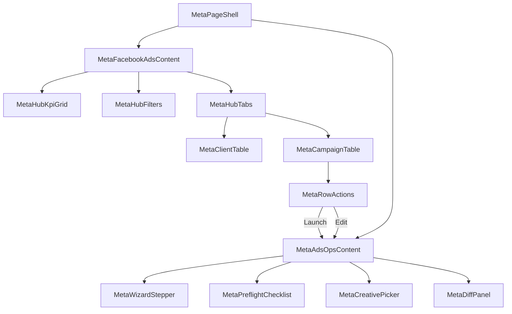
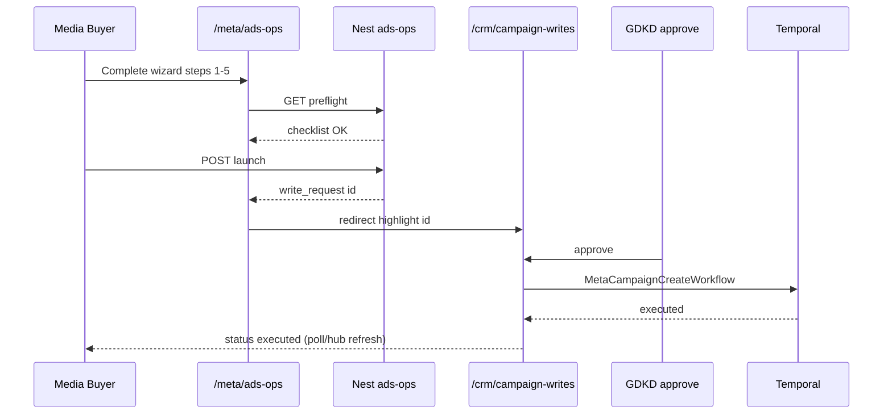
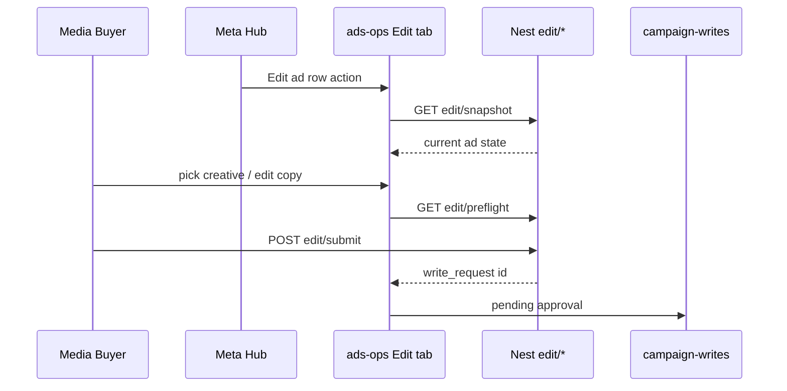

# Meta Enterprise — UI/UX System Architecture

> **Phiên bản:** 1.0 · **Ngày:** 2026-07-24  
> **Trạng thái:** Design for implementation — chuẩn bị coding B8–B15  
> **Nguồn:** [`../SPEC_META_ENTERPRISE_PTTADS.md`](../SPEC_META_ENTERPRISE_PTTADS.md) v1.2.1  
> **Apps:** `ops-web` (staff) · `portal-web` (client)  
> **Baseline shipped:** H1 hub · B6 portal · B6 campaign-writes (budget only)

---

## Mục lục

1. [Mục tiêu & nguyên tắc UX](#1-mục-tiêu--nguyên-tắc-ux)
2. [As-is vs target](#2-as-is-vs-target)
3. [Information Architecture (IA)](#3-information-architecture-ia)
4. [Design system & tokens](#4-design-system--tokens)
5. [Kiến trúc component](#5-kiến-trúc-component)
6. [Cross-cutting UX patterns](#6-cross-cutting-ux-patterns)
7. [Route specs — ops-web](#7-route-specs--ops-web)
8. [Route specs — portal-web](#8-route-specs--portal-web)
9. [Write / approve flows (B6 + B15)](#9-write--approve-flows-b6--b15)
10. [API → UI mapping](#10-api--ui-mapping)
11. [State & data fetching](#11-state--data-fetching)
12. [Lộ trình coding theo wave](#12-lộ-trình-coding-theo-wave)
13. [File checklist (coding)](#13-file-checklist-coding)
14. [QA & E2E map](#14-qa--e2e-map)

---

## 1. Mục tiêu & nguyên tắc UX

### 1.1. Mục tiêu

| Mục tiêu | Mô tả |
|----------|--------|
| **Agency hub** | Staff quản lý đa client Meta trên một màn hình — filter, KPI, drill-down |
| **Closed-loop visibility** | Spend → Lead CRM → CPL/ROAS → alert → action (write / ads-ops) |
| **Governed mutate** | Mọi thay đổi Graph qua submit → approve → Temporal — UI phản ánh trạng thái |
| **Client self-serve** | Portal read-only performance + export; không expose write |
| **Không clone Ads Manager** | Wizard hẹp + deep link cho audience/catalog/Advantage+ |

### 1.2. Nguyên tắc thiết kế

1. **URL-synced filters** — hub filters lưu trên query string (pattern hiện có `MetaFacebookAdsContent`).
2. **Cap-first UI** — ẩn nút mutate nếu thiếu cap; không chỉ dựa API 403.
3. **Progressive disclosure** — hub summary → tab chi tiết → wizard full-screen.
4. **Attribution transparency** — mọi KPI hiển thị `unmapped_spend_pct` + disclaimer §21 spec.
5. **Vietnamese-first copy** — label VI; technical IDs (campaign_id) secondary/monospace.
6. **Reuse PTT patterns** — `.card`, `.perf-table`, `.summary-grid`, `OpsNav` section gates.
7. **Two themes intentional** — ops light green vs portal dark; shared logic qua hooks/types, không shared CSS bundle.

### 1.3. Personas → surfaces

| Persona | Primary routes | Không thấy |
|---------|----------------|------------|
| Media Buyer | hub, ads-ops Launch/Edit, campaign-writes submit | approve button |
| Account Manager | hub, alerts, portal notify | conversion rules edit |
| Tracking/Tech | `/meta/tracking` | write approve |
| GDKD / Admin | campaign-writes approve, rules | — |
| Client Viewer | portal `/meta` | mọi mutate |

---

## 2. As-is vs target

### 2.1. ops-web Meta routes

| Route | Shipped | Target wave | Gap chính |
|-------|:-------:|:-----------:|-----------|
| `/meta/facebook-ads` | ✅ | B8 enhance | Tabs, campaign table, badges, row actions |
| `/meta/migration` | ✅ | H1 | Giữ; ẩn sau Flask retire |
| `/meta/ads-combined` | ✅ | B14 lite | Cross-channel KPI |
| `/meta/tracking` | ❌ | B9 | CAPI health, rules, pixel test |
| `/meta/intelligence` | ❌ | B10 | ROAS, anomaly, recommend |
| `/meta/alerts` | ❌ | B8 | Inbox deduped (hoặc tab trong hub) |
| `/meta/ads-ops` | ❌ | B15 | Launch wizard + Edit tab |
| `/crm/campaign-writes` | ✅ | B6+B15 | Budget only → extend create/edit |

### 2.2. portal-web

| Route | Shipped | Target | Gap |
|-------|:-------:|--------|-----|
| `/meta` | ✅ B6-S7 | B10 | CPL delta column, attribution footer |
| `/dashboard` | ✅ | B10 | Combined channel KPI |

### 2.3. Technical debt cần fix khi coding B8+

- ops hub KPI grid không dùng `.summary-grid` — **chuẩn hóa** khi refactor hub B8.
- portal `cpl_delta_vnd/pct`, `hub_mapped` có trong API type nhưng **chưa render**.
- portal `.channel-badge`, `.over-target` referenced nhưng thiếu CSS — **fix trong B8 portal pass**.

---

## 3. Information Architecture (IA)

### 3.1. ops-web — Meta section (target)

```
Agency & Hub
├── Meta Ads              /meta/facebook-ads     [hub canonical]
├── Meta Ads Ops          /meta/ads-ops          [B15 — cap: meta_ads_ops submit]
├── Meta Tracking         /meta/tracking         [B9]
├── Meta Intelligence     /meta/intelligence     [B10]
├── Ads CPL               /meta/ads-combined     [existing]
├── Meta Migration        /meta/migration        [H1 — fade out]
└── Campaign Write        /crm/campaign-writes   [approve hub — cross-link]

CRM · Marketing (existing cross-links)
├── Launch QA             /crm/launch-qa
├── Creative Hub          /crm/creatives
└── Hub · Hợp đồng        /crm/hub
```

**Nav cap gates (OpsNav):**

| Link | Cap required |
|------|--------------|
| Meta Ads, Ads CPL, Migration | `crm_facebook_ads.view` **or** `crm_agency.view` |
| Meta Ads Ops | above + (`crm_board.edit` **or** `meta_ads_ops` submit) |
| Meta Tracking | above + `crm_agency.configure` (Tracking role) |
| Meta Intelligence | `crm_facebook_ads.view` |
| Campaign Write | `meta_campaign_write.view` **or** `crm_board.view` |

### 3.2. portal-web (unchanged MVP nav)

```
Performance
├── Dashboard    /dashboard
├── Meta         /meta
└── Google       /google

Creative inbox   /creatives
Settings         /settings
```

### 3.3. User flow map (staff)

```mermaid
flowchart LR
  subgraph hub [Meta Hub]
    H1[Filter client/date]
    H2[KPI cards]
    H3[Tabs: Clients / Campaigns / Alerts]
  end

  subgraph actions [Actions]
    A1[Pause / Budget → campaign-writes]
    A2[Launch new → ads-ops Launch]
    A3[Edit ad → ads-ops Edit]
    A4[Open Ads Manager ↗]
  end

  subgraph approve [Governance]
    W1[Submit pending]
    W2[/crm/campaign-writes approve]
    W3[Temporal executed]
  end

  H3 --> A1 & A2 & A3 & A4
  A1 & A2 & A3 --> W1 --> W2 --> W3 --> H1
```

### 3.4. Deep linking contract

| From | To | Query |
|------|-----|-------|
| Hub campaign row | ads-ops Edit | `?mode=edit&client_id=&campaign_id=&ad_id=` |
| Alert `ad_disapproved` | ads-ops Edit | `?mode=edit&ad_id=&ack=1` |
| Intelligence recommend | campaign-writes submit | pre-filled budget form |
| Launch QA fail pixel | `/meta/tracking?client_id=` | |
| Client detail | hub filtered | `/meta/facebook-ads?client_id=` |

---

## 4. Design system & tokens

### 4.1. ops-web (staff)

**File:** `services/ops-web/src/app/globals.css`

| Token | Value | Usage |
|-------|-------|-------|
| `--primary` | `#398b43` | Primary buttons, active nav |
| `--bg` | `#ecf3ee` | Page background |
| `.card` | white panel | All Meta pages |
| `.perf-table` | striped table | Hub, tracking, writes |
| `.summary-grid` / `.summary-card` | 5-col KPI | **Target standard** for hub B8 |
| `.badge` | pill status | Generic status |
| `.meta-migration-pill--*` | pass/warn/pending | Migration panel only |

**Meta-specific badges (NEW — B8):**

```css
/* propose: ops-web/src/app/globals.css or meta/meta-badges.css */
.meta-badge { font-size: 0.75rem; padding: 2px 8px; border-radius: 999px; }
.meta-badge--ok { background: #dcfce7; color: #166534; }
.meta-badge--warn { background: #fef9c3; color: #854d0e; }
.meta-badge--error { background: #fee2e2; color: #991b1b; }
.meta-badge--muted { background: #f3f4f6; color: #4b5563; }
```

| Badge | Condition | Variant |
|-------|-----------|---------|
| Chưa map | `unmapped_spend_pct > 0` | warn |
| Token lỗi | `token_status != active` | error |
| Tenant locked | offboard B7 | error |
| CAPI OK | tracking health green | ok |
| Thiếu pixel | no pixel_id | error |
| Ad disapproved | B13 alert | warn |

### 4.2. portal-web (client)

**File:** `services/portal-web/src/app/globals.css`

| Token | Value | Usage |
|-------|-------|-------|
| `--accent` | `#3b82f6` | Links, active nav |
| `--bg` | `#0f1419` | Dark shell |
| `.summary-grid` | KPI cards | PerformancePanel |
| `.perf-table` | Data table | PerformanceTable |

**Portal attribution footer (B8/B10):**

```
CPL tính theo last-touch CRM · X% chi tiêu chưa map campaign · Dữ liệu đến {through_date}
```

### 4.3. Typography & numbers

| Element | Convention |
|---------|------------|
| VND | `fmtVnd()` — `1.234.567 ₫` (vi-VN) |
| Dates | `dd/mm/yyyy` display; ISO in API |
| Campaign IDs | monospace, truncate + tooltip |
| Empty | em dash `—` not `null` |

### 4.4. Wizard stepper (B15)

```
.meta-wizard-steps { display: flex; gap: 0; }
.meta-wizard-step { flex: 1; text-align: center; border-bottom: 3px solid #e5e7eb; }
.meta-wizard-step--active { border-color: var(--primary); font-weight: 600; }
.meta-wizard-step--done { border-color: #86efac; color: #166534; }
```

---

## 5. Kiến trúc component

### 5.1. Proposed folder structure (ops-web)

```
services/ops-web/src/
├── app/meta/
│   ├── facebook-ads/
│   │   ├── page.tsx
│   │   └── MetaFacebookAdsContent.tsx      # refactor → thin shell
│   ├── ads-ops/
│   │   ├── page.tsx
│   │   └── MetaAdsOpsContent.tsx           # NEW B15
│   ├── tracking/
│   │   ├── page.tsx
│   │   └── MetaTrackingContent.tsx         # NEW B9
│   ├── intelligence/
│   │   ├── page.tsx
│   │   └── MetaIntelligenceContent.tsx     # NEW B10
│   └── alerts/
│       ├── page.tsx                        # optional B8
│       └── MetaAlertsContent.tsx
├── components/meta/                        # NEW shared Meta UI
│   ├── MetaPageShell.tsx                   # OpsNav + title + max-width
│   ├── MetaHubKpiGrid.tsx
│   ├── MetaHubFilters.tsx
│   ├── MetaHubTabs.tsx
│   ├── MetaClientTable.tsx
│   ├── MetaCampaignTable.tsx
│   ├── MetaBadge.tsx
│   ├── MetaPreflightChecklist.tsx          # B15 Launch + Edit
│   ├── MetaWizardStepper.tsx
│   ├── MetaCreativePicker.tsx              # crm_creatives approved only
│   ├── MetaAdSnapshotPanel.tsx             # Edit left pane
│   ├── MetaDiffPanel.tsx                   # old vs new_value
│   ├── MetaRowActions.tsx                  # Edit/Pause/Budget/Ads Manager
│   └── MetaDeepLinkButton.tsx
├── hooks/meta/
│   ├── useMetaHub.ts
│   ├── useMetaAdsOpsLaunch.ts
│   ├── useMetaAdsOpsEdit.ts
│   ├── useMetaTrackingHealth.ts
│   └── useCampaignWriteSubmit.ts
└── lib/meta/
    ├── types.ts                            # FacebookHub*, AdsOps*, Tracking*
    ├── api.ts                              # fetch wrappers (or extend lib/api.ts)
    └── caps.ts                             # hasMetaCap helpers
```

### 5.2. portal-web additions

```
services/portal-web/src/
├── components/
│   ├── PerformancePanel.tsx                # extend: CPL delta, attribution footer
│   └── PerformanceTable.tsx                # add columns: delta, hub_mapped badge
└── lib/format.ts                           # shared fmt — already exists
```

### 5.3. Component dependency graph



---

## 6. Cross-cutting UX patterns

### 6.1. Page shell pattern

Every ops Meta page:

```tsx
<main>
  <OpsNav user={user} onLogout={...} />
  <div className="card" style={{ maxWidth: 1200, margin: '0 auto' }}>
    <header>{title} + primary actions</header>
    {error && <p className="error">{error}</p>}
    {loading ? <MetaSkeleton /> : children}
  </div>
</main>
```

Extract to `MetaPageShell` — tránh copy 5 lần.

### 6.2. Loading & empty states

| Context | Loading | Empty |
|---------|---------|-------|
| Hub no clients | skeleton KPI + table rows | "Chưa có client Meta active" + link `/agency/clients` |
| Hub no data in range | — | "Không có dữ liệu T-{n}" |
| Alerts inbox | — | "Không có alert mở" |
| Ads-ops no approved creative | — | "Chưa có creative approved" + link `/crm/creatives` |
| Tracking no CAPI events | — | "Chưa gửi CAPI — kiểm tra pixel" |

### 6.3. Error handling

| HTTP | UI |
|------|-----|
| 403 missing cap | Inline "Không có quyền" — hide page actions |
| 404 client/ad | Toast + redirect hub |
| 422 preflight fail | Checklist items red + block submit |
| 500 Graph/Temporal | Retry button + link campaign-writes status |

### 6.4. Confirmation patterns

| Action | Pattern |
|--------|---------|
| Submit write | Modal summary payload + "Gửi duyệt" |
| Approve write | Note field optional + confirm |
| Reject write | Note **required** |
| Edit disapproved ad | Checkbox "Tôi xác nhận ad đang bị từ chối" |
| Export CSV | Direct download (existing) |

### 6.5. Pending write visibility

- **Global banner** on `/crm/campaign-writes` when `stats.pending > 0` (existing).
- **Hub chip** "X write chờ duyệt" → link campaign-writes (B8).
- **Post-submit** toast + link poll request id (B15).

---

## 7. Route specs — ops-web

### 7.1. `/meta/facebook-ads` (B8 enhanced)

**Reference implementation:** `MetaFacebookAdsContent.tsx` — refactor, không rewrite từ zero.

#### Layout zones

| Zone | Content | Component |
|------|---------|-----------|
| Header | Title, cross-links (Ads CPL, Google, Launch QA), Export CSV | inline |
| Migration compact | Horizon panel (hide when retired) | `MetaMigrationPanel compact` |
| Filters | client, days/date range, status, search | `MetaHubFilters` |
| KPI row | Spend, Leads CRM, CPL, Unmapped %, Open alerts, Over target | `MetaHubKpiGrid` |
| Tabs | Clients · Campaigns · Alerts · (Tracking embed B9) · (Intel embed B10) | `MetaHubTabs` |
| Table | Sortable, row badges, row actions | `MetaClientTable` / `MetaCampaignTable` |

#### Campaign tab columns (B8)

| Column | Source |
|--------|--------|
| Campaign | name + external id |
| Client | name |
| Spend | `spend_vnd` |
| Leads CRM | `leads_crm` |
| CPL | derived |
| vs Target | delta badge |
| Status badges | unmapped, token, CAPI |
| Actions | `MetaRowActions` |

#### Row actions (cap-gated)

| Action | Cap | Destination |
|--------|-----|-------------|
| Pause / Resume | `crm_board.edit` | inline modal → campaign-writes |
| Budget | `crm_board.edit` | modal → campaign-writes |
| Launch | `meta_ads_ops` submit | `/meta/ads-ops?client_id=` |
| Edit ad | `meta_ads_ops` submit | `/meta/ads-ops?mode=edit&...` |
| Open Ads Manager | view | external `MetaDeepLinkButton` |
| Client detail | view | `/agency/clients/:id` |

### 7.2. `/meta/ads-ops` (B15)

**URL state:**

| Param | Values |
|-------|--------|
| `tab` | `launch` (default) · `edit` |
| `step` | 1–5 (launch) · 1–4 (edit) |
| `client_id`, `campaign_id`, `ad_id` | pre-fill |
| `mode` | legacy alias for `tab=edit` |

#### Tab Launch — 5 steps

| Step | Title | Fields | Validation |
|------|-------|--------|------------|
| 1 | Client & account | client select, channel account, token status | offboard block |
| 2 | Objective & budget | template RE Lead, daily budget, objective | min budget |
| 3 | Creative | `MetaCreativePicker` — approved only | required |
| 4 | Tracking | pixel, page, UTM preview, map status | preflight API |
| 5 | Review | summary + `MetaPreflightChecklist` all green | block if fail |

**Primary CTA flow:**

```
[Submit for approval]
  → POST /meta/ads-ops/launch
  → success: toast + link /crm/campaign-writes?highlight={id}
  → poll GET /meta/ads-ops/requests/:id (optional progress)
```

**Secondary:** `[Open in Ads Manager ↗]` top-right always visible.

#### Tab Edit — 4 steps (§8.9 spec)

| Step | Title | UI |
|------|-------|-----|
| 1 | Chọn ad | cascaded select client → campaign → ad (B11 ad-level) |
| 2 | Creative / copy | split: `MetaAdSnapshotPanel` left · editor right |
| 3 | Diff review | `MetaDiffPanel` old/new JSON fields human-readable |
| 4 | Submit | preflight edit + disapproved ack checkbox |

**Edit modes (step 2 toggle):**

- **Swap creative** — picker `crm_creatives` → `update_ad_creative`
- **Edit copy** — fields: headline, primary_text, description, CTA → `update_ad_copy`

### 7.3. `/meta/tracking` (B9)

| Section | Components |
|---------|------------|
| Health KPI cards | sent / failed / skipped 7d, avg latency, match hint |
| Account table | pixel_id, page, capi_enabled, test button |
| Conversion rules | CRUD table (admin cap) |
| Events log | paginated `capi_event_log` + retry |

**Primary action:** `[Test pixel]` → POST test-pixel → inline result.

### 7.4. `/meta/intelligence` (B10)

| Section | Content |
|---------|---------|
| ROAS KPI | series chart or summary cards |
| Anomalies | table alert_type, campaign, spike % |
| Recommendations | read-only table + CTA "Tạo write request" |

### 7.5. `/crm/campaign-writes` (extend B15)

**Existing:** budget submit/approve.

**Extend UI:**

| `change_type` / action | Submit form fields |
|------------------------|-------------------|
| `daily_budget` | budget VND (existing) |
| `create_*` | read-only summary from ads-ops (no inline form) |
| `update_*` | diff view from ads-ops edit |
| `status` pause/resume | campaign/ad id + target status |

Approve view: show payload JSON collapsed + human summary line.

---

## 8. Route specs — portal-web

### 8.1. `/meta` (B6 ✅ → B10 enhance)

**Component chain:** `page.tsx` → `PortalPageShell` → `PerformancePanel channel="meta"`.

#### Enhancements (B8/B10)

| Feature | Priority | Notes |
|---------|----------|-------|
| CPL delta column | B8 | `cpl_delta_vnd`, `cpl_delta_pct` — green/red |
| `hub_mapped` badge | B8 | warn when unmapped |
| Attribution footer | B8 | model + unmapped % + through_date |
| Hide ROAS when stub | B10 | existing logic — verify |
| Weekly report link | B10 | staff-generated PDF metadata |

#### Portal constraints

- **No** write buttons, **no** Ads Manager links (client confusion).
- Export CSV/PDF only.
- Strict `client_id` from JWT — no client picker.

---

## 9. Write / approve flows (B6 + B15)

### 9.1. State machine (UI)

```
[draft form] → submit → pending_approval → (approve → executed | reject → rejected | fail → execution_failed)
```

UI colors:

| Status | Badge class |
|--------|-------------|
| pending_approval | `meta-badge--warn` |
| approved | `meta-badge--muted` |
| executed | `meta-badge--ok` |
| rejected / execution_failed | `meta-badge--error` |

### 9.2. Flow diagram — Launch



### 9.3. Flow diagram — Edit creative/copy



---

## 10. API → UI mapping

### 10.1. ops-web — existing (keep)

| UI | API function | Endpoint |
|----|--------------|----------|
| Hub load | `fetchFacebookHub` | `GET /facebook-ads/hub` |
| Export | `downloadFacebookHubExport` | `GET /facebook-ads/hub/export` |
| Client filter | `fetchAgencyClients` | `GET /clients` |
| Writes list | `fetchCrmCampaignWrites` | `GET /crm/campaign-writes` |
| Write submit | `postCrmCampaignWriteSubmit` | `POST /crm/campaign-writes` |

### 10.2. ops-web — NEW (add to `lib/api.ts` or `lib/meta/api.ts`)

| UI surface | Function (proposed) | Endpoint |
|------------|---------------------|----------|
| Hub alerts tab | `fetchMetaAlerts` | `GET /meta/alerts` |
| Alert ack | `patchMetaAlertAck` | `PATCH /meta/alerts/:id/ack` |
| Sync status badge | `fetchMetaSyncStatus` | `GET /meta/sync/status` |
| Map suggest | `postMetaHubMapSuggest` | `POST /meta/hub-campaign-map/suggest` |
| Tracking health | `fetchMetaTrackingHealth` | `GET /meta/tracking/health` |
| CAPI events | `fetchMetaCapiEvents` | `GET /meta/capi/events` |
| Conversion rules | `fetch/post/patchMetaConversionRules` | `/meta/conversion-rules` |
| Test pixel | `postMetaTestPixel` | `POST .../test-pixel` |
| Anomalies | `fetchMetaAnomalies` | `GET /meta/anomalies` |
| ROAS | `fetchMetaRoas` | `GET /meta/roas` |
| Recommendations | `fetchMetaBudgetRecommendations` | `GET /meta/budget-recommendations` |
| Ads-ops templates | `fetchMetaAdsOpsTemplates` | `GET /meta/ads-ops/templates` |
| Ads-ops preflight | `fetchMetaAdsOpsPreflight` | `GET /meta/ads-ops/preflight` |
| Creative upload | `postMetaAdsOpsCreativeUpload` | `POST /meta/ads-ops/creative/upload` |
| Launch submit | `postMetaAdsOpsLaunch` | `POST /meta/ads-ops/launch` |
| Edit snapshot | `fetchMetaAdsOpsEditSnapshot` | `GET /meta/ads-ops/edit/snapshot` |
| Edit preflight | `fetchMetaAdsOpsEditPreflight` | `GET /meta/ads-ops/edit/preflight` |
| Edit submit | `postMetaAdsOpsEditSubmit` | `POST /meta/ads-ops/edit/submit` |
| Deep link | `fetchMetaAdsOpsDeepLink` | `GET /meta/ads-ops/deep-link` |
| Creatives picker | reuse `fetchCrmCreatives` | existing CRM API |

### 10.3. portal-web

| UI | Extend |
|----|--------|
| PerformancePanel | render `attribution_model`, `unmapped_spend_pct`, `data_freshness` from API |
| PerformanceTable | columns `cpl_delta_*`, `hub_mapped` |

---

## 11. State & data fetching

### 11.1. Conventions

| Pattern | Usage |
|---------|-------|
| `useSearchParams` + `router.replace` | Hub filters, wizard step (shareable URLs) |
| `useCallback ensureAuth` | Staff token refresh — copy from existing pages |
| `hasCap(user, section, action)` | Before render mutate controls |
| `useEffect` load on filter change | Hub, tracking — no React Query yet (match codebase) |
| Optimistic UI | **Avoid** for writes — wait API pending_approval |

### 11.2. Hook: `useMetaHub`

```ts
// hooks/meta/useMetaHub.ts — pseudocode
export function useMetaHub(query: HubQuery) {
  // ensureAuth → fetchFacebookHub(query)
  // returns { hub, loading, error, reload, syncUrl }
}
```

### 11.3. Hook: `useMetaAdsOpsLaunch`

```ts
// step state 1-5, template, preflight checklist, submitLaunch()
// blocks advance if step validation fails
```

### 11.4. Hook: `useMetaAdsOpsEdit`

```ts
// ad picker cascade, snapshot, diff builder, editPreflight(), submitEdit()
```

---

## 12. Lộ trình coding theo wave

### Phase 0 — Foundation (trước B8, ~1 tuần)

**Mục tiêu:** component library + refactor hub không đổi behavior.

| Task | Files |
|------|-------|
| Extract `MetaPageShell` | `components/meta/MetaPageShell.tsx` |
| Extract filters/KPI from hub | `MetaHubFilters`, `MetaHubKpiGrid` |
| Add `MetaBadge` + CSS | globals.css |
| Fix portal missing CSS | portal globals.css |
| Add `lib/meta/types.ts` | shared TypeScript interfaces |

### Phase 1 — B8 Measurement UI (~2 tuần)

| Task | Route / component |
|------|-------------------|
| Hub tabs Clients/Campaigns/Alerts | `MetaHubTabs`, `MetaCampaignTable` |
| Hub badges on rows | `MetaBadge` |
| Sync status indicator | header chip |
| Map suggest CTA | campaign row action |
| Optional `/meta/alerts` or tab only | prefer **tab first** |
| Portal CPL delta + footer | `PerformancePanel`, `PerformanceTable` |

**DoD UI:** match spec §18 B8 acceptance + hub wireframe §11.1.

### Phase 2 — B9 Tracking UI (~2 tuần)

| Task | Route |
|------|-------|
| New `/meta/tracking` page | full page |
| Nav entry + cap gate | OpsNav |
| Launch QA link when pixel fail | cross-link |

### Phase 3 — B10 Intelligence UI (~2 tuần)

| Task | Route |
|------|-------|
| `/meta/intelligence` | ROAS + anomaly + recommend |
| Hub tab embed or link | |
| Portal ROAS real vs stub | |

### Phase 4 — B15 Ads Ops UI (~3–4 tuần)

| Sprint | Deliverable |
|--------|-------------|
| B15.1 | `/meta/ads-ops` shell + Launch wizard steps 1–2 |
| B15.2 | Creative picker + upload (step 3–4) + preflight |
| B15.3 | Launch submit + campaign-writes integration |
| B15.4 | Edit tab + snapshot/diff/submit |
| B15.5 | Hub row actions + deep link + E2E |

**Prerequisite UI:** B9 preflight checklist component reused in B15.

### Phase 5 — B8.1 / B12 / B13 overlays

| Wave | UI increment |
|------|--------------|
| B8.1 | Breakdown charts on campaign drill |
| B12 | Creative registry link in Edit/Launch |
| B13 | Alert `ad_disapproved` → Fix creative CTA |

---

## 13. File checklist (coding)

### 13.1. Must create (B8–B15)

```
components/meta/MetaPageShell.tsx
components/meta/MetaHubKpiGrid.tsx
components/meta/MetaHubFilters.tsx
components/meta/MetaHubTabs.tsx
components/meta/MetaClientTable.tsx
components/meta/MetaCampaignTable.tsx
components/meta/MetaBadge.tsx
components/meta/MetaRowActions.tsx
components/meta/MetaPreflightChecklist.tsx
components/meta/MetaWizardStepper.tsx
components/meta/MetaCreativePicker.tsx
components/meta/MetaAdSnapshotPanel.tsx
components/meta/MetaDiffPanel.tsx
components/meta/MetaDeepLinkButton.tsx
app/meta/tracking/page.tsx
app/meta/tracking/MetaTrackingContent.tsx
app/meta/intelligence/page.tsx
app/meta/intelligence/MetaIntelligenceContent.tsx
app/meta/ads-ops/page.tsx
app/meta/ads-ops/MetaAdsOpsContent.tsx
hooks/meta/useMetaHub.ts
hooks/meta/useMetaAdsOpsLaunch.ts
hooks/meta/useMetaAdsOpsEdit.ts
lib/meta/types.ts
```

### 13.2. Must modify

```
app/meta/facebook-ads/MetaFacebookAdsContent.tsx   # refactor to compose components
components/OpsNav.tsx                              # new Meta nav links + caps
app/globals.css                                    # meta badges, wizard steps
app/crm/campaign-writes/CrmCampaignWritesContent.tsx  # extend write types display
lib/api.ts                                         # new Meta endpoints
portal-web/.../PerformancePanel.tsx
portal-web/.../PerformanceTable.tsx
portal-web/src/app/globals.css
```

### 13.3. Feature flags (UI gates)

| Flag | UI behavior when `0` |
|------|----------------------|
| `PTT_META_ALERTS_ENABLED` | hide Alerts tab |
| `PTT_META_ADS_OPS_ENABLED` | hide Ads Ops nav + row actions |
| `PTT_META_ADS_OPS_PILOT_CLIENTS` | disable submit with tooltip |
| `PTT_META_ROAS_ENABLED` | hide Intelligence ROAS |

---

## 14. QA & E2E map

### 14.1. Playwright scenarios (ops-web)

| ID | Scenario | Wave |
|----|----------|------|
| E2E-M1 | Hub loads, filter client syncs URL | B8 |
| E2E-M2 | Export CSV downloads | H1 ✅ |
| E2E-M3 | Alert tab lists + ack | B8 |
| E2E-M4 | Tracking test pixel button | B9 |
| E2E-M5 | Launch wizard blocked on preflight fail | B15 |
| E2E-M6 | Launch submit → pending in campaign-writes | B15 |
| E2E-M7 | Edit ad diff + submit update_copy | B15 |
| E2E-M8 | Buyer cannot see approve button | B8 RBAC |

### 14.2. Playwright scenarios (portal-web)

| ID | Scenario | Wave |
|----|----------|------|
| E2E-P1 | Meta tab loads KPI + table | B6 ✅ |
| E2E-P2 | CPL delta column visible | B8 |
| E2E-P3 | No write/mutate controls | regression |
| E2E-P4 | Cross-tenant 403 | B6 ✅ |

### 14.3. Visual regression checkpoints

- Hub KPI grid alignment (`.summary-grid`)
- Wizard stepper active/done states
- Edit diff panel side-by-side
- Badge colors ok/warn/error
- Portal dark theme KPI cards

---

## Phụ lục A — Wireframe index (spec cross-ref)

| Wireframe | Spec section | This doc section |
|-----------|--------------|------------------|
| Hub enhanced | §11.1 | §7.1 |
| Ads Ops Launch | §11.2, §8.8 | §7.2 Tab Launch |
| Ads Ops Edit | §11.2, §8.9 | §7.2 Tab Edit |
| Tracking | §11.3 | §7.3 |
| Intelligence | §11.4 | §7.4 |
| Portal meta | §11.5 | §8.1 |

## Phụ lục B — Related docs

| Doc | Purpose |
|-----|---------|
| [`SPEC_META_ENTERPRISE_PTTADS.md`](../SPEC_META_ENTERPRISE_PTTADS.md) | Master spec v1.2.1 |
| [`2026-07-23-wave-b6-s4-campaign-write-e2e-design.md`](2026-07-23-wave-b6-s4-campaign-write-e2e-design.md) | Write approve UX |
| [`2026-07-23-wave-b6-s7-portal-mvp-prod-design.md`](2026-07-23-wave-b6-s7-portal-mvp-prod-design.md) | Portal baseline |
| [`workflows/campaign-write-approval.md`](workflows/campaign-write-approval.md) | Temporal flow |

---

*Meta Enterprise UI/UX Architecture · PTTADS · v1.0 · 2026-07-24 · Ready for coding phases 0–5*
